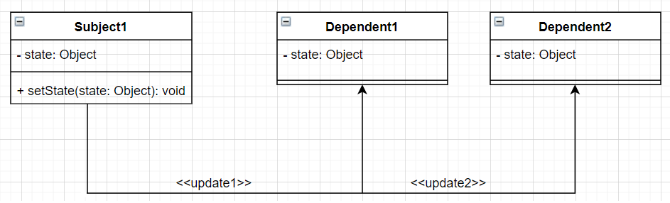

In this article, we will find something new about Observer pattern. Let's get started.

<br>

## Table of contents
- [Given Problem](#given-problem)
- [Solution of Observer Pattern](#solution-of-observer-pattern)
- [When to use](#when-to-use)
- [Benefits & Drawback](#benefits-&-drawback)
- [Code C++ /Java](#code-c++-java)
- [Application & Examples](#application-&-examples)
- [Wrapping up](#wrapping-up)


<br>

## Given Problem



Assuming that we have a Subject1 class, and some dependency class of it such as Dependent1, Dependent2. Each time we change the state of Subject1's instance, we want to update or notify the state of Dependent1's, Dependent2's instances.

A inflexible solution is that Subject1 class has some references of Dependent1, Dependent2 class. So, it makes Subject1 class tightly couples with other particular Dependent class, and makes it impossible to change the object (add new ones or remove existing ones) independently from (without having to change) the subject. And it stops the subject from being reusable and makes the subject hard to test.

So, we will have some questions about the above problems?
- How can a one-to-many dependency between objects be defined without making the objects tightly coupled?
- How can an object notify an open-ended number of other objects?

<br>

## Solution of Observer Pattern


Due to our problems that is relevant to update/notify other dependency classes when Subject class changes its state. So we will define an interface ```IObserver``` with ```update()``` method.

Then our dependency classes will implement IObserver interface to update state when something changes. If our dependency classes that have some other actions, we can define IAction interface with many methods to do what we want.

Finally, to manage all of our dependency classes, we will need to create Subject class. In this situation, we will define ISubject interface that have some methods to manage observer such as registerObserver(), removeObserver(), and notifyObserver() methods.

When Subject class's instance changes its own state, we need to use notifyObserver() method to send notifications **The Subject's state was be changed, all observers need to update**. This methods will iterate all observers that we managed.

--> Observer pattern is created.

<br>

## When to use
- The change of a state in one object must be reflected in another object without keeping the objects tight coupled.

- The framework we are writing needs to be enhanced in future with new observers with minimal changes.
Some Classical Examples:

<br>

## Benefits & Drawback
1. Benefits

    - abstract coupling between subject and observer. Each can be extended and reused individually.
    - dynamic relationship between subject and observer, can be established at run time (can hot-swap views, ...) gives a lot more programming flexibility.
    - broadcast communication: notification is broadcast automatically to all interested objects that subscribed to it.
    - observer can be used to implement Model-View separation in Java more easily.

2. Drawbacks


<br>

## Code C++/Java

To refer this pattern's code, we can read the [source code of Observer pattern on Github](https://github.com/gamethapcam/Design-Pattern/tree/master/Behavioral-Pattern/observer-pattern/src/Java).


<br>

## Application & Examples
- Write a model class that extends Observable

    have the model notify its observers when anything significant happens.

- make all views of that model (E.g: GUI panels that draw the model on screen) into observers.

- Model View Controller Pattern - The observer pattern is used in the model view controller (MVC) architectural pattern. In MVC the this pattern is used to decouple the model from the view. View represents the Observer and the model is the Subject object.

- Java Message Service (JMS) uses Observer design pattern along with Mediator pattern to allow applications to subscribe and publish data to other applications.

- Event management - This is one of the domains where the Observer patterns is extensively used. Swing and .Net are extensively using the Observer pattern for implementing the events mechanism.

<br>

## Wrapping up


<br>

Refer: 

[Head First Design Pattern]()

[https://sourcemaking.com/design_patterns/observer](https://sourcemaking.com/design_patterns/observer)