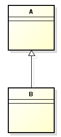
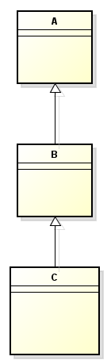
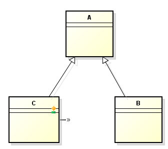
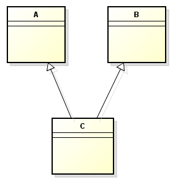
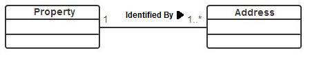
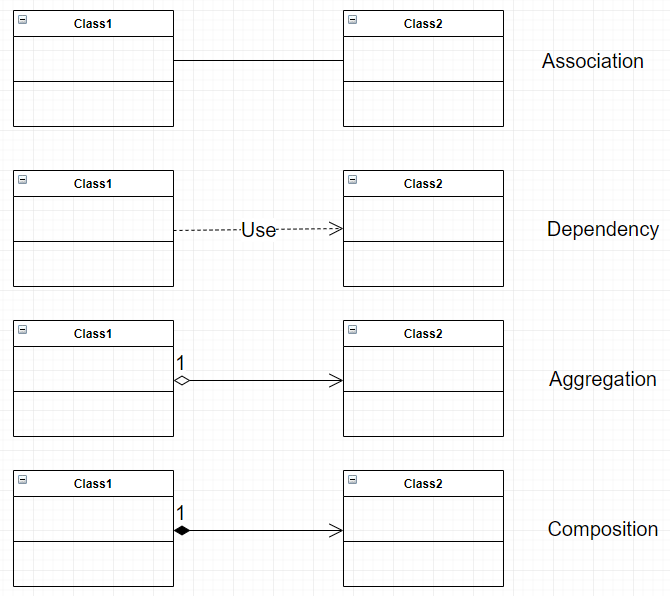
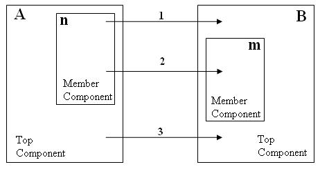

In this article, we will read up on some important concepts of Object oriented programming. Understanding deeper these concepts make us confidently when utilizing OOAD.

Let's get started.

<br>

## Table of contents
- [Programming paradigm](#programming-paradigm)
- [Introduction to Object oriented programming](#introduction-to-object-oriented-programming)
- [History of OOP](#history-of-oop)
- [Inheritance](#inheritance)
- [Encapsulation](#encapsulation)
- [Abstraction](#abstraction)
- [Polymorphism](#polymorphism)
- [Cohesion and Coupling](#cohesion-and-coupling)
- [Relationships between classes](#relationships-between-classes)
- [Granularity](#Granularity)
- [Wrapping up](#wrapping-up)

<br>

## Programming paradigm

According to [Programming pradigm of wikipedia.com](https://en.wikipedia.org/wiki/Programming_paradigm), we have a definition of programming paradigm:

```
Programming paradigms are a way to classify programming languages based on their features. Languages can be classified into multiple paradigms.
```

```
Some paradigms are concerned mainly with implications for the execution model of the language, such as allowing side effects, or whether the sequence of operations is defined by the execution model. Other paradigms are concerned mainly with the way that code is organized, such as grouping a code into units along with the state that is modified by the code. Yet others are concerned mainly with the style of syntax and grammar.
```

<br>

## Introduction to Object oriented programming

Object-oriented programming is a programming paradigm based on the concepts of objects that contains data called as fields, and some logic that is relevant to its fields.

In order to solve our problems with OOP, we can follow some below steps:
- Identify all the objects that our problem has, and how they interact with each other.
- Then, we will generalize them as classes, that they contains fields and methods.
- Based on the relationships between objects, we write the business logic between them.

<br>

## History of OOP

History of the object-oriented programming approach could be traced to the idea of ADTs and the concept of objects in Simula 67 programming language, which was developed in the 1960s for performing simulations. The first true object-oriented programming language that appeared before the larger software development community was Smalltalk in 1980, developed at Xerox PARC. Smalltalk used objects and messages as the basis for computation. Classes could be created and modified dynamically. Most of the vocabulary in object-oriented paradigm has originated from this language.

Toward the end of the 1970s, Bjarne Stroustrup, who was doing doctoral work in England, needed a language for doing simulation of distributed systems. He developed a language based on the class concept in Simula, but this language was not particularly efficient. However, he pursued his attempt and developed an object-oriented language at Bell Laboratories as a derivative of C, which would blossom into one of the most successful programming languages, C++. The language was standardised in 1997 by the American National Standards Institute (ANSI).

The 1980s saw the development of several other languages such as ObjectLisp, CommonLisp, Common Lisp Object System (CLOS), and Eiffel. The rising popularity of the object-oriented model also propelled changes to the language Ada, originally sponsored by the U.S. Department of Defense in 1983. This resulted in Ada 9x, an extension to Ada 83, with object-oriented concepts including inheritance, polymorphism, and dynamic binding.

The 1990s saw two major events. One was the development of the Java programming language in 1996. Java appeared to be a derivative of C++, but many of the controversial and troublesome concepts in C++ were deleted in it. Although it was a relatively simple language when it was originally proposed, Java has undergone substantial additions in later versions making it amoderately difficult language. Java also comes with an impressive collection of libraries (called packages) to support application development. A second watershed event was the publication of the book Design Patterns by Gamma et al. in 1994. The book considered specific design patterns (23 of them) and provided general approaches to solving them using object-oriented constructs. The book (as also the approach it advocated) was a huge success as both practitioners and academicians soon recognised its significance.

The last few years saw the acceptance of some dynamic object-oriented languages that were developed in the 1990s. Dynamic languages allow users more flexibility, for example the ability to dynamically add a method to an object at execution time. One such language is Python, which can be used for solving a variety of applications including web programming, databases, scientific and numeric computations and networking. Another dynamic language, Ruby, is even more object-oriented in that everything in the language, including numbers and primitive types, is an object.

<br>

## Inheritance
1. Definition

    Inheritance is a mechanism in which one class can inherit/acquire properties/attributes and behaviors/methods from another classes.

    The relationship between classes is:
    - subclass (derived class): the class that inherit from another class.
    - superclass (base class): the class that is inherited

2. Some types of inheritance

    - Single inheritance

        

        It means that one subclass inherits from one superclass.

    - Multilevel inheritance

        

        It means that one class inherits from one superclass. And this superclass is also a subclass of the another relationship with one superclass.

    - Hierarchical inheritance

        

        It means that one class is a superclass of multiple subclass.

    - Multiple inheritance

        

        It means that one class can have more than one superclass and inherit attributes, methods from all superclasses.

3. Benefits

    - This inheritance property permits code reusability.
    
    - Reusability saves time in software development because we do not define the duplicated code.

    - Extensibility / Polymorphism: New functionality may be easily plugged in without changing existing classes as long the new plug-in classes extend given base classes.

4. Drawbacks

    - subclass and superclass get tightly coupled. Because changing the superclass in an inheritance relationship risks breaking our code.

    - when level of inheritance is increased highly. It is difficult to test, debug, understand where we are.

<br>

## Encapsulation
1. Definition

    Encapsulation is a way to protect our data that is accessed from outside.

2. Benefits

    - better control of class attributes and methods.
    - flexible: developer can change one part of the code without affecting other parts.
    - increased security of data.

<br>

## Abstraction
1. Definition

    Abstraction is a way that we choose some crucial properites or behaviors of something to describe, create our class after getting rid of unnecessary information or complex functionality that we do not need.

2. Benefits

    - makes code reable and easily to understand.

    - reduces the complexity of the design and implementation process of software.

    - allows us to group several related classes as siblings.

<br>

## Polymorphism
1. Definition

    Polymorphism means "many forms", is a way that we can perform a single action in different ways.

2. Some types of polymorphism

    - compile time polymorphism
    - run time polymorphism

        is a process in which a call to an overridden method is resolved at runtime rather than compile time.

3. Benefits

    - It makes our code flexible, easy to test.

<br>

## Cohesion and Coupling
1. Cohesion

    Each module provides certain functionality; cohesion of a module tells us how well the entities within amodule work together to provide this functionality. Cohesion is a measure of how focused the responsibilities of a module are. If the responsibilities of a module are unrelated or varied and use different sets of data, cohesion is reduced.
    
    Highly cohesive modules tend to be more reliable, reusable, and understandable than less cohesive ones. To increase cohesion, we would like that all the constituents contribute to some well-defined responsibility of the module. This may be quite a challenging task. In contrast, the worst approach would be to arbitrarily assign entities to modules, resulting in a module whose constituents have no obvious relationship.

2. Coupling

    Coupling refers to how dependent modules are on each other. The very fact that we split a program into multiple modules introduces some coupling into the system. Coupling could result because of several factors: a module may refer to variables defined in another module or a module may call methods of another module and use the return values. The amount of coupling between modules can vary. In general, if modules do not depend on each others implementation, i.e., modules depend only on the published interfaces of other modules and not on their internals, we say that the coupling is low. In such cases, changes in one module will not necessitate changes in other modules as long as the interfaces themselves do not change.

    Low coupling allows us to modify a module without worrying about the ramifications of the changes on the rest of the system. By contrast, high coupling means that changes in one module would necessitate changes in other modules, which may have a domino effect and also make it harder to understand the code.

<br>

## Relationships between classes
1. ```Association```

    ```Association``` is the relationship between two or more classes. They are represented by a solid line between classes. ```Associations``` are typically named using a verb or verb phrase which reflects the real world problem domain.

    

    **The normal kind of association is bidirectional by default**. This means that if an association exists between two classes, then both objects know about each other. However, when creating a class diagram it is possible to use a navigable association between two classes.  This is shown by adding an arrowhead at one end of the association.  If **A** is the source class and **B** is the target class, the arrowhead would be placed on the **B** side of the association. A navigable association of this type means that at runtime object **A** knows about object **B**, but object **B** has no knowledge of or visibility into object **A**.

    

    There are some types of Association:

    - Dependency

        ```Dependency``` is a weaker form of relationship and in code terms indicates that a class uses another by **parameter** or **return type**.

        ```Dependency``` is a form of association.

    - Aggregation

        ```Aggregation``` is another form of ```Association```, implies a realtionship where the child can exist independently of the parent.

        For example, with Java code, we have:

        ```java
        public class ClassRoom {
            private List<Student> students;

            public ClassRoom(List<Student> students) {
                this.students = students;
            }

            // ...

        }

        public class Student {
            ...
        }
        ```

    - Composition

        ```Composition``` is another form of Association, implies a relationship where the child cannot exist independent of the parent. When the parent is destroyed, the child object will be immediately destroyed.

        ```java
        public class Room {
            // ...
        }

        public class House {
            private List<Room> rooms;

            public House() {
                this.rooms = new ArrayList<>();
            }

            // ...
        }
        ```

    So, we have UML notation for association, aggregation and composition.

    

2. Inheritance

    With this relationship, we can refer a section [Inheritance](#inheritance)

<br>

## Granularity

According to [Granularity of analysis](http://jripples.sourceforge.net/jripples/manual/concepts/granularities.html), we have the definition of granularity of OOP.

Object-Oriented Programs may have complex structure of components and interactions among them; in other words, components and interactions among them can be defined on different levels of granularities. Typically, the component of the coarsest granularity in OOP is class; this is called **granularity of classes** or **level of classes**. In turn, a class may define methods; this finer granularity is called **granularity of methods** or **level of methods**.



For example, on the above picture, components A and B are defined on granularity of classes (top components), while components n and m are defined on granularity of members.

In turn, dependencies among these components are defined on different granularities as well.

For example, dependency 2 is defined between members, while dependency 1 is mixed dependency defined between the method and the class. The membership relation among the components affects the marks (statuses) of components during incremental change.

For example, if method n is changed, then it implies that its parent component ?class A, - is changed as well. The type of dependency specifies, how a component interacts with other components, and how the change in status of this component through propagation rules affects other components it interacts with.

For example, dependency 2 on the picture implies that class A interacts with component B only. On the other hand, dependency 2 implies the method n interacts with method m, and, transitively, method n interacts with class B; also, through membership relations, it implies that A interacts with m, and, transitively, A interacts with B.

<br>

## Wrapping up
- Understanding OOP and some its properties.
- The meaning of cohension and coupling.


<br>

Refer:

[Object-Oriented Analysis, Design and Implementation, 2nd Edition]()

[Practical Object Oriented Design]()

[https://tomassetti.me/oops-concepts/#delegation](https://tomassetti.me/oops-concepts/#delegation)

[https://www.guru99.com/java-data-abstraction.html](https://www.guru99.com/java-data-abstraction.html)

[https://www.cs.rit.edu/~afb/20012/cs4/slides/contract-08.html](https://www.cs.rit.edu/~afb/20012/cs4/slides/contract-08.html)

[https://www.ianswer4u.com/2017/09/oops-inheritance-advantages.html](https://www.ianswer4u.com/2017/09/oops-inheritance-advantages.html)

[https://www.ianswer4u.com/2017/07/abstraction-oops-advantages-examples.html](https://www.ianswer4u.com/2017/07/abstraction-oops-advantages-examples.html)

[http://erpbasic.blogspot.com/2012/01/inheritance-advantages-and.html](http://erpbasic.blogspot.com/2012/01/inheritance-advantages-and.html)

[https://javarevisited.blogspot.com/2012/03/what-is-encapsulation-in-java-and-oops.html](https://javarevisited.blogspot.com/2012/03/what-is-encapsulation-in-java-and-oops.html)

[https://www.modernanalyst.com/Careers/InterviewQuestions/tabid/128/ID/1807/What-is-a-navigable-association-in-UML.aspx](https://www.modernanalyst.com/Careers/InterviewQuestions/tabid/128/ID/1807/What-is-a-navigable-association-in-UML.aspx)