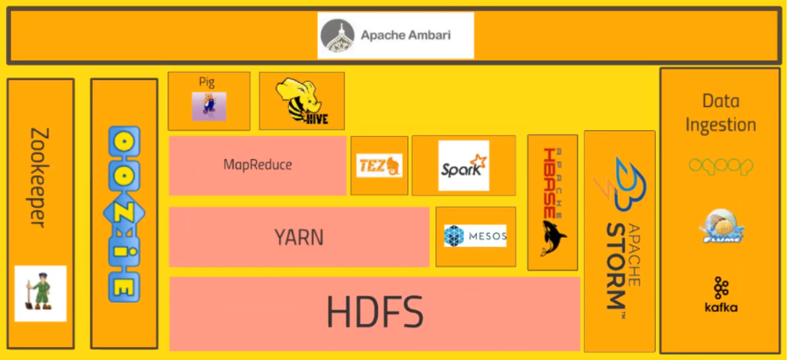

All information of this article we get from the [The Ultimate Hands-On Hadoop]() course in Udemy website.

After learned completely about Hadoop ecosystem's concepts, we can understand the sequence steps that we want to do with Big Data.

Let's get started.

<br>

## Table of contents
- [Introduction to Hadoop](#introduction-to-hadoop)
- [History of Hadoop](#history-of-hadoop)
- [Architecture of Hadoop](#architecture-of-hadoop)
- [Wrapping up](#wrapping-up)

<br>

## Introduction to Hadoop

According to Hortonworks, we have the definition of Hadoop:

```
Hadoop is an open source software platform for distributed storage and distributed processing of very large data sets on computer clusters built from commodity hardware.
```

With Hadoop's definition, we need to understand some concepts:
- software platform: is a bunch of software that runs on a cluster of computers so as opposed to just running on a single PC.

    --> So, Hadoop is meant to be run on an entire cluster of PCs that run inside a rack in some data center somewhere. It leverages the power of multiple PCs to actually handle big data.

- distributed storage: is one of the main things that Hadoop provides.

    --> The idea is that we don't want to be limited by a single hard drive. If we're dealing with big data, we might be getting terabytes of information every day or even more where are we gonna put all that.

    The nice thing about distributed storage is that we can just keep on adding more and more computers to our cluster and their hard drives will just become part of our data storage for our data and what we do gives us a way of viewing all of the data distributed across all of the hard drives in our cluster as one single file system.
    
    And not only that it's also very redundant. So if one of those computers happens to burst into flames and our data set melts into this gooey puddle of silicon Hadoop can handle that because it's gonna keep backup copies of all our data on other places in our cluster and it can automatically recover and make that data very resilient and very reliable.

- distributed processing: Not only Hadoop store vast amounts of data across an entire cluster of computers, it can distribute the processing of that data as well.

    --> So whether we need to transform all that data into some other format or to some other system or aggregate that data in some way, Hadoop provides the means for actually doing that all in a parallel manner. So it can actually set all the CPU cores on our entire cluster chugging away on that problem in parallel.

    And that way we can actually get through all that data very quickly. So we know we don't have to sit there with a single CPU chugging away on a petabyte of information. It can divide and conquer that problem across all the PCs in a cluster.

    --> It's meant for very large data sets, that can't be managed by a single PC on a computer clusters built from commodity hardware. And by commodity software, we don't mean cheap, we just mean readily available stuff, we can rent from AWS or Google that sell cloud services. So we can just rent off the shelf hardware throw it into a Hadoop cluster and go for it.

    We know just go and keep on adding as many computer as we need to handle the amount of data we have.

<br>

## History of Hadoop

Hadoop wasn't the first solution for this problem. Quite honestly Google is the grandfather of all this stuff. So back in 2003 and 2004, Google published a couple of papers.

One was about the Google file system GFS and that was basically the foundation of the ideas behind how Hadoop does its distributed storage. So GFS kind of informed what Hadoop's storage system turned into. MapReduce is also Hadoop's similar to.

So GFS is basically what inspired Hadoop's distributed data storage and map reduce is what inspired Hadoop's distributed processing. And in fact that they didn't even bother changing the name. It's still called MapReduce.

So Hadoop was developed originally by Yahoo. They were building something called Nutch which was an open source we search engine at the time. And primarily a couple of guys Doug Cutting and Tom White in 2006 started putting Hadoop together.

Hadoop was actually the name of Doug Cutting's kid's toy Elephant. And apparently this is the actual yellow elephant named Hadoop that the project was named after.

<br>

## Architecture of Hadoop


There's a lot of different ways of organizing these system and this is just what makes sense to us. There are a lot of complex interdependencies between these system, so there's really no right way to represent these relationships.

So, we will split things up into three general areas like Core Hadoop system which is just things built on the Hadoop platform directly, Query Engines and External Data Storage. Let's move on the Hadoop core system.



The pink things are the things that are part of Hadoop itself. Everything else is sort of addon projects that have come out overtime that integrate with it to solve specific problems.

- HDFS stands for Hadoop Distributed File System. HDFS is the version of GFS and that is the system that allows us to distribute the storage of big data across our cluster of computers. So it makes all of the hard drives on our cluster look like one giant file system.

    And not only that it actually maintains redundant copies of that data. So if one of our computers happens to randomly burst into flames and melts into a puddle of silicon it happens. It can actually recover from that and it will back itself up to a backup copy that it had of that data automatically.

- Sitting on top of HDFS, it is YARN.

    YARN stands for Yet Another Resource Negotiator, also is where the data processing starts to come into play. So YARN is basically the system that manages the resources on our computing cluster. It's what decides what gets to run tasks when what nodes are available for extra work, which nodes are not available. So it's kind of the heartbeat that keeps our cluster going.

- MapReduce is a piece of Hadoop proper and map reduce at a very high level is just a programming metaphor or programming model that allows us to process our data across an entire cluster.

    It consists of Mapper and Reducer. These are both different scripts that we might write or different functions if we will when we're writing a map reduce program.
    
    Mappers have the ability to transform our data in parallel across our entire computing cluster in a very efficient manner.

    Reducers are what aggregate that data together and it may sound like a very simple model and it's actually very veratile.

    Now originally MapReduce and YARN were kind of the same thing in Hadoop. They got split out recently and that's enabled other applications to be built on top of YARN that solve the same problem as MapReduce but in a more efficient manner.

- Sitting on top of MapReduce, we have technologies such as Pig. So if we don't want to write Java or Python map reduce code, and we're familiar with a scripting language that has sort of a SQL style syntax.

    Pig is a very high level programming API that allows us to write simple scripts that look a lot like SQL in some cases that allow us to chain together queries and get complex answers but without actually writing Python or Java code in the process. So Pig will actually transform that script into something that will run on MapReduce which in turn goes through YARN and HDFS to actually process and get the data that it needs to get the answer we want.

- Hive also sits on top of MapReduce and it solves a similar problem to pig but it really more directly looks like a SQL database. So Hive is a way of actually taking SQL queries and making this distributed data that's just really sitting on our file system somewhere look like a SQL database.

    So for all intents and purposes, it's just like a database. We can even connect to it through a shell client or ODBC or what we have.

    And actually execute SQL queries on the data that's stored on our Hadoop cluster even though it's not really a relational database under the hood. So if we're familiar with SQL, Hive might be a very useful API for us to use.

- Apache Ambari is basically this thing that sits on top of everything and it just gives us a view of our cluster and lets us visualize what's running on our cluster, what systems are using how much resources and also has some views in it that allow us to actually do things like execute Hive queries or import databases into Hive or execute Pig queries and things like that.

    Ambari is what sits on top of all this and lets us have a view into the actual state of our cluster, and the applications that are running on it. Now there are other technologies that do this for us and Ambari is what Hortonworks uses. There are competing distributions of Hadoop stacks out there, Hortonworks being one of them. Other ones include Cloudera and MapR but for Hortonworks they use Ambari.

- Mesos isn't really part of Hadoop proper but it's included here because it's basically an alternative to YARN. So it's also a resource negotiator, basically solves the same problems in different ways.

    There are ways of getting Mesos and YARN to work together if we need to as well.

- Spark is sitting at the same level of MapReduce in that it sits of top of YARN or Mesos, it can go either way to actually run queries on our data and like MapReduce it requires some programming and need to actually write our Spark scripts using either Python or Java or the Scala programming language (preferred).

    But Spark is kind of where it's at right now. It's extremely fast, it's under a lot of active development. So Spark's a very exciting technology and a very powerful technology.

    If we need to very quickly, efficiently and reliably process data on our cluster, Spark is really good choice fo that. It's also very versatile, it can do things like handle SQL queries that can do machine learning across an entire cluster of information. It can actually handle streaming data in real time and all sorts of other cool stuff.

- Tez is similar to Spark. It also uses some of the same technologies as Spark notably with something that's called a directed acyclic graph and this gives Tez a leg up on what MapReduce does because it can produce more optimal plans for actually executing queries. Tez is usually used in conjunction with Hive to accelerate it.

    So we have an option Hive through Tez can often be faster than Hive through MapReduce. Both different means of optimizing queries to get a efficient answer from our cluster.

- HBase kind of sits off to the side and it's a way of exposing the data on our cluster to transactional platforms. So HBase is what we call a NoSQL database. It's a columnar data store and we might have heard that term before it's basically a really fast database meant for very large transaction rates so it's appropriate. For example, for hitting from a web application doing all types of transactions. So HBase can actually expose the data that's stored on our cluster and maybe that data was tranformed in some way by Spark or MapReduce or something else.

    It provides a very fast way of exposing those results to other systems.

- Apache Storm is basically a way of processing streaming data. So if we have streaming data from sensors or web logs, we an actually process that in real time using storm and spark streaming solves the same problem.

    Storm just does it in a slightly different way. So Apache Storm's made for processing streaming data quickly in real time so it doesn't have to be a batch thing anymore.

    We can actually update our machine learning models or transform data into a database all in real time as it comes in.

- Oozie is just a way of scheduling jobs on our cluster. So if we have a task that needs to happen on our Hadoop cluster that involves many different steps and maybe many different systems.

    Oozie is a way of scheduling all of these things together into jobs that can be run on some sort of schedule. So when we have more complicated operations that require loading data into Hive and then integrating that with Pig, maybe querying it with Spark and then transforming the results into HBase, Oozie can manage that all for us and make sure that it runs reliably on a consistent basic.

- Zookeeper also sits alongside all of these technologies. It's basically a technology for coordinating everything on our cluster. So it's the technology that can be used for keeping tracking of which nodes are up,  which nodes are down.

    It's a very reliable way of just kind of keeping track of shared states across our cluster that that different applications can use and many of these applications rely on zookeeper to actually maintain reliable and consistent performance across the cluster even when a node randomly goes down.

    So zookeeper can be used, for example, for keeping track of who the current master node is or keeping track of who's up, who's down what we have. It's really more extensible than that even.

- How do we actually get data into our cluster, and onto HDFS from external resources. Sqoop, for example, is a way of actually typing our Hadoop database into a relational database. Anything that can talk to ODBC or JDBC can be transformed by Sqoop into our HDFS file system.

    So Sqoop is basically a connector between Hadoop and our legacy databases. Flume is a way of actually transporting Web logs at a very large scale and very reliably to our cluster. If we have a fleet of web servers, Flume can actually listen to the web logs coming in from those web servers in real time and publish them into our cluster in real time for processing by something like Storm or Spark streaming.

- Kafka solves a similar problem although it's a little bit more general purpose. It can basically collect data of any sort from a cluster of PCs from a cluster of web servers or whatever it is, and broadcase that into our Hadoop cluster as well.

Next, we will go to External Data Storage. Our data might be exposed or stored in other places. So, we need to get data from these places to push into Hadoop system. In this External Data Storage, HBase would also fit into this category. But since HBase is really part of the Hadoop stack itself. Then we do not need to consider HBase in it.

- MySQL database is something we might be integrating with our cluster. We can not only import data from Sqoop into our cluster, we can also export it to MySQL as well. So a lot of these technologies like Spark, have the ability to write to any JDBC or ODBC database and we can store and retrieve our results from a central database.

- Cassandra like HBase and also MongoDB are both also columnar data stores and there are also good choices for exposing our data for real time usage to say a web application.

    So we definitely want some sort of layer like Cassandra or MongoDB sitting between real time applications and cluster.

    Both are very popular choices for vending  simple key value data store is at very large transaction rates.

--> MySQL, Cassandra or MongoDB, all external databases that might integrate with our cluster.

Finally, we will come in several query engines that sit on top of our cluster.


- Apache Drill

    It actually allows us to write SQL queries that will work across a wide range of NoSQL databases potentially. So they can actually talk to our HBase database, maybe our Cassandra, MongoDB db as well and tie those results all together and allow us to write queries across all those disparate data stores, bring them all back together when we're done.

- Hue

    It's also a way of interactively creating queries that works well with Hive and HBase. Actually for Cloudera, it kind of takes the role of Ambari as sort of the thing that sits on top of everything and lets us visualize, execute queries on the Hadoop cluster as a whole.

- Apache Phoenix

    It's kind of similar to Apache Drill. It lets us do SQL style queries across the entire range of data storage technologies we might have but it takes it one step further. It actually gives us ACID guarantees and OLTP.

    So we can actually make us not SQL Hadoop data store look a lot like a relational data store in a relational database with all the guarantees that come with that.

- Presto

    It's another way to execute queries across our entire cluster.

- Zeppelin

    It's just another angle on it that takes more of a notebook type approach to the UI and how we actually interact with the cluster.

<br>

## Wrapping up
- Understand the basic parts of Hadoop framework:

    - HDFS
    - YARN
    - MapReduce

- In the next article, we will delve into how Hadoop's parts works and how they communicate together.


<br>

Refer:

[https://www.quora.com/What-is-the-learning-path-of-big-data](https://www.quora.com/What-is-the-learning-path-of-big-data)

[https://www.cloudera.com/tutorials/getting-started-with-hdp-sandbox/1.html](https://www.cloudera.com/tutorials/getting-started-with-hdp-sandbox/1.html)

[https://sundog-education.com/hadoop-materials/](https://sundog-education.com/hadoop-materials/)

[https://www.simplilearn.com/big-data-and-hadoop-8-essential-concepts-guide-pdf?source=frs_recommended_resource_clicked](https://www.simplilearn.com/big-data-and-hadoop-8-essential-concepts-guide-pdf?source=frs_recommended_resource_clicked)

[https://www.simplilearn.com/big-data-career-guide-pdf?source=interpromo](https://www.simplilearn.com/big-data-career-guide-pdf?source=interpromo)