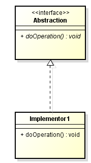
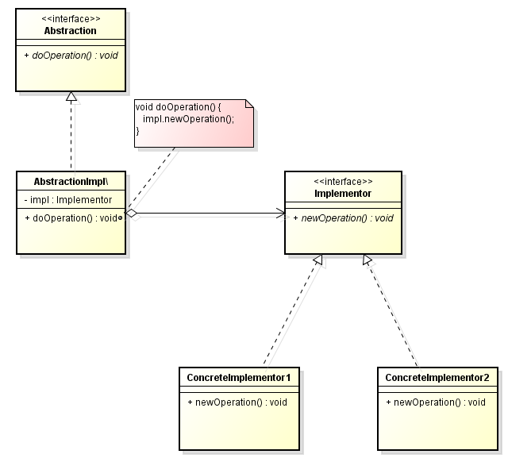

In this article, we will find something out about Bridge pattern. Let's get started.

<br>

## Table of Contents
- [Given Problem](#given-problem)
- [Analysis Problem](#analysis-problem)
- [Solution of Bridge Pattern](#solution-of-bridge-pattern)
- [When to use](#when-to-use)
- [Code C++/Java](#code-C++/Java)
- [Application & Examples](#application-&-examples)
- [Wrapping up](#wrapping-up)

<br>

## Given Problem



Normally, when we want to separate an abstraction and its implementation, we will use inheritance to solve it like an above image. It means that we have different subclasses Implementor1, ... that implement the abstraction (interface) in different ways.

But we can think of inheritance have a drawback that is Abstraction and Implementor1 get tightly coupled. Because changing the Abstraction in an inheritance relationship risks breaking our code in Implmentor1, ...

Then, this binds the implementation to an abstraction at compile-time and makes it impossible to change the implementation at runtime. Because inheritance cannot be changed i.e. we cannot ask a class to implement another class at runtime.

So, our problems are:
- Abstraction and Implementor1, ... get tightly coupled.
- We change implementation at runtime in difficulties.

After encounter the above problems, we can have some questions to answer:
- How can an abstraction and its implementation vary independently?
- How can an abstraction be defined and extended independently from its implementation?
- How can an implementation be selected and exchanged at runtime?
- How can an abstraction support different implementations so that an implementation can be selected at run-time?
- How can an abstraction be configured with one of different implementations?

<br>

## Solution of Bridge Pattern

With the first question - **How can an abstraction and its implementation vary independently?**, we need to create two interface, one for abstraction, one for its implementation. When we change abstraction about its methods, we do not worry whether its implementation is modified or not.

With the second question - **How can an implementation be selected and exchanged at runtime?**, we need to use composition over inheritance because the composition is more flexible because we can change its implementation at run time by calling setXXX() method.

So, we have a below UML class diagram:



To implement this pattern, we will do some following steps:
- Define separate inheritance hierarchies for an abstraction (```Abstraction```)
and its implementation (```Implementor```).

    - The ```Abstraction``` interface is implemented in terms of (by delegating to) an Implementor object (```impl.newOperation()```).

    - "Typically the Implementor interface provides only primitive operations, and Abstraction defines higher-level operations based on these primitives."

    This enables compile-time flexibility (via inheritance). ```Abstraction``` and implementation can be defined independently from each other.

- ```Abstraction``` delegates its implementation to an ```Implementor``` object
(```impl.newOperation()```).

    This enables run-time flexibility (via object composition). ```Abstraction``` can be configured with an ```Implementor``` object, and even more, the Implementor object can be exchanged at run-time.

<br>

## When to use
- When we want runtime binding of the implementation.
- We have a proliferation of classes resulting from a coupled interface and numerous implementations.
- We want to share an implementation among multiple objects.
- We need to map orthogonal class hierarchies.
- When there is a need to avoid permanent binding between an abstraction and an implementation.

<br>

## Benefits & Drawback
1. Benefits

    - This pattern is intended to keep the interface to our client program constant while allowing us to change the actual kind of class we display or use.
    - Improved extensibility (we can extend subclasses the abstraction and implementation hierarchies independently).
    - Hiding implementation details from the client program much more easily.
    - This pattern would leave the client code unchanged with no need to recompile the code.

2. Drawbacks

    - Useful in graphics and windowing systems that need to run over multiple platforms.
    - Useful anytime we need to vary an interface and an implementation in different ways.
    - Increases complexity.

<br>

## Code C++/Java

To refer this pattern's code, we can read this [link](https://github.com/DucManhPhan/Design-Pattern/tree/master/Structural-Pattern/Bridge-pattern/src/Java).

<br>

## Application & Examples


<br>

## Relation with other patterns
- Adapter is used when two incompatible interfaces have to unified together.
- Bridge is something we use when we actually need to separate interface from implementation. Varying types of implementation is one reason.


<br>

## Wrapping up
- The key idea in this pattern is to separate (decouple) an abstraction from its implementation so that the two can be defined independently from each other.


<br>

Thanks for your reading.

<br>

Refer:

[Hands-On Design patterns with Java]()

[Design patterns and best practices in Java]()

[http://wiki.c2.com/?BridgePattern](http://wiki.c2.com/?BridgePattern)

[https://w3sdesign.com/index0100.php##gf](https://w3sdesign.com/index0100.php##gf)

[https://www.baeldung.com/java-bridge-pattern](https://www.baeldung.com/java-bridge-pattern)