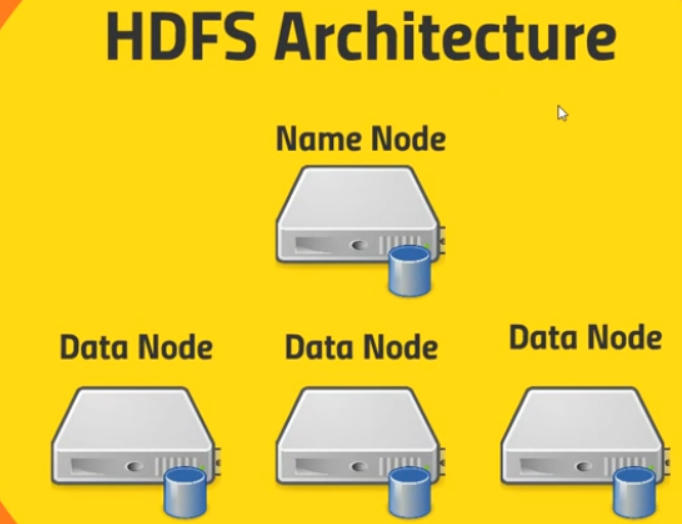
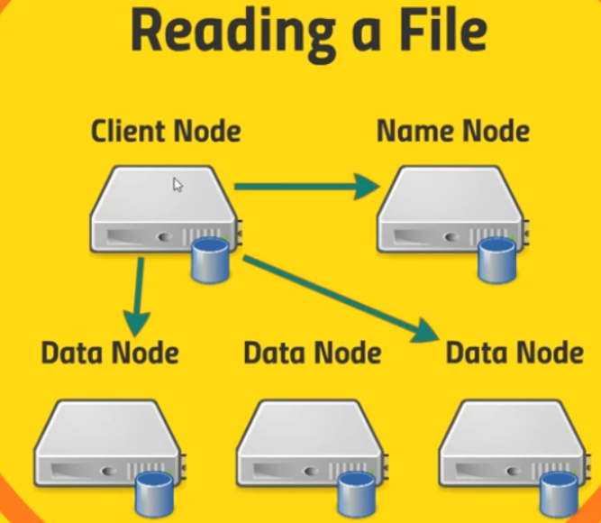
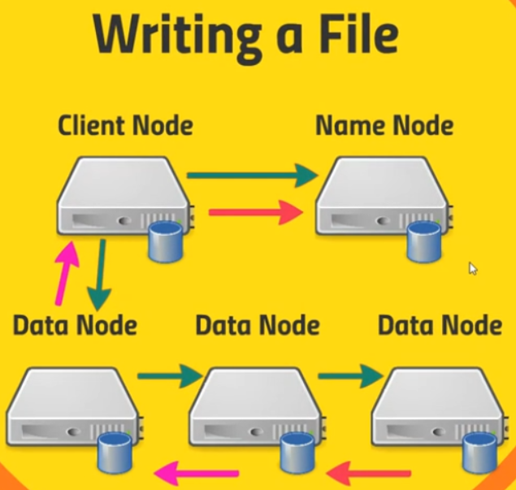

 

## Table of contents
- [Introduction to HDFS](#introduction-to-hdfs)
- [HDFS architecture](#hdfs-architecture)
- [How HDFS works](#how-hdfs-works)
- [How to configure factors of HDFS](#how-to-configure-factors-of-hdfs)
- [Wrapping up](#wrapping-up)

 

## Introduction to HDFS

HDFS stands for Hadoop Distributed File System, this is basically the underpinning of Hadoop. It actually allows our big data to be stored across an entire cluster in a distributed manner, in a reliable manner, and allows our applications to analyze that data to access that data quickly and reliably.

HDFS is really made/optimized for handling large files that can be distributed and broken up across an entire cluster. If we're dealing with big data such as big logs of information from sensors or web servers, HDFS can handle it by breaking up those files into blocks and those blocks are actually pretty large that is 128 MB by default. If these files have size that is less than 128MB, then we will have one block. But by splitting up these large files into blocks, we're not limited by the drive limitations of a single hard drive. So, we can actually store files that are even bigger than what an individual hard drive can store.

HDFS also allows us to distribute the processing of one of these large files. So if we split that large file up across several different computers that they can access different parts of that data and process it in parallel, we can also do things like making sure that the computers that are processing a given chunk of data give a block of that data are physically close to where that block is stored. So it can access it more efficiently.

In order to handle failure, HDFS will actually store more than one copy of each block and so that way if one of these inidividual computers goes down, HDFS can deal with them and actually start retrieving information from a different computer that had a backup copy of that block and it can do this in a clever way such that if a single node goes down. We do not lose any blocks from any given file because there'll be another block stored somewhere else at all times.

The key point is that HDFS allows us to purchase commodity computers we don't have to get a special purpose expensive computers that have high availability because as the side effect of this architecture is that if a single computer goes down, it's not a big deal. We can juset fail over to another node that has a copy of that block somewhere else.

 

## HDFS architecture

HDFS contains a single Name Node and a set of Data Node.
- Name Node will keep track of where all those blocks live. So basically it's maintaining a big old table of a given file name under some directory structure - a virtual directory structure in HDFS and it knows where to go to actually find every copy of every block that's associated with that file.

    It's also maintaining an edit log that maintains a records of what's being created, what's being modified, what's being stored so that it can keep track of where everything is, as things get moved around or new files get created.

    So that Name Node keeps track of what's on all the Data Nodes.

- Data Node contains blocks that are given by HDFS. The Data Nodes actually talk to each other as well to maintain those copies and replication of those blocks.

 

## How HDFS works

1. Read a file

    

    Assuming that we have an application running on some client that need to access data stored on the HDFS. Below is some steps that we need to know.
    - Client Node will communicate with Name Node to get at this file and the Name Node will response our file lives on these blocks on these Data Nodes and then our client application will know ok.

    - After client node know the position of Data Nodes that contains blocks which it wants. Client node will access to these Data Nodes to retrieve the blocks that we need for this particular file.

        Our applicaton won't actually be dealing with it at that level. There are client librarie will be used for this task. If we want to read these bytes from these files, under the hood, our HDFS client library will actually figure out OK what blocks to actually need to retrieve.

2. Writing a file

    

    Assuming that our client application wants to create a new file on HDFS. Below is some steps to write a file to HDFS:
    - Client Node is gonna tell the Name Node to want to create a new file. Then the Name Node will create this new entry of a new file name and it will keep track of its blocks.

    - Then, Client Node will talk to a single Data Node, start creating new file in this Data Node.

 

## How to configure factors of HDFS
1. Block size configuration for entire cluster

2. Replication factor

 

## Wrapping up

- Understanding about the architecture of HDFS and how HDFS works.

 

Refer:

[Hadoop for Dummies]()

[https://acadgild.com/blog/hadoop-hdfs-beginners-guide](https://acadgild.com/blog/hadoop-hdfs-beginners-guide)

[https://acadgild.com/blog/configuring-replication-factor-block-size-hdfs](https://acadgild.com/blog/configuring-replication-factor-block-size-hdfs)