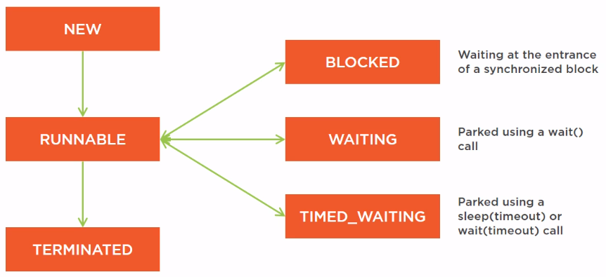

 

## Table of contents
- [States of Java's thread](#states-of-java's-thread)
- [Source code](#source-code)
- [Wrapping up](#wrapping-up)

 

## States of Java's thread

1. New state

    When we create a new thread by calling **new Thread(Runnable task)**, this thread is in the **New** state. It has not been run yet. It has not executed its task yet.

2. Runnable state

    Once we call the **start()** method on this thread, the thread is set in the **Runnable** state. It means that the thread scheduler is free to give a time slice of the CPU to the thread, so that this thread can execute its task.

3. Terminated state

    Once the task is completed, this thread enters the **Terminated** state, in which the thread scheduler knows that the thread should not be run anymore.

4. Blocked state

    When a thread is blocked at the entrance of a synchronized block because the key of the lock object is not available, it is in a Blocked state and the thread scheduler will not try to awake this thread as long as the key is not available.

    This is very common state in which threads can be put.

5. Waiting state

    This is a state in which the thread is put once the **wait()** method has been called. In this case, the thread is parked in **the wait list** and can be awakened only by a **notify()** call.

6. Timed_Waiting state

    In fact, the **wait()** method can take a time out, which is a time out expressed in miliseconds. At the end of its time out, the thread will be automatically modified by the system and in this case, this thread will be awakened without calling the **notify()** method on the right object. So in that case, the thread will be put in a **Timed_Waiting** state. It is the same state as the one thread is put when we call the **sleep()** method on a given thread.

    So the thread can go from the **Runnable** state to one of those three states such as **Blocked**, **Waiting**, **Timed_Waiting** state and can go back to the **Runnable** state depending on the actions taken on the system.

 

## Source code

- Be aware of the life cycle and state of thread in java makes us easy to understand how synchronized block, lock framework such as ReentrantLock works.

 

## Wrapping up

 

Refer:

[https://www.geeksforgeeks.org/lifecycle-and-states-of-a-thread-in-java/](https://www.geeksforgeeks.org/lifecycle-and-states-of-a-thread-in-java/)

[https://www.javatpoint.com/life-cycle-of-a-thread](https://www.javatpoint.com/life-cycle-of-a-thread)

[https://stackoverflow.com/questions/13249835/java-does-wait-release-lock-from-synchronized-block](https://stackoverflow.com/questions/13249835/java-does-wait-release-lock-from-synchronized-block)

[https://dzone.com/articles/difference-between-blocked-waiting-timed-waiting-e](https://dzone.com/articles/difference-between-blocked-waiting-timed-waiting-e)

[https://howtodoinjava.com/java/multi-threading/java-thread-life-cycle-and-thread-states/](https://howtodoinjava.com/java/multi-threading/java-thread-life-cycle-and-thread-states/)

[https://www.journaldev.com/1044/thread-life-cycle-in-java-thread-states-in-java](https://www.journaldev.com/1044/thread-life-cycle-in-java-thread-states-in-java)

[https://www.baeldung.com/java-thread-lifecycle](https://www.baeldung.com/java-thread-lifecycle)

