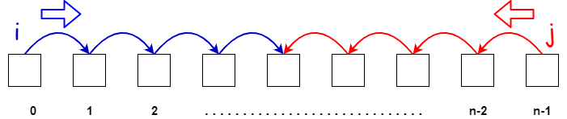

In this article, we will learn about two pointer technique. Let's get started.

<br>

## Table of contents
- [Given problem](#given-problem)
- [Solution of Two pointers technique](#solution-of-two-pointers-technique)
- [When to use](#when-to-use)
- [Wrapping up](#wrapping-up)


<br>

## Given problem

Given a sorted array nums, remove the duplicates in-place such that each element appear only once and return the new length.

Do not allocate extra space for another array, you must do this by modifying the input array in-place with O(1) extra memory.

Example 1:
- Given nums = [1,1,2],

    Your function should return length = 2, with the first two elements of nums being 1 and 2 respectively.

    It doesn't matter what you leave beyond the returned length.

Example 2:
- Given nums = [0,0,1,1,1,2,2,3,3,4],

    Your function should return length = 5, with the first five elements of nums being modified to 0, 1, 2, 3, and 4 respectively.

    It doesn't matter what values are set beyond the returned length.

<br>

## Solution of Two pointers technique

Currently our array is sorted, so to remove all duplicated elements, we will use two pointers technique to solve it. Because we need to compare two adjancency elements to know what elements are duplicated.

Below is the source code of the above problem.

- First way

    Assuming that the **left** pointer to point the other array, and the **right** pointer will iterate our source array.

    ```java
    public int removeDuplicates(int[] nums) {
        if (arr == null || arr.length == 0) {
                return 0;
        }

        // assuming that we have left is an index of the other array
        int left = 0;
        for (int right = 0; right < arr.length - 1; ++right) {
            if (arr[right] != arr[right + 1]) {
                arr[left++] = arr[right];
            }
        }

        arr[left++] = arr[arr.length - 1];
        return left;
    }
    ```

To dig deeper into this technique, we need to know how much the templates of this technique. The below is some types of Two pointers technique.

1. Left and Right boundary

    Use the **left** pointer starts from the beginning of an array. Use the **right** pointer starts from the ending of an array.

    The condition to stop the scanning of whole array is **left** > **right**.
    
    So, we have an image that describes our this case.

    

    Finally, we have some problems of this case to practice.
    - [https://leetcode.com/problems/3sum/](https://leetcode.com/problems/3sum/)

    - [https://leetcode.com/problems/remove-duplicates-from-sorted-array/](https://leetcode.com/problems/remove-duplicates-from-sorted-array/)

    - [https://leetcode.com/problems/reverse-vowels-of-a-string/](https://leetcode.com/problems/reverse-vowels-of-a-string/)

    - [https://leetcode.com/problems/container-with-most-water/](https://leetcode.com/problems/container-with-most-water/)

    - [https://leetcode.com/problems/4sum/](https://leetcode.com/problems/4sum/)

2. Slow/Fast pointers

    Use the **left** pointer as the slow pointer, the **right** pointer as the fast pointer.

    Normally, when the fast pointer go to the end of an array is the stop condition that we need to care about.

    Below is an image that describes how this case works.

    

    Finally, we also have some examples to practice.
    - [https://leetcode.com/problems/remove-duplicates-from-sorted-array/](https://leetcode.com/problems/remove-duplicates-from-sorted-array/)

    - [https://leetcode.com/problems/linked-list-cycle/](https://leetcode.com/problems/linked-list-cycle/)

3. Use two pointers for two sequences

    In each sequence, we will use one pointer to loop it. Each step we will compare them, and process logic between them.

    

    Finally, we also have some examples to practice.
    - [https://leetcode.com/problems/is-subsequence/](https://leetcode.com/problems/is-subsequence/)

    - [https://leetcode.com/problems/shortest-word-distance-ii/](https://leetcode.com/problems/shortest-word-distance-ii/)

    - [https://leetcode.com/problems/wildcard-matching/](https://leetcode.com/problems/wildcard-matching/)

4. Old and new state

    

    Finally, we also have some examples to practice.
    - [https://leetcode.com/problems/merge-two-sorted-lists/](https://leetcode.com/problems/merge-two-sorted-lists/)

    - [https://leetcode.com/problems/decode-ways/](https://leetcode.com/problems/decode-ways/)

    - [https://leetcode.com/problems/merge-two-sorted-lists/](https://leetcode.com/problems/merge-two-sorted-lists/)

    - [https://leetcode.com/problems/house-robber/](https://leetcode.com/problems/house-robber/)

    - [https://leetcode.com/problems/sort-colors/](https://leetcode.com/problems/sort-colors/)

<br>

## When to use

- When we have to deal with sorted arrays (or Linked List) and need to find a set of elements that fulfill cretain constraints.

    The set of elements could be a pair, a triplet, or even a subarray.

- With fast/slow pointer approach, it's quite useful when dealing with cyclic Linked List or arrays.

    By moving at different speeds (say, in a cyclic LinkedList), the algorithm proves that the two pointers are bound to meet. The fast pointer should catch the slow pointer once both the pointers are in a cyclic loop.

<br>

## Wrapping up

- Due to our context of this technique is the sorted array or something, so we can use binary search as the brute-force solution when we do not think other solutions.


<br>

Refer:

[https://afteracademy.com/blog/what-is-the-two-pointer-technique](https://afteracademy.com/blog/what-is-the-two-pointer-technique)

[https://leetcode.com/](https://leetcode.com/)

[https://www.pluralsight.com/guides/algorithm-templates:-two-pointers-part-1](https://www.pluralsight.com/guides/algorithm-templates:-two-pointers-part-1)

[https://www.pluralsight.com/guides/algorithm-templates:-two-pointers-part-2](https://www.pluralsight.com/guides/algorithm-templates:-two-pointers-part-2)

[https://www.pluralsight.com/guides/algorithm-templates:-two-pointers-part-3](https://www.pluralsight.com/guides/algorithm-templates:-two-pointers-part-3)