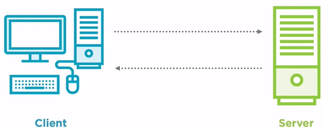
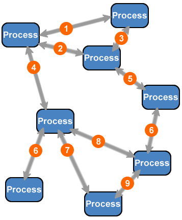
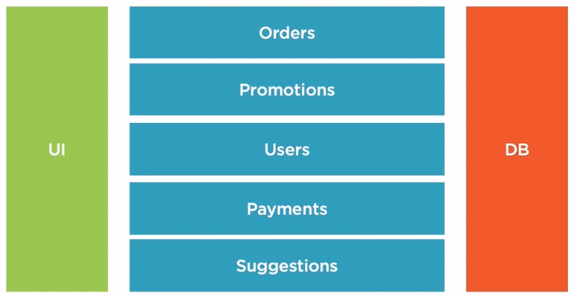
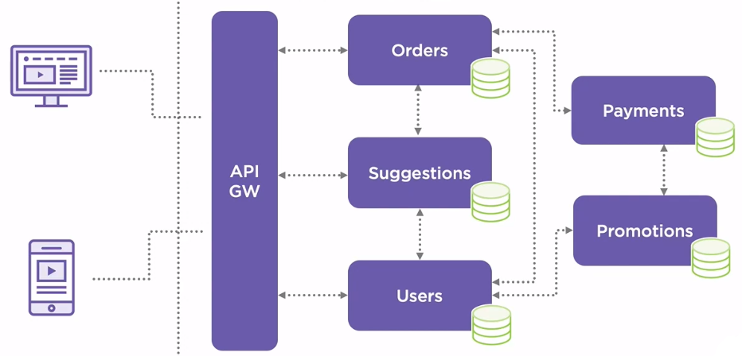
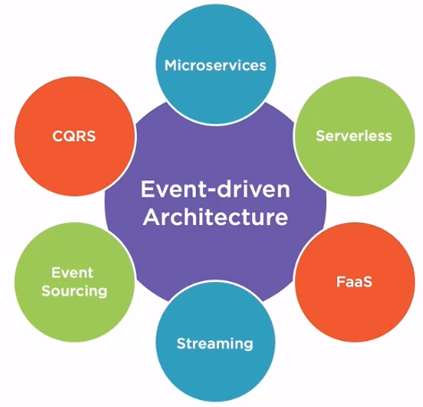
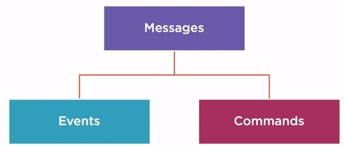
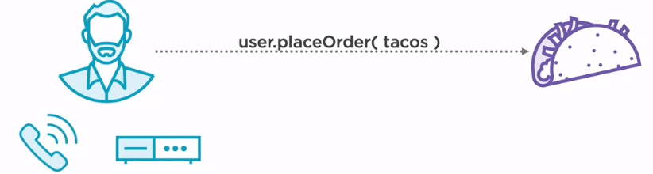
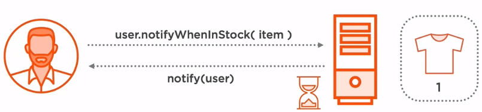
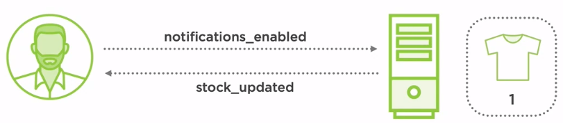
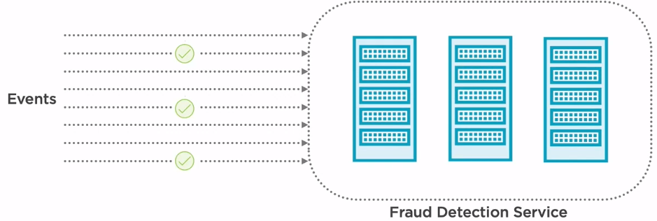

In this article, we will learn how to use Event-driven architecture pattern, and apply it in Axon framework. Let's get started.

 

## Table of contents
- [Given Problem](#given-problem)
- [Solution of Event-driven architecture pattern](#solution-of-event-driven-architecture-pattern)
- [When to use](#when-to-use)
- [Benefits & Drawback](#benefits-&-drawback)
- [Code C++ /Java / Javascript](#code-c++-/java-/-javascript)
- [Related Patterns](#related-patterns)
- [Wrapping up](#wrapping-up)

 

## Given Problem

When talking about enterprise solution generally, a client-server structure is chosen over other models. The client and server usually reside on separate hardware, so in order to access resources from the server, a communication channel will need to be established over some kind of network.

So, to communicate between other systems, our situation will look like the below image.

Then, we have the disadvantages of this request-driven architecture.
- If there are some errors in any system, it is very difficult to trace log.
- When we have multiple the other systems, to integrate them together is a conundrum.
- It's arduous to extend independently some parts of system.

Continuously, the monolithic application usually uses a layered approach to structure our code where each layer has a specific functionality. The structure of a two-layer application would include a presentation layer represented by a user interface, which translate tasks into something that a user can understand. The data layer is where the information is stored and retrieved, usually a database or some other kind of storage solution. And the business layer where all the business logic resides. This layer controls the application's functionality by processing and evaluating commands given by the user interface.

In this scenario, the business layer is composed of multiple modules such as orders, promotions, users, payments, and suggestions. When the number of features increases, so does the complexity of an application, and the cost of maintaining and developing it may become higher.

In order to solve this issue, a new pattern emerged, microservices. In a microservices architecture, the application is decomposed in a collection of loosely coupled services where each service, or model solves a specific problem and communicates with other services through simple, lightweight protocol. A microservices architecture can easily support multiple clients, such as web or mobile, without any additional overhead.

Considering the previously defined models, transposing them into the microservices pattern would result in independent services. Orders will take and process orders. Suggestions, based on the current items that are in the cart, it can suggest some other items. Users, responsible for authorizing customers. Payments process and manage payments. And promotions, based on some specific rules, the customer can benefit from discount.

**In order to ensure loose coupling, having a database per service is essential**. Moreover, each service can use the type of the database which is the most suitable. The services are interconnected through some lightweight communication protocol often being REST APIs or RPC. To have a single entry point of entry for the client, an API Gateway is required. An API Gateway will forward all the requests from a client to the appropriate service, but it can include at the same time some features like authentication or monitoring. Microservices are a great solution for the complex systems. But as we can see on the diagram, while the system gets more and more complex, so do the dependencies between services resulting in something called **microservices hell**.

It all starts with a single request from a client, but in order to complete the request, many other requests are fired across the system making it very hard to track and manage our data throughout the system. To solve this issue, a different way of thinking was required. And so event-driven architecture came into place.

 

## Solution of Event-driven architecture pattern

Event-driven architecture is a software architecture pattern promoting the production, detection, consumption of, and reaction to events. In other words, in an event-driven architecture, everything revolves around events and not the data. There are many flavors of programming models that can be encountered in EDA. Among them the most popular is still the microservices pattern where focusing each microservice to handle certain types of events and decoupling them with a broker-based technology.

The event-driven microservice architecture can be a great solution for many problems. Serverless application and the now-popular cloud computing services, Faas - Function as a Service  can solve problems that require small, short-lived applications. The streaming model is very popular nowadays due to the fact that companies need to respond faster to customer's needs. While streaming, the events are processed as they arrive in the system, so we can consider a stream as a never-ending operation giving the possibility for companies to react in almost real time. Event sourcing implies storing the data as a sequence of events in recreating the current state based on the log. Try to image a journal in which instead of changing the current balance every time we make a transaction, we write down all transactions that they are making with money. We are always recreate the current state by following the transactions incurred from the beginning until the current moment.

CQRS stands for Command Query Responsibility Segregation, and it works by separating the interfaces for read and write. In a traditional system, both reading the data and writing it are executed through the same set of entities. Using CQRS, the interfaces would be separated and would be exposed over different APIs.

Belows are some concepts that usually uses in EDA.
- A message is a basic unit of communication, and it can be literally anything. It can be a string, a number, or a full-blown object. Messages can be describe as a generic interface which has no special intent.

    

- An event is a message which informs various listeners about something that has happended.

    A real world example of an event would be publishing an advertisement on a pin board. The person that publishes the event would be called a producer, and then the interested parties which are called consumers, would subscribe to that advertisement and then would react to the ad-posted events. An event should always be referred to in its past tense because it defines something that has already happened or something that has been already triggered.

    A domain event is something that is happening in the system and is relevant to the business. Usually a domain event provokes a reaction, maybe even another event, and our system needs to react to them.

- A command will present a targeted action by having a one-to-one connection between a producer and a consumer. For instance, ordering tacos can be viewed as a command because we're placing an order either by calling or even using our favorite home-assisting device, there is an interaction between systems that knows how to reach from one to another. It would be kind of strange to call a random number to order tacos.

    

 

## When to use

- When our system has to process multiple requests that takes so much time to check business logic.

 

## Benefits & Drawback
1. Benefits

    - All the components are decoupled one from the other.
    
        When components need to communicate, let's say service A needs to transmit some data to service B, it would then use a broker-based technology. A broker acts as a middleware by facilitating the transmission of data between two systems, so the only thing that they need to know is the location of the broker. A direct communication between service A and service B would be forbidden since it would result in a tightly coupled situation.

    - Encapsulation

        Events can be classified within different functional boundaries, and they can be processed under the same boundaries. For example, in a typical e-commerce system, we would have events related to analytics, payments, promotions, suggestion, or even authentication. There are clean boundaries between each type of event without having to worry about confusing them.

    - Speed

        An event-driven architecture is designed to run almost in realtime by reacting to the incoming events as they arrive in the system.

        Let's compare a traditional system with an event-driven on and how they can react in a common scenario like handling notifications. In a typical system, a user would tell the application - "Let me know when you have this awesome T-shirt in stock again?". When the stock increases, the user would probably have to wait for a scheduled job to scan for all the persons that want to notified when this item gets back in stock. When that job is complete, the user will then be notified.

        

        In an event-driven scenario, the user will tell the system that he wants to be notified by sending an event called notification_enabled. The momen the stock is increased, an event called a stock_updated is transmitted, and the user gets notified.

        

    - Scalability

        In an event-driven architecture, scalability comes naturally allowing application to accommodate a growing amount of work, as well as cutting down resources when they are not needed.

        For example, a fraud detection service, which job is to detect if any transaction is considered to be suspicious and eventually stopped. When the number of incoming events is growing, things are becoming slower, and some of the requests may never be processed or, even worse, the whole system may freeze. The easiest solution would be the ability to horizontally scale up the fraud detection to handle the growth in events.

        

2. Drawbacks

    - Designing and developing event-driven applications requires a steep learning curve to get started because it poses some questions that traditional architectures by their nature have already given an answer to. Some of these questions may be, what can be considered the source of the truth in an event-driven architecture? Another question might be, What if things go wrong at some point in time, and duplicative event occurs? Are we ready to handle that?

    - It may become very complex to maintain. Simple event-driven architectures were introduced many years ago, but systems evolved over time and enterprise solutions usually require complex flow of events, which may become hard to understand and maintain.
    
    - Loss of transactionality
    
        In a traditional solution where requests coming into the system can be interpreted as a transaction, and if anything goes wrong during the processing of that request, the transaction can be reverted easily. 
        
        In an event-driven system, a request would result in one or a multitude of events scattered across the sytem making it almost impossible to revert the actions triggered by them in case that something fails.

    - Lineage is an important topic when it comes to debugging our system. Events can get lost or corrupted, and because the applications are loosely coupled, it is almost impossible to determine from which system that event arrived. A simple solution for this would be pinning some kind of identifier to the event in each application that is passing to.

 

## Code C++ /Java / Javascript

To understand the way that Event-driven architecture is implemented, we will use Axon framework to deal with it.

We can refer the [source code of Event-driven architecture on Github]().

 

## Related Patterns

 

## Wrapping up

- Understanding about Event-driven architecture pattern, benefits and drawbacks.

- Dig deeper into using Axon framework to combine DDD and Event-driven architecture.

 

Refer:

[Software architecture pattern ebook]()

[Designing Event-driven Applications Using Apache Kafka Ecosystem By Bogdan Sucaciu](https://app.pluralsight.com/library/courses/designing-event-driven-applications-apache-kafka-ecosystem/table-of-contents)

[https://www.confluent.io/blog/apache-kafka-for-service-architectures/](https://www.confluent.io/blog/apache-kafka-for-service-architectures/)

[https://stackoverflow.com/questions/54875234/request-based-vs-event-based-architecture](https://stackoverflow.com/questions/54875234/request-based-vs-event-based-architecture)

[https://tanzu.vmware.com/content/intersect/introduction-to-event-driven-architecture-and-apache-kafka](https://tanzu.vmware.com/content/intersect/introduction-to-event-driven-architecture-and-apache-kafka)