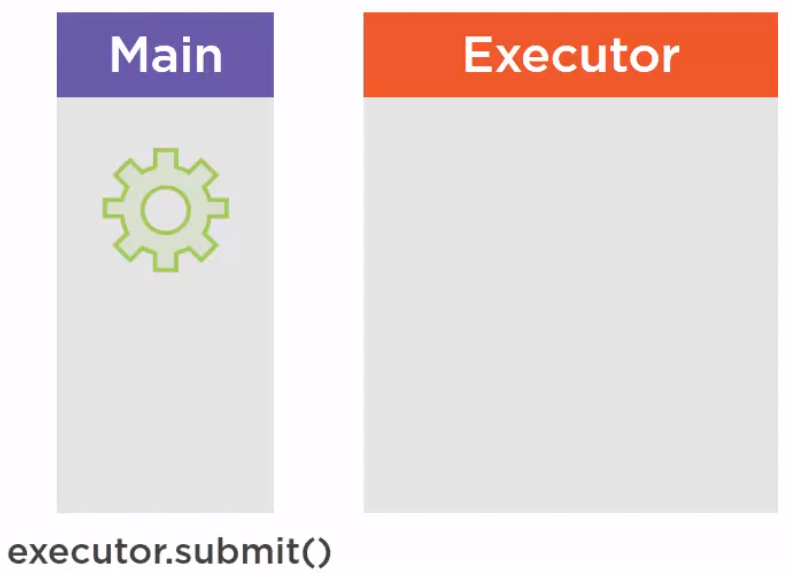
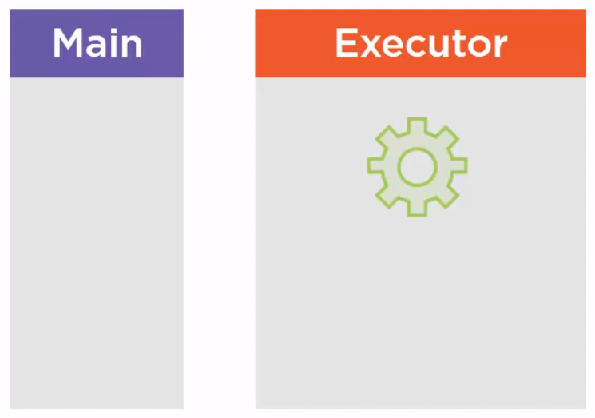
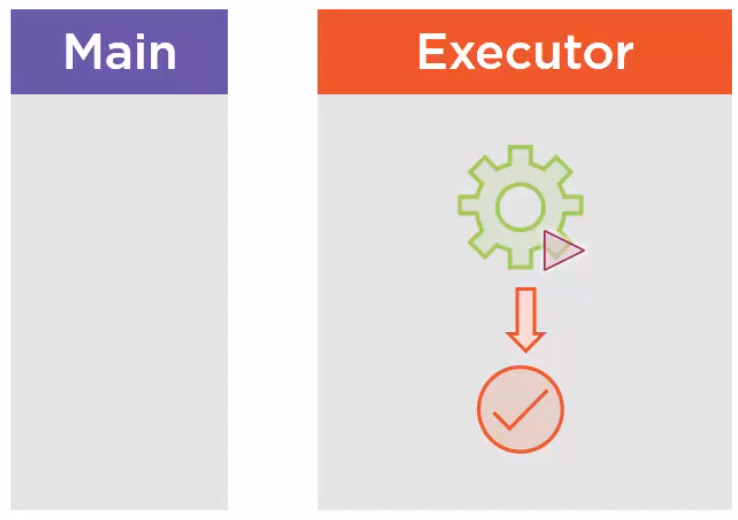
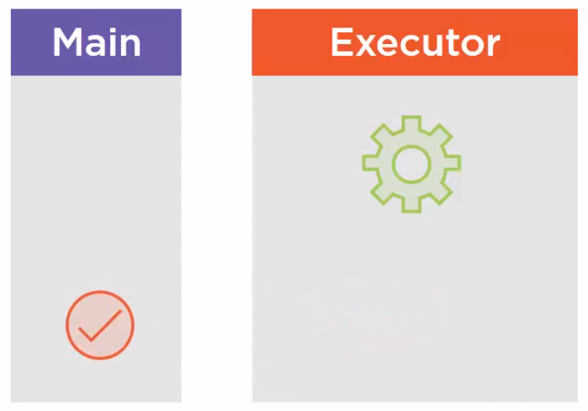

<br>

## Table of contents
- [Understanding about Callable](#understanding-about-callable)
- [Understanding about Future](#understanding-about-future)
- [Understanding about CompletableFuture](#understanding-about-completablefuture)
- [Wrapping up](#wrapping-up)


<br>

## Understanding about Callable

1. Given problem

    To understand why we need Callable functional interface, we need to take closer look at Runnable interface.

    ```java
    Runnable task = () -> someReallyLongProcess();
    Executor executor = Executors.newSingleThreadExecutor();
    executor.execute(task);
    ```

    There are several caveats in this Runnable interface:
    - The **run()** method of Runnable interface does not return anything. It means that no object can be returned and no exception can be raised.

        Suppose our task involved some kind of database quering. The database query is something we might want to execute in another thread because it can be a long-running process. This query can go longer and the standard way to tell that in the JDK is to throw a SQL exception, and if it goes well, it will simply produce a result. This result or this exception cannot be transmitted through the Runnable task.

    - There is no way we can know if a task is done or not, if it has complete normally or exceptionally, and this task cannot produce any result.

    So, we have some questions when using Runnable interface:
    - How can a task return a value?

    - How can we get the exceptions raised by a task?

    - How can this value or exception go from one thread to another?
    
        Because a task is created in a given thread, passed to a thread of an ExecutorService, and it is in this last thread that the result of the exception is created.
        
    So we need a new model for our tasks.
    - With a method that returns a value.
    - And that can throw an Exception.
    - We also need a new object that will act as a bridge between threads.

2. Solution

    Based on some drawbacks of Runnable interface, we have Callable interface to fix them. The Callable interface is a generated interface. It has a single method, just as the Runnable interface called call() method. This call() method returns an object of type V and may throw an Exception, so it does exactly what we need.

    ```java
    @FunctionalInterface
    public interface Callable<V> {

        V call() throws Exception;

    }
    ```

    As we saw the Executor interface does not handle **Callable** directly. It has a single method that takes a **Runnable** as a parameter. But the **ExecutorService** interface has a **submit()** method that takes a Callable as a parameter, and it returns a **Future** object --> this object is a wrapper on the object returned by the task, but it has also special functionalities. So to use **Callable** tasks, we have to use ExecutorService instead of Executors.

    ```java
    public interface ExecutorService extends Executor {

        // Submits a value-returning task for execution and returns a Future representing the pending results of the task.
        <T> Future<T> submit(Callable<T> task);

        // Submits a Runnable task for execution and returns a Future representing that task.
        Future<?> submit(Runnable task);

        // Submits a Runnable task for execution and returns a Future representing that task.
        <T> Future<T> submit(Runnable task, T result);
    }
    ```

<br>

## Understanding about Future

1. How does Future object works

    Suppose that we create a **Callable** in the main thread. This is the task we want to execute in the Executor we have, so we pass this task to the **submit()** method of this Executor.
    
    
    
    This task is then transmitted from the main thread to the **ExecutorService**.

    

    Now the **ExecutorService** is going to execute it in a thread of its own pool, which is of course, different from the main thread. This special thread will create a result whether it is a normal result or an exception.

    

    Then the **Executor** will have to pass this object from its thread to the main thread that created the task. This is precisely the the role of this Future object.

    

    In fact, the **Executor** will return a **Future** object that is going to hold the result of the execution of this task once it is available.

2. Understanding about **Future.get()** method

    Below is the source code that uses Future object with Callable interface.

    ```java
    // In the main thread
    Callable<String> task = () -> buildPatientReport();
    Future<String> future = executor.submit(task);

    String result = future.get();   // blocking here to get the result
    ```

    In the above code, we create the task in the main thread, then submit this task, and this **submit()** method will immediately return a Future object with the same type as the type of the **Callable**. Then we can call the **get()** method on this **Future** object. We can execute the other code before calling this **get()** method.

    There are two things can happen when we call **get()** method:
    - First, the object produced by the task is available, so the **get()** method will return that object immediately.

    - Second, the object produced by the task is not yet available. In that case, the **get()** method will not return immediately. It will block until the returned String is available.

    Now, we continue to find out about exceptions in **Future.get()** method. It can raise two exceptions:
    - In the case the thread of the executor is interrupted, it throws an **InterruptedException**.

        This exception is thrown if the thread from the Executor that is executing this task has been interrupted. It is possible to interrupt such a thread by issuing a shutdown command to the **Executor**.

    - The second case is that the task itself has thrown an exception. Imagine a query on a database and there has been some kind of error, so a SQL exception has been raised in the task internally. Then in that case, the **get()** method will wrap this root exception in an **ExecutionException** and throw it in the main thread.

    In a nutshell, this **get()** method may throw two kinds of exception, **InterruptedException**, meaning that something went wrong in the Executor itself, or **ExecutionException** to wrap an application exception thrown by the task.

    So, we have the behavior of **Future.get()** method:
    - If the task has completed, then the **get()** method call will return the produced result immediately. If it is not the case, then the **get()** call blocks until the result is ready.

    - If an exception has been thrown, then this exception is also thrown by the **get()** call, wrapped in an **ExecutionException**.

        We can pass a timeout to the **get()** call, to avoid indefinitely blocking calls. So for instance, if we think that the result should be made available in less than a second, we can pass 1 second to this **get()** method and pass the time the **get()** method will throw an exception.

3. Some examples to use Callable correctly

    - Use timeout for **Future.get()** method

        ```java
        Callable<String> task = () -> {
            Thread.sleep(300);
            return "This is thread " + Thread.currentThread().getName();
        }

        ExecutorService executor = Executors.newFixedThreadPool(4);

        try {
            IntStream.range(0, 10).forEach(cnt -> {
                Future<String> future = executor.submit(task);
                System.out.println("Result: " + future.get(100, TimeUnit.MILLISECONDS));
            });
        } finally {
            executor.shutdown();
        }
        ```

    - Handling exceptions in Callable interface

        ```java
        Callable<String> task = () -> {
            throw new IllegalStateException("Throw exception in thread " + Thread.currentThread().getName());
        }

        ExecutorService executor = Executors.newFixedThreadPool(4);

        try {
            IntStream.range(0, 10).forEach(cnt -> {
                Future<String> future = executor.submit(task);
                System.out.println("Result: " + future.get(100, TimeUnit.MILLISECONDS));
            });
        } finally {
            executor.shutdown();
        }
        ```

<br>

## Understanding about CompletableFuture

1. Introduction to **CompletableFuture**

    In fact, the **CompletableFuture** object is almost the same as a Future object with more methods and more capabilities. So everything we know about Future object is also true for a CompletableFuture.

    ```java
    Runnable task = () -> System.out.println("Hello world");
    ExecutorService service = Executors.newSingleThreadExecutor();
    Future<?> future = service.submit(task);    // use future object
    CompletableFuture<Void> completableFuture = CompletableFuture.runAsync(task);
    ```

    The above is the completable future pattern and it does not work with Callable. But it does with Suppliers.

    ```java
    Supplier<String> task = () -> readPage("https://google.com");
    ExecutorService service = Executors.newSingleThreadExecutor();
    CompletableFuture<String> completableFuture = CompletableFuture.supplyAsync(task);
    ```

    Be careful that a supplier cannot throw any checked exceptions because the supplier's signature does not declare any checked exception, this is the main difference between callable and supplier. So if our Callable is throwing a checked exception, we cannot make it a supplier.

    Then we have two pattern for working with CompletableFuture:
    - **runAsync()** method that takes a Runnable interface.
    - **supplyAsync()** method that takes a Supplier.

2. What thread does asynchronous tasks are going to be run

    In the asynchronous pattern, we do not have such pool of thread, so this is a question. In fact, by default, all the asynchronous tasks launched with those patterns are run in what is called the Common Fork/Join pool. This Common Fork/Join pool is launched by defaut with JVM starting with Java 8. It is an executor service or merely an extension of it with special capabilities.
    
    If we remember the Stream API, in fact, when we launch computations in parallel streams, the threads of the Common Fork/Join pool are used to run the parallel tasks of our stream. We can also pass an explicit executor service as a parameter as we are going to see in the code.

    ```java
    ExecutorService service = Executors.newSingleThreadExecutor();
    // first way
    Runnable task = () -> System.out.println("Hello world");
    Future<?> future = service.submit(task);    // use future object
    CompletableFuture<Void> completableFuture = CompletableFuture.runAsync(task, service);

    // second way
    Supplier<String> task = () -> readPage("https://google.com");
    CompletableFuture<String> completableFuture = CompletableFuture.supplyAsync(task, service);
    ```

3. Some methods of CompletableFuture class

    **CompletableFuture** is a class that implements two interface.
    - First, this is the Future interface.
    - Second, this is the **CompletionStage** interface.

    The fact that the **CompletableFuture** is also an implementation of this **Future** object, is making CompletableFuture and Future compatible Java objects. **CompletionStage** adds methods to chain tasks. This is where the methods of chaining tasks are defined. And the **CompletableFuture** adds more methods to the **CompletionStage** interface. So most of the time in our code, we will be using **CompletableFuture**, even if we are calling methods that are defined on the **CompletionStage** interface.

    In the **CompletableFuture** API, a task has a state which was not really the case in the **Executor** and **Future** API.
    
    This state may be:
    - running
    
        It means that this task is currently running as any task.

    - completed normally.
    
        This is a task that run normally and produced a result in a certain way. This result can be anything including, by the way, **Void** that is no result.

    - completed exceptionally

        This happens if a task encountered a problem and raised an exception while running.

    There are 5 methods on Future:
    - two methods to get the result

        ```java
        T get();

        T get(long timeout, TimeUnit unit);
        ```

        Those methods are blocking call.

    - one to cancel the execution of the task.

        ```java
        void cancel();
        ```

    - two getters

        ```java
        // to check if the task has completed
        boolean isDone();

        // it will result true if the cancel() method has been called.
        boolean isCancelled();
        ```

    **CompletableFuture** brings 5 future-like methods that are not defined on **CompletionStage**.
    - two methods to get the result in a different way

        ```java
        T join();     // may throw an unchecked exception

        T getNow(T valueIfAbsent);
        ```

        **join()** method is the same as the **get()** method. The difference is that it does not throw a checked exception, so we do not have to rub this call in a **try/catch** pattern.

        **getNow()** method will check if the task is done, and if it's not the case, we'll cancel it and return the value of absent parameter that is passed.

    - two methods to force the returned value

        ```java
        boolean complete(V value);

        void obtrudeValue(V value);
        ```

        The **complete()** method checks if the task is done or not. If it is done, then it does nothing, that is calling **join()** method or **get()** method will return the value the task computed. If it is not done, then it completes the task interrupting the grand process and sets the returned value to value that is passed as a parameter.

        The **obtrudeValue()** works almost the same. It checks if the task is done. If it is done, then it forces the returned value to the value passed as a parameter and this is the difference with the **complete()** method. If it is not done, then the behavior is the same, it completes this task and sets the return value to the value passed as a parameter.

        This **obtrudeValue()** method should be used in error recovery operations and not in normal operations.

    - two methods to force an exception

        ```java
        boolean completeExceptionally(Throwable t);

        void obtrudeException(Throwable t);
        ```

        The completeExceptionally() method will force the completion if the task is not done in an exceptional way, meaning that the join() method or the get() method will throw an exception.

        An obtrudeException() method does almost the same as the completeExceptionally() method, meaning that it forces the completion even if the task is done, even if the task is completed in a normal way, it would force the exception state and both of the join() method or the get() method will throw an exception.

        The exception thrown by the **get()** method or the **join()** method is not the exception that passed as a parameter. Merely, it is a special exception of the **Future** API or the **CompletableFuture** API that will have the exception passed as a parameter, as the root cause of this exception.

<br>

## Wrapping up

- Understanding why we have Callable, Future concept, and how to apply CompletableFuture into the asynchronous programming

<br>

Refer:

[https://crondev.blog/2017/01/23/timeouts-with-java-8-completablefuture-youre-probably-doing-it-wrong/](https://crondev.blog/2017/01/23/timeouts-with-java-8-completablefuture-youre-probably-doing-it-wrong/)

[https://medium.com/@zengcode/executorservice-with-timeout-98befeab8f50](https://medium.com/@zengcode/executorservice-with-timeout-98befeab8f50)

[https://www.callicoder.com/java-callable-and-future-tutorial/](https://www.callicoder.com/java-callable-and-future-tutorial/)

[https://docs.oracle.com/javase/7/docs/api/java/util/concurrent/Future.html#get(long,%20java.util.concurrent.TimeUnit)](https://docs.oracle.com/javase/7/docs/api/java/util/concurrent/Future.html#get(long,%20java.util.concurrent.TimeUnit))

[https://www.baeldung.com/java-future](https://www.baeldung.com/java-future)

[https://www.baeldung.com/java-completablefuture](https://www.baeldung.com/java-completablefuture)

[https://www.baeldung.com/java-runnable-callable](https://www.baeldung.com/java-runnable-callable)

[https://www.deadcoderising.com/timeout-support-using-executorservice-and-futures/](https://www.deadcoderising.com/timeout-support-using-executorservice-and-futures/)

[https://dzone.com/articles/asynchronous-timeouts](https://dzone.com/articles/asynchronous-timeouts)

[https://www.codepedia.org/ama/how-to-make-parallel-calls-in-java-with-completablefuture-example](https://www.codepedia.org/ama/how-to-make-parallel-calls-in-java-with-completablefuture-example)

[http://software-empathy.pl/2016/11/asynchronous-call-using-completablefuture/](http://software-empathy.pl/2016/11/asynchronous-call-using-completablefuture/)

[Advanced Java Concurrent Patterns by Jose Paumard](https://app.pluralsight.com/library/courses/java-concurrent-patterns-advanced/table-of-contents)