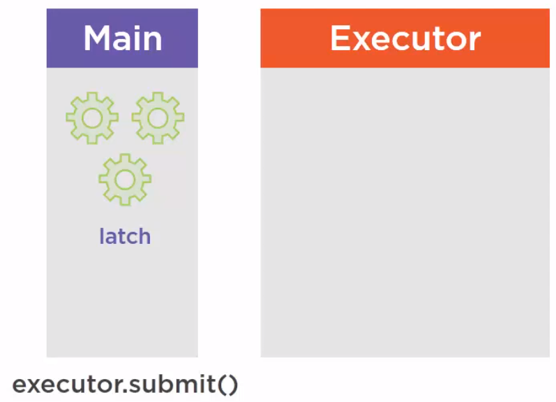
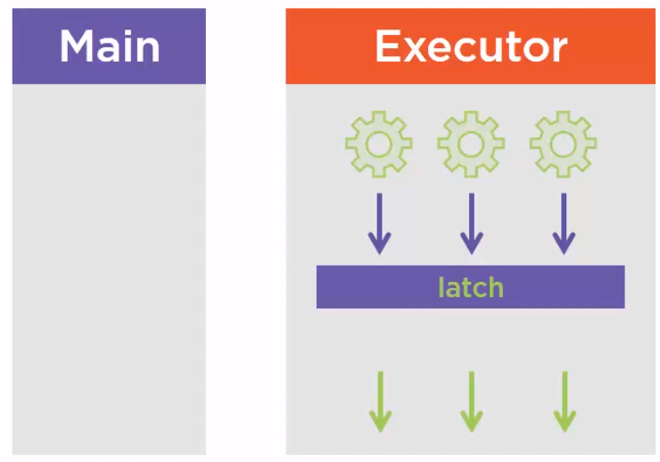

<br>

## Table of contents
- [Given problem](#given-problem)
- [Solution of CountDownLatch](#solution-of-countdownlatch)
- [When to use](#when-to-use)
- [Benefits and Drawbacks](#benefits-and-drawbacks)
- [Source code](#source-code)
- [Wrapping up](#wrapping-up)


<br>

## Given problem

1. Basic problem

    Supposed that we have a case that we need to start our application. This application is a quite complex. It depends on many services such as AuthenticationService, DataService to access the database, and OrderService to handle orders from our customers, ... And we need to make sure that all those services have properly started before we start our main application.

    So before serving clients, our application needs to make sure that all those resources are properly initialized. It looks like it is a problem for the CyclicBarrier. The problem is that once all the services are available, once they have all properly started, we need to start our application, but we do not want the barrier to reset. We do not want the barrier to close again because it could block everything, they system will have impression that some services have no been properly started. So it is the fact that the barrier is cycling that we cannot use this object in this case.

    What we need is a kind of Barrier that once opened, it cannot be closed again.

2. The drawbacks of using synchronized keyword

    Normally, when we want multiple threads work together, we usually utilize some common keyword and methods such as **synchronized**, **wait()**, **notify()**, **join()**. Our problem is that we need to run multiple threads before the main thread. But using them to solve this problem has some drawbacks:

    - **wait()**, **notify()** method only work on the segment code of **synchronized** keyword.

        The problem of using **wait()** method is the spurious wake up. Spurious wake up is a phenomena where a waiting thread is awaken without a notify signal. This can be happened due to OS. So in some cases, if code is not written properly, it ended up with an error or deadlock.

    - Using **join()** method makes our code duplicated, difficult to maintain. Because we have to call **join()** method of multiple threads.

    - Using **wait()**, **notify()**, **join()** method and synchronized keyword is difficult to use when we manullay orchestrate among threads.

    So, how to deal with the above drawbacks?

<br>

## Solution of CountDownLatch

**CountDownLatch** is defined in the package **java.util.concurrent**. It was introduced in Java 5 along with other concurrent utilities such as **CyclicBarrier**, **Semaphore**, **ConcurrentHashMap**, and **BlockingQueue**.

To solve the above problems when using **synchronized** keyword, **wait()**, **notify()**, and **join()** methods, **CountDownLatch** provides some functionalities:
- **CountDownLatch** handles spurious wake up.

- **CountDownLatch** takes responsibility to orchestrate among threads.

**CountDownLatch** works in latch principle, the main thread will wait until Gate is open.

Belows are some steps to describe how **CountDownLatch** works.
- **CountDownLatch**'s instance is constructed with the **count** variable that is corresponding to the number of threads we want to work together.

- Pass that **CountDownLatch**'s instance into our threads. Then, each our threads works successfully, we need to call **countDown()** method to decrease the **count** variable, if the count is greater than zero. Then the new count is zero, all waiting threads are re-enabled for thread scheduling purposes.

    If the current count variable equals to zero, nothing happens.

- Finally, in the other thread, we need to call **await()** method of CountDownLatch's instance.

    In this **await()** method, it can happen some cases of the **count** variable.
    - If the current **count** is zero, then this method returns immediately.

    - If the current **count** is greater than zero, the current thread becomes disabled for thread scheduling purposes and lies dormant until one of two things happen:

        - The **count** reaches zero due to invocations of the **countDown()** method.
        - Some other thread interrupts the current thread.

    - If the current thread:

        - has its interrupted status set on entry to this method.
        - is interrupted while waiting.

        then **InterruptedException** is thrown and the current thread's interrupted status is cleared.

<br>

## When to use

- Use **CountDownLatch** when the main thread require to wait for one or more threads to complete, before it can continue processing.

- CountDownLatch is good for one-time events like application start-up time.

- CountDownLatch is useful for starting an application on the completion of different initializations.

<br>

## How CountDownLatch works

The CountDownLatch works alsmost the same as a CyclicBarrier. Suppose we have three tasks in Callable in the main thread and a Latch object.



We pass everything to the ExecutorService and our tasks are going to execute. At some point, all our tasks will be waiting on the latch and this will have the same effect as the barrier. It will open the latch and let the task continue their execution. But the big difference is that the latch does not reset, and does not close again.



<br>

## Benefits and Drawbacks

1. Benefits

    - We do not need to know about reference of Thread class's instances

2. Drawbacks

    - Once the counter of **CountDownLatch** is equal to 0, it can not be set again or we cannot use CountDownLatch any more. To reset it, we need to use **CyclicBarrier**.

        It means that the CountDownLatch's not reusable.

<br>

## Source code

```java
ExecutorService service = Executors.newFixedThreadPool(5);
final CountDownLatch latch = new CountDownLatch(5);

IntStream.range(0, 5).forEach(item -> {
    service.submit(() -> {
            // do something
            // ...

            latch.countDown();
        });
});

latch.await();  // block until the count reaches 0
```


<br>

## Wrapping up

- A latch is just a tool to check that different threads did their task properly. And we can synchronize the beginning of subsequent tasks on the last one to complete.

- Memory consistency effects: Until the count reach zeros, actions in a thread prior to calling **countDown()** happen-before actions following a successful return from a corresponding **await()** in another thread.

- We can not reuse CountDownLatch once count reaches zero --> it was born CyclicBarrier.

- Main thread wait on Latch by calling **CountDownLatch.await()** method while other thread calls **CountDownLatch.countDown()** to inform that they have completed.

- A latch is conceptually any variable or concurrency construct that has two possible states and transitions from its initial state to its final state only once. Once the transition occurs, it remains in that final state forever. CountDownLatch is a concurrency utility that can exist in two states, closed and open. In its initial closed state, any thread that call the **await()** method block and can not proceed until it transitions to its latched open gate. Once this transition occurs, all waiting threads proceed, and any threads that call **await()** in the future will not block at all. The transition from closed to open occurs when a specified number of calls to **countDown()** have occured.

<br>

Refer:

[https://docs.oracle.com/javase/8/docs/api/java/util/concurrent/CountDownLatch.html#countDown--](https://docs.oracle.com/javase/8/docs/api/java/util/concurrent/CountDownLatch.html#countDown--)