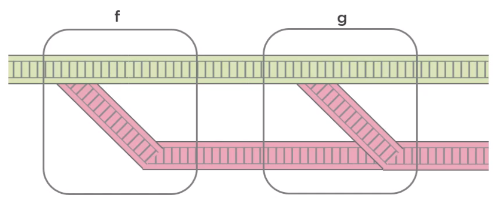

<br>

## Table of contents
- [Given problem](#given-problem)
- [Solution of Railway-oriented programming](#solution-of-railway-oriented-programming)
- [Defining the Either and Try types](#defining-the-either-and-try-types)
- [Benefits and Drawbacks](#benefits-and-drawbacks)
- [Wrapping up](#wrapping-up)


<br>

## Given problem

In functional programming, we know that a pure function doesn't produce side effect. Some people consider exceptions as side effects, but throwing an exception doesn't break the purity of a function. Catching an exception is what can break purity. Catching allows us to inspect the exception and modify the behavior of a function, breaking referential transparency.

There are two kinds of exceptions.
- Non-deterministic exceptions

    When the exception arises unpredictable, at the wrong time, for example, due to a memory error.

    This kind of exception can make our function impure because if we catch it, we could do things like having the functions to return one value when, for example, a file is found and another when it's not found, which could cost the return value to change for the same input.

    Languages that don't enforce purity like Java, let us catch exceptions anywhere we want. More functional-friendly languages prefer to let unrecoverable exceptions propagate, and they only allow us to catch exceptions in certain places. We can emulate this by catching exceptions only in well-defined places or at the lowest level possible.

- Deterministic exceptions

    Exceptions thrown when a particular set of arguments is evaluated. For example, if we are trying to parse an integer from a given string and we throw an exception, if it fails, that could be pure if it always throws the exception when passing the same string.

There are two types of functions:
- Total function

    A function that is defined for all possible values of its input. It always terminates and returns a value.

- Parital function

    A function that is not defined for all possible input values, because in some cases, it may never return anything at all.

    For example, in case of an infinite cycle or if an exception is thrown.

Don't get confused between partial functions and partially-applied functions. A partially-applied function is one where some of the arguments of the function have been pre-supplied, and a new function that takes the remaining arguments is returned.

In partial functions, we can pass a valid member of the domain as an argument, but the return value of the function is not always a member of the codomain.

For example:

```java
// if null, an exception is thrown. So it makes f is partial function
Function<Integer, Integer> f = a -> a / 2;
```

To make the function total, we can do something:
- change the domain, making it a function of a NonNullInteger type, creating a new type for this purpose.
- change the codomain, making it a function of IntegerOrException type, also creating a new type.

Functional programming prefer the second approach. In other words, functional programmer avoid exceptions by using total functions.

For example:

```java
// IntegerOrException explicitly tell us that it may throw an error in some cases
IntegerOrException operation(Integer i) {
    // ...
}
```

So to handle errors, we need a type that can be composed, passing either a valid result or an error. Scott Wlaschin calls this approach as rail-oriented programming.


<br>

## Solution of Railway-oriented programming

Railway-oriented programming is a method to explain functional programming's preferred approach for error handling.

For example, updating the product that the system is going to give for free and the number of points needed for a gift reward loyalty program. 

```java
GiftRewardLoyaltyProgram loyaltyProgram = lpRepository.getGiftRewardLoyaltyProgram();
loyaltyProgram.setNeededPoints(points);
loyaltyProgram.setProductId(productId);

lpRepository.save(loyaltyProgram);
```

According to the happy path, we will have to update the database record, but in a real-world application, we must deal with validation, connection errors, and other things.

It means that we will do something like the below.

```java
public void updateGiftReward(GiftRewardLoyaltyProgram newLoyaltyProgram) {
    if (!isNumberOfPointsValid(newLoyaltyProgram)) {
        throw new RuntimeException("Invalid points");
    }

    if (!isProductValid(newLoyaltyProgram)) {
        throw new RuntimeException("Invalid product");
    }

    GiftRewardLoyaltyProgram loyaltyProgram = lpRepository.getGiftRewardLoyaltyProgram();
    if (loyaltyProgram == null) {
        throw new RuntimeException("The loyalty program was not found");
    }

    loyaltyProgram.setNeededPoints(points);
    loyaltyProgram.setProductId(productId);

    try {
        lpRepository.save(loyaltyProgram);
    } catch(Exception ex) {
        throw new RuntimeException("Error when saving to the database");
    }
}

private boolean isNumberOfPointsValid(GiftRewardLoyaltyProgram lp) {
    boolean isValid = false;

    if (lp.getNeededPoints() != null || lp.getNeededPoints() > 0) {
        valid = true;
    }

    return valid;
}

private boolean isProductValid(GiftRewardLoyaltyProgram lp) {
    return productRepository.getProductById(lp.getProductId()) != null;
}
```

Here's how the validation function would look like in pseudocode.

```java
if valid points
    return Success
else
    return Failure({"Invalid points")
```

If we analyze the other steps, we'll find that each one will have or can be expressed with the same Success/Failure output. So each step of the process can be represented by a function, where each function takes an input and returns a union type with two cases, success and failure.


Scott Wlaschin gives us greate analogy for doing this, railways. A railway track represents a function, and this track transform the cargo of any train that goes through it.


We can compose two functions to form a new one, but railways have switches for directing trains onto a different track. We can think of these railway switches as the success-failure return values of functions.


And if we have two of these, we can combine them so that both failure tracks are connected. This way, we end up with a two-track system where the top track is the happy path, and the bottom track is the failure path.


Now, look at the big picture, we have a series of functions forming a two-track railway, each function processing data and passing it down the track to the next function. If we look inside the functions, we can see that there is a switch inside each one to change to the failure track in case an error happens. Once we get on the failure path, generally we never get back onto the happy path. Functional programming languages have a built-in type that represents the result of these functions. 



<br>

## Defining the Either and Try types

1. Either type

    Many functional languages have a data type called Either that represents one of two possible subtypes, left and right.

    

    By convention, we'll use the left subtype to represent an error and the right subtype to represent successs. Either is not always used for error handling. Either is a general-purpose type for whatever we need to deal with situations where the result can be one of two possible types. And **Either\<A, B\>** can contain either an instance of A or an instance of B. This is different from **Tuple\<A, B\>**, which contains both an A and a B instance.

    If Either of A and B contains an instance of A, then the Either is a left. If it contains an instance of B, the Either is a right.

2. Try type

    Scala, a language that also runs on the JVM, in addition to Either, has the type Try. Try represents an operation that may either result in an exception represented by the subtype failure, or return a successfully compute value represented by the subtype success.

    If an instance of Try A represents a successful operation, it is an instance of Success. wrapping an instance of type A. On the other hand, if it represents an operation in which an error has occurred, it is an instance of Failure, wrapping a Throwable, not an instance of type A.

    If we know that a function may result in an error, we can use Try A as its return type, forcing the caller of the function to deal with the possibility of an error.

3. Subtypes

    All these subtypes such as left, right, Failure, Success, have methods that receive functions, we can find in an Optional or a String. However, left and failure just pass the error value without the error value without doing anything else. In other words, the way to use these types is not by retrieving the value, but by composing functionality. Java doesn't have a type based on Either or Try.

To simulate Either or Try type in Java, we will name these with other name as Result type.

```java
public abstract class Result<T> {

    public static <T> Result<T> of(final T value) {
        return value != null 
                ? success(value)
                : failure("Null value");
    }

    public static <T> Result<T> of(final T value, final String message) {
        return value != null
                ? success(value)
                : failure(message);
    }

    public static <T> Result<T> ofNullable(final T value) {
        return value != null
                ? success(value)
                : empty();
    }

    public abstract Result<T> filter(Predicate<T> p, String message);

    public abstract <U> Result<U> map(Function<T, U> f);

    public abstract <U> Result<U> flatMap(Function<T, Result<U>> f);

    public abstract T orElse(T defaultValue);

    public abstract T orElse(Supplier<T> defaultValue);

    public static <T> Result<T> success(T value) {
        return new Success<>(value);
    }

    public static <V> Result<V> failure(Exception e) {
        return new Failure<>(e);
    }

    public static <T> Result<T> failure(String message) {
        return new Failure<>(message);
    }

    public static <T> Result<T> failure(String message, Exception e) {
        return new Failure<>(new Exception(message, e));
    }

    public static <V> Result<V> failure(Failure<U> failure) {
        return new Failure<>(failure.exception);
    }

    public static <T> Result<T> empty() {
        return new Empty<>();
    }

    private static class Success<T> extends Result<T> {
        private final T value;

        private Success(T value) {
            this.value = value;
        }

        @Override
        public Result<T> filter(Predicate<T> p, String message) {
            try {
                return p.test(this.value)
                        ? success(this.value)
                        : failure(message);
            } catch(Exception ex) {
                return failure(ex);
            }
        }

        @Override
        public <U> Result<U> map(Function<T, U> f) {
            try {
                return success(f.apply(this.value));
            } catch(Exception ex) {
                return failure(ex);
            }
        }

        @Override
        public <U> Result<U> flatMap(Function<T, Result<U>> f) {
            try {
                return f.apply(this.value);
            } catch(Exception ex) {
                return failure(ex);
            }
        }

        @Override
        public T orElse(T defaultValue) {
            return this.value;
        }

        @Override
        public T orElse(Supplier<T> defaultValue) {
            return this.value;
        }

        @Override
        public String toString() {
            return String.format("Success: %s", this.value.toString());
        }
    }

    private static class Failure<T> extends Result<T> {
        private final Exception exception;

        private Failure(Exception e) {
            this.exception = e;
        }

        private Failure(String message) {
            this.exception = new Exception(message);
        }

        @Override
        public Result<T> filter(Predicate<T> p, String message) {
            return failure(this);
        }

        @Override
        public <U> Result<U> map(Function<T, U> f) {
            return failure(this);
        }

        @Override
        public <U> Result<U> flatMap(Function<T, Result<U>> f) {
            return failure(this);
        }

        @Override
        public T orElse(T defaultValue) {
            return defaultValue;
        }

        @Override
        public T orElse(Supplier<T> defaultValue) {
            return defaultValue.get();
        }

        @Override
        public String toString() {
            return String.format("Failure: %s", this.exception);
        }
    }

    private static class Empty<T> extends Result<T> {
        private Empty() {}

        @Override
        public Result<T> filter(Predicate<T> p, String message) {
            return empty();
        }

        @Override
        public <U> Result<U> map(Function<T, U> f) {
            return empty();
        }

        @Override
        public <U> Result<U> flatMap(Function<T, Result<U>> f) {
            return empty();
        }

        @Override
        public T orElse(T defaultValue) {
            return defaultValue;
        }

        @Override
        public T orElse(Supplier<T> defaultValue) {
            return defaultValue.get();
        }

        @Override
        public String toString() {
            return "Empty";
        }
    }
}
```

Now, we will apply the Result type to refactor our **updateGiftReward()** method in section [Given problem](#given-problem).

```java
public Result<GiftRewardLoyaltyProgram> updateGiftReward(GiftRewardLoyaltyProgram newLoyaltyProgram) {

    return Result.ofNullable(newLoyaltyProgram)
                 .flatMap(this::isNumberOfPointsValid)
                 .flatMap(this::isProductValid)
                 .flatMap(lp -> Result.of(lpRepository.getGiftRewardLoyaltyProgram()))
                 .map(lp -> updateLoyaltyProgram(lp, newLoyaltyProgram))
                 .map(lpRepository::save);
}

private Result<GiftRewardLoyaltyProgram> isNumberOfPointsValid(GiftRewardLoyaltyProgram lp) {
    Result<GiftRewardLoyaltyProgram> result = null;

    if (lp.getNeededPoints() != null && lp.getNeededPoints() > 0) {
        result = Result.success(lp);
    } else {
        result = Result.failure("Invalid points");
    }

    return result;
}

private Result<GiftRewardLoyaltyProgram> isProductValid(GiftRewardLoyaltyProgram lp) {
    return Result.of(lp)
                 .filter(newLp -> productRepository.getProductById(newLp.getProductId()) != null
                         "Invalid product");
}

private GiftRewardLoyaltyProgram updateLoyaltyProgram(GiftRewardLoyaltyProgram oldLoyaltyProgram,
                                                      GiftRewardLoyaltyProgram newLoyaltyProgram) {
    oldLoyaltyProgram.setNeededPoints(newLoyaltyProgram.getNeededPoints());
    oldLoyaltyProgram.setProductId(newLoyaltyProgram.getProductId());

    return oldLoyaltyProgram;
}
```

So, we can extend the implemented Result type
- Get the exception from Failure

    - use getError() method that returns an Optional with the exception in case of a failure or an Empty Optional otherwise.
    - orElseThrow() method to throw the exception instead of returning a default value.

- onSuccess() and onFailure() methods to execute a consumer at the end of the chain.

<br>

## Benefits and Drawbacks

1. Benefits

    - It makes our code concise, easy to follow.
    - Reducing our side effects.

<br>

## Wrapping up

- Understanding the total function, the partial or partial-applied function, it is a cause that functional programming deal with errors.

- We should reference to the Scala, Erlang, even Hashkell to learn their syntax in the functional languages to improve the thinking about it.

<br>

Refer:

[Applying Functional Programming Techniques in Java by Esteban Herrera](https://app.pluralsight.com/library/courses/applying-functional-programming-techniques-java/table-of-contents)
