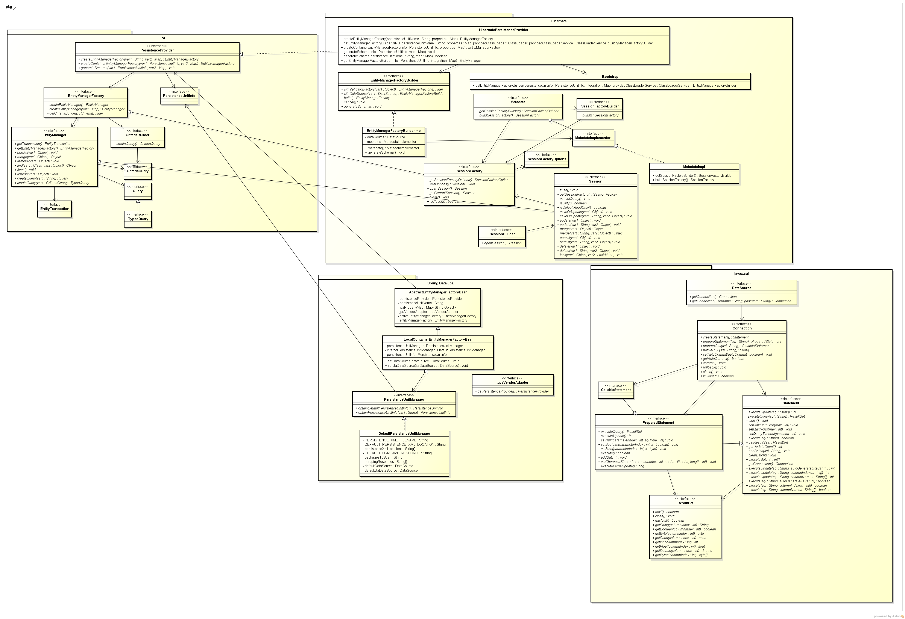
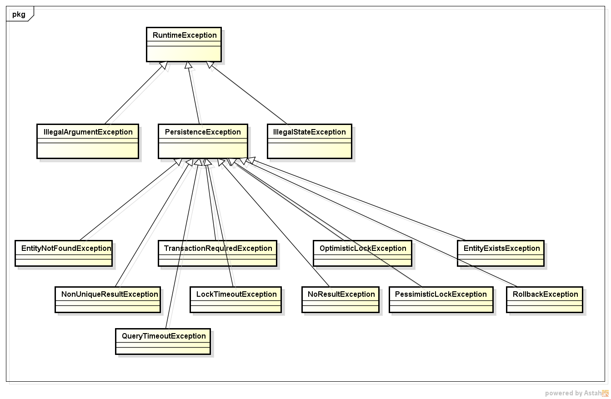

In Java web, we always do work with database such as SQL Server, MySQL, Oracle, ... Then, there are so many ways to implement with database like some implementations of ORM (Object Relational Mapping) such as ```Hibernate```, ```EclipseLink```, ```TopLink```, ```Spring Data JPA```.

Therefore, understanding about architecture of JPA is benefical for us. In this article, we will discuss about the architecture of JPA.

<br>

## Table of contents
- [Given problem](#given-problem)
- [Solution of JPA](#solution-of-jpa)
- [The architecture of JPA](#the-architecture-of-jpa)
- [Benefits and Drawbacks](#benefits-and-drawbacks)
- [Wrapping up](#wrapping-up)


<br>

## Given problem

Before JPA was born, we used JDBC to work with databases. It uses facade pattern to abstract all types of databases. It makes developers to only take care about tables of databases without their differences.

But JDBC has still some drawbacks that we need to know.
- We map a data member to a table column. This is not object-centric.
- No default mapping is available in JDBC with table.
- JDBC works using the basics of SQL. So we can use some special functionalities in each RDBMS.
- JDBC uses database-specific code.
- No automatic versioning or timestamping is available.


<br>

## Solution of JPA

1. Definition of JPA

    To solve all the drawbacks of JDBC, we will have the Object Relational Mapping - ORM technique. And JPA, iBatis, ... are some ORM techniques that we need to know.

    JPA - Java Persistence API is the Java standard for mapping Java objects to a relational database. Mapping Java objects to database tables and vice versa is called Object-relational mapping (ORM). **The Java Persistence API (JPA) is one possible approach to ORM**. Via JPA, the developer can map, store, update and retrieve data from relational databases to Java objects and vice versa. JPA can be used in Java-EE and Java-SE applications.

    **JPA defines only specifications, it does not provide an implementation.**

    JPA implementation is provided as a reference implementation by the vendors developing O/R Mapper such as Hibernate, EclipseLink and Apache OpenJPA.

    JPA permits the developer to work directly with objects rather than with SQL statements. The JPA implementation is typically called ```persistence provider```.

2. JPA Providers

    JPA is an open source API, therefore various enterprise vendors such as Oracle, Redhat, Eclipse, etc. provide new products by adding the JPA persistence flavor in them. 

    Some of these products include: 
    - Hibernate
    - EclipseLink
    - TopLink
    - Spring Data JPA
    - ...

<br>

## The architecture of JPA

Below is the relationship between JPA and Hibernate, Spring Data JPA.



But in this article, we will concentrate on the components of JPA.
1. PersistenceProvider

    Based on our information about database such as url, username, password, ..., it will create an instance of EntityManagerFactory.

    In JPA, it is an interface. Then the other vendors need to implement this interface.

2. EntityManagerFactory

    It is a factory class of EntityManager. It is used to create multiple instances of EntityManager class.
    
    If we need to access multiple databases, we must configure one EntityManagerFactory per a database.

3. EntityManager

    EntityManager manages the entities of the application. It provides some operations to interact with database through database driver such as CRUD operations, ... 

    EntityManager can use multiples instances of Query.

    EntityManager and EntityTransaction has one-to-one relationship.

4. EntityTransaction

    This class will provide some operations that satisfies ACID properties in RDBMS.

    To know more about these properties of transaction, we will read an article [Understanding about ACID properties in database](https://ducmanhphan.github.io/2020-03-25-Understanding-about-ACID-properties-in-database/).

5. Query

    This interface is implemented by each JPA vendor to find persistence objects that meet the certain criteria.

6. Entity

    An entity is a persistent domain object. Each entity class will represent a table in our database, and an entity's instance will contain the data of a single row of that table.

    Each entity will have an id field that represents the primary key in the table.

7. Persistence Unit

    A persistence unit specifies all entity tables, which are managed by the EntityManagers of the application. Each persistence unit contains all classes representing the data stored in a single database.


<br>

## Some exceptions in JPA



In JPA, all specific exceptions are subclasses of **PersistenceException** class.
- TransactionRequiredException

    It is thrown by the persistence provider when a transaction is required but is not active.

- RollbackException

    It is thrown by the persistence provider when **EntityTransaction.commit()** fails.

- EntityExistsException

    It is thrown by the persistence provider when EntityManager.persist(Object) is called and the entity already exists. The current transaction, if one is active, will be marked for rollback.

- LockTimeoutException

    It is thrown by the persistence provider when an pessimistic locking conflict occurs that does not result in transaction rollback.
    
    This exception may be thrown as part of an API call, at, flush or at commit time. The current transaction, if one is active, will be not be marked for rollback.

- OptimisticLockException

    It is thrown by the persistence provider when an optimistic locking conflict occurs. This exception may be thrown as part of an API call, a flush or at commit time. The current transaction, if one is active, will be marked for rollback.

- PessimisticLockException

    It is thrown by the persistence provider when an pessimistic locking conflict occurs. This exception may be thrown as part of an API call, a flush or at commit time. The current transaction, if one is active, will be marked for rollback.

- EntityNotFoundException

    It is thrown by the persistence provider when an entity reference obtained by EntityManager.getReference is accessed but the entity does not exist.
    
    Thrown when EntityManager.refresh is called and the object no longer exists in the database.
    
    Thrown when EntityManager.lock is used with pessimistic locking is used and the entity no longer exists in the database.

- NonUniqueResultException

    It is thrown by the persistence provider when Query.getSingleResult() or TypedQuery.getSingleResult() is executed on a query and there is more than one result from the query. This exception will not cause the current transaction, if one is active, to be marked for rollback.

- NoResultException

    It is thrown by the persistence provider when Query.getSingleResult() or TypedQuery.getSingleResult()is executed on a query and there is no result to return. This exception will not cause the current transaction, if one is active, to be marked for rollback.

- QueryTimeoutException

    It is thrown by the persistence provider when a query times out and only the statement is rolled back. The current transaction, if one is active, will be not be marked for rollback.

<br>

## Benefits and Drawbacks

1. Benefits

    - Maps an object to the table.
    - It supports its own query language instead of SQL.
    - Less database-dependent code.
    - Low maintaince code.
    - Optmizes the performance by providing caching.
    - Provides ways for automatic versioning and timestamping.
    - Abstract all operations that interact with databases. So we can switch the other databases without any concerns.

<br>

## Wrapping up

- In Hibernate, the ```Session``` interface follows the ```Repository``` pattern. However, by introducing our own repository interfaces, we decouple our domain objects from the hibernate implementation, make the domain model package easy to test and reuse.

<br>

Refer:

[Spring with JPA and Hibernate](https://app.pluralsight.com/library/courses/spring-jpa-hibernate/table-of-contents)

[http://www.javaguides.net/2018/12/jpa-architecture.html](http://www.javaguides.net/2018/12/jpa-architecture.html)

[https://en.wikibooks.org/wiki/Java_Persistence/What_is_Java_persistence%3F](https://en.wikibooks.org/wiki/Java_Persistence/What_is_Java_persistence%3F)

[https://www.objectdb.com/api/java/jpa/exceptions](https://www.objectdb.com/api/java/jpa/exceptions)