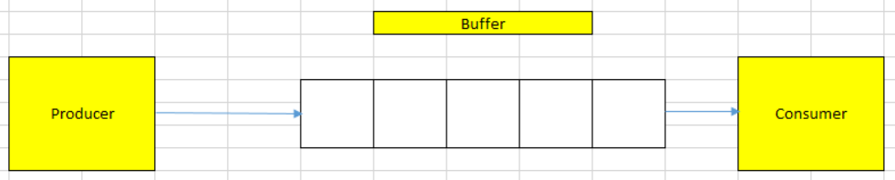
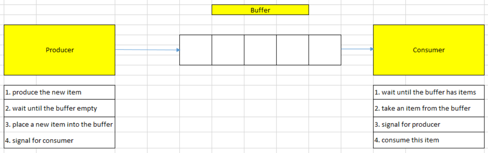

<br>

## Table of contents
- [Understanding about Producer/Consumer pattern](#understanding-about-producer/consumer-pattern)
- [When to use](#when-to-use)
- [Using synchronized block](#using-synchronized-block)
- [Using Lock framework](#using-lock-framework)
- [Using BlockingQueue](#using-blockingqueue)
- [Using Semaphore](#using-semaphore)
- [Common questions with Producer/Consumer](#common-questions-with-producer/consumer)
- [Wrapping up](#wrapping-up)


<br>

## Understanding about Producer/Consumer pattern

The producer-consumer problem, it also can be called bounded-buffer problem, is proposed by Edsger W. Dijkstra.



This problem describes that:
- A producer produces items one by one, and push each item into the buffer.

    When the buffer is full, a producer need to stop its working, and wait until the buffer has some available spaces.

- A consumer consumes items one by one, and takes each item from the buffer.

    When the buffer is empty, a consumer has to wait until the buffer has some items to continue consuming.

So, below is the common solution for this problem.




<br>

## When to use

- When we want to separate the actions between producing data and consuming data. It makes our code loose coupling.


<br>

## Using synchronized block

1. Runnable pattern

    This is the first pattern used to launch threads in Java. It is introduced in Java 1.0. Other patterns have been introduced in Java 5.

    In Java 1, the model of a task is the **Runnable** interface. It's very simple interface called Runnable. Since this method has only one method, in Java 8, it became a functional interface with **@FunctionalInterface** annotation added to it. It does not change anything in Java 7. It does not introduce any kind of backward incompatibility. It is just leveraging a new feature of the Java 8 compiler.

    ```java
    @FunctionalInterface
    public interface Runnable {
        void run();
    }
    ```

    This **Runnable** interface can be implemented using a lambda expression.

    ```java
    Runnable task = () -> System.out.println("Hello, world!");
    ```

    - How to stop a thread

        There is a method in the Thread class called **stop()**. But we should not use this method to stop a thread because if we check the documentation on this method, we will have the exact reasons that this method has in fact been introduced in the first version of the Thread class before the people who write it realized that it was a wrong idea to create such a method. The problem is once this method was published, it was not possible to remove it on the Thread class without introducing a backward incompatibility. It is there for legacy, backward compatibility reasons. It will not be removed in future versions but the only thing we want to know with this method is that we should stay away from it.

        The right pattern to stop a thread is to use the **interrupt()** method. The tricky is the **interrupt()** method will not stop a thread, but merely send a signal to the task the thread is running, telling it that it is time for this task to stop itself.

        ```java
        Runnable task = () -> {
            while (!Thread.currentThread().isInterrupted()) {
                // the task itself.
            }
        }
        ```

        If the thread is blocked, or waiting, then the corresponding method will throw an **InterruptedException**.

        The methods **wait()**, **notify()**, **join()** throw **InterruptedException**.

2. Using Producer/Consumer with wait/notify

    A producer produces values in a buffer. A consumer consumes the values from this buffer. Be careful, the buffer can be empty, or full.

    Producers and consumers are run in their own thread.

    - If we do not use wait/notify pattern, then we have:

        ```java
        public static Object lock = new Object();

        public class Consumer {
            public void consume() {
                synchronized(lock) {
                    while (isEmpty(buffer)) {}
                    buffer[--count] = 0;
                }
            }
        }

        public class Producer {
            public void produce() {
                synchronized(lock) {
                    while (isFull(buffer)) {}
                    buffer[++count] = 1;
                }
            }
        }
        ```

        Our prolem happens when buffer is empty. Well, the thread executing this consumer will be running the **isEmpty()** method inside this infinite while loop forever. So this thread will be blocked inside the **consume()** method, inside the synchronized block, while holding the key of the lock object.

        So what is going happen in the producer?

        The thread running the producer will be waiting for the key held this lock object and since this key is not available because it is held by the consumer thread, it will not be able to execute its synchronized block. So it will have no chance to add any object to buffer. In fact, this way of writing things, this way of naively synchronizing our two methods is not the right way to do it, it will lead to a deadlock.

    - Use **wait()**/**notify()**

        Calling the **wait()** method releases the key held by this thread. So this key is available to the other thread. And it puts the current thread in a particular state called the WAIT state. The WAIT state is not the same as the state in which a thread is when it is waiting at the entrance of a synchronized block. It is a special thread state. The only way to release a thread from a WAIT state is to notify it.

        Calling the **notify()** method released a thread that is in the **WAIT** state, so a thread that has called a **wait()** method and puts it in **RUNNABLE** state. And this is the only way to release a waiting thread. So if we never call the **notify()** method in our code, at some point, the new application will most probably not work properly. If there are more than one thread in the **WAIT** state, and this is the case most of the time, the released thread by the **notify()** method is chosen randomly among these threads. We also have a **notifyAll()** method that will awake all the threads in the **WAIT** state.

        ```java
        public class Producer {
            public void produce() {
                synchronized(lock) {
                    while (isFull(buffer)) {
                        lock.wait();
                    }

                    buffer[count++] = 1;
                    lock.notifyAll();
                }
            }
        }

        public class Consumer {
            public void consume() {
                synchronized(lock) {
                    while (isEmpty(buffer)) {
                        lock.wait();
                    }

                    buffer[--count] = 0;
                    lock.notifyAll();
                }
            }
        }
        ```
    
    One major caveat of this pattern is in the wait state. Once it has called the **wait()** method, it is blocked and there is no way we can interrupt it. So if no thread is ever calling **notify()** or **notifyAll()**, there is no chance that this thread will be awakened. The only way to interrupt it will be to reboot the application.

<br>

## Using Lock framework

Based on using wait/notify pattern with producer/consumer, we can change somethings in the above source code. Then we have,

```java
private static Lock lock = new ReentrantLock();
private static Condition notFull = lock.newCondition();
private static Condition notEmpty = lock.newCondition();

private static int[] buffer;

private static int count;

static boolean isEmpty(int[] buffer) {
    return count == 0;
}

static boolean isFull(int[] buffer) {
    return count == buffer.length;
}

public class Producer {
    public void produce() {
        try {
            lock.lock();
            while (isFull(buffer)) {
                notFull.await();
            }

            buffer[count++] = 1;
            notEmpty.signal();
        } catch (InterruptedException ex) {
            System.out.println(ex);
        } finally {
            lock.unlock();
        }
    }
}

public class Consumer {
    public void consume() {
        try {
            lock.lock();
            while (isEmpty(buffer)) {
                if (!notEmpty.await(10, TimeUnit.MILLiSECOND)) {
                    throw new TimeoutException("Consumer timeout");
                }
            }

            buffer[--count] = 0;
            notFull.signal();
        } catch (InterruptedException ex) {
            System.out.println(ex);
        } finally {
            lock.unlock();
        }
    }
}

public static void main(String[] args) {
    buffer = new int[10];
    count = 0;

    final Producer producer = new Producer();
    Consumer consumer = new Consumer();

    Runnable produceTask = () -> {
        for (int i = 0; i < 50; ++i) {
            producer.produce();
        }

        System.out.println("Done producing");
    };

    Runnable consumeTask = () -> {
        for (int i = 0; i < 50; ++i) {
            consumer.consume();
        }

        System.out.println("Done consuming");
    };

    Thread consumerThread = new Thread(consumeTask);
    Thread produceThread = new Thread(produceTask);

    consumerThread.start();
    produceThread.start();

    consumerThread.join();
    produceThread.join();

    System.out.println("Data in the buffer: " + count);

    IntStream.of(buffer).forEach(item -> System.out.println(item + " "));
}

```

In order to use Lock framework with Producer/Consumer pattern, we need to identify two state of buffer:
- full state
- empty state

If the buffer is in the full state, we will use the new Condition instance **notFull** to describe this state, then calling the **await()** method of Condition's  instance **notFull**.

It's similar to the empty state.

Note:
- In Consumer class, we use the **await()** method with timeout as the first parameter. It needs timeout because when happening the exception in Producer class, then lock object will be unlocked. So consumer will wait for so much time. It makes our application hang out. So, we need to use **await()** method with version timeout.

<br>

## Using BlockingQueue

Below is the source code of Producer/Consumer that uses BlockingQueue.

```java
public static void main(String[] args) throws InterruptedException {
    BlockingQueue<String> queue = new ArrayBlockingQueue<>(50);

    Callable<String> consumer = () -> {
        int count = 0;
        while (count++ < 50) {
            queue.take();
        }

        return "Consumed " + (count - 1);
    };

    Callable<String> producer = () -> {
        int count = 0;
        while (count++ < 50) {
            queue.put(Integer.toString(count));
        }

        return "Produced " + (count - 1);
    };

    List<Callable<String>> producersAndConsumers = new ArrayList<>();
    IntStream.range(0, 2).forEach(cnt -> producersAndConsumers.add(producer));
    IntStream.range(0, 2).forEach(cnt -> producersAndConsumers.add(consumer));

    System.out.println("Producers and Consumers launched");

    ExecutorService executorService = Executors.newFixedThreadPool(4);
    try {
        List<Future<String>> futures = executorService.invokeAll(producersAndConsumers);
        futures.forEach(future -> {
            try {
                System.out.println(future.get());
            } catch (InterruptedException | ExecutionException ex) {
                System.out.println(ex);
            }
        });
    } finally {
        executorService.shutdown();
    }
}
```

<br>

## Using Semaphore

Below is the source code that uses Semaphore.

```java
public class Buffer {

    private LinkedList<Integer> buffer = new LinkedList<>();

    private Semaphore semProducer = new Semaphore(1);

    private Semaphore semConsumer = new Semaphore(0);

    public void put(int value) {
        try {
            semProducer.acquire();
        } catch (InterruptedException ex) {
            System.out.println(ex);
        }

        this.buffer.add(value);
        System.out.println("Producer push " + value + " to buffer in " + Thread.currentThread().getName());

        semConsumer.release();
    }

    public void get() {
        try {
            this.semConsumer.acquire();
        } catch (InterruptedException ex) {
            System.out.println(ex);
        }

        System.out.println("Consumer is consuming element " + this.buffer.removeLast() + " in " + Thread.currentThread().getName());

        semProducer.release();
    }

}

public static void main(String[] args) {
    Buffer buffer = new Buffer();

    Runnable producer = () -> {
        IntStream.range(1, 51).forEach(cnt -> buffer.put(cnt));
    };

    Runnable consumer = () -> {
        IntStream.range(1, 51).forEach(cnt -> buffer.get());
    };

    ExecutorService executorService = Executors.newFixedThreadPool(2);
    executorService.submit(producer);
    executorService.submit(consumer);

    System.out.println("Working producer and consumer with using Semaphore");

    executorService.shutdown();
}
```

<br>

## Common questions with Producer/Consumer
1. How to resolve the producer/consumer problem so that my CPU cycle can be used to 100%. For example, if producer is producing less and consumer is consuming fast then your CPU cycle is getting wasted which is associated with cost. So what would be strategy to resolve this.


<br>

## Wrapping up

- Understanding how to use synchronized block, Lock framework, BlockingQueue and Semaphore to solve the producer/consumer problem.

<br>

Refer:

[Advanced Java Concurrent Patterns by Jose Paumard](https://app.pluralsight.com/library/courses/java-concurrent-patterns-advanced/table-of-contents)

[https://www.geeksforgeeks.org/semaphore-in-java/](https://www.geeksforgeeks.org/semaphore-in-java/)

[https://dzone.com/articles/the-evolution-of-producer-consumer-problem-in-java](https://dzone.com/articles/the-evolution-of-producer-consumer-problem-in-java)

[https://stackoverflow.com/questions/8288479/how-to-solve-the-producer-consumer-using-semaphores](https://stackoverflow.com/questions/8288479/how-to-solve-the-producer-consumer-using-semaphores)

[https://dzone.com/articles/the-evolution-of-producer-consumer-problem-in-java](https://dzone.com/articles/the-evolution-of-producer-consumer-problem-in-java)

[https://www.javacodegeeks.com/2012/02/concurrency-pattern-producer-and.html](https://www.javacodegeeks.com/2012/02/concurrency-pattern-producer-and.html)