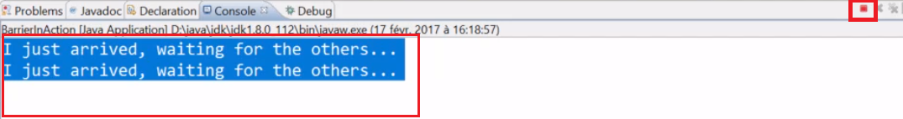
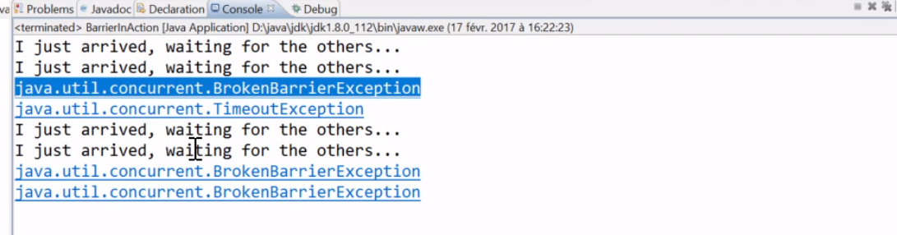
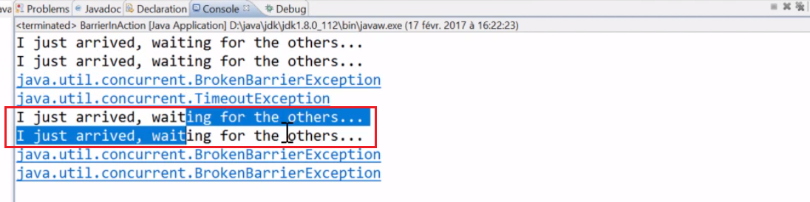
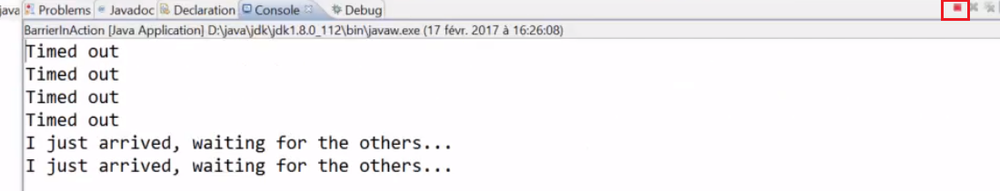

<br>

## Table of contents
- [Given problem](#given-problem)
- [Do not have enough threads on Executor to execute tasks](#do-not-have-enough-threads-on-executor-to-execute-tasks)
- [Wrapping up](#wrapping-up)

<br>

## Given problem

Below is the source code that use CyclicBarrier.

```java
public static void main(String[] args) {
    
    class Friend implements Callable<String> {
        private CyclicBarrier barrier;

        public Friend(CyclicBarrier barrier) {
            this.barrier = barrier;
        }

        public String call() throws Exception {
            try {
                Random random = new Random();
                Thread.sleep(random.nextInt(20) * 100 + 100);
                System.out.println("I just arrived, waiting for the others ...");

                barrier.await();        // (1)

                System.out.println("Let's go to the cinema");
                return "ok"
            } catch (InterruptedException ex) {
                System.out.println("Interrupted");
            }

            return "nok";
        }
    }

    ExecutorService executorService = Executors.newFixedThreadPool(4);

    CyclicBarrier barrier = new CyclicBarrier(4, () -> System.out.println("Barrier openning"));
    List<Future<String>> futures = new ArrayList<>();

    try {
        for (int i = 0; i < 4; ++i) {
            Friend friend = new Friend(barrier);
            futures.add(executor.submit(friend));
        }

        futures.forEach(future -> {
            try {
                future.get();   // (2)
            } catch(InterruptedException | ExecutionException ex) {
                System.out.println(e.getMessage());
            }
        });
    } finally {
        executorService.shutdown();
    }
}
```

The above source code runs smoothly. Then we will modify some parameters to encounter some problems that we need to fix. They are common cases that we will cope with in projects.

<br>

## Do not have enough threads on Executor to execute tasks

From an above source code, we find that we have 4 on a CyclicBarrier, so we need to have at least 4 threads available in our ExecutorService. If it is not the case, it means that this barrier will never open. 

To try this problem, we can change the number of threads in **newFixedThreadPool()** method.

```java
ExecutorService executorService = Executors.newFixedThreadPool(2);
```

So, we have some conclusions:
- The two first Callable will be propery executed and will wait for the barrier to open, but since the ExecutorService do not have any available threads for the two other tasks, they will never be executed and this barrier will never open. So it takes so much time to open properly.

    

    - First way

        To fix this problem, we can find that the **await()** method has the timeout version. So, to reduce the time to wait for it, we need to set timeout for the await() method.

        ```java
        barrier.await(5, TimeUnit.SECONDS);     // (1)
        ```

        We have two tasks that are going to be properly executed, so this **await()** method will be executed for them, but the two others are never going to be executed. So, at the ```(1)``` point, the **await()** method will throw a **TimeoutException** after 5 seconds.

        Then the **TimeoutException** will be catched in the **Future.get()** method at the ```(2)``` point and it caused the barrier will be broken. 
        
        

        We can see that the two first tasks executed and a TimeoutException has been raised along with a BrokenBarrierException. In fact, the first task that timed out closed the other waiting tasks on the await() method to throw the BrokenBarrierException. So those two tasks have failed.

        And the two corresponding of ExecutorService have been released and they became available to execute the two waiting tasks. So they are executed.

        

        When those two waiting tasks have reached the barrier and the await() method, since the barrier was broken, that immediately throw this BrokenBarrierException.

    - Second way

        To fix this problem, we can use another solution. Using timeout version of **Future.get()** method at the ```(2)``` point.

        ```java
        try {
            future.get(200, TimeUnit.MILLISECONDS);   // (2)
        } catch(InterruptedException | ExecutionException ex) {
            System.out.println(e.getMessage());
        } catch (TimeoutException ex) {     //  (3)
            System.out.println(e.getMessage());
        }
        ```

        This version of **Future.get()** method can throw a **TimeoutException**, so we need to add a catch clause with **TimeoutException**. Then, we have:

        

        We can see that our problem is only partially resolved. Because all our future have timed out, so our main thread is not waiting for any result anymore. But our tasks are still waiting for the barrier to open and our two unexecuted tasks are still waiting in the ExecutorService, and JVM is still running because threads are still running in the ExecutorService executing tasks. The timeout that the Future.get() method does not always cancel the running task, and in that case, it is only a partial solution.

        So the proper way to handle this case completely with this solution is once the TimeoutException at the ```(3)``` point has been throw, cancel the corresponding task by calling Future.cancel() method and pass true since we want to interrupt the currently running tasks and the tasks waiting in the ExecutorService for an available thread.

        ```java
        try {
            future.get(200, TimeUnit.MILLISECONDS);   // (2)
        } catch(InterruptedException | ExecutionException ex) {
            System.out.println(e.getMessage());
        } catch (TimeoutException ex) {     //  (3)
            System.out.println(e.getMessage());
            future.cancel(true);
        }
        ```

        Run this code, our application has exited properly, so it means that the ExecutorService has been shutdown and all the tasks have been cancelled, but if we 

<br>

## Wrapping up

- We need to use timeout version of methods to reduce the corner cases in multithreading.


<br>

Refer:

[Advanced Java Concurrent Patterns by Jose Paumard](https://app.pluralsight.com/library/courses/java-concurrent-patterns-advanced/table-of-contents)