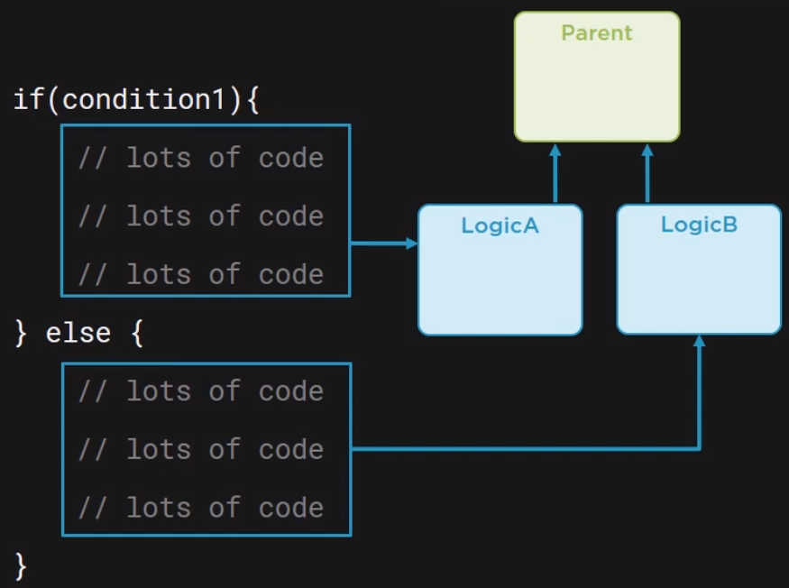
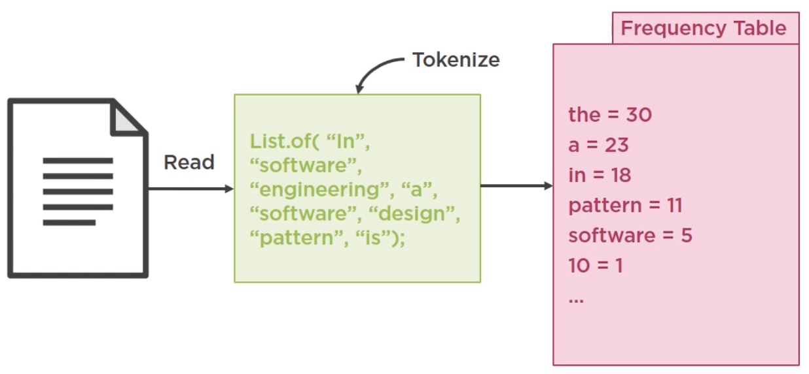

<br>

## Table of contents
- [Given problem](#given-problem)
- [Solution for refactoring conditional code](#solution-for-refactoring-conditional-code)
- [Reducing nested code](#reducing-nested-code)
- [Replace conditionals with polymorphism](#replace-conditionals-with-polymorphism)
- [Using Strategy pattern](#using-strategy-pattern)
- [Using functional programming](#using-functional-programming)
- [Using Enum type](#using-enum-type)
- [Wrapping up](#wrapping-up)


<br>

## Given problem

Conditional code is typically expressed in two ways, either with an if/else block or a switch statement.

For example:

```java
if (condition1) {
    // do something
} else if (condition2) {
    // do something
} else {
    // do something
}

switch (value) {
    case v1: 
    case v2:
    default:
}
```

Normally conditional code is not bad in itself and it is a part of language's syntaxes. But it breaks Open-Closed Principle.

**If our conditional code is simple and short, we do not need to refactor it**. But problems start happening when such branch in code grows into a huge mess that nobody want to touch it.

For example:

```java
if (condition1) {
    if (condition3 && condition4) {
        if (condition5) {
            // do something
        }
    }
} else if (condition2) {
    if (!condition6) {
        switch (val) { ... }
    }
}
```

It's fragile and complex, it means that it's difficult to understand and that's easy to break, so refactoring of such statements should happen when they start to grow.

<br>

## Solution for refactoring conditional code

Belows are some solutions to refactor our code.
- Reduce level of code nestedness
- Replace conditional with polymorphism
- Strategy pattern
- Using functional programming
- Using enum type

To understand deeper each solution, we will implement it.

<br>

## Reducing nested code

In order to reduce the amount of nested code in if/else statement, we can:
1. Use a guard clause

    For example:

    ```java
    if (val1 != null) {
        if (val2 != null) {
            if (val3 != null) {
                // do something
            }
        }
    }

    throw new SomeException("...");
    ```

    Using a guard clause, we will apply fail-fast for these conditions.

    ```java
    if (val1 == null || val2 == null || val3 == null) {
        throw new SomeException("...");
    }
    ```

    It might not reduce the number of checks, but it reduces the depth of our code.

2. Extract conditional

    If we have multiple checks, we can take that condition and wrap it into a seperate function or method with a descriptive name,

    For example:

    ```java
    Integer val = ...;
    if (val == null && val < 0) {
        throw new SomeException("...");
    }
    ```

    Then squeeze that condition into a method, we have:

    ```java
    Integer val = ...;
    if (check(val)) {
        throw new SomeException("...");
    }

    boolean check(Integer val) {
        // do something
    }
    ```

3. Use Java 8 Stream

    For example:

    ```java
    public static List<String> extractDefinitions(String json) {
        List<String> defs = new ArrayList<>();

        for (String line : json.split("\\n")) {
            if (line.contains("definition") && line.substring(line.lastIndexOf(":") + 3).trim().length() > 3) {
                String def = line.substring(line.lastIndexOf(":") + 3, line.length() - 2);
                defs.add(def);
            }
        }

        return defs.isEmpty() ? List.of("Nothing found") : defs;
    }
    ```

    We can find that this case has several nested levels. So, we will use **Stream** to refactor it.

    ```java
    public static List<String> extractDefinitions(String json) {
        Predicate<String> nonEmptyDefinition = line -> line.contains("definition") &&
                                                       line.substring(line.lastIndexOf(":") + 3).trim().length() > 3;

        Function<String, String> extractDefinition = line -> line.substring(line.lastIndexOf(":") + 3, line.length() - 2);

        List<String> defs = Arrays.stream(json.split("\\n"))
                                    .filter(nonEmptyDefinition)
                                    .map(extractDefinition)
                                    .collect(Collectors.toList());

        return defs.isEmpty() ? List.of("Nothing found") : defs;
    }
    ```

    The idea for an above problem is that to convert [imperative programming](https://en.wikipedia.org/wiki/Imperative_programming) to [declarative programming](https://en.wikipedia.org/wiki/Declarative_programming).

    For example:

    ```java
    // imperative style
    for (...) {
        if (...) {
            for (...) {
                if (...) { ... }
            }
        }
    }

    // declarative style
    things.stream()
          .filter()
          .map()
          .distinct()
          .collect();
    ```

<br>

## Replace conditionals with polymorphism

Sometimes conditional code becomes complex, even if it's not a deeply nested.

For example, if we have a simple condition, then execute a large chunk of code or else even bigger chunk.

```java
if (condition1) {
    // lots of code
    // lots of code
    // lots of code
} else {
    // lots of code
    // lots of code
    // lots of code
}
```

In such cases, we should replace branching code with polymorphism. It's not a design pattern but we should definitely consider before even thinking about patterns. 

Essentially, we identify each major branch, create a subclass for each of them, move them, and create an interface or parent class. It is the act of encapsulating behavior. We are encapsulating a logical unit of codes in a dedicated class.



For example, below is the source code about writing something to txt file or pdf file based on input.

```java
public static void main(String[] args){
    List<String> words = getWords(Paths.get("text-stats/src/main/resources/words.csv"));

    Dictionary dict = english();
    String wordsWithDefinitions = HelperUtils.defineWords(dict, words);


    String outputDestination = args[0];
    // example of a non-deeply nested, but large conditional code
    if(outputDestination.equalsIgnoreCase("txt")){

        try {
            Files.write(Paths.get("wordsWithDefinitions.csv"), wordsWithDefinitions.getBytes());
        } catch (IOException e) {
            throw new UncheckedIOException(e);
        }

    } else if (outputDestination.equalsIgnoreCase("pdf")){

        String sanitized = wordsWithDefinitions.replaceAll("\\p{C}", "");
        PDDocument document = new PDDocument();
        PDPage page = new PDPage();
        document.addPage(page);
        PDPageContentStream contentStream;
        try {
            contentStream = new PDPageContentStream(document, page);
            contentStream.setFont(PDType1Font.COURIER, 12);
            contentStream.beginText();
            contentStream.showText(sanitized);
            contentStream.endText();
            contentStream.close();
            document.save(Paths.get("wordsWithDefinitions.pdf").toFile());
            document.close();
        } catch (IOException e) {
            throw new UncheckedIOException(e);
        }
    }
    else {
        throw new IllegalArgumentException("We only currently support writing to txt or pdf. " +
                                            "You have input: " + outputDestination);
    }
}
```

Take a glimpse an above code, we can find that if/else statement uses many code. In the future, when we have a new requirement, we need to change it, it will break Single Responsibility Principle.

So, in this case, we will use polymorphism to refactor it.
1. Define the parent class or interface for each brach code.

    ```java
    public interface Writer {
        void write(String s, Path path);
    }
    ```

2. Seperate the writing content to text file into **FileWriter** class.

    ```java
    public class FileWriter implements Writer {
        @Override
        public void write(String s, Path path) {
            try {
                Files.write(path, String.join("\n", s).getBytes());
            } catch (IOException e) {
                throw new UncheckedIOException(e);
            }
        }
    }
    ```

3. Seperate the writing content to pdf file into **PdfWriter** class

    ```java
    public class PdfWriter implements Writer {
        @Override
        public void write(String s, Path path) {
            String sanitized = s.replaceAll("\\p{C}", "");
            PDDocument document = new PDDocument();
            PDPage page = new PDPage();
            document.addPage(page);
            PDPageContentStream contentStream;
            try {
                contentStream = new PDPageContentStream(document, page);
                contentStream.setFont(PDType1Font.COURIER, 12);
                contentStream.beginText();
                contentStream.showText(sanitized);
                contentStream.endText();
                contentStream.close();
                document.save(path.toFile());
                document.close();
            } catch (IOException e) {
                throw new UncheckedIOException(e);
            }
        }
    }
    ```

4. Use factory method pattern to support its implementation

    ```java
    public class WriterFactory {
        public enum WriterType {
            PDF, TXT
        }

        public static Writer getWriter(WriterType type){
            switch (type){
                case TXT:
                    return new FileWriter();
                case PDF:
                    return new PdfWriter();
                default:
                    throw new IllegalArgumentException("Unsupported writer type");
            }
        }
    }
    ```

5. Use all above code in main() method

    ```java
    public class ConditionalComplexityToPolymorphismAfterApp {
        public static void main(String[] args){

            List<String> words = getWords(Paths.get("..."));

            Dictionary dict = english();
            String wordsWithDefinitions = defineWords(dict, words);

            // no branching
            String outputDestination = args[0];
            Writer fileWriter = WriterFactory.getWriter(WriterType.valueOf(outputDestination));
            fileWriter.write(wordsWithDefinitions, Paths.get("wordsWithDefinitions." + outputDestination));
        }
    }
    ```

6. Benefits and Drawbacks

    - Benefits

        - Overcome the problems when we have new requirements. We only need to use Open/Close principle to adapt these new requirements.

    - Drawbacks

        - When we have a small code of if/else statement, use this way makes our code verbose.

<br>

## Using Strategy pattern

1. Given problem

    Assuming that we want to create a text statistic application, we'll have some input, output code to take a text file, then tokenize, means that break it up into a list of words, the produce a frequency table, which is basically a map.

    

    Below is the source code of this problem:

    ```java
    public static void main(String[] args) {
        String content = readFile(Paths.get("text-stats/src/main/resources/design_patterns.txt"));
        List<String> words = tokenize(content);

        Map<String, Long> wordsFrequency;
        String filterCriteria = args[0];

        if (filterCriteria.equalsIgnoreCase("all")) {
            wordsFrequency = words.stream()
                    .map(String::toLowerCase)
                    .collect(groupingBy(w -> w, counting()));

        } else if (filterCriteria.equalsIgnoreCase("nostopwords")) {
            wordsFrequency = words.stream()
                    .map(String::toLowerCase)
                    .filter(word -> !getStopWords().contains(word))
                    .collect(groupingBy(w -> w, counting()));

        } else if (filterCriteria.equalsIgnoreCase("nonumbers")) {
            wordsFrequency = words.stream()
                    .map(String::toLowerCase)
                    .filter(word -> !isNumeric(word))
                    .collect(groupingBy(w -> w, counting()));
        } else {
            throw new IllegalArgumentException("Unsupported argument:" + filterCriteria);
        }

        Map<String, Long> sorted = sortDescending(wordsFrequency);
        System.out.println(sorted);
    }

    private static Map<String, Long> sortDescending(Map<String, Long> stringFrequencyMap) {
        return stringFrequencyMap.entrySet()
                .stream()
                .sorted(reverseOrder(comparingByValue()))
                .collect(
                        toMap(Map.Entry::getKey,
                                Map.Entry::getValue, (e1, e2) -> e2,
                                LinkedHashMap::new));
    }
    ```

    From an above code, we can find that we has three slightly different algorithm to care about.
    - Strategy 1 - all words
    - Strategy 2 - no stop words
    - Strategy 3 - no numbers

    If we have a new algorithm, we will insert a new else if statement into an above code. So, it makes our code difficult to read, understand, and maintain.

    How can we deal with it?

2. Solution

    In this case, we will use strategy pattern to deal with it.

    Belows are some steps that we will use strategy pattern to refactor code.
    - Define the interface for our strategies.

        ```java
        public interface WordCriteria {
            Map<String, Long> convertToFrequencyTable(List<String> list);
        }
        ```

    - Define classes for each our strategy.

        Below is all words strategy.

        ```java
        public class Allwords implements WordCriteria {
            @Override
            public Map<String, Long> convertToFrequencyTable(List<String> list) {
                return list.stream()
                        .map(String::toLowerCase)
                        .collect(groupingBy(w -> w, counting()));
            }
        }
        ```

        Below is no numbers strategy.

        ```java
        public class NoNumbers implements WordCriteria {
            @Override
            public Map<String, Long> convertToFrequencyTable(List<String> list) {
                return list.stream()
                        .map(String::toLowerCase)
                        .filter(word -> !isNumeric(word))
                        .collect(groupingBy(w -> w, counting()));
            }
        }
        ```

        Below is no stop words strategy.

        ```java
        public class NoStopWords implements WordCriteria {
            @Override
            public Map<String, Long> convertToFrequencyTable(List<String> list) {
                return list.stream()
                        .map(String::toLowerCase)
                        .filter(word -> !getStopWords().contains(word))
                        .collect(groupingBy(w -> w, counting()));
            }
        }
        ```

    - Finally, we will define a context for our strategies. It will contains the current strategy, and we can dynamically change it.

        For example:

        ```java
        public class TextStatsPalWithStrategy {
            private WordCriteria criteria;

            public TextStatsPalWithStrategy() {
                this.criteria = new Allwords();
            }

            public TextStatsPalWithStrategy(WordCriteria criteria) {
                this.criteria = criteria;
            }

            public Map<String, Long> countWords(List<String> list){
                return criteria.convertToFrequencyTable(list);
            }

            public void setCriteria(WordCriteria criteria){
                this.criteria = criteria;
            }
        }
        ```

    - Source code in main() method.

        ```java
        public static void main(String[] args) {
            String content = readFile(Paths.get("..."));
            List<String> words = tokenize(content);

            TextStatsPalWithStrategy textStats = new TextStatsPalWithStrategy();
            Map<String, Long> wordStats1 = textStats.countWords(words);
            System.out.println(sortDescending(wordStats1));

            textStats.setCriteria(new NoStopWords());
            Map<String, Long> wordStats2 = textStats.countWords(words);
            System.out.println(sortDescending(wordStats2));
        }
        ```

    So, with above problem, we used strategy pattern to refactor it. But it makes more complicated code because it creates multiple classes.

<br>

## Using functional programming

1. Given problem

    We implemented strategy pattern based on the understanding that the requirements for different algorithms will not change much, or at least that we will get requests for new requirements. That's when the strategy pattern works well.
    
    But in turns out that many stakeholders might want their own algorithm, and frequently it will be a random mix of what we already have, or the combination between our algorithms.

    For example:

    ```java
    Behavior b1 = // no stop words
    Behavior b2 = // no numbers
    Behavior b3 = // b1 && b2
    Behavior b4 = // b1 && b2 && other
    ```

    Our code will become deeply nested, with a lot of duplication across the branching blocks.

    ```java
    if (condition1) {
        if (condition3 && condition4) {
            if (condition5) { ... }
        } 
    } else if (condition2) {
        if (!condition6) {
            switch (val) { ... }
        }
    }
    ```

    With an above code, we do not apply the strategy pattern in it. Because we will need to write a lot of classes, and that would lead to what we call class (comboniatorial) explosion. It means that we write a lot of classes that combine other algorithms.

    In this case, we need to mix and match behaviors, and the pattern works well for this case is Decorator pattern.
    
    ```java
    new NoNumbers(new NoStopWords(new AllWords()));
    ```

    The other way to solve it is to use functional programming. Because some functional interfaces that support chainning and composing together.

2. Solution

    We can present the above strategies through functional interfaces such as.

    ```java
    Predicate<String> noStopWords = word -> !getStopWords().contains(word);
    Predicate<String> noNumbers = word -> !isNumeric(word);

    Predicate<String> combined = noStopWords.and(noNumbers);
    List<Predicate<String>> filters = List.of(noStopWords, noNumbers);
    ```

    To solve our above problem, we can do this.

    ```java
    public class TextStatsPalWithPredicate {
        public Map<String, Long> countWords(List<String> list) {
            return list.stream()
                    .map(String::toLowerCase)
                    .collect(groupingBy(w -> w, counting()));
        }

        public Map<String, Long> countWords(List<String> list, Collection<Predicate<String>> filters) {

            Predicate<String> allFilters = filters.stream().reduce(Predicate::and).orElse(x -> true);

            return list.stream()
                    .map(String::toLowerCase)
                    .filter(allFilters)
                    .collect(groupingBy(w -> w, counting()));
        }

        private static final Map<String, Predicate<String>> FILTERS = Map.of(

                "no_stop_words", word -> !getStopWords().contains(word),
                "no_numbers", word -> !isNumeric(word)
        );

        /**
        * If a user inputs no_stop_words, then get the corresponding Predicate from the map
        */
        public static List<Predicate<String>> mapUserInputToFilters(String[] args) {
            List<String> userInput =  Arrays.asList(args);
            Set<String> mapKeys = FILTERS.keySet();
            return mapKeys
                    .stream()
                    .filter(k -> userInput.stream().anyMatch(mapKeys::contains))
                    .map( k -> FILTERS.get(k))
                    .collect(Collectors.toList());
        }

        // Enum alternative to the Map above
        public enum WordFilterCriteria {

            NO_STOP_WORDS(word -> !getStopWords().contains(word)),
            NO_NUMBERS(word -> !isNumeric(word));

            private final Predicate<String> wordFilter;

            WordFilterCriteria(Predicate<String> wordFilter) {
                this.wordFilter = wordFilter;
            }

            public Predicate<String> get(){
                return wordFilter;
            }
        }

        // Plain constant pool alternative to the Map above
        public static class WordFilterCriteria2 {
            public static final Predicate<String> NO_STOP_WORDS = word -> !getStopWords().contains(word);
            public static final Predicate<String> NO_NUMBERS = word -> !isNumeric(word);
        }

    }

    public static void main(String[] args) {
        List<Predicate<String>> userFilters = TextStatsPalWithPredicate.mapUserInputToFilters(args); // no_stop_words, no_numbers

        TextStatsPalWithPredicate textStatsPal = new TextStatsPalWithPredicate();
        Map<String, Long> wordStats = textStatsPal.countWords(words, userFilters);
        System.out.println(sortDescending(wordStats));
    }
    ```

<br>

## Using Enum type

1. Given problem

    The original article is [Clean Code with Java: Replace the logical condition using ENUM(if / else statements)](https://medium.com/@roanmonteiro/clean-code-with-java-replace-the-logical-condition-using-enum-if-else-statements-898bd6a85327).

    Assuming that we have multiple if/else statements for many type, below is the source code that describe its intention.

    ```java
    if ("type1".equalsIgnoreCase(operationType)) {
        // ...
    } else if ("type2".equalsIgnoreCase(operationType)) {
        // ...
    } else if ("type3".equalsIgnoreCase(operationType)) {
        // ...
    } else if ("type4".equalsIgnoreCase(operationType)) {
        // ...
    }
    ```

2. Solution

    - Define the enum type for these above types and its abstract method for their type's behaviors.

        ```java
        public enum SpecialType {

            TYPE_1,

            TYPE_2,

            TYPE_3,

            TYPE_4;

            public abstract void doOperation(Param params);
        }
        ```

    - Then, with each type, we need to override an above abstract method.

        ```java
        public enum SpecialType {

            TYPE_1 {
                @Override
                public void doOperation(Param params) {
                    // implement its operation
                }
            },

            TYPE_2 {
                @Override
                public void doOperation(Param params) {
                    // implement its operation
                }
            },

            TYPE_3 {
                @Override
                public void doOperation(Param params) {
                    // implement its operation
                }
            },

            TYPE_4 {
                @Override
                public void doOperation(Param params) {
                    // implement its operation
                }
            };

            public abstract void doOperation(Param params);
        }
        ```

3. Benefits and Drawbacks

    - Benefits

        - Seperate all logic code in if/else statements into each specific type of Enum --> satisfy the Single Responsibility principle.

        - Easily add a new functionality when we have a new requirement.

    - Drawbacks

        - Embedded the business logic code into Enum type because normally enum type is used to define the limited value of the enumeration type.

<br>

## Wrapping up

- Over-application of design patterns leads to overcomplicated code.

- If our code is short and simple, we will use lambda to refactor code.

- If our cde is long and complex, we need to use class.

- To reduce the level of nested code, we can use some ways:

    - Use a guard clause
    - Extract conditional
    - Use Java 8 Stream

- When we have a lot of code in a simple if/else statement, we can use polymorphism. Normally replace branching with polymorphism is often enough.

    It means that we will create classes for corresponding code in each if/else statement, and the base class for them. Then, we will use factory method pattern to support creating an instance of each class.

- When we have multiple **else if** statement in **if/else** statements, but each logical code does not frequently change, then we can use strategy pattern.

- When we have multple if/else statement, and some nested code, it makes our code complex, we can use functional programming.

<br>

Refer:

[Java: Refactoring to Design Patterns by Andrejs Doronins](https://app.pluralsight.com/library/courses/java-refactoring-design-patterns/table-of-contents)

[https://www.softwaretestingclass.com/assertions-in-jmeter-jmeter-tutorials-series-day-7/](https://www.softwaretestingclass.com/assertions-in-jmeter-jmeter-tutorials-series-day-7/)

[https://www.guru99.com/assertions-in-jmeter.html](https://www.guru99.com/assertions-in-jmeter.html)