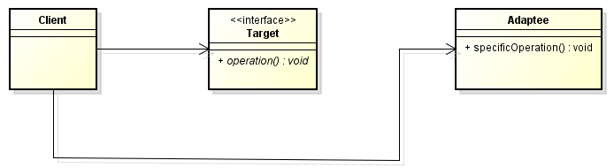
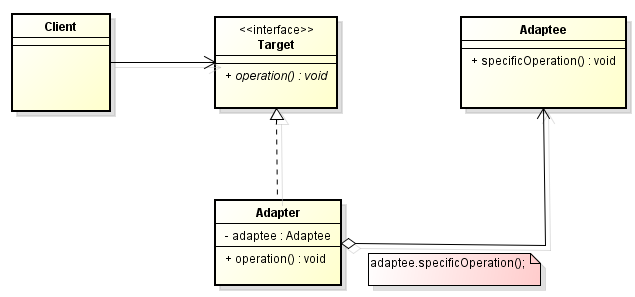

In this article, we will learn how to use adapter pattern. Let's get started.

<br>

## Table of contents
- [Given Problem](#given-problem)
- [Solution of Adapter Pattern](#solution-of-adapter-pattern)
- [When to use](#when-to-use)
- [Benefits & Drawbacks](#benefits-&-drawbacks)
- [Code C++ /Java / Javascript](#code-c++-/java-/-javascript)
- [Wrapping up](#wrapping-up)


<br>

## Given Problem 



Assuming that we have two components such as ```Component1```, ```Component2```. In ```Component1```, we have interface ```Target```. In ```Component2```, we have class ```Adaptee``` that has some behaviors that we need to use in ```Component1```. But ```Adaptee``` class has an interface that does not conform to the Component1's interface ```Target``` that a client requires.

An inflexible way to solve this problem is to change the class so that its interface conforms to the required interface. But it's impossible to change a class each time another interface is needed.

So, we have some questions for this problem:
- How can a class be reused that has not the interface clients require?
- How can classes work together that have incompatible interfaces?

<br>

## Solution of Adapter Pattern

In order to answer the question **How can classes work together that have incompatible interfaces?**, because our ```Component1``` that has different interface when compared with ```Adaptee``` of the ```Component2```. So, we will to use only one interface ```Target``` to unify interaction between ```Component1``` and ```Component2```. Then, we create another class ```Adapter``` that implements Target interface, and contains instance ```Adaptee``` in it. In ```operation()``` method of ```Adapter```, we will call ```adaptee.specificOperation()``` method.

When ```Adapter``` class contains instance of Adaptee class, we will reuse Adaptee class that do not worry about the incompatible between two components.

So, we will have Adapter pattern, and below is UML class diagram of it.



- Some types of Adapter pattern

    - Class Adapter

        With class adapter, Adapter class will extends from Adaptee, and implements from Target interface. In this way, if we have many Adaptee class, we will have multiple inheritance relationship between Adapter class and Adaptee classes.

        In Java, we do not have multiple inheritance. C++ do offer this feature.

    - Object Adapter

        With object adapter, we will use composition to contains all instances of Adaptee classes. This way is more flexible than class adapter because we delegate an Adaptee object at runtime, and a class adapter binds an Adaptee object at compile time.

- Pros and Cons of Object Adapter and Class Adapter

    - Object Adapter
        
        - Composition over Inheritance

            So, it can be more flexible and leads to a flatter class hierarchy.

        - Delegate to the Adaptee

            It gives great flexibility.

        - Works with all Adaptee subclasses

            It satisfies the L in the SOLID principles. However, if some subclasses add a new behavior, the Adapter would also need to change to support it, breaking the Opened-Closed principle.

    - Class Adapter

        - Using subclassing

            This thing allows it to adapt to a specific class or subclass.

        - Overrides adaptee methods which keeps it simple

        - Committed to one Adaptee subclass

            If a new behavior is added to the subclass, the Adapter needs no work to support it, thereby obeying the Opened-Closed Principle 

- Which one does we use?

    It depends upon our application, existing and new libraries, and business requirements. However, all things being equal, consider using the object adapter as it can be the more flexible approach.

<br>

## When to use
- When we need to use some classes but the interface does not match what we need.

    We can use it to create reusable code that works with new unrelated or unforeseen interfaces.

    The object adapter works with several subclasses, and is useful when it is impractical to subclass each one.

    The class adapter works with a specific subclass and can be simpler to implement.

- When we need subsystems/componenets/classes are incompatible together that can communicate.

    For example, we have a subsystem that is written in C++, other system is written in C#. We need to embbed C++ subsytem into C# subsystem. So, we will create a thin layer between them. This thin layer uses C++/CLR that play a role as Object Adapter class. Target interface will be define in C# subsystem. C++ subsystem will play as Adaptee class.


<br>

## Benefits & Drawbacks
1. Benefits

    - When we are working with legacy project, we want to enhance this project to use new technologies, but we still use the old buniness logic. We use adapter pattern to reduce time to develop, instead of creating a new project.

    - We do not need to change the existing core components or subsystems.

    - Increases reusability and flexibility.

2. Drawbacks

    - All requests are forwarded, so there is a slight increase in the overhead.
    
    - Sometimes many adaptations are required along an adapter chain to reach the type which is required.

<br>

## Code C++ /Java / Javascript

To refer this pattern's code, we can read the [source code of Adapter pattern on Github](https://github.com/DucManhPhan/Design-Pattern/tree/master/Structural-Pattern/Adapter-pattern/src/Java).

<br>

## Wrapping up
- The key idea in this pattern (object version) is to work through a separate ```Adapter``` object that adapts the interface of an (already existing) object.
    
    Clients do not know whether they are working with a ```Target``` object or an ```Adapter```.


<br>

Thanks for your reading.

<br>

Refer: 

[https://w3sdesign.com/index0100.php#gf](https://w3sdesign.com/index0100.php#gf)

[https://stackoverflow.com/questions/11079605/adapter-any-real-example-of-adapter-pattern](https://stackoverflow.com/questions/11079605/adapter-any-real-example-of-adapter-pattern)