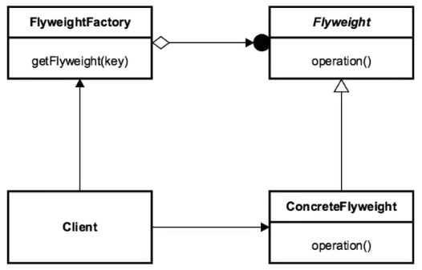

In this article, we will learn how to use Flyweight patter, and how to apply it in our project.

Let's get started.


<br>

## Table of contents
- [Given Problem](#given-problem)
- [Solution of Flyweight Pattern](#solution-of-flyweight-pattern)
- [When to use](#when-to-use)
- [Benefits & Drawback](#benefits-&-drawback)
- [Code C++ /Java / Javascript](#code-c++-java-javascript)
- [Application & Examples](#application-&-examples)
- [Contrast to other patterns](#contrast-of-other-patterns)
- [Wrapping up](#wrapping-up)


<br>

## Given Problem 

Assuming that we will create an application like editor such as visual code, notepad, ... In our editor, we have multiple characters that will be duplicated, ... So how do we manage all characters?

Our simple solution to support large number of objects in our application is to create an object each time it is needed.

With this solution, it is so bad because our application will take so much memory in RAM. If we open multiple editor at the same time, our computer can be crashed.

So, how do we deal with it, when each object do not change its state?

<br>

## Solution of Flyweight Pattern

Flyweight pattern is a pattern used to minimize memory used by sharing data with similarly type objects.

The concepts surrounding why we would choose the Flyweight pattern are when we need:
- To make a more efficient use of memory.
- A Flyweight is definitely an optimization pattern. This is typically an issue when we have a large number of similar objects.
- This is especially the case for objects that are stateless or immutable in nature. Immutable objects are objects that their state can't be changed after creation.
- Most of the object state can be extrinsic. Extrinsic properties are ones that are not essential or inherent.

    For example:
    - **java.lang.String**, **String**s are immutable objects and are loaded from a string literal pool that is basically the Flyweight factory. Caching is generally a hint also that we could be using a Flyweight as well.

    - **java.lang.Integer**, and **valueOf()** method is another greate example of a Flyweight pattern.
        
        In fact, all of the primitive objects with wrappers such as **Boolean**, **Byte**, **Character**, **Short**, **Long** have a **valueOf()** method that is similar to the Integer, that is a Flyweight in action.

It's a pattern of patterns, it utilizes other patterns inside of it. It uses a Factory pattern to retrieve Flyweight objects after they've been created. The Flyweight pattern also often encompasses both the creation and structure of the object as far as the pattern is concerned. So it has creational pattern inside of this structural pattern. It can and often does manage the entire lifecycle of the object.

Below is a UML diagram of the Flyweight pattern.



The UML of the Flyweight pattern starts with a Client class. The Client is what is requesting the Flyweight object, although oftentimes it doesn't even know that it's a Flyweight. It requests it from a FlyweightFactory. The factory returns the cached object or it creates a new instance of the Flyweight, eventually at the end of the process if one doesn't already exist in our factory. The ConcreteFlyweight is what gets returned to the client, although it thinks it's just getting that object back. Oftentimes a client doesn't know the underlying structure and just has a simple interface but regardless, this is what happens underneath it all.

<br>

## When to use

- When our application use a large number of objects.

- The storage costs are high because the quantity of objects.

- Most object state can be made extrinsic.

- Many groups of objects may be replaced by relatively few shared objects once extrinsic state is removed.

- Our application doesn't depend on object identity. Since flyweight objects may be shared, identity tests will return true for conceptually distinct objects.


<br>

## Benefits & Drawback
1. Benefits

    - It reduces the number of objects.

    - It reduces the amount of memory and storage devices required if the objects are persisted.

2. Drawbacks

    - It's a bit of a complex pattern.
    - Premature optimization.
    - Must understand the Factory pattern. Now, that's not a bad thing, but if we have a pattern inside a pattern, sometimes it can be a little bit confusing about which is the factory and which is the flyweight, and that the flyweight is part of the factory, ...
    - Not a graphical pattern.

<br>

## Code C++ /Java / Javascript

To refer this pattern's code, we can read the [source code of Flyweight pattern on Github](https://github.com/gamethapcam/Design-Pattern/tree/master/Structural-Pattern/Flyweight-pattern).

<br>

## Application & Examples

- java.lang.Integer.

    If we've been developing with Java, we probably know that Strings are immutable and come out of the string literal pool. The literal pool is a sort of cache that all strings in the JVM are stored and retrieved from. This is a greate example of the Flyweight pattern, but most people don't realize other wrapper object for primitives such as Integer also make a great use of the Flyweight pattern as well.

    ```java
    Integer firstInt = Integer.valueOf(5);
    Integer secondInt = Integer.valueOf(5);
    Integer thirdInt = Integer.valueOf(10);

    System.out.println(System.identityHashCode(firstInt));
    System.out.println(System.identityHashCode(secondInt));
    System.out.println(System.identityHashCode(thirdInt));
    ```

    When we call valueOf() method, it retrieves the object representing the number that we want the value of. If that object doesn't exist, it will create it, insert it, and then return that object. From there, other calls will get the same object.

<br>

## Contrast to other patterns

Below is the comparison between the Facade pattern and the Flyweight pattern.

    - With Flyweight pattern

        - It focuses on memory optimization.
        - It is by nature an optimization pattern.
        - It deals with immutable objects.

    - With Facade pattern

        - It is a reactoring pattern.
        - The Facade pattern is also centered around making a simplified client, or making it easier for the client once we realize that the API we're dealing with is very complex in nature.
        - It also provides a different interface. Its entire goal is a different interface for the client where the Flyweight was designed up front for the client to not know that pattern was being utilized under the hood.

    So we would use the Facade pattern to provide a more simplified interface, whereas the Flyweight pattern was designed up front to already deliver a simple interface to the client.

<br>

## Wrapping up
- It's a great way for memory management.
- It's a pattern that we want to utilize if we know we're going to have a lot of objects that we're goint to pass around in our system, and don't want to create those for every client or end-user that's going to be accessing them from our system.

- It can be a little bit of a complex pattern to deal with, not necessarily bad once we know the details of it, but we have a factory pattern in there at a minimum, we have to make our objects immutable, and we're dealing with all these small little objects and how we pass them around, where a lot of times people haven't thought of it in terms of composition. We're going to pass an object into an object and that's going to be an instance of of our flyweight.

- It's used a lot by the core API.

<br>

Thanks for your reading.

<br>

Refer: 

[Design Patterns in Java: Structural by Bryan Hansen](https://app.pluralsight.com/library/courses/design-patterns-java-structural/table-of-contents)

[https://w3sdesign.com/index0100.php](https://w3sdesign.com/index0100.php)