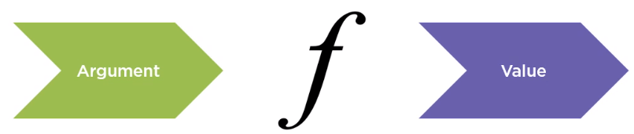
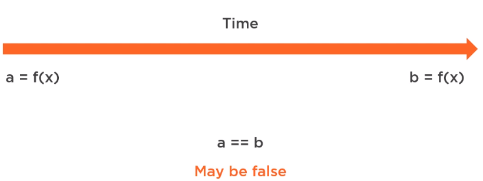

In this article, we will learn about functional programming. Let's get started.

<br>

## Table of contents
- [Introduction to Functional programming](#introduction-to-functional-programming)
- [No side effect](#no-side-effect)
- [Referential Transparency](#referential-transparency)
- [Pushing abstraction](#pushing-abstraction)
- [Wrapping up](#wrapping-up)

<br>

## Introduction to Functional programming

Functional programming is about programming with functions, but not just any function. Functional programming is about programming with pure functions, representations of mathematical functions.

This means that functions:
- just do one thing.
- do not depend on anything else but their arguments.
- and always give us the same result.

In many ways, functional programming is the opposite of the imperative programming paradigm. In an imperative style, we describe the way to do something, which many times implies a series of changes to the state of a program.

Let's take a look at some piece of code.

```java
class Order {
    private Customer customer;
    private OrderStatus orderStatus;

    public void issueRewards() {
        this.orderStatus = OrderStatus.REWARDS_ISSUED;
        if (this.getOrderRewards() != null) {
            this.customer.addToRewardBalance(this.getOrderRewards());
        }
    }
}
```

We can find some problems of **issueRewards()** method:
- It's hard to understand what this method does at a glance.
- This method does two things

    - sets the value of the order status
    - reward balance of the customer

    If a method has multiple responsibilities, then each responsibility has the potential for changing the entire method.

    About the method's name, probably issuing a reward, means that these two things have to be done, but we'll have to keep a mental list of all the things the method does. Add some methods like this, and we'll see that it will be very hard to keep track of everything. Most of the time, we cannot rely on naming, so to stop this, we can split the method into two, one for each responsibility.

    ```java
    public void issueRewards() {
        this.orderStatus = OrderStatus.REWARDS_ISSUED;
    }

    public void updateBalanceReward() {
        if (this.getOrderRewards() != null) {
            this.customer.addToRewardBalance(this.getOrderRewards());
        }
    }
    ```

    Then, the caller must ensure that these methods are called in the correct sequences. However, most of the time, this will not be a problem because the caller always has the context for the usage.

    We can find that the customer object is only used in **this.customer.addToRewardBalance(this.getOrderRewards()**. If this is the case, we can remove the reference to the customer in the order object.

    ```java
    public void updateBalanceReward(Customer customer) {
        if (this.getOrderRewards() != null) {
            customer.addToRewardBalance(this.getOrderRewards());
        }
    }
    ```

    Now, the caller is the one who has to keep a reference to the customer. In funtional programming, the state of the object tends to decrease because it removes to the caller.
    
    Also, functional programming does not like void functions. In mathematics, a function always has an output. If a method has void in its signature, then it does nothing, does many things, or does something invisible to us. That's why we need to have functions with one responsibility. When moving from object-oriented programming to functional programming, honoring the single responsibility principle is one of the first thing we need to do. We might recognize this principle as one of the SOLID principles. Some desing principles are shared by imperative and functional programming.

    We trust mathmetics because a mathemtical function does one thing. If we want to trust our code, we have to start with that.

    Back to our code, we still have void methods to remove, so let's keep applying functional principals to remove them completely.

<br>

## No side effect

A mathematical function that calculates, for example, a 10% discount of the total of an order, has no dependencies other than the total.

```java
f(total) = total * 0.1
```

So, if a function receives everything that it needs to fulfill its responsibility, it will have no reason to use or change anything outside its scope. In mathematics, a function cannot depend on anything but its input. On the other hand, in OOP programming, a method can reference and modify things outside its scope. Take, for example, the code we had in the previous section.

```java
public void issueRewards() {
    this.orderStatus = OrderStatus.REWARDS_ISSUED;
    if (this.getOrderRewards() != null) {
        this.customer.addToRewardBalance(this.getOrderRewards());
    }
}
```

The method **issueRewards()** is modifying the customer object, an object that did not receive as input. When we call this method, just by looking at its definition, we cannot know that the customer is being updated.

For example,

```java
customer.getOrderRewards();     // 10
order.issueRewards();

customer.getOrderRewards();     // 15
```

If we get the reward balance of the customer and it turns out to be 10, probably calling the **issueRewards()** method and finding out the reward balance has changed will be unexpected.

When a method changes something outside its scope, we call that a side effect. In functional programming, there are no side effect. Among other things, side effects include:
- Mutation of variables
- Printing to the console
- Writing to the files, databases, or anything in the outside world
- Throwing an exception.

In practice, it's impossible to have no side effects at all. However, the goal is not to eliminate side effects. When we say that in functional programming, there can be no side effects, we mean no observable side effects, side effects that are not part of the outcome of the program.

Functional programming are built by composing functions that take an argument and return a value. So functions are black boxes that take an argument, do something inside with no effect observable from outside, and return a value.



To avoid unexpected side effects, we need to redesign our Order class.

```java
// In Java, most methods that represent pure functions are static.
public class ProcessReward {
    public static void issueRewards(Order order) {
        order.setOrderStatus(OrderStatus.REWARDS_ISSUED);
    }
}

@Data
public class Order {
    private OrderStatus orderStatus;
    private Integer orderRewards;
}

@Data
public class Customer {
    private Integer rewardBalance;

    public void updateBalanceReward(Order order) {
        if (order.getOrderRewards() != null) {
            this.addToRewardBalance(order.getOrderRewards());
        }
    }

    public void addToRewardBalance(Integer rewardBalance) {
        this.rewardBalance += rewardBalance;
    }
}
```

Functional programming tends to prefer objects that just hold data, but we still have side effects and void methods. To be pure, we need to apply another principle.

<br>

## Referential Transparency

Given a same argument, a mathematical function always outputs the same result regardless of when we called it. It's like asking a fact question. Asking it twice should not change the answer. We have learned that the output of a function must depend only on its argument. As a consequence, it's always possible to replace a function call with its value. This is called referential transparency.

In object-oriented programming, it is common to use public methods to update the state of an object. Take the **updateBalanceReward()** method as an example.

```java
public void updateBalanceReward(Order order) {
    if (order.getOrderRewards() != null) {
        this.addToRewardBalance(order.getOrderRewards());
    }
}

public void addToRewardBalance(Integer rewardBalance) {
    this.rewardBalance += rewardBalance;
}
```

If we call it twice with the same order instance, the reward balance increases after each call. Calling the same method at different times with the same input yields different results, which is the opposite of referential transparency. This is common in object-oriented programming because object-oriented programming values encapsulation. But functional programming values referential transparency.

So the first thing we need to do is move **updateBalanceReward()** method to the class **ProcessReward**, passing the order and customer objects as parameters.

Now, to avoid modifying the customer, **updateBalanceReward()** method must return a new customer object, leaving the original unchanged.

```java
public class Customer {
    private Integer rewardBalance;
    public Customer(Integer rewardBalance) {
        this.rewardBalance = rewardBalance;
    }

    public void addToRewardBalance(Integer rewardBalance) {
        this.rewardBalance += rewardBalance;
    }
}
```

So let's add to the **Customer** class a constructor where we can pass a reward balance and change the **updateBalanceReward()** method, so it can create and return a new **Customer** object with the updated balance or return the original customer if there are no rewards to udpate. This is how the caller code looks now.

```java
customer.getRewardBalance();        // 10

Customer newCustomer = updateBalanceReward(order, customer);
newCustomer.getRewardBalance();     // 15
customer.getRewardBalance();        // 10
```

The caller now holds references to both customers, the the original customer is not modified. The **updateBalanceReward()** method always returns another customer with an updated balance. We can call **updateBalanceReward()** method with the same arguments any number of times, and the output will always be an object with the same balance. And that's because **updateBalanceReward()** method treats customers as immutable. That makes the difference. To achieve referential transparency, we need immutable data.

- The problem with Assignment Statements

    

    An assignment statement introduces the concept of time because the state of the system many change between the invocation of the same function in such a way that an expression like this may evaluate to false due to the side effect of an assignment.

    However, in functional programming, this expression evaluates to true no matter when it is evaluated.

    Back to the code, we can also return a new order in the **issueRewards()** method.

    ```java
    public class Customer {
        public final Integer rewardBalance;
        public Customer(Integer rewardBalance) {
            this.rewardBalance = rewardBalance;
        }
    }

    public class Order {
        public final OrderStatus orderStatus;
        public final Integer orderRewards;
        
        public Order(OrderStatus orderStatus, Integer orderRewards) {
            this.orderStatus = orderStatus;
            this.orderRewards = orderRewards;
        }
    }


    public class ProcessReward {
        public static Order issueRewards(Order order) {
            return new Order(OrderStatus.REWARDS_ISSUED, order.orderRewards);
        }

        public static Customer updateBalanceReward(Order order, Customer customer) {
            if (order.orderRewards != null) {
                Customer newCustomer = new Customer(customer.rewardBalance + order.orderRewards);
                return newCustomer;
            }
            return customer;
        }
    }
    ```

    In **Customer** and **Order** classes, we remove the **getter/setter** methods and expose the properties directly to make the data more transparent. The properties can be final. To guarantee once a value via the constructor is assigned, it cannot be reassigned. This may look strange at first because in object-oriented programming, we are used to hiding data, but in functional programming, we protect the data by making it immutable.

    The goal is the same in object-oriented and functional programming. What the different is the way it is achieved. However, in Java, the amount of effort needed to keep the data immutable is significant. Think of object with many nested properties or a list with thousands of elements. This raises many concerns, like that performance will be negatively affected or that the memory usage will have a huge increase. These are valid concerns.

    Functional programming was invented in the late 1950s, but it didn't become popular because memory was too expensive to make it practical. This is not a problem any more. And now functional programming languages encourage and ensure immutability by providing immutable data as a language feature with optimized data structures, so we do not have to worry about it. Also, the compiler can mark attempts to modify data as errors, but in Java, objects are passed by reference, so any piece of code with a reference to the object can modify it. This is one of the biggest limitations of Java regarding functional programming. But remember, immutability is not the goal, it's just a medium to achieve referential transparency.

<br>

## Pushing abstraction

Pure functions has some benefits.
- They don't create unexpected results. Pure functions are deterministic, which means they always return the same value for the same argument.

- Since there are no side effects and we can pass everything the function needs, they are easier to test. Usually we don't need mocks or a specific context to test them.

- They are thread safe because they avoid mutation, by the way, it does not mean that all data has to be immutable. Only shared data must be.

    For example, in languages that do not enforce immutability like Java, it's valid to modify a variable inside a function as long as this mutation is not visible externally. However, working with immutable data is a good practice and always safer.

- And working with functions also makes our program more modular. Writing a functional program means combining or composing functions.

    For example, we can start with many base functions and then combine them into higher-level ones and even reuse functions from other programs, as they are referentially transparent.

Inside pure functions, we can use imperative code like **if** statement or **for** loops, if side effects are not observable from outside. But it's not common to find such a style of coding in functional programming. When programming in an imperative style, we have to express step by step how we are going to achieve what we want.

```java
// imperative programming
List<Order> shipped = new ArrayList<>();
for (Order order : orders) {
    if (order.isShipped()) {
        shipped.add(order);
    }
}

// functional programming
List<Order> shipped = orders.stream()
                            .filter(Order::isShipped)
                            .collect(Collectors.toList());
```

In functional programming, we tend to express what we want and not how to achieve it. This style of declaring just our intentions instead of telling how to achieve them is called declarative programming, and even if we do not use a super functional friendly language, probably we an still use declarative programming to push abstraction to the limit.

But remember, it's not the language, it's the way we write code.

<br>

## Wrapping up
- From imperative to functional

    - Move methods to a new class, honoring the single responsibility principle.

    - Pass the original classes as inputs of a new methods.

    - Modify these methods to honor immutability, and return new copies of the objects.

- Functional programming techniques

    - Immutability

    - High-order functions

    - Currying

    - Recursion

    - Lazy evaluation

- The atomic thing in OOP is class, but in functional programming, it is the pure function.

    It has some properties that we need to remember;
    - input-output only
    - the same input always generates the same output
    - no side-effects
    - no explicit changing of state


<br>

Refer:

[Applying Functional Programming Techniques in Java](https://app.pluralsight.com/library/courses/applying-functional-programming-techniques-java/table-of-contents)