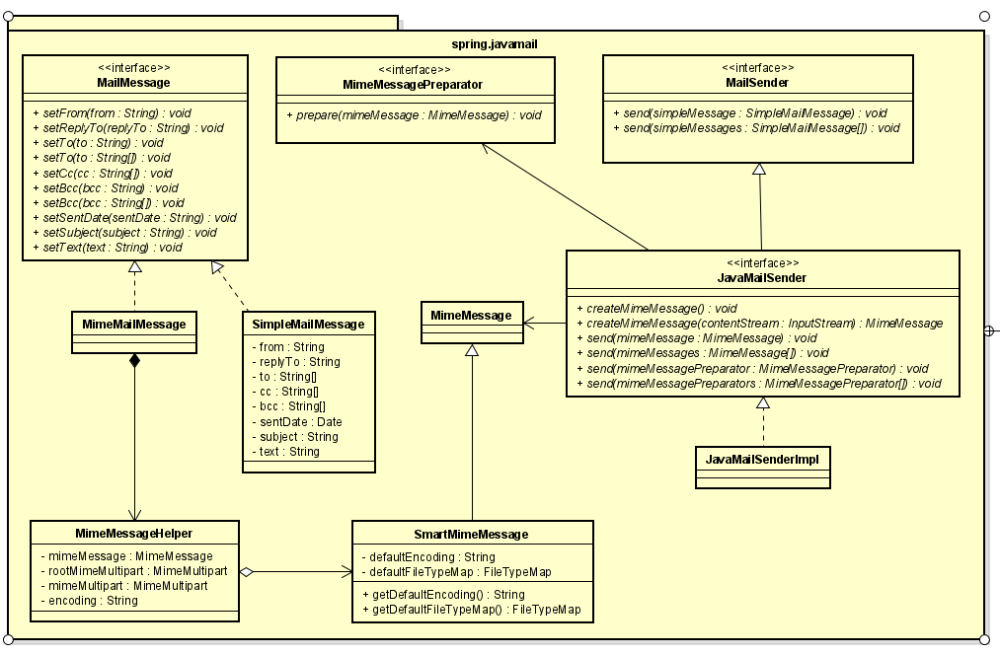

<br>

## Table of contents
- [How Spring Mail works](#how-spring-mail-works)
- [Some steps in using Spring Mail](#some-steps-in-using-spring-mail)
- [Wrapping up](#wrapping-up)


<br>

## How Spring Mail works

1. Some classes that Spring Mail uses

    

    Belows are packages that Spring Mail classes belong to:
    - org.springframework.mail
    - org.springframework.mail.javamail

2. Class diagram of Spring Mail

    

    The meaning of each class of Spring Mail:
    - **MailMessage** interface - defines actions that will interact with some parts in a mail such as cc, bcc, the receiver, the content of a mail.
    - **SimpleMailMessage** class and **MimeMailMessage** class - the derived classes from **MailMessage** interface.

    - **MailSender** interface - defines the basic actions for sending mail with the input is **SimpleMailMessage**.

    - **JavaMailSender** interface - that supports **MimeMessage**.

    - **JavaMailSenderImpl** class - the implementation of **JavaMailSender** interface that supports both **MimeMessage** and **SimpleMailMessage**.

    - **MimeMessagePreparator** interface - the callback interface for the preparation of JavaMail MIME message.

    - **MimeMessageHelper** class - the helper class for creating a **MimeMessage** instance. It supports the attachment file and tet content in an HTML layout.

3. Class diagram of Exception in Spring Mail

    

    So, from an above image, we can easily find that **MailException** is the parent exception class for other exceptions such as **MailSendException**, **MailParseException**, **MailPreparationException**, **MailAuthenticationException**.

<br>

## Some steps in using Spring Mail

Belows are some basic steps that we need to configure to run Spring Mail:

0. Fill in some suitable dependencies

    ```xml
    <dependency>
        <groupId>org.springframework.boot</groupId>
        <artifactId>spring-boot-starter-web</artifactId>
    </dependency>
    <dependency>
        <groupId>org.springframework.boot</groupId>
        <artifactId>spring-boot-starter</artifactId>
    </dependency>
    <dependency>
        <groupId>org.springframework.boot</groupId>
        <artifactId>spring-boot-starter-mail</artifactId>
    </dependency>
    <dependency>
        <groupId>org.thymeleaf</groupId>
        <artifactId>thymeleaf-spring5</artifactId>
    </dependency>
    <dependency>
        <groupId>nz.net.ultraq.thymeleaf</groupId>
        <artifactId>thymeleaf-layout-dialect</artifactId>
    </dependency>
    ```

1. Create an implementation of **MailSender** interface

    In order to send email successfully, we will take a role as sender. So, we need to configure all information of a sender such as email address, username, password, host that can be gmail, yahoo, ..., port, protocol, and something else.

    - First way, take advantage of Spring, we will only configure above information into **application.properties** file.

        Belows are some files that Spring accepts:

        |              Key               |                  Description                |
        | ------------------------------ | ------------------------------------------- |
        | spring.mail.host               | SMTP server host. For example: smtp.gmail.com |
        | spring.mail.port               | SMTP server port                            |
        | spring.mail.username           | Login user of the SMTP server               |
        | spring.mail.password           | Login password of the SMTP server           |
        | spring.mail.protocol           | Protocol used by the SMTP server. By default, it is smtp |
        | spring.mail.properties.*       | Additional JavaMail Session properties      |
        | spring.mail.test-connection    | Whether to test that the mail server is available on startup |

        To configure more information for JavaMail Session properties, we will know about its properties:

        |              Key               |                  Description                |
        | ------------------------------ | ------------------------------------------- |
        | mail.smtp.connectiontimeout    | Socket connection timeout value in milliseconds. This timeout is implemented by java.net.Socket. Default is infinite timeout. |
        | mail.smtp.timeout              | Socket read timeout value in milliseconds. This timeout is implemented by java.net.Socket. Default is infinite timeout. |
        | mail.smtp.writetimeout         | Socket write timeout value in milliseconds. This timeout is implemented by using a java.util.concurrent.ScheduledExecutorService per connection that schedules a thread to close the socket if the timeout expires. Thus, the overhead of using this timeout is one thread per connection. Default is infinite timeout. |

        For example:

        ```yml
        spring.mail.default-encoding=UTF-8
        spring.mail.host=smtp.gmail.com
        spring.mail.username=username@gmail.com
        spring.mail.password=password
        spring.mail.port=587
        spring.mail.protocol=smtp
        spring.mail.test-connection=false
        spring.mail.properties.mail.smtp.auth=true

        spring.mail.properties.mail.smtp.connectiontimeout=5000
        spring.mail.properties.mail.smtp.timeout=3000
        spring.mail.properties.mail.smtp.writetimeout=5000

        # TLS, port 587 - current setting
        spring.mail.properties.mail.smtp.starttls.enable=true

        # SSL, port 465
        spring.mail.properties.maili.smtp.socketFactory.port=465
        spring.mail.properties.mail.smtp.socketFactory.class=java.net.ssl.SSLSocketFactory
        ```

        After configuring all information of sender, at startup time, Spring will read about **spring.mail.*** properties, and automatically creating **JavaMailSender** for us. Our work is that using **@Autowired** annotation to get the **JavaMailSender** bean in our service class.

    - Second way, based on [the properties of java mail](https://javaee.github.io/javamail/docs/api/com/sun/mail/smtp/package-summary.html), we will use them to configure programmatically.

        ```java
        @Configuration
        public class EmailConfig {

            @Bean
            public JavaMailSender javaMailSender() {
                JavaMailSenderImpl mailSender = new JavaMailSenderImpl();
                mailSender.setHost("smtp.gmail.com");
                mailSender.setPort(587);

                mailSender.setUsername("username.gmail.com");
                mailSender.setPassword("password");

                Properties props = mailSender.getJavaMailProperties();
                props.put("mail.transport.protocol", "smtp");
                props.put("mail.smtp.auth", "true");
                props.put("mail.smtp.starttls.enable", "true");
                props.put("mail.debug", "true");

                return mailSender;
            }
        }
        ```

2. Configuration about template engine for sending email

    In this case, we use thymeleaf to decorator our email form.

    ```java
    @Configuration
    public class ThymleafConfig {
        @Bean
        public SpringTemplateEngine springTemplateEngine() {
            SpringTemplateEngine templateEngine = new SpringTemplateEngine();
            templateEngine.addTemplateResolver(htmlTemplateResolver());
            templateEngine.setTemplateEngineMessageSource(emailMessageSource());

            return templateEngine;
        }

        @Bean
        public ResourceBundleMessageSource emailMessageSource() {
            ResourceBundleMessageSource messageSource = new ResourceBundleMessageSource();
            messageSource.setBasename("mail/MailMessages");

            return messageSource;
        }

        @Bean
        public SpringResourceTemplateResolver htmlTemplateResolver(){
            SpringResourceTemplateResolver emailTemplateResolver = new SpringResourceTemplateResolver();
            emailTemplateResolver.setPrefix("classpath:/templates/");
            emailTemplateResolver.setSuffix(".html");
            emailTemplateResolver.setTemplateMode(TemplateMode.HTML);
            emailTemplateResolver.setCharacterEncoding(StandardCharsets.UTF_8.name());
            emailTemplateResolver.setCacheable(false);

            return emailTemplateResolver;
        }
    }
    ```

    In this step, we also need to define the content of mail in html layout. It need to be defined in **java/main/resource** folder.

3. Building MimeMessage and sending it

    We utilize **MimeMessageHelper** class to apply some advanced functionalities such as attaching files, use HTML layout in text content.

    ```java
    @Data
    @AllArgsConstructor
    @NoArgsConstructor
    public class Mail {
        private String from;
        private String to;
        private String subject;
        private String content;
        private Map<String, Object> model;
    }

    @Service
    public class EmailService {

        private static final String EMAIL_TEMPLATE = "email-template";

        @Autowired
        private JavaMailSender mailSender;

        @Autowired
        private SpringTemplateEngine templateEngine; 

        public void sendMessage(Mail mail) throws MessagingException {
            this.emailSender.send(this.buildMimeMessage(mail));
        }

        private MimeMessage buildMimeMessage(Mail mail) throws MessagingException {
            MimeMessage message = this.emailSender.createMimeMessage();
            MimeMessageHelper helper = new MimeMessageHelper(message,
                    MimeMessageHelper.MULTIPART_MODE_MIXED_RELATED,
                    StandardCharsets.UTF_8.name());

            helper.setTo(mail.getTo());
            helper.setText(this.getHtmlContent(mail), true);
            helper.setSubject(mail.getSubject());
            helper.setFrom(mail.getFrom());

            return message;
        }

        private String getHtmlContent(Mail mail) {
            Context context = new Context();
            context.setVariables(mail.getModel());
            String html = this.templateEngine.process(EMAIL_TEMPLATE, context);

            return html;
        }
    }
    ```

    Currently, we are using the **email-template.html** file that is laid in **java/main/resource** folder.


<br>

## Some problems when running Spring Mail

1. Username and password are not accepted

    When we are encountering with this error message, we need to access to our account's [Less secure app access](https://myaccount.google.com/lesssecureapps).

    In local environment, we want to test, so turn on this feature.

2. Do not display value of each variable in thymeleaf page

    Supposed that we are define an element with:

    ```html
    <h1>Hello, ${name}</h1>
    ```

    It cann't display the name variable. So, we can use **th:text** element that is supported by Thymeleaf.

    ```html
    <h1 th:text="'Hello, ' + ${name}"></h1>
    ```

<br>

## Wrapping up

- Understanding some command steps to send email

    - Create a **JavaMailSender** instance that have a responsibility to send email.

    - Create a **MimeMessage** instance that contain all information about a real email.

    - Create a content layout with HTML.

- Understanding about classes that use in Spring Mail.

<br>

Refer:

[https://docs.spring.io/spring-framework/docs/4.0.x/spring-framework-reference/html/mail.html](https://docs.spring.io/spring-framework/docs/4.0.x/spring-framework-reference/html/mail.html)

[https://www.baeldung.com/spring-email](https://www.baeldung.com/spring-email)

[https://memorynotfound.com/spring-security-forgot-password-send-email-reset-password/](https://memorynotfound.com/spring-security-forgot-password-send-email-reset-password/)

[https://memorynotfound.com/spring-mail-sending-email-thymeleaf-html-template-example/](https://memorynotfound.com/spring-mail-sending-email-thymeleaf-html-template-example/)

[https://memorynotfound.com/spring-mail-sending-email-freemarker-html-template-example/](https://memorynotfound.com/spring-mail-sending-email-freemarker-html-template-example/)

[https://memorynotfound.com/spring-mail-sending-email-inline-attachment-example/](https://memorynotfound.com/spring-mail-sending-email-inline-attachment-example/)

[https://memorynotfound.com/spring-mail-sending-email-attachment-configuration-example/](https://memorynotfound.com/spring-mail-sending-email-attachment-configuration-example/)

[https://memorynotfound.com/spring-mail-sending-simplemailmessage-javamailsender-example/](https://memorynotfound.com/spring-mail-sending-simplemailmessage-javamailsender-example/)

[http://blog.michalszalkowski.com/java/spring-boot-send-html-email/](http://blog.michalszalkowski.com/java/spring-boot-send-html-email/)

[https://memorynotfound.com/adding-static-resources-css-javascript-images-thymeleaf/](https://memorynotfound.com/adding-static-resources-css-javascript-images-thymeleaf/)

[https://www.developer.com/java/other/working-with-javamail-and-the-spring-mail-apis.html](https://www.developer.com/java/other/working-with-javamail-and-the-spring-mail-apis.html)

<br>

**Configuration for proxy**

[https://javaee.github.io/javamail/docs/api/com/sun/mail/smtp/package-summary.html#mail.smtp.proxy.host](https://javaee.github.io/javamail/docs/api/com/sun/mail/smtp/package-summary.html#mail.smtp.proxy.host)