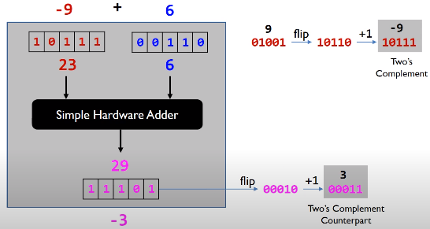

In this article, we will learn how to use Bitwise operators and some tricks to deal with our common problems. Let's get started.

<br>

## Table of Contents
- [Introduction to Bitwise operators](#introduction-to-bitwise-operators)
- [When to use](#when-to-use)
- [Benefits and Drawbacks](#benefits-and-drawbacks)
- [Some tricks in Bit Manipulation](#some-tricks-in-bit-manipulation)
- [Wrapping up](#wrapping-up)

<br>

## Introduction to Bitwise operators

Bitwise operators are operators that perform with each bit of a number. But we can use them with some integral types such as char, short, int, ...

There are some operators:
- Bitwise AND ```&```
- Bitwise OR ```|```
- Bitwise XOR ```^```
- Bitwise Complement ```~```
- Shift operator ```>>``` or ```<<```

1. Bitwise AND ```&```

    ```java
    1 & 1 = 1
    1 & 0 = 0
    0 & 0 = 0
    0 & 1 = 0
    ```

    So if both bits are 1, then AND operator gives 1, otherwise 0.

2. Bitwise OR ```|```

    ```java
    1 | 1 = 1
    1 | 0 = 1
    0 | 1 = 1
    0 | 0 = 0
    ```

    If either of bits are 1, then OR operator gives 1, otherwise 0.

3. Bitwise XOR ```^```

    ```java
    1 ^ 1 = 0
    1 ^ 0 = 1
    0 ^ 1 = 1
    0 ^ 0 = 0
    ```

    When performing XOR on two integers, the XOR operation is calculated on each pair of bits (the two bits at the same index in each number).

    ```java
    5 ^ 6  // gives 3

    // At the bit level:
    //     0101  (5)
    //   ^ 0110  (6)
    //   = 0011  (3)
    ```

4. Bitwise Complement ```~```

    ```java
    ~5 = ~0101 = 1010
    ```

    This operator will return the one's complement representation of the input value by inversing all bits in a variable, 1 to 0, or 0 to 1.

    Then the highest bit is 1, the complier or OS will give the two's complement for this number. It looks like that the below image.

    ```java
    ~5 = 1010 (binary) = 10 (decimal)  // (the one's complement)
    -6 = ~0110 = 1001 --> (+1) --> 1010
    ```

    The two's complement simplifies the hardware implementation of arithmetic functions.
    - For addition or substraction in two's complement, the hardware can ignore the sign of operands if signed integers are represented.
    - For multiplication, the multiplication hardware can also ignore the sign of operands if the product is required to keep the same number of bits as operands.

    --> This property simplifies the hardware design for addition, substraction, and multiplication. This property does not hold true for division.

    


5. Shift operator

    A bit shift moves each digit in a number's binary representation left or right. There are three main types of shifts:
    - Left shifts

        When shifting left, the most-significant bit is lost, and a 0 bit is inserted on the other end.

        The left shift operator is usually written as "<<".

        ```java
        0010 << 1  →  0100
        0010 << 2  →  1000
        ```

        A single left shift multiplies a binary number by 2:

        ```java
        0010 << 1  →  0100

        0010 is 2
        0100 is 4
        ```

    - Logical Right shifts

        When shifting right with a logical right shift, the least-significant bit is lost and a 0 is inserted on the other end.

        ```java
        1011 >>> 1  →  0101
        1011 >>> 3  →  0001
        ```

        For positive numbers, a single logical right shift divides a number by 2, throwing out any remainders.

        ```java
        0101 >>> 1  →  0010

        0101 is 5
        0010 is 2
        ```

    - Arithmetic Right shifts

        When shifting right with an arithmetic right shift, the least-significant bit is lost and the most-significant bit is copied.

        Languages handle arithmetic and logical right shifting in different ways. Java provides two right shift operators: >> does an arithmetic right shift and >>> does a logical right shift.

        ```java
        1011 >> 1  →  1101
        1011 >> 3  →  1111

        0011 >> 1  →  0001
        0011 >> 2  →  0000
        ```

        The first two numbers had a 11 as the most significant bit, so more 11's were inserted during the shift. The last two numbers had a 0 as the most significant bit, so the shift inserted more 0's.

        If a number is encoded using two's complement, then an arithmetic right shift preserves the number's sign, while a logical right shift makes the number positive.

        ```java
        // Arithmetic shift
        1011 >> 1  →  1101
            1011 is -5
            1101 is -3

        // Logical shift
        1111 >>> 1  →  0111
            1111 is -1
            0111 is  7
        ```

<br>

## When to use

- when performing update and query operations of Binary Indexed Tree.


<br>

## Benefits and Drawbacks

1. Benefits

    - fast.

2. Drawbacks

    - It's difficult to understand, read code, maintain code.

<br>

## Some tricks in Bit Manipulation
1. Clear all bits from LSB to ith bit

    ```java
    mask = ~((1 << (i + 1) - 1);
    x &= mask
    ```

2. Clear all bits from MSB to ith bit

    ```java
    mask = (1 << i) - 1;
    x &= mask;
    ```

3. Check whether a character is upper case

    ```java
    char ch = 'A';
    boolean isUpperCase = (ch & 32) == 0;
    ```

    In ASCII, the distance between upper cases and lower cases is 32. So, if a character is upper case, it does not contain 5th bit --> 0010 0000.

4. Convert upper case to lower case

    ```java
    char ch = 'A';
    char lowerCase = ch | 32;
    ```

5. Convert lower case to upper case

    ```java
    int distance = 32;
    char ch = 'a';
    char upperCase = ch & ~distance; // we get all characters that excepts 5th bit.
    ```

<br>

## Wrapping up

- Understanding the meaning of all basic bitwise operators.

<br>

Refer:

[https://www.geeksforgeeks.org/bits-manipulation-important-tactics/](https://www.geeksforgeeks.org/bits-manipulation-important-tactics/)

[https://www.vojtechruzicka.com/bit-manipulation-java-bitwise-bit-shift-operations/](https://www.vojtechruzicka.com/bit-manipulation-java-bitwise-bit-shift-operations/)

[https://www.log2base2.com/C/bitwise/bitwise-ones-complement-operator-in-c.html](https://www.log2base2.com/C/bitwise/bitwise-ones-complement-operator-in-c.html)

[https://www.interviewcake.com/concept/java/bit-shift](https://www.interviewcake.com/concept/java/bit-shift)