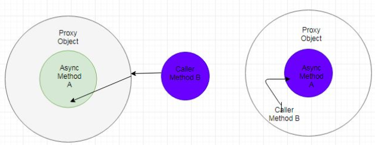

In this article, we will learn how to use @Async annotation in Spring. Let's get started.

<br>

## Table of contents
- [Introduction to @Async annotation](#introduction-to-@async-annotation)
- [How to use @Async annotation](#how-to-use-@async-annotation)
- [Source code](#source-code)
- [When to use](#when-to-use)
- [Benefits and Drawbacks](#benefits-and-drawbacks)
- [Wrapping up](#wrapping-up)


<br>

## Introduction to @Async annotation

@Async annotation is introduced to Spring framework with 3.0 version. When using @Async annotation with specific methods, our methods will be executed in a seperate thread. It means that **@Async** annotation is using the fire and forget pattern.

To delve deeper into the fire and forget pattern, we can go to the [Improving performance of application by running processes in the background](https://ducmanhphan.github.io/2020-02-24-Improving-performance-of-application-by-running-processes-in-the-background/#the-fire-and-forget-pattern).

<br>

## How @Async works

When you put an **@Async** annotation on a method underlying it, it creates a proxy of that object where Async is defined (JDK Proxy/CGlib) based on the **proxyTargetClass** property. Then, Spring tries to find a thread pool associated with the context to submit this method's logic as a separate path of execution. To be exact, it searches a unique **TaskExecutor** bean or a bean named as **taskExecutor**. If it is not found, then use the default **SimpleAsyncTaskExecutor**.

Now, as it creates a proxy and submits the job to the **TaskExecutor** thread pool, it has a few limitations that have to know.

<br>

## How to use @Async annotation
Belows are some steps to use **@Async** annotation in our project.

1. Configure package in **pom.xml** to use **@Async** annotation

    If we want to experience maven project with @Async annotation, not use Spring boot, we can use some the below packages.

    ```xml
    <properties>
        <spring.version>4.1.7.RELEASE</spring.version>
    </properties>

    <dependency>
      <groupId>org.springframework</groupId>
      <artifactId>spring-core</artifactId>
      <version>${spring.version}</version>
    </dependency>
    <dependency>
      <groupId>org.springframework</groupId>
      <artifactId>spring-context</artifactId>
      <version>${spring.version}</version>
    </dependency>
    ```

2. Use **@EnableAsync** annotation with our configuration class

    ```java
    @Configuration
    @EnableAsync
    public class AppConfig {
    }
    ```

    By default, **@EnableAsync** detects Spring's **@Async** annotation.

3. Use **@Async** annotation for our methods

    Our classes that contains **@Async** annotation with its methods, this classes have to picked up by Spring **@ComponentScan** annotation. It means that our instances of these classes need to be managed by Spring IoC container.

    According to [Async java docs](https://docs.spring.io/spring/docs/current/javadoc-api/org/springframework/scheduling/annotation/Async.html), we can find that **@Async** is not supported on methods declared within a **@Configuration** class.

    In order to use **@Async**, we need to know about some crucial things:
    - **@Async** must be applied to public method only.
    - self-invocation - calling the async method from within the same class. It won't work.

        Because in this case, although it creates a proxy, the call bypasses the proxy and directly call the method so that Thread will not be spawned.

        

        This problem is as same as calling **run()** method of Thread object directly, without calling **start()** method.

    The **@Async** used with public method that have **void** return type or return type **Future<T>**, **CompletableFuture<T>**.

    ```java
    @Component
    public class AsynchronousComponent {
        @Async
        public void displayNumbers() {
            // ...
        }

        @Async
        public Future<String> doSomething() {
            // ...
        }

        @Async
        public CompletableFuture<String> doSomething() {
            // ...
        }
    }

    @RestController
    public class AuthenticationController {
        @Autowired
        private AsynchronousComponent asyncComp;

        public void display() {
            this.asyncComp.displayNumbers();
        }
    }
    ```

    If the return type is void, exceptions will not be propagated to the calling thread. So, we need to create asynchronous exception handler that implement **AsyncUncaughtExceptionHandler** interface. When an exception is thrown in method with void return type, the **handleUncaughtException()** method will be called.

    ```java
    public class CustomAsyncExceptionHandler implements AsyncUncaughtExceptionHandler {
        @Override
        public void handleUncaughtException(Throwable throwable, Method method, Object... obj) {
            System.out.println("Exception message - " + throwable.getMessage());
            System.out.println("Method name - " + method.getName());
            for (Object param : obj) {
                System.out.println("Parameter value - " + param);
            }
        }
    }
    ```

4. Customize our Executor

    Because each method that is marked with **@Async** annotation, it will be run on one thread. So, to manage all of threads, we need to have a thread pool. By default, a **SimpleAsyncTaskExecutor** is used.

    So, to customize our default thread pool, we can override it at two levels that are application level, and the individual method level.

    - In the method level

        ```java
        @Configuration
        @EnableAsync
        public class AppConfig {
            @Bean("threadPoolTaskExecutor")
            public TaskExecutor getAsyncExecutor() {
                ThreadPoolTaskExecutor executor = new ThreadPoolTaskExecutor();
                executor.setCorePoolSize(20);
                executor.setMaxPoolSize(1000);
                executor.setWaitForTasksToCompleteOnShutdown(true);
                executor.setThreadNamePrefix("Async-");
                return executor;
            }
        }

        @Service
        public class EmailService {
            @Async("threadPoolTaskExecutor")
            public void displayThreadName() {
                System.out.println("Our thread's name - " + Thread.currentThread().getName());
            }
        }
        ```

    - In application level

        Our configuration class will implement the **AsyncConfigurer** interface.

        ```java
        @Configuration
        @EnableAsync
        public class AppConfig implements AsyncConfigurer {
            @Override
            public Executor getAsyncExecutor() {
                return new ThreadPoolTaskExecutor();
            }
        }
        ```

<br>

## Source code

In order to understand how to implement code of using @Async annotation, we can reference [this link](https://github.com/DucManhPhan/J2EE/tree/master/src/Java_Spring/Spring-Boot/asynchronous-webservice).


<br>

## When to use
- When our caller do not need to wait for so much time to get result.

<br>

## Benefits and Drawbacks
1. Benefits

    - With some other methods that do not need to block, we need to use **@Async** annotation for these methods to reduce the waiting time.

    - Use **@Async** annotation suitably, improve performance of our application.

2. Drawbacks

    - If we have so many methods that are applied to **@Async** annotation, they can degrage our application's performance because the switching context between threads takes so much time.

<br>

## Wrapping up


<br>

Refer:

[https://www.baeldung.com/spring-async](https://www.baeldung.com/spring-async)

[https://howtodoinjava.com/spring-boot2/rest/enableasync-async-controller/](https://howtodoinjava.com/spring-boot2/rest/enableasync-async-controller/)

[https://dzone.com/articles/effective-advice-on-spring-async-part-1](https://dzone.com/articles/effective-advice-on-spring-async-part-1)