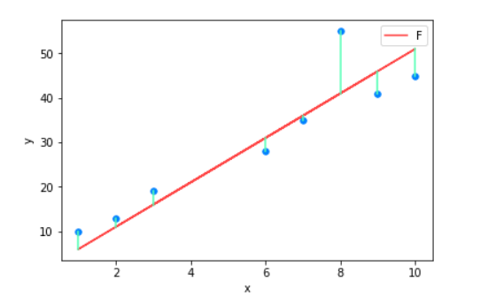

In this article, we will learn how to use Normal Equation in Linear Regression model. Let's get started.

 

## Table of contents
- [Given problem](#given-problem)
- [Linear Regression](#linear-regression)
- [Normal Equation](#normal-equation)
- [Source code](#source-code)
- [Advantages and Disadvantages](#advantages-and-disadvantages)
- [Wrapping up](#wrapping-up)

 

## Given problem

In reality, we always have a large data sets from many sources such as logging system, research results, ... , what we have to do with it is that we need to preprocess it, then, analysis it to get the useful data. 

After that based on the cleaned data, we have to establish the relationship between the input and output that is called as supervised learning, to predict results when we had inputs. Or we need to cluster our data based on relationships among the variables in the data --> unsupervised learning. With unsupervised learning, there is no feedback based on the prediction results.

In supervised learning, we have:
- When the target variable that we're trying to predict is continuous, we call the learning problem a regression problem.
- When the outputs y can take on only a small number of discrete values, we call it a classification problem.

To work with Machine Learning fluently, we need to study about some basic algorithms in supervised learning and unsupervised learn. Then in this article, we only focus on Linear Regression of supervised learning.

 

## Linear Regression

1. Symbols

    - $\mathbf{x}^{(i)}$ is denoted as the input variables, also called input features of the $i^{th}$ training examples.
    
    - $\mathbf{x_j}^{(i)}$ is a value of feature $j$ in the $i^{th}$ training example.

    - $\mathbf{y}^{(i)}$ is denoted as the output or target variable.

    - A pair ($\mathbf{x}^{(i)}$, $\mathbf{y}^{(i)}$) is called a training example. ($\mathbf{x}^{(i)}$, $\mathbf{y}^{(i)}$) with $i = 1, 2, ..., m$ is called a traning set.

    - The superscript $(i)$ in the notation is simply an index into the training set, and has nothing to do with exponentation.

    - m is the number of training examples.

    - n is the number of features.

    - A function $h(\boldsymbol{x}): \mathbf{X} \rightarrow \mathbf{Y}$ is a good predictor for corresponding value of $\mathbf{Y}$. For historical reasons, this function h is called a hypothesis.

    - $\mathbf{x}$ is column vector such as $\mathbf{x} = \begin{bmatrix} x_1\\ x_2\\ x_3 \end{bmatrix}$ or $\mathbf{x} = [x_1; x_2; \dots; x_n]$. In Machine Learning, by default, all vectors are column vectors.

    - With $\boldsymbol{X}$ matrix, if we do nothing, $\boldsymbol{w_i}$ is a column vector of its matrix.

2. Establishing the equation of Linear Regression

    After the step of visualizing our data, we can find that our data can be fit in the first degree equation for parameter $\mathbf{\theta}$ with a below equation:

    $$h_\mathbf{\theta} (\mathbf{x}) = \sum\limits_{i=0}^n \theta_ix_i = \theta_0 + \theta_1x_1 + \theta_2x_2 + ... + \theta_nx_n$$
    
    Also, we have:

    $$h_\mathbf{\theta} (\mathbf{x}) = \begin{bmatrix}\theta_0 \ \theta_1 \ \dots \ \theta_n \end{bmatrix} \begin{bmatrix} x_0\\ x_1\\ \vdots \\ x_n \end{bmatrix} = \mathbf{\theta}^T\mathbf{x}$$

    Our target is to find the values of parameters ($\theta_0, \theta_1, \theta_2, ..., \theta_n$) that is close for our data. When using its $\theta$ 's values, if we have the input, we can predict the output exactly.

    Continuously, in order to measure the accurancy of our hypothesis function, we can utilize a cost function by taking an average difference of all the results of the hypothesis with inputs from $\mathbf{x}$'s and the actual output $y$'s.

    $$J(\mathbf{\theta}) = \frac{1}{2m}\sum\limits_{i=1}^m(\hat{y}^{(i)} - y^{(i)})^2$$

    Then, we have:

    $$J(\mathbf{\theta}) = \frac{1}{2m}\sum\limits_{i=1}^m(h_\mathbf{\theta}(\mathbf{x}^{(i)}) - y^{(i)})^2$$

    This function is, otherwise, called the **Squared Error Function** or **Mean Squared Error**. The mean is halved ($\frac{1}{2}$) as a convenience for the computation of the gradient descent, as the derivative term of the square function will cancel out the $\frac{1}{2}$ term.

 

## Normal Equation

Our objective is to get the best possible line. The best possible line will be such so that the average vertical distances of the scattered points from the line will be the least.

Ideally, the line should pass through all the points of our traning data set. In such a case, the value of $J(\mathbf{\theta}$ will be $0$.

It means that we need to solve the equation:

$$J(\mathbf{\theta}) = \frac{1}{2m}\sum\limits_{i=1}^m(h_\mathbf{\theta}(\mathbf{x}^{(i)}) - y^{(i)})^2 = \frac{1}{2m} \sum\limits_{i=1}^m(\mathbf{\theta}^T\mathbf{x}^{(i)} - y^{(i)})^2 = \frac{1}{2m} \left \| \mathbf{\bar{X}}\theta - \mathbf{y} \right \|^2 = 0$$

Note:
- $\mathbf{\theta}$ is a column vector, that is:

    $$\mathbf{\theta} = \begin{bmatrix}\theta_0 \\ \theta_1 \\ \vdots \\ \theta_n \end{bmatrix}$$

- $\mathbf{\bar{X}}$ is a matrix that contains the training examples that are row vectors.

    $$\mathbf{\bar{X}} = \begin{bmatrix} (\mathbf{x}^{(1)})^T \\ (\mathbf{x}^{(2)})^T \\ \vdots \\(\mathbf{x}^{(n)})^T \end{bmatrix}$$

    Firstly, with $x_0 = 1$, we can use a transpose of column vector  that is $\mathbf{x} = \begin{bmatrix}x_0; \ x_1; \ \dots; \ x_n \end{bmatrix}$ or

    $$\mathbf{x} = \begin{bmatrix}x_0 \\ x_1 \\ \vdots \\ x_n \end{bmatrix}$$

    Or we can use xbar notation - $\mathbf{\bar{x}}$ that is a row vector that is added with $x_0 = 1$ such as $\mathbf{\bar{x}} = [x_0, x_1, ... , x_n]$

    $$\mathbf{\bar{X}} = [\mathbf{\bar{x}}^{(1)}; \mathbf{\bar{x}}^{(2)}; \dots; \mathbf{\bar{x}}^{(n)} ]$$

    Next, we need to convert our cost function to other easy version:

    $$J(\mathbf{\theta}) = \frac{1}{2m} \left \| \mathbf{\bar{X}}\theta - \mathbf{y} \right \|^2 = \frac{1}{2m} (\mathbf{\bar{X}}\mathbf{\theta} - \mathbf{y})^T(\mathbf{\bar{X}}\mathbf{\theta} - \mathbf{y})$$

    Expanding our above equation, we have:

    $$J(\mathbf{\theta}) = \frac{1}{2m} ((\mathbf{\bar{X}}\mathbf{\theta})^T - \mathbf{y}^T)(\mathbf{\bar{X}}\mathbf{\theta} - \mathbf{y})$$

    Continue with it, we have:

    $$J(\theta)=\frac{1}{2m} ((\mathbf{\bar{X}}\mathbf{\theta})^T\mathbf{\bar{X}}\mathbf{\theta} -(\mathbf{\bar{X}}\mathbf{\theta})^T\mathbf{y} - \mathbf{y}^T(\mathbf{\bar{X}}\mathbf{\theta}) + \mathbf{y}^T\mathbf{y})$$

    Because $(\mathbf{\bar{X}}\mathbf{\theta})^T\mathbf{y} = \mathbf{y}^T(\mathbf{\bar{X}}\mathbf{\theta})$, then, we can extract an above equation:

    $$J(\mathbf{\theta}) = \frac{1}{2m} (\mathbf{\theta}^T\mathbf{\bar{X}}^T\mathbf{\bar{X}}\mathbf{\theta} - 2(\mathbf{\bar{X}}\mathbf{\theta})^T\mathbf{y} + \mathbf{y}^T\mathbf{y})$$

    In order to deal with it, we should find the derivative of equation $J(\mathbf{\theta}) = 0$.

    $$\frac{\partial{J(\mathbf{\theta})}}{\partial{\mathbf{\theta}}} = \mathbf{\bar{X}}^T(\mathbf{\bar{X}}\mathbf{\theta} - \mathbf{y}) = 0$$

    Then, we have:

    $$\mathbf{\bar{X}}^T\mathbf{\bar{X}}\mathbf{\theta} = \mathbf{\bar{X}}^T\mathbf{\theta}$$

    Assuming that $\mathbf{X}^T\mathbf{X}$ can be invertible, so $\mathbf{\theta}$ can be calculated by using:

    $$\mathbf{\theta}=(\mathbf{\bar{X}}^T\mathbf{\bar{X}})^{-1}\mathbf{\bar{X}}^T\mathbf{y}$$

    If $\mathbf{X}^T\mathbf{X}$ is non-invertible, the common causes might be having:
    - Redundant features, where two features are very closely related (Ex: they are linearly dependent.)

    - Too many features (Ex: $m \leq n$). In this case, delete some features or use regularization.

    So solutions for the non-invertible of matrix is:
    - deleting a feature that is linearly dependent with another.
    - deleting one or more features when there are too many features.

 

## Source code
1. From scratch

2. Using scikit-learn

 

## Drawbacks of Linear Regression

- It's sensitive to noise. If we have a few of data points that is abnormal, our result will be bad.

    --> Solution is that we have to clean some outliers.

- It is not represented the complited model.

 

## Advantages and Disadvantages of Normal Equation
1. Advantages

    - It's very simple.

    - It's easily to implement by other languages.

2. Disadvantage

    - The algorithm complexity for inversing matrix is $O(n^3)$. So, it takes so much time when we have the large input features.

 

## Wrapping up
- Understanding how to expand to formula of Normal Equation.

 

Refer:

[https://github.com/bangoc123/learn-machine-learning-in-two-months/tree/master/models/linear-regression](https://github.com/bangoc123/learn-machine-learning-in-two-months/tree/master/models/linear-regression)

[https://machinelearningcoban.com/2016/12/28/linearregression/](https://machinelearningcoban.com/2016/12/28/linearregression/)