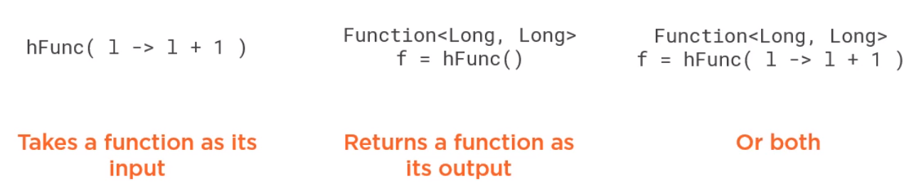

In this article, we will learn how to use Function functional interface. Let's get started.

<br>

## Table of contents
- [Introduction to Function functional interface](#introduction-to-function-functional-interface)
- [Chaining with Function interface](#chaining-with-function-interface)
- [Chaining with BiFunction interface](#chaining-with-bifunction-interface)
- [High-order function](#high-order-function)
- [Source code](#source-code)
- [Some useful examples for applying Function and BiFunction interface](#some-useful-examples-for-applying-function-and-bifunction-interface)
- [Benefits and Drawbacks](#benefits-and-drawbacks)
- [Wrapping up](#wrapping-up)


<br>

## Introduction to Function functional interface

1. Function interface

    Function is a functional interface with two type parameters T and R. Its functional method called **apply()**, takes an argument of type **T** and returns an object of type **R**. Functions are ideal for converting an object of type **T** to one of type **R**.

    ```java
    @FunctionalInterface
    public interface Function<T, R> {
        R apply(T t);
    }
    ```

    For example:

    ```java
    Function<String, Integer> func = str -> Integer.parseInt(str);

    // pass function interface to a method
    public static <T, R> R transform(T t, Function<T, R> func) {
        return func.apply(t);
    }
    ```

2. BiFunction interface

    Continuously, we will go through **BiFunction** interface with two type parameters for input types in addition to the output type parameter.

    ```java
    @FunctionalInterface
    public interface BiFunction<T, U, R> {
        R apply(T, U);
    }
    ```

    For example:

    ```java
    BiFunction<String, String, String> func = (s1, s2) -> {
        s3 = s1 + s2;   
    };
    ```

<br>

## Chaining with Function interface

In order to implement chaining with Function interface, we will find something out about some default methods.

```java
// andThen() method applies an additional operation after the operation specified by the apply() method
// completes.
default <V> Function<T, V> andThen(Function<? super R, ? extends V> after);

// compose() method applies a preliminary operation before the operation specified by the apply() method
default <V> Function<V, R> compose(Function<? super V, ? extends T> before);
```

For example:

```java

```


<br>

## Chaining with BiFunction interface

In BiFunction interface, it is only defined **andThen()** default method for chaining expressions.

```java
default <V> BiFunction<T,U,V> andThen(Function<? super R,? extends V> after)
```

For example:

```java

```

<br>

## High-order function

Just like classes are first-class citizens in object-oriented programming, functions are first-class citizens in functional programming. In this context, a function becomes a high-order function when it takes a function as its input, or argument. It returns a function as its output, or both.



We can compare high-order functions with one of the most popular design patterns in OOP, strategy pattern. This pattern allows us to encapsulate the behavior that varies in a supertype, making different behaviors, the subclasses, interchangeable. In Java, this pattern is usually implemented using an interface, creating different implementations for different behaviors.

For example, we can have an interface, **RewardPointsGenerator**, with a method to calculate their reward from a customer order.

```java
Order processOrder(Order order, RewardPointsGenerator rewardPointGenerator) {
    // ...
    RewardPoints rp = rewardPointGenerator.calculate(order);
    // ...
}
```

The method that **processOrder()** can take one of its argument as an implementation of this interface. This way, when calling **processOrder()**, we can pass different implementations to calculate the reward in different ways.

```java
RewardPointsGenerator totalBaseRP = order -> { /* ... */ }
RewardPointsGenerator numProductsBaseRP = order -> { /* ... */ }

Order processOrder1 = processOrder(order, totalBaseRP);
Order processOrder2 = processOrder(order, numProductsBaseRP);
```

We can see the **processOrder()** as a high-order function, accepting a function with the algorithm to calculate the reward points as one of its inputs. But we do not need **RewardPointsGenerator**. We can use the function interface to implement a function from order to RewardPoints in this way. And to avoid the clutter of a lambda expression with a body, we can move the code to a method and use a method reference.

```java
Order processOrder1 = processOrder(order, this::totalBaseRewardPoints);
Order processOrder2 = processOrder(order, this::numProductsBaseRewardPoints);
```

In any case, object oriented, or functional programming, having simple units of code that are easy to read and test is a good practice, and that's exactly what high-order functions can be small, concise units of code that are easy to test and make the core more readable.

This benefit comes from the design process, in particular, from the ability to abstract behavior that can be implemented with high-order functions and compose these high-order functions. This can also give us the ability to reuse the functions we create.

Both object-oriented and functional programming seek the same goals, in this case, abstraction, composition, and reusability, but they do it in a different way. Object-oriented programming uses classes as its main tool. We can compose new classes from existing ones. We can abstract behavior into classes for reusing.

In functional programming, it's the same, but using functions as the main tool. However, with high-order functions, functional programming tends to use a more declarative style for programming.

```java
List<Integer> filteredList = new ArrayList<>();
for (int n : listOfNumbers) {
    if (n % 3 == 0) {
        filteredList.add(n);
    }
}
```

So instead of having a loop where we explicitly tell how to iterate and filter a list, in functional programming, we have the below piece of code.

```java
List<Integer> filteredList = listOfNumbers.stream()
                                          .filter(n -> n % 3 == 0)
                                          .collect(Collectors.toList());
```

The filter function does not expose how it works. It simply asks for another function to declare the intention of what we want to do.

```java
// use point-free style and method reference
Predicate<Integer> divisibleBy3 = n -> n % 3 == 0;
List<Integer> filteredList = listOfNumbers.stream()
                                          .filter(divisibleBy3)
                                          .map(IntegerUtils::intToString)
                                          .collect(Collectors.toList());

```

There's a style of programming called point-free programming, that is about passing a named function as an argument to avoid writing an inline lambda expression and its parameters. We can also use method reference. The idea of using point-free style is to improve the clarity and readability of the code, and by chaining two or more of these high-order functions, we can create pipelines to transform collections.

<br>

## Source code

In order to see how Predicate functional interface works, we can reference to [Function functional interface](https://github.com/gamethapcam/J2EE/tree/master/src/Java_Core/Java%208/Functional%20Interfaces/function).

<br>

## Some useful examples for applying Function and BiFunction interface

Assuming that we have a list of Student that we get from database, our tasks are:
- search Student instances that have the same **name**.

    ```java
    BiFunction<String, List<Student>, List<Student>> searchByName = (name, students) -> {
        students.stream
                .filter(str -> str.equals(name))
                .collect(Collectors.toList());
    };
    ```

- get Student instance that has the maximum score.

    ```java
    Function<List<Student>, List<Student>> sortedByScore = students -> {
        students.stream()
                .sorted((x, y) -> y.getAge() > x.getAge())
                .collect(Collectors.toList());
    };

    Function<List<Student>, Optional<Student>> first = student -> student.stream().findFirst();
    Function<List<Student>, Optional<Student>> findMaxScore = first.compose(sortedByScore);
    ```

<br>

## When to use

- It is used in the map operation of the Stream API.

- When we want to convert some kind of objects.

## Benefits and Drawbacks
1. Benefits

    - Using **Function** interface makes our code DRY.

    - easy to understand what it does, and maintain.


<br>

## Wrapping up

- **BiFunction** interface only offers **andThen()** method, not **compose()** method, because **compose()** method will return single result, then it is not accepted as argument of another BiFunction with two input parameters.

- Some specialization of **Function** interface that used to convert from primitive types such as **IntFunction**, **LongFunction**, **DoubleFunction**.

    ```java
    @FunctionalInterface
    public interface IntFunction<R> {
        R apply(int value);
    }

    @FunctionalInterface
    public interface LongFunction<R> {
        R apply(long value);
    }

    @FunctionalInterface
    public interface DoubleFunction<R> {
        R apply(double value);
    }
    ```

- Some specialization of **Function** interface that used to convert to primitive types such as **ToIntFunction**, **ToLongFunction**, **ToDoubleFunction**.

    ```java
    @FunctionalInterface
    public interface ToIntFunction<T> {
        int applyAsInt(T value);
    }

    @FunctionalInterface
    public interface LongFunction<T> {
        long applyAsLong(T value);
    }

    @FunctionalInterface
    public interface DoubleFunction<T> {
        double applyAsDouble(T value);
    }
    ```

- Some non-generic specialization of Function interface such as **DoubleToIntFunction**, **DoubleToLongFunction**, **IntToDoubleFunction**, **IntToLongFunction**, **LongToDoubleFunction**, **LongToIntFunction**.

<br>

Refer:

[Functional Interfaces in Java book]()

[https://www.deadcoderising.com/2015-09-07-java-8-functional-composition-using-compose-and-andthen/](https://www.deadcoderising.com/2015-09-07-java-8-functional-composition-using-compose-and-andthen/)

[https://www.logicbig.com/how-to/code-snippets/jcode-java-functional-interfaces-bifunction-andthen.html](https://www.logicbig.com/how-to/code-snippets/jcode-java-functional-interfaces-bifunction-andthen.html)