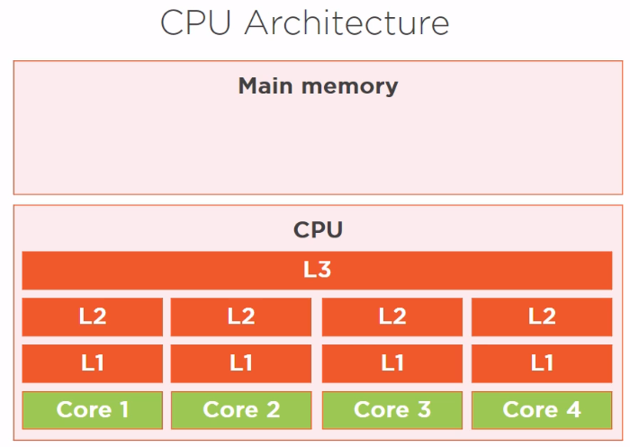
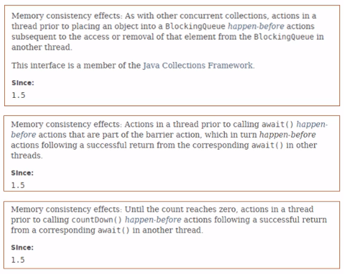
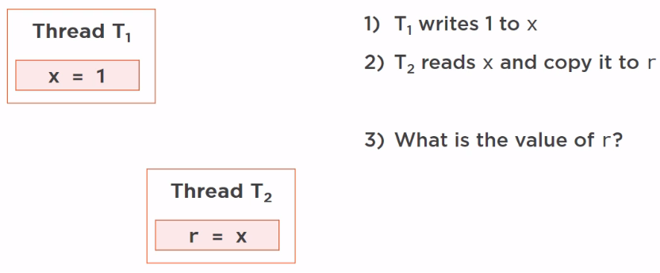
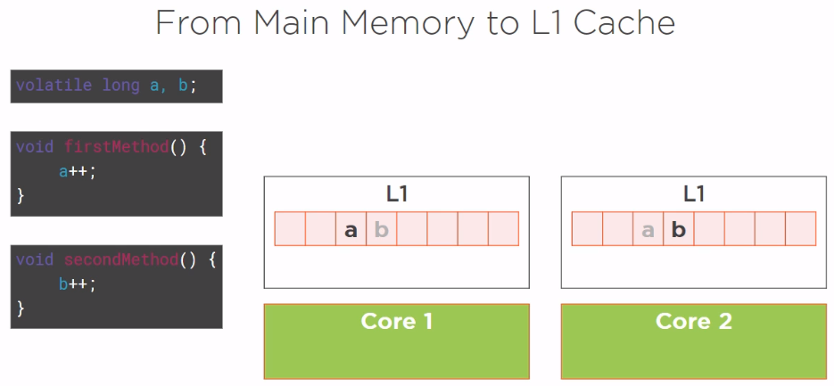
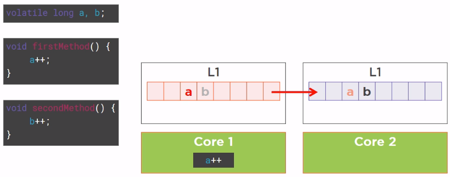
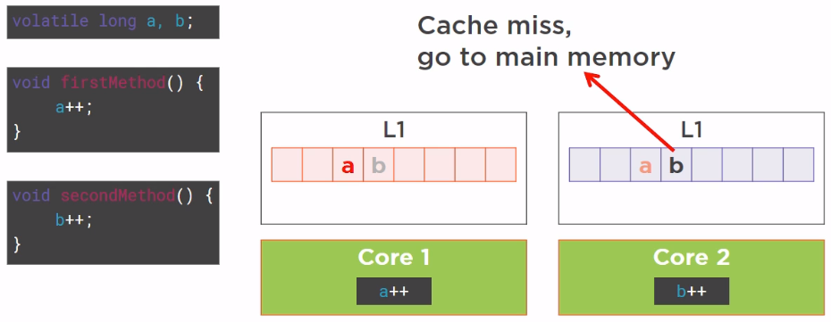

In this article, we will learn about the organization of physical memory that impacts to our multithreaded application. And some concepts such as synchronization, visibility, volatility, happens-before link that will be used to deal with it.

Let's get started.

<br>

## Table of contents
- [Organization of Caches on Multicore CPUs](#organization-of-caches-on-multicore-cpus)
- [Synchronization and Visibility on Multicore CPUs](#synchronization-and-visibility-on-multicore-cpus)
- [Understanding happen-before link](#understanding-happens-before-link)
- [Synchronization and volatility on shared variables](#synchronization-and-volatility-on-shared-variables)
- [Understanding false sharing on Multicore CPUs](#understanding-false-sharing-on-multicore-cpus)
- [Wrapping up](#wrapping-upxas)

<br>

## Organization of Caches on Multicore CPUs

1. Memory Access

    The memory access is a key point of Visibility. About 20 years ago, when CPU had no cache, this code was working fine with no side effect, but nowadays, things are different, they do not work like that any more. The CPU does not read a variable from the main memory, it reads it from its internal cache.

    So let's have a closer look at that. How does the CPU work with its main memory?
    
    

    Well, we have a first electronic component called CPU, in fact it is called CPU but there are many sub-CPUs on it called **cores**. And there is a main memory, which is a different electronic component, linked to the main CPU using a special piece of electronic called a **bus**.

    On a CPU, we have several physical cores, suppose we have four. Each core has several layers of memory caches called **L1**, **L2**, and a common third layer called **L3**. This is a very classic pool architecture that we have on Intel CPUs for instance.

    Why has it been made like that?

    Just because access to caches is much faster than access to main memory. Access to main memory is limited by the speed of this electronic bus linking the main CPU to the main memory. Reading and writing in a cache is much faster, so it allows for much faster computation than computing directly in main memory.

    Access to the main memory is in the order of 100 ns. Access to the L2 cache is in the order of 7 ns, roughly 15 times faster. And access to the L1 cache is in the order of 0.5 ns, roughly 20 times faster than access to the main memory.

2. Tradeoffs

    - The amount of memory available
    
        - Size of the main memory: several GB.
        
        - Size of the L2 cache: 256KB, so much less.

        - Size of the L1 cache is in the order of 32KB.


<br>

## Synchronization and Visibility on Multicore CPUs
1. Synchronization

    The synchronization is about protecting a block of code, which might be a whole method or some portion of a method. It guarantees that the code protected in a synchronized block is executed at one time by only one thread.

    So synchronizing a block of code is about preventing two threads from executing this piece of code at the same time. It is there to prevent race condition, and race condition is when several threads are trying to read and write the same fields of a Java class at the same time.

2. Visibility

    - Given problem

        Assuming that we have our Producer/Consumer pattern like that:

        ```java


        ```

        Based on CPU architecture in the section [Organization of Caches on Multicore CPUs](#organization-of-caches-on-multicore-cpus), we can have some assumptions.

        Our Producer, which is running in Core 1 needs a copy of this **count** variable, so this **count** variable will be copied in the L1 cache of the Core 1 of our CPU. Then the Core 1 can modify this variable, that is increment it. But in turns out that Core 2, which is running the Consumer, also needs the same count variable.

        Now the problem comes from the fact that the **count** variable is really stored in two places on our CPU, first in main memory, and the value of count of main memory has not been updated yet because the write to the main memory is much slower than the write to the L1 cache. But in Core 2, since this variable is synchronized, should get the value 1 from the L1 cache of the Core 1 of our CPU, and not the value of 0 from the main memory. So, it needs a technical trick to know that the write value is in the L1 cache of Core 1 and not in the main memory.

        This is exactly what visibility is. Visibility is about informing the other caches of CPU that a variable has been modified and that the write value is in one of the caches of the CPU and should not be fetched from the main memory.

    - Definition of Visibility

        A variable is said visible if the writes made on it visible, which means that the reads made on this variable are going to return the correct value.

        All the synchronized writes, that is all the modification of variables made within the boundary of a synchronized block, are visible.

<br>

## Understanding happens-before link
1. Introduction to **happens-before** link

    The **happens-before** link is an abstract notion introduced in Java that is going to help us order the read and the write operations on a multicore CPU.

    First of all, why is it important to understand what **happens-before** link is? Well, there is one main reason, is that if we check the Java doc, and especially the Java docs of several special classes from the java.util.concurrent package, we will see that there are many references to this **happens-before** link.

    Here are some examples from the BlockingQueue.

    

    The **happens-before** link is not explained in Java doc, it is explained in the Java Language Specification.

2. Definition of **happens-before**

    - Java Memory Model

        Multicore CPU brings new problems since a variable can be stored in multiple places, main memory and several caches. Read and writes can really happen at the same time, and this is different from the situation we used to have in mono-core CPUs.
        
        A given variable can be stored in more than one place, and different threads need to be aware of that because they need to read the correct value of a given variable.

        **Visibility means that a read operation should return the value set by the last write**. What does it mean the last write in a multicore CPU world? So basically we need some kind of timeline to put read and write operations on, and of course a CPU does not offer such a service, so we do not have this tool exactly, we need to reproduce it to have correct operations.
        
        So, what does the Java memory model tell us? 
        
        
        
        Suppose we have a write operation executed in a given thread T1. Here T1 just writes the value 1 to the variable x, and we have another thread T2, which is reading this variable. It reads x and copy the value in another variable, r. So this is basically a read operation.
        
        The question is, what is the value of r once this code has been executed? In fact, there are two answers to this question, and the Java memory model fixes those two answers.

        If there is no happens-before link between the two operations, then the value of r is unknown. It should be 1, which is the correct value from x, it also could be 0, which is the default initial value of x. But if there is a hapens-before link between the two operations, that is if x = 1 is set to happen before r = x, then the value of r should be 1. This is the specification from the Java Language Specification, and it should be working like that in our code.
        
        How can we setup a happens-before link? Because there is no such keyword in the Java language.

    - Definition of happens-before link

        A happens-before link exists between all synchronized or volatile write operations and all synchronized or volatile read operations that follow.

        A synchronized read or write is simply a read or write operation within the boundary of a synchronized block of code.

    - Examples of happens-before links

        - Basic example

            Assuming that we have two operations, an operation's in the increment() method, which is a write operation, the incrementation of the index variable. And the read operation in the System.out.println() method, which is simply the writing of this index variable on the console.

            ```java
            int index;

            void increment() {
                index++;
            }

            void print() {
                System.out.println(index);
            }
            ```

            What does this code prints in multithreaded?

            That is if the incrementation is executed in a given thread, T1, and the printing in another thread, T2. This code without any synchronization and no volatile declaration, the answer is that it is impossible to say.

            The printing of the index variable is not bound to the last write operation, so we can hope so really any kind of value printed out.

            ```java
            int index;

            void synchronized increment() {
                index++;
            }

            void synchronized print() {
                System.out.println(index);
            }
            ```

            Now if we synchronize our two methods on the same objects, which is the instance in which those two methods have been declared, then we have a synchronized write and a synchronized read, so we have a **happens-before** link between our write and our read operation. So the correct value is always printed, the value printed by the **System.out.println()** is the last value updated by our write operation.

            ```java
            volatile int index;

            void increment() {
                index++;
            }

            void print() {
                System.out.println(index);
            }
            ```

            Now if we do not use **synchronized** keyword in our code, we use **volatile** keyword for index variable. Then the write and read operations are volatile read and writes, and the correct value will also be always printed out.

        - Complex example

            ```java
            int x, y, r1, r2;
            Object lock = new Object();

            void firstMethod() {
                x = 1;
                synchronized(lock) {
                    y = 1;
                }
            }

            void secondMethod() {
                synchronized(lock) {
                    r1 = y;
                }

                r2 = x;
            }
            ```

            We have a method called **firstMethod()** with two write operations. The first x = 1 unsynchronized and non-volatile since x is not declared as being volatile, and y = 1, which is a synchronized write.

            The **secondMethod()** method with two read operations, the first one r1 = y, synchronized read, and r2 = x, non-synchronized read. And the question is, if we execute this code in two different thread, the T1 thread executing **firstMethod()** and the T2 thread executing **secondMethod()**, what the value of r2 is going to be?

            Due to the way the code is written, there is a happens-before link between the x = 1 and the y = 1 operation. Those two pieces of code are writeten in the same method, and a given thread is supposed to respect the order in which we have written our code. So we have a happens-before link between x = 1 and y = 1, and on the other hand, between r1 = y and r2 = x.

            Let's suppose that T1 is the first thread to enter the synchronized block. 

            We know that we have a happens-before link between the write operation y = 1 and the read operation r1 = y. Since we also have a happens-before link between x = 1 and y = 1, and r1 = y and r2 = x, then the execution is in this order:
            - x = 1
            - y = 1
            - r1 = y
            - r2 = x

            --> The value of r2 is 1. Because by transitivity, we have a happens-before link between x = 1 and r2 = x.

            Now, we have an another case. Let's suppose that T2 is the first thread to enter the synchronized block, then the execution in this order:
            - r1 = y
            - r2 = x or x = 1
            - y = 1

            Next, things are not going that well because we have a happens-before link between r1 = y and y = 1, but since r2 = x and x = 1 are not synchronized or volatized read and write operations we have no happens-before link between those two operations, and we can't know if x = 1 will be executed and visible before r2 = x. So the value of r2 may be 0 or 1 and it 


<br>

## Synchronization and volatility on shared variables

In the previous section, we concluded about some concepts:
- Synchronization guarantees the exclusive execution of a block of code, only one thread can execute a special block of code at a given time.

- Visibility guarantees the consistency of the variables. If a variable is visible then we have the guarantee that when we read it, we read a correctly updated value. Visibility is a weaker constraint that synchronization because two threads can execute the read and write operations at the same time but we still have the consistency of the variables guaranteed.

--> All shared variables should be accessed in a synchronized or a volatile way.

If we see a variable in a piece of code that is read or written by more than one thread at the same time and that is neither synchronized nor volatile then we have a race condition and a bug in our code.


<br>

## Understanding false sharing on Multicore CPUs

In this section, we will talk about false sharing because this structure of caches inside the modern CPU has a drawback which is precisely called false sharing. False sharing happens because of the way the CPU caches work. It is a side effect, unfortunately it can have a tremendous effect on performance, so it is good to understand what it is and to have that in mind when designing applications.

In fact, the cache of a CPU is organized in lines of data. Each line can hold 8 longs, which is 64 bytes. And when a visible variable is modified in an L1 cache, all the line is marked **dirty** for the other caches. A read on a dirty line triggers a refresh on this line, not just on the variable that has been modified.

Suppose we have a simple code, a class with two fields, volatile longs a and b, and a **firstMethod()** that is incrementing **a** and a **secondMethod()** incrementing **b**.



The first thread is running **firstMethod()** method and a second thread running **secondMethod()** method. So the first method is only interested in variable **a** and the second thread only in variable **b**. The first thread is running in Core 1, and since it needs the variable **a**, it loaded a line of cache from the main memory with this variable in this line.

And the second thread did the same, loaded a line of cache from the main memory with the **b** variable in it. Now, because of the way the memory is organized in our applicaton, organized by the compiler and the JVM, it turns out that **a** and **b** are written in two contiguous areas of the main memory. So, while loading this line of cache T1, also loaded the **b** variable and T2 also loaded the **a** variable.

So, what is going to happen now? The thread T1 is going to increment the **a** variable, thus marking this line of cache as dirty, and this mark as dirty will be broadcasted to other caches of the CPU, including the cache of Core 2.



Then, Core 2 wants to increment the **b** variable, but unfortunately the line of cache it loaded from the main memory has been marked as dirty by Core 1, so when it tries to read the variable **b**, it is a cache miss, it has to go back to the main memory to fetch the value of **b**, it is going to increment. Which is really bad luck because the variable **b** has not been touched by Core 1, the variable **b** has been made dirty by the side effect of the fact that the CPU cache is organized in lines. This is a very well-known drawback of the cache organization called false sharing.



False sharing happens in an invisible way beause when we write some code and when we write a class, we have no idea of how the class and its fields are laid out in memory.

It is hard to predict but it is with no doubt hitting the performance of our applications.

There are workarounds to prevent false sharing from happening in very simple cases, then we will going to see how false sharing can really kill the performance of an application and how variable padding can fix this problem.

<br>

## Wrapping up


<br>

Refer:

[Applying Concurrency and Multi-threading to Common Java Patterns](https://app.pluralsight.com/library/courses/java-patterns-concurrency-multi-threading/table-of-contents)
