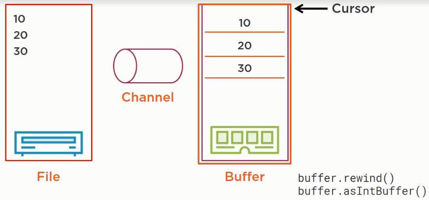

In this article, we will learn how to use Java NIO to work with file to improve our application's performance, especially using Channel, Buffer to deal with it.

Let's get started.

<br>

## Table of contents
- [Given problem](#given-problem)
- [Introduction to Java NIO](#introduction-to-java-nio)
- [Understanding channels and in-memory file channels](#understanding-channels-and-in-memory-file-channels)
- [Understanding buffers and their main properties](#understanding-buffers-and-their-main-properties)
- [Writing content to a file using Buffers and Channels](#writing-content-to-a-file-using-buffers-and-channels)
- [Reading content from a file using a flip operation](#reading-content-from-a-file-using-a-flip-operation)
- [Reading and writing to multiple buffers](#reading-and-writing-to-multiple-buffers)
- [Using MappedByteBuffers to map large files in memory](#using-mappedbytebuffers-to-map-large-files-in-memory)
- [Wrapping up](#wrapping-up)


<br>

## Given problem
Before diving into Java NIO, NIO2, we should understand some drawbacks of Java I/O, why Java NIO, NIO2 added to the Java 4 and Java 7.

Java I/O was released in the Java 1.0 - 1996. It offers the **File** class of **java.io** package to access file systems. This File object represents a file/directory and did allow you to perform some operations such as checking if a file/directory exists, get properties and delete it.

Belows are some disadvantages of Java I/O that we need to know.
- The File class lacked some important functionality, such as a **copy()** method.
- It also defined many methods that returned **boolean**. As one can imagine, in case of an error, false was returned, rather than throwing an exception. The developer had, indeed, no way of knowing why it failed.
- Did not provide good handling on support of symbolic links.
- A limited set of file attributes was provided.
- But below is the major points that Java NIO, NIO added to the JDK.

    - We know that Java I/O is added to the JDK in 1995/1996 and Java NIO in 2002, that is 7 years later. In fact, during those 7 years, people realized that Java I/O was technically speaking a good API, no problem on that, but it was lacking several features, especially for performance reasons.

        For instances, Java I/O writes or reads one byte or character at a time and cannot conduct bulk reads or bulk write operations.

        Readers are for reading only. This is the case of reader class and the input stream class. And Writers are for writing only.

        Then buffering is made for use of buffered reader or buffered writer for the character stream and buffered input stream, buffered output stream where the raw bytestreams are. It occurs in the JVM called heap memory that is in a nutshell, an essential memory of the JVM and held by the garbage collector. This is not well adapted to very large files, very large read and write operations.

        Then the handling of charsets is not great. Basically, a text file written in Latin-1 across it, for instance, that is a charset not suppported by default by the JDK which default UTF-8, would have to read using the binary operation and then converted character by character to the right charset. This is not transparent to the user.

        The Java I/O API does not offer any solution for that. And at last, all the operations on the Java I/O API are synchronous operations. All these is not bad in 1996 but in 2002, 7 years later, people had the feeling that those functionalities were missing from Java I/O and decided to create a new Java I/O API to handle all these.

<br>

## Introduction to Java NIO

1. Some functionalities that Java NIO provide

    In the JDK, to access files and network, there are three APIs to deal with it.
    - The first one is Java I/O that is introduced in 1996 in the very first version of the JDK.
    - The second, Java NIO has been added to the JDK in 2002, Java 4.
    - The last one to date, in 2011, in Java 7, Java NIO2 was introduced.

    NIO stands for Non-blocking IO. It deals with buffers and channels. It also supports asynchronous operations.

    When NIO was released, there was a statement about that NI0 was more efficient, better performance than pure Java I/O. This might have changed. This might not be the case anymore. It really depends on our application and our use cases.

    The Java NIO provides:
    - bulk access to raw bytes and only raw bytes, so we can leverage the functionalities of file systems and operating system to speed up read and write operations.
    - bidirectional channels with a single channel, that is with single Java object, we can both read and write data to and from the disk or to and from the network.
    - off-heap buffering. It means that it can create buffer outside of the central memory of the JVM, in portions of memory not handled by the garbage collector. So, we can create very large buffers. Think of multi-gigabytes or even multi-terabytes of size without any impact on the performance of the garbage collector.
    - Proper support for charsets directly inside the JDK. So the JDK defines standard charsets objects. Objects for the standard, well-known and most widely used charsets around and those charsets provide encode and decode methods to convert a stream of characters expressed in a given charset to another charset.
    - support for asynchronous operations.

2. Understanding new concepts of Java NIO

    Java NIO introduces three new concepts:
    - Buffer

        A buffer can be seen as a space in memory. It can reside in the main memory of the JVM, the heap or off-heap, which is very useful for very large buffers.

    - Channel

        The channel is where the data comes from. The channel object is an object that connect to a file or to a socket, for instance. A channel can write the buffer to the medium or can read data from that medium to a buffer.
        
        A channel only knows bytes buffers, so it can only read and write bytes from files or for socket, for instance. Afterwards, we have to convert the content of this buffer to characters if this is a character buffer or to data or object if it is raw data or raw objects.

    - Selector

        A selector has been introduced to handle asynchronous operations. 

    A write operation takes data from a buffer and writes it to a channel.

    A read operation reads data from a channel and writes it into a buffer.

    Once the data is in the buffer, we can read it and interpret it as raw bytes, data types, objects, or characters as we need it.

<br>

## Understanding channels and in-memory file channels

1. Channel

    The channel is an interface and is implemented by several classes.
    - The first one is **FileChannel** to access files.

        It has a cursor. It allows for multiple reads and writes. It is thread safe.

    - The second is **DatagramChannel** to access to socket.

        It supports multicast since it is UDP and it supports multiple, non-concurrent reads and writes.

    - The third one is the **SocketChannel** and **ServerSocketChannel** to access to a TCP socket.

        It supports asynchronous operations and also supports multiple, non-concurrent reads and writes.

    **FileChannel**, **SocketChannel**, and **ServerSocketChannel** are in fact, abstract classes extended by concrete classes in the JDK. But these implementations are hidden and should not be used directly.

    To create an instances of Channels, we are going to use factory methods.

2. In-memory files channels

    A **FileChannel** can be mapped to a memory array for direct access. This allows for much faster operation than accessing to the disk directly. It is built on native features provides by the different operating system and this is the reason why the concrete implementation of **FileChannel** are hidden just because they are different depending on the machine we are working on.

    It should be used with caution because a single write in this kind of array can trigger a modification of the file that will be send to the disk directly.

    There are 3 modes of this mapping:
    - **READ_ONLY**: the mapped file cannot be modified.

        The file is just loaded in memory and is read from this array.

    - **READ_WRITE**: the file can be modified with the previous warning.

    - **PRIVATE**: modifications are local to this channel and will not be propagated to the disk.

<br>

## Understanding buffers and their main properties

Buffer is an abstract class, extended by typed buffers.
- The first type buffer and the most important is ByteBuffer since this is the only type of buffer, a channel can write in or read from.

    So, if we need to write characters to a ByteBuffer, we need to decorate it with a CharBuffer precisely and to write character using the method of this CharBuffer. As same as IntBuffer that allows for reading and writing integer into a ByteBuffer.

- CharBuffer

And then those ByteBuffer, CharBuffer, ... are extended by concrete implementations. Those concrete implementations are hidden. We do not have direct access to them. We can only create buffer using factory methods. This is the right pattern to use.

A buffer is an in-memory structure backed by an array of bytes. It is usually stored in the central memory of the JVM, handled by the garbage collector. But it can also be stored in the off-heap space of the JVM, thus not impacting the garbage collector. This is very useful for very large buffers. The size of buffer is an Int since it is backed by an array. So the size of a buffer can be as large as two gigabytes which could have an impact on the performance of the garbage collector if stored in the central memory space of the JVM.

A buffer object has 3 properties:
- a capacity = the size of the backing array.
- a current position that can be seen as cursor. All the read and the write operations are made to or from the current position.
- a limit which is the last position in memory seen by this buffer.

So with those two indexes, cursor and limit, we can create views on buffers which can be seen as a kind of a sub buffer inside a buffer. And a buffer always keeps track of the available space, so we know exactly what amount of data, we can write in a buffer.

A buffer can hold a single mark. Marking a buffer does two things:
- It sets the mark to the current position. The position we are reading from or writing to in the buffer.
- It returns this to be able to chain calls on this buffer.
- A buffer supports 4 operations:

    - rewind: clears the mark and sets the current position to 0.
    - reset: sets the current position to the previously set mark. This is the companion method of the mark method.
    - flip: sets the limit to the current position and rewinds the buffer.
    - clear: clears the buffer.

    These operations return this and can be chained for better patterns.

<br>

## Writing content to a file using Buffers and Channels

Suppose we need to write integers to a file. First, we need a buffer to write those integers in and then, a channel which will be a FileChannel to write the contents of this buffer to the right file. A channel can only write or read from a ByteBuffer.

- Create a ByteBuffer.
- use the putXXX() method to write data.
- have our FileChannel to write the ByteBuffer to a file.

Note that in this way, we can write characters or arrays of characters but we cannot write directly strings of characters.

To write strings of characters, we can use the following pattern.
- convert the ByteBuffer to a CharBuffer.
- use the put(String) method that is available of CharBuffer.

For example:

```java
// use off-heap memory
ByteBuffer byteBuffer = ByteBuffer.allocate(1024);
byteBuffer.putInt(10);
FileChannel fileChannel = FileChannel.open(Paths.get("files/ints.bin"), CREATE, WRITE);
fileChannel.write(byteBuffer);

// should not forget to close manually the FileChannel if we are not choosing the try-with-resource in Java 7.
fileChannel.close();
```
<br>

## Reading content from a file using a flip operation

In Java NIO, a read operation takes data from a channel and puts it in a buffer. So we know that to properly read a file, we need understand how buffers work.

- First, we are going to create a channel on the given file to read its content.
- That content will be transferred in a ByteBuffer since a channel can only access a ByteBuffer.
- Then our application will need to read the content of this buffer and translate it into understandable data.

For example, we have a file on the disk with three integers such as 10, 20, 30.


We can setup a channel that will transfer this data directly into an in-memory buffer and we will have an image of this file in this buffer. Once this is done, the cursor of this buffer will be marking the byte stream just after 30. So, we will have to drop this buffer as an end buffer. When we do that, we have an image of the buffer which starts at the current position of the cursor. That is, we have this image of a buffer.


Of course, this is not what we need. Because if we try to read from that buffer, we will not see any content. So we need to put the cursor at the beginning of the buffer before doing that. We can call rewind() method and indeed, rewind will do the trick. It will put the cursor at the beginning of the buffer. And if we call as end buffer at this point, we will see the full buffer starting from the cursor to the end of the back end array, like the below image.



Now the problem is that we need to know that we wrote three integers in this buffer because if we try to read as many integers as this buffer can contain, we'll probably read junk past the three integers that have been written. What we want, in fact, is not exactly this configuration but this configuration, an Int buffer that ends exactly at where the cursor was before the rewind operation. So in fact, what we want is to set limit at the point where our cursor was before the rewind operation.


And we have a method that does exactly this which is not the rewind() method but which is the flip() method. This is just what does the flip() method. It sets the limit of the buffer at the current position of the cursor and then rewinds the cursor.


So the correct pattern to read the content, we need to follow the below sample code.

```java
// First, we create a FileChannel and ByteBuffer
FileChannel fileChannel = FileChannel.open(Paths.get("files/ints.bin"), READ);
ByteBuffer byteBuffer = ByteBuffer.allocate(1024);

// Then, read the content of the file to fill the ByteBuffer
fileChannel.read(byteBuffer);

// Then, we flip the ByteBuffer and create an IntBuffer
byteBuffer.flip();
IntBuffer intBuffer = byteBuffer.asIntBuffer();

// Then, we can read integers from the IntBuffer in a while loop
int i = intBuffer.get();

// once we are done reading the integers, call clear() method
// to reset both the cursor, the limit, and the end buffer.
buffer.clear();
```

The difference between rewind and flip
- Rewind resets of the cursor inside the buffer.
- Flip resets the cursor and prevents reading past what has been written into the buffer.

So to properly conduct read operation, most of the time it is the flip operation that is used.

<br>

## Reading and writing to multiple buffers

Java NIO allows for the reading and writing to multiple buffers at the same time. The reading of a file in multiple buffers is called the scattering read operation. It consists in reading from a single channel, that is from a single file, to an array of buffers. It is specified by the ScatteringByteChannel interface. The reading process will first fill the first buffer before moving to the next. So, it's mostly usable when we have fixed length file formats.

The opposite is called the gathering write operation. It consists in writing from an array of buffers to single Channel. It is specified by the ScatteringByteChannel interface. The writing operation starts with the first buffer, then the next one and so on.

The Gather/Scatter pattern is useful when handling messages with fixed-length parts. And in this case, it is, in fact, extremely useful.

Suppose we have a 1024 bytes header followed by a 4096 bytes body, ending with a 128 byte footer. Then we can setup an array of three buffers of the right size, plug a channel on those buffers, then the first reading will fill the first buffer, the second reading will fill the body, and the third reading will fill the footer. Below is a sample code to implement that.

```java
ByteBuffer header = ByteBuffer.allocate(1024);
ByteBuffer body = ByteBuffer.allocate(4096);
ByteBuffer footer = ByteBuffer.allocate(128);

ByteBuffer[] message = {header, body, footer};

// Scattering read operation
long bytesRead = channel.read(message);

// Gathering write operation
long bytesWritten = channel.write(message);
```

Remember to properly rewind the buffers when using it.

<br>

## Using MappedByteBuffers to map large files in memory

Java NIO introduces the notion of MappedByteBuffer. MappedByteBuffer is a buffer that maps a file to memory. Think of a buffer that is able to load a file in memory thus all the paths of our application that are reading our same file again and again will be much more efficient since the readings will take place in memory instead of taking place on the disk.

There are three modes for those MappedByteBuffer:
- READ
- READ_WRITE
- PRIVATE

The way the MappedByteBuffer is created also allows for the buffering of a portion of a file instead of the whole file itself.

For example:

```java
// first, create a FileChannel on a path
FileChannel fileChannel = FileChannel.open(Paths.get("files/ints.bin"), READ);

// then, map the corresponding file to this mapped buffer
MappedByteBuffer mappedBuffer = fileChannel.map(FileChannel.MapMode.READ_ONLY, 0, fileChannel.size());

// then, we can decode it to a char buffer if it is a text file
CharBuffer charBuffer = StandardCharsets.UTF_8.decode(mappedBuffer);
```

Remember that this ByteBuffer is created in the main memory of the JVM. So if the file is too big, we will come across and out of memory error most probably.

<br>

## Introducing ByteBuffer to CharBuffer conversion using Charsets

Java NIO defines two types of buffer, ByteBuffer and CharBuffer. To convert a ByteBuffer into a CharBuffer and vice versa, we need to specify a charset. This conversion is based on the use of a decorder and encoder.

We have standard charsets supported in Java.
- US_ASCII, ISO_8859_1 (aka latin1)
- UTF_8
- UTF_16, UTF_16BE, UTF_16LE

A charset object has two methods:
- encode() method: takes a CharBuffer, returns a ByteBuffer.
- decode() method: takes a ByteBuffer, returns a CharBuffer.

Using these methods is the only way to convert a CharBuffer to a ByteBuffer and vice versa. This is what we need to read and write text files using Java NIO.

For example:

```java
// read operation
FileChannel channel = FileChannel.open(Paths.get("files/text-latin1.txt"), StandardOperation.READ);
ByteBuffer buffer = ByteBuffer.allocate(1024);
channel.read(buffer);

CharSet latin1 = StandardCharsets.ISO_8859_1;
CharBuffer utf8Buffer = latin1.decode(buffer);

String result = new String(utf8Buffer.array());

// write operation
CharSet utf8 = StandardCharsets.UTF_8;
ByteBuffer byteBuffer = utf8.encode(buffer);
anotherFileChannel.write(byteBuffer);
```

Some notes about Buffers and Charsets
- Channels can only read and write ByteBuffers. If we are reading a text file, it will thus be read in a ByteBuffer.

- Using the encoding and decoding operation, we can convert a ByteBuffer to a CharBuffer using the right encoding and this is the only way to do it.

Encoding and Decoding are only available through the charsets object provided by the JDK.


<br>

## Convert NIO objects to I/O objects using the Channels factory

Java NIO API provides bridges to the Java I/O API through the use of the **Channels** factory class. In fact, we have ten factory methods:
- to create channels from InputStream and OutputStream.
- to create InputStream and OutputStream from a channel, whether it is asynchronous or not.
- to create readers and writers from a channel, providing a charset because a channel holds bytes and to decode bytes in characters, we need a charset.

<br>

## Wrapping up
- Understanding about buffers and channels.
- resetting, rewinding, and flipping operation.
- How to use charset to encode/decode characters.

<br>

Refer:

[Java Fundamentals: NIO and NIO2]()

[https://stackoverflow.com/questions/25537675/java-what-exactly-is-the-difference-between-nio-and-nio-2](https://stackoverflow.com/questions/25537675/java-what-exactly-is-the-difference-between-nio-and-nio-2)