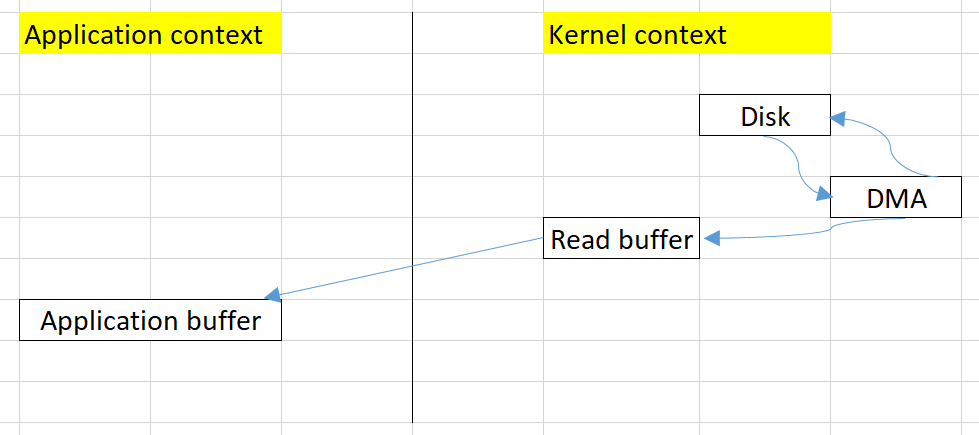
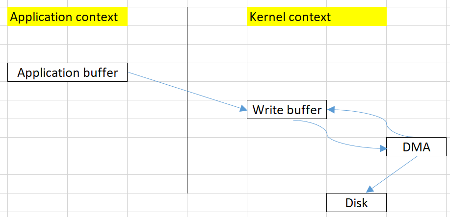

<br>

## Table of contents
- [Given problem](#given-problem)
- [Solution with Zero copy](#solution-with-zero-copy)
- [When to use](#when-to-use)
- [Applications and Examples](#applications-and-examples)
- [Wrapping up](#wrapping-up)


<br>

## Given problem

Suppose that we need to copy the content of a file to an another file. Using Java we can have the source code.

```java
FileInputStream in = new FileInputStream("in.txt");
FileOutputStream out = new FileOutputStream("out.txt");
int c;

while ((c = in.read()) != -1) {
    out.write(c);
}

in.close();
out.close();
```

Normally, it is the basic way when we are working with file. But we do not understand about the drawbacks of this way. So, belows are some steps of Read operation and Write operation.

1. Read operation

    

    To take a look at this read operation of the above problem, we can have some notes:
    - There are **two copy operations**.

        - The first copy operation is that DMA will copy data from **disk** to **read buffer** in **kernel context**.
        - The second copy operation is that copy data from **read buffer** to **application buffer** of **application context**.

    - There are **two context switching** between **application context** and **kernel context**.

        - The first context switching is when we call **read()** method in application, then we need to call **sys_read()** method to read data from the file.
        - The second context switching is when we need to copy from **read buffer** of **kernel context** to **application buffer** of **application context**.

2. Write operation

    

    To take a look at this write operation of the above problem, we can have some notes:
    - There are two copy operations.

        - The first copy operation is that copy data from **application buffer** of **Application Context** to **write buffer** of **Kernel context**.
        - The second copy operation is that DMA copy data from **write buffer** to disk in **Kernel context**.

    - There are two context switching between application context and kernel context.

        - The first context switching is when we call write() method in application, the system call of Kernel context will copy data to write buffer. 

        - The second context switching is when the system call of **Kernel context** is done, it will go back to **Application Context**.

Based on the read/write operations, we can find that we have 4 copy operations and 4 context switching. It takes so much time when our system has multiple transfer data operations.

So, how can we optimize the above problem?

<br>

## Solution with Zero copy

The ashin's heel of the above problem is that we always have to copy data from buffer of Kernel context to application buffer of Application context. It is redundancy. 

The solution for this problem is that we only need to copy data from read buffer to write buffer in Kernel context.

The advantages of this solution:
- reduce the number of context switching between Application context and Kernel context.

    We only need two context switching, the first time is when calling **read()** method, and the second time is to go back **application context**.

- reduce the number of copy operations.

    It uses one copy operation that is from read buffer to write buffer in Kernel context, and one copy operator from disk to read buffer.

Below is the source code of using Java NIO to implement Zero copy.

```java
FileChannel inChannel = new FileInputStream("in.txt").getChannel();
FileChannel outChannel = new FileOutputStream("out.txt").getChannel();

inChannel.transferTo(0, inChannel.size(), outChannel);

inChannel.close();
outChannel.close();
```

<br>

## When to use

- When our system has multiple transfer data operations.

<br>

## Applications and Examples

- Kafka use Zero copy to optimize the transfer data operations.

- Microsoft Windows supports zero-copy through the TransmitFile API.

- MacOS supports zero-copy through the FreeBSD portion of the kernel[citation needed].

- Java input streams can support zero-copy through the java.nio.channels.FileChannel's transferTo() method if the underlying operating system also supports zero copy.

- RDMA (Remote Direct Memory Access) protocols deeply rely on zero-copy techniques.

<br>

## Wrapping up

- Understanding the drawbacks of the original solution that using Stream Java I/O.


<br>

Refer:

[https://developer.ibm.com/articles/j-zerocopy/](https://developer.ibm.com/articles/j-zerocopy/)

[https://labs.septeni-technology.jp/none/zero-copy-va-toi-uu-data-transfer/](https://labs.septeni-technology.jp/none/zero-copy-va-toi-uu-data-transfer/)

[https://en.wikipedia.org/wiki/Zero-copy](https://en.wikipedia.org/wiki/Zero-copy)