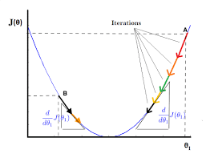
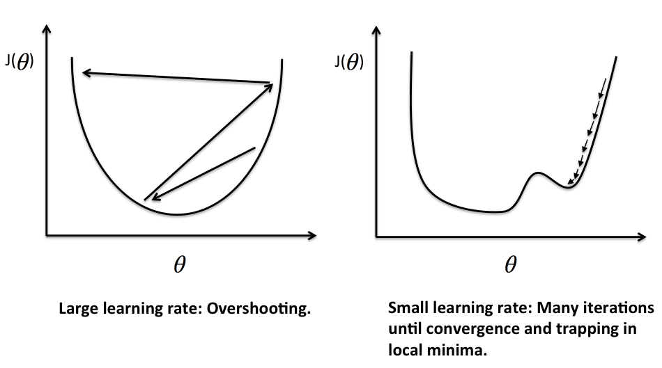

In this article, we will learn how to use gradient descent algorithm. Let's get started.

 

## Table of contents
- [Given problem](#given-problem)
- [Solution of Gradient Descent](#solution-of-gradient-descent)
- [Improvement GD with Momentum](#improvement-gd-with-momentum)
- [Nesterov accelerated gradient (NAG)](#nesterov-accelerated-gradient-(nag))
- [Benefits and Drawbacks](#benefits-and-drawbacks)
- [Wrapping up](#wrapping-up)

 

## Given problem

In the previous article [Linear Regression](https://gamethapcam.github.io/2020-04-02-Linear-regression/), we had visited the Linear Regression model and Normal Equation for solving the first degree equation with parameter $\mathbf{\theta}$. Then, we also had the disadvantages of Normal Equation:
- The algorithm complexity for inversing matrix is $O(n^3)$. So, it takes so much time when we have the large input features.

The large features of our data is normal case. So, what is other way to deal with this problem?

 

## Solution of Gradient Descent

1. Explain the formula of Gradient Descent

    In the previous article [Linear Regression](https://gamethapcam.github.io/2020-04-02-Linear-regression/), we solved the derivation of equation $J(\mathbf{\theta}) = 0)$ to find the value of $\mathbf{\theta}$. But Gradient Descent algorithm uses the derivation of cost function $J(\mathbf{\theta})$ to know the tendency of direction of parameter $\mathbf{\theta}$. Then we will update the parameter $\theta_j$ based on the cost function's derivation with $\theta_j$.

    Repeat until convergence:

    $$\theta_j = \theta_j - \alpha \frac{\partial{J(\mathbf{\theta})}}{\partial{\theta_j}}$$

    

    Because our cost function is the second degree equation, then we have a parabol graph that is describe in an above image.
    
    And the image shows that:
    - When the slope is negative (all the data points are in the left side of global minimum point such as **B** point), means that $\frac{\partial{J(\mathbf{\theta})}}{\partial{\theta_1}} \leq 0$, the value of $\theta_1$ increases because of $-\alpha \frac{\partial{J(\mathbf{\theta})}}{\partial{\theta_1}} \geq 0$.

    - When the slope is positive (all the data points are in the right side of global minimum point such as **A** point), means that $\frac{\partial{J(\mathbf{\theta})}}{\partial{\theta_1}} \geq 0$, the value of $\theta_1$ decreases because of $-\alpha \frac{\partial{J(\mathbf{\theta})}}{\partial{\theta_1}} \leq 0$.

    In both our cases, the tendency of cost function always go to local minimum points, luckly, we can get the global minimum point.

    - Influence of $\alpha$'s value

        

        If $\alpha$ is too small, gradient descent can be slow.

        If $\alpha$ is too large, gradient descent can overshoot the minimum. It may fail to converge or even diverge.

        Gradient descent can converge to a local minimum, even with the learning rate $\alpha$ fixed. As we approach a local minimum, gradient descent will automatically take smaller steps. So no need to decrease $\alpha$ over time.

2. Build the vectorize version of $\mathbf{\theta}$

    According to the formula of Gradient Descent algorithm, we have:

    $$\theta_j = \theta_j - \alpha \frac{\partial{J(\mathbf{\theta})}}{\partial{\theta_j}}$$ (1)

    But, in the previous article [Linear Regression](https://gamethapcam.github.io/2020-04-02-Linear-regression/), we have:

    $$J(\mathbf{\theta}) = \frac{1}{2m} \sum\limits_{i=1}^{m}(h_\mathbf{\theta}(\mathbf{x}^{(i)}) - y^{(i)})^2$$

    Then, the partial derivation of the above equation is:

    $$\frac{\partial{J(\mathbf{\theta})}}{\partial{\theta_j}} = 2.\frac{1}{2m} \sum\limits_{i=1}^{m}(h_\mathbf{\theta}(\mathbf{x}^{(i)}) - y^{(i)})\frac{\partial{(h_\mathbf{\theta}(\mathbf{x}^{(i)}}) - y^{(i)})}{\partial{\theta_j}}$$

    $$\Leftrightarrow \frac{\partial{J(\mathbf{\theta})}}{\partial{\theta_j}} = \frac{1}{m}\sum\limits_{i=1}^{m}(h_\mathbf{\theta}(\mathbf{x}^{(i)}) - y^{(i)}) \frac{\partial}{\partial{\theta_j}}(\sum\limits_{k=0}^{n}\theta_kx_k^{(i)} - y^{(i)})$$

    $$\Leftrightarrow \frac{\partial{J(\mathbf{\theta})}}{\partial{\theta_j}} = \frac{1}{m}\sum\limits_{i=1}^{m}(h_\mathbf{\theta}(\mathbf{x}^{(i)}) - y^{(i)})x_j^{(i)}$$ (2)

    Combine $(2)$ with $(1)$ with $j = 0, 1, \dots, n$, we have:

    $$\theta_j = \theta_j - \alpha \frac{1}{m}\sum\limits_{i=1}^{m}(h_\mathbf{\theta}(\mathbf{x}^{(i)}) - y^{(i)})x_j^{(i)}$$ (3)

    So, we have the vectorized version of parameter $\mathbf{\theta}$:

    $$\mathbf{\theta} = \mathbf{\theta} - \alpha \frac{1}{m} \sum\limits_{i=1}^{m}(\mathbf{\bar{x}}^{(i)}\mathbf{\theta}- y^{(i)})\mathbf{x}^{(i)}$$

    $$\Leftrightarrow \mathbf{\theta} = \mathbf{\theta} - \alpha \frac{1}{m} \mathbf{\bar{X}}^T(\mathbf{\bar{X}}\mathbf{\theta} - \mathbf{y})$$ (4)

    with:

    - $\mathbf{\bar{X}}$ is a matrix that has row vectors.
        
        $$\mathbf{\bar{X}} = \begin{bmatrix} \mathbf{\bar{x}}^{(1)} \\ \mathbf{\bar{x}}^{(2)} \\ \vdots \\ \mathbf{\bar{x}}^{(n)} \end{bmatrix}, \mathbf{\bar{X}}  \mathbb{R}$$

        $$\mathbf{\bar{x}}^{(i)} = \begin{bmatrix} x_0^{(i)} \ x_1^{(i)} \ \dots \ x_n^{(i)}  \end{bmatrix}$$

    - $\mathbf{X}$ is a matrix that has column vectors.

        $$\mathbf{X} = \begin{bmatrix} \mathbf{x}^{(1)} \ \mathbf{x}^{(2)} \ \dots \ \mathbf{x}^{(n)} \end{bmatrix}$$

        $$\mathbf{x}^{(i)} = \begin{bmatrix} x_0^{(i)} \\ x_1^{(i)} \\ \vdots \\ x_n^{(i)}  \end{bmatrix}$$

        So, we can find that $\mathbf{\bar{x}}^T = \mathbf{x}$ and $\mathbf{\bar{X}}^T = \mathbf{X}$.

3. Some note about Gradient Descent

    We know that the gradient descent is:

    Repeat until convergence:

    $$\theta_j = \theta_j - \alpha \frac{\partial{}}{\partial{\theta_j}} J(\theta_0, \theta_1)$$

    where $j = 0, 1$ represents the features with the index number.

    At each iteration j, one could simultaneously update the parameters $\theta_0, \theta_1, \theta_2, \dots, \theta_n$. Update a specific parameter prior to calculate another one of the $j^{(th)}$ iteration would yield to a wrong implementation.

    Below is an incorrect implementation:

    $$temp0 = \theta_0 - \alpha \frac{\partial}{\partial{\theta_0}}J(\theta_0, \theta_1)$$

    $$\theta_0 = temp0$$

    $$temp1 = \theta_1 - \alpha \frac{\partial}{\partial{\theta_1}}J(\theta_0, \theta_1)$$

    $$\theta_1 = temp1$$

    So, we should simultaneously update the parameters $\mathbf{\theta}$.

    $$temp0 = \theta_0 - \alpha \frac{\partial}{\partial{\theta_0}}J(\theta_0, \theta_1)$$

    $$temp1 = \theta_1 - \alpha \frac{\partial}{\partial{\theta_1}}J(\theta_0, \theta_1)$$

    $$\theta_0 = temp0$$

    $$\theta_1 = temp1$$

 

## Gradient Descent with feature scaling

We can speed up gradient descent by having each of our input values in roughly the same range. This is because $\theta$ will decrease quickly on small ranges and slowly on large ranges, and so will oscillate inefficiently down to the optimum when the variables are very uneven.

The way to prevent it is to modify the ranges of our input variables so that they are all roughly the same. Ideally,

$$-1 \leq x_i \leq 1$$ 

or 

$$-0.5 \leq x_i \leq 0.5$$

These aren't exact requirements, we are only trying to speed things up. The goal is to get all input variables into roughly one of these ranges, give or take a few.

Two techniques to help with this are feature scaling and mean normalization.
- Feature scaling involves dividing the input values by the range of the input variable, resulting in a new range of just $1$.

    For example, the maximum value minus the minimum value.

- Mean normalization involves the average value for an input variable from the values for that input variable resulting in a new average value for the input variable of just $0$.

To implement both of these techniques, adjust our input values as shown in the below formular:

$$x_i = \frac{x_i - \mu_i}{s_i}$$

where:
- $\mu_i$ is the average of all values for feature $i$
- $s_i$ is the range of values $(max - min)$, or $s_i$ is the standard derivation.

Note that dividing by the range or dividing by the standard derivation, give different results.

For example, if $x_i$ represents housing prices with a range of $100$ to $2000$ and a mean value of $1000$, then:

$$x_i = \frac{price - 1000}{1900}$$

For example, consider the below example:

|    $midterm-exam$     |        $(midterm-exam)^2$      |        $final-exam$         |
| --------------------- | ------------------------------ | --------------------------- |
| 89                    | 7921                           | 96                          |
| 72                    | 5184                           | 74                          |
| 94                    | 8836                           | 87                          |
| 69                    | 4761                           | 78                          |

So, we have hypothesis function for this problem:

$$h_\mathbf{\theta}(\mathbf{x}) = \theta_0 + \theta_1x_1 + \theta_2x_2$$

with $x_1$ - $midterm-score$, $x_2$ - $(midterm score)^2$

We will use feature scaling and mean normalization for an above problem.

$$Mean-normalization = \frac{89 + 72 + 94 + 69}{4} = 81$$

$$Feature-scaling = 94 - 69 = 25$$

$$\Rightarrow x_1^{(3)} = \frac{94 - 81}{25} = 0.52$$

 

## Features and Polynomial Regression

1. Features

    We can improve our features and the form of our hypothesis function in a couple different ways.

    We can combine multiple features into one.

    For example, combine $x_1$ and $x_2$ into a new feature $x_3$ by taking $x_1x_2$.

2. Polynomial Regression

    Our hypothesis function need not be linear (a straight line) if that does not fit the data well.

    We can change the behavior or curve of our hypothesis function by making it a quadratic, cubic or square root function (or any other form).

    For example, we have a hypothesis function: $h_{\mathbf{\theta}}(\mathbf{x}) = \theta_0 + \theta_1x_1$

    Create additional features based on $x_1$:
    - quadratic function: $h_{\mathbf{\theta}}(\mathbf{x}) = \theta_0 + \theta_1x_1 + \theta_2 x_1^{2}$
    - cubic function: $h_{\mathbf{\theta}}(\mathbf{x}) = \theta_0 + \theta_1x_1 + \theta_2 x_1^{2} + \theta_3 x_1^{3}$

        we create new features such as $x_2$ and $x_3$ where $x_2 = x_1^2$, $x_3 = x_1^3$

    - square root function: $h_{\mathbf{\theta}}(\mathbf{x}) = \theta_0 + \theta_1x_1 + \theta_2 \sqrt{x_1}$

    One important thing to keep in mind is, if we choose our features this way, then feature scaling becomes very important.

    For example, with $x_1 \in (1, 1000)$, we have:
    
    - $x_1^{2} \in (1, 1000.000)$,

    - $x_1^{3} \in (1, 1000.000.000)$.

 

## Improvement GD with Momentum

The problem of Batch Gradient Descent is that it can lie in local minimum points. So, how can we make it leave the local minimum points to jump at the global minimum point?

So what we will do is that we will use the past velocity and the slope of the derivation line to the current velocity. It does this by adding a fraction $\gamma$ of the update vector of the past time to the current update vector.

$$v_t = \gamma v_{t-1} + \eta\nabla_\mathbf{\theta}J(\mathbf{\theta})$$

$$\mathbf{\theta} = \mathbf{\theta} - v_t$$

The momentum term $\gamma$ is usually set to 0.9 or a similar value.

The $\eta$ is a learning rate.

The drawbacks when using Gradient Descent with Momentum
- When we plus the additional of the velocity of the previous point, we make our algorithm that is difficult to converge at global minimum point because it always oscillate around the global/local minimum point.

 

## Nesterov accelerated gradient (NAG)

Nesterov accelerated gradient (NAG) is a way to give our momentum term this kind of prescience. We know that we will use our momentum term $\gamma v_{t-1}$ to move the parameters $\mathbf{\theta}$. Computing $\mathbf{\theta} - \gamma v_{t-1}$ thus gives us an approximation of the next position of the parameters (the gradient is missing for the full update), a rough idea where our parameters are going to be. We can now effectively look ahead by calculating the gradient not w.r.t. to our current parameters $\mathbf{\theta}$ but w.r.t. the approximate future position of our parameters:

$$v_t = \gamma v_{t-1} + \eta\nabla_{\mathbf{\theta}}J(\mathbf{\theta} - \gamma v_{t-1})$$

$$\mathbf{\theta} = \mathbf{\theta} - v_t$$

 

## The comparison between Normal Equation and Gradient Descent

|        Gradient Descent        |         Normal Equation          |
| ------------------------------ | -------------------------------- |
| Need to choose alpha           | No need to choose alpha          |
| Needs many iterations          | No need to iterate               |
| $O(kn^2)$                      | $O(n^3)$, need to calculate inverse of $\mathbf{\bar{X}}^T.\mathbf{\bar{X}}$ |
| Works well when n is large     | Slow if n is very large          |

In practice, when the number of traning samples exceeds 10000, it might be a good time to go from a normal solution to an iterative process.

There is no need to do feature scaling with the normal equation.

 

## Benefits and Drawbacks

1. Benefits

    - computational efficient.

    - produces a stable error gradient and a stable convergence.

2. Drawbacks

    - the stable error gradient can sometimes result in a state of convergence that isn't the best the model can achieve.

    - it requires the entire training dataset be in memory and available to the algorithm.

    - As we need to calculate the gradients for the whole dataset to perform just one update, batch gradient descent can be very slow and is intractable for datasets that don't fit in memory.

    - Batch gradient descent also doesn't allow us to update our model online.

 

## Wrapping up
- The above Gradient Descent algorithm also called as Batch Gradient Descent.

    Batch gradient descent, also called vanilla gradient descent, calculates the error for each example within the training dataset, but only after all training examples have been evaluated does the model get updated. This whole process is like a cycle and it's called a training epoch.

- Mini-batch Gradient Descent is used in almost machine learning algorithm, especially in Deep Learning. The value of n is from 50 to 100.

 

Refer:

[https://builtin.com/data-science/gradient-descent](https://builtin.com/data-science/gradient-descent)

[https://www.hackerearth.com/blog/developers/3-types-gradient-descent-algorithms-small-large-data-sets](https://www.hackerearth.com/blog/developers/3-types-gradient-descent-algorithms-small-large-data-sets)

[https://www.quora.com/In-gradient-descent-without-feature-scaling-why-does-theta-descend-quickly-for-small-ranges-and-slowly-for-large-ones](https://www.quora.com/In-gradient-descent-without-feature-scaling-why-does-theta-descend-quickly-for-small-ranges-and-slowly-for-large-ones)

[https://machinelearningmastery.com/linear-regression-for-machine-learning/](https://machinelearningmastery.com/linear-regression-for-machine-learning/)

[https://machinelearningcoban.com/2017/01/16/gradientdescent2/#vi-du-minh-hoa](https://machinelearningcoban.com/2017/01/16/gradientdescent2/#vi-du-minh-hoa)

[https://blog.paperspace.com/part-2-generic-python-implementation-of-gradient-descent-for-nn-optimization/](https://blog.paperspace.com/part-2-generic-python-implementation-of-gradient-descent-for-nn-optimization/)

 

**Momentum with GD**

[https://towardsdatascience.com/stochastic-gradient-descent-with-momentum-a84097641a5d](https://towardsdatascience.com/stochastic-gradient-descent-with-momentum-a84097641a5d)

[https://ruder.io/optimizing-gradient-descent/index.html#batchgradientdescent](https://ruder.io/optimizing-gradient-descent/index.html#batchgradientdescent)

[https://engmrk.com/gradient-descent-with-momentum/](https://engmrk.com/gradient-descent-with-momentum/)