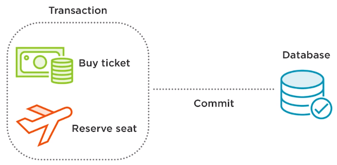
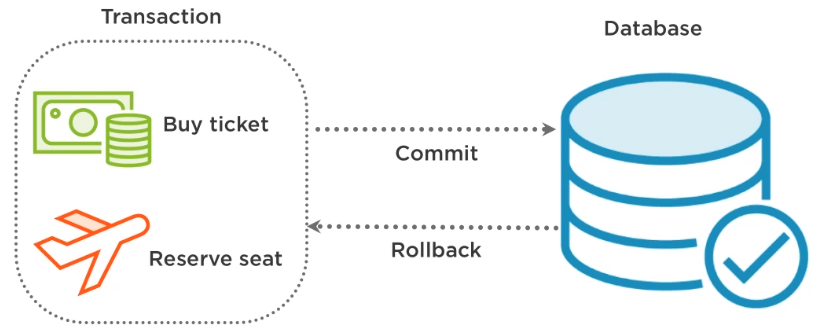
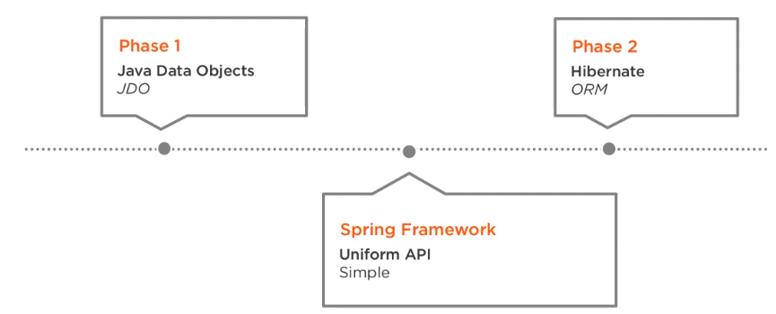
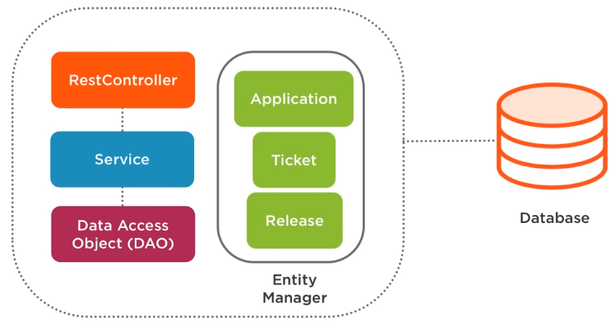

In this article, we will introduce to transaction with Spring Data JPA, how many ways to implement it in our project.

Let's get started.

<br>

## Table of contents
- [Introduction to Transaction](#introduction-to-transaction)
- [Using transaction with Spring](#using-transaction-with-spring)
- [Benefits and Drawbacks](#benefits-and-drawbacks)
- [Wrapping up](#wrapping-up)


<br>

## Introduction to Transaction
1. Transaction

    

    The first thing that we need to know is what a transaction actually is. A series actions that are treated as a single unit of work is consider as transaction. Although there are multiple actions in a single transaction, all should either fail as a group or complete entirely as a group.

    When a single action in the group fails, all actions should be rolled back. If all actions complete, then the transaction should be permanently committed. There are four key properties to transactions that can be easily remembered using the ACID acronym.
    - Atomicity, a transaction consists of a series of actions, and the approach is an all-or-nothing approach. The transaction must either fully happen or not happen at all. It cannot partially complete.
    - Consistency, a transaction is committed once all of its actions have completed. This keeps our data in a consistent state.
    - Isolation, each transaction is isolated from other transactions to ensure that data is not corrupted. Isolation ensures that one transaction cannot read data from another transaction.
    - Durability, a durable transaction is one that cannot be undone by system failure typically because it is written to persistent storage.

2. Transaction Management

    Transaction management ensures data consistency and integrity. The ability to properly manage transactions is essential to enterprise application development because most enterprise apps almost always persists data to a database. Without transaction management, data could end-up in an consistent state and become corrupted.

    To understand the importance of the trasanction, think of a common example, buying a airline ticket online using a credit card.
    
    

    In an online airline, ticket booking system, a booking may consists of two separate actions that together form a single transaction, paying for the seat and then reserving a seat and then reserving a seat, and removing it from inventory for the customer that just paid. Now think of the situation where the amount is charged to the credit card but a seat is never reserved nor confirmed for the passenger due to a system error. The data is left in an inconsistent state. The booking transaction should use transaction management so that both steps are performed as a single unit of work and all complete entirely as a group or fail as a group are rolled back.

    ```java
    try {
        conn = dataSource.getConnection();
        conn.setCommit(false);
        ticket.buy()
        seat.reseve();
        conn.commit();
    } catch (SQLException e) {
        conn.rollback();
    }
    ```

    In this scenario, setting the correct boundaries for the transaction is important. When should a transaction start? When should a transaction end? When should the transaction be committed to the database? And when should data be rolled back in the case of exception?

    Without transaction management, our data would be left in an inconsistent state. We are lucky that Spring provides transaction management support.

    In a typical environment, there are two types of transactions, global and local.
    - Global transactions are used when multiple resources manage the transactions and are typically managed by the application server, allowing for access to multiple resources like message queues, relational databases, ...
    - Local transactions are typically associated with a specific resource like a JDBC connection, and this resource manages the transaction. Local transactions do not typcially run in a global environment.

<br>

## Using transaction with Spring

1. The advantages of the Spring framework

    Transaction management is a useful feature that the Spring framework makes available out of box. Spring provides support for automatically committing or rolling back transactions when they fail.
    
    

    There are several different APIs that help developer manage transactions.
    - Java Transaction API
    - Java Database Connectivity
    - Hibernate
    - Java Persistence API
    - Java Data Objects
    - Java Message Service
    
    The advantages of using Spring to manage transactions is that it provides a consistent programming model across all of the APIs. For example, we are currently using JDO to help manage our transactions, and one day down the road we want to change to Hibernate. Well, if we are not using Spring, we'd have to make coding changes to support the migration because JDO and Hibernate have different APIs for transaction management.

    If we're using Spring, then coding changes aren't required. Spring provides a uniform API that is simpler for programmatic transaction management than other complex APIs.

    

    Let's have a closer look at an example for this problem:

    ```java
    public void saveTicket(Ticket ticket) {
        Session session = sessionFactory.getCurrentSession();
        session.getTransaction().begin();
        session.save(ticket);
        session.getTransaction().commit();
    }
    ```

    In the above code, we can find that we're responsible for beginning the transaction, and commit the transaction. It is very manual. Then, we will see the code that's using the Spring transaction management.

    ```java
    @Transactional
    public void saveTicket(Ticket ticket) {
        sessionFactory.getCurrentSession().save(ticket);
    }
    ```

    Using the Spring transaction management, the piece of code is lightweight and flexible and lets Spring handle the transaction.

    Let's say we needed to execute **saveTicket()** as a part of complex transactions.

    ```java
    @Transactional
    public void scheduleRelease(Ticket ticket, Release release) {
        ticketDao.saveTicket(ticket);
        assignToRelease(ticket);
        doOtherStuff(ticket);
    }
    ```

    In this example where we have to first save a ticket, assign it to a release, and do other stuff, the automatic rollback happens in the case of exception.

    Spring makes all of this possible by providing support for programmatic and declarative transaction management. The above code of **scheduleRelease()** method is considered declarative transaction management. The underlying transaction manager should intercept resource manager requests made by the application and perform the necessary transaction management such as **begin**, **suspend**, **commit** and **rollback**. Declarative transaction management can also include **the specification of transactional parameters** such as **isolation levels**.

    The advantages of declarative transactions:
    - The declarative transactions allow container to manage the transaction for us.
    - This saves us from having to put transaction management calls into our application code.
    - Declarative transactional management can lead to much cleaner separation of business logic and transaction code. And application written to depend on declarative transaction management can be much easier to maintain and evolve.

2. Programmatic transaction management

    In this section, we will see some tools for the programmatic transaction management.
    - **Transaction Template**, is similar to Spring templates like JdbcTemplate and other available templates.
    
    - **Platform transaction manager**, Spring makes available several implementations of the platform transaction manager interface for handling transactions across Hibernate, JDBC, JPA, JMS, etc such as Platform transaction manager, the Jta transaction manager, the Hibernate transaction manager, the DataSource transaction manager, and the JPA transaction manager, etc.

    In our article, we will use Hibernate transaction manager because it's a uniform API that uses the features of Hibernate's transactions, while maintaining the advantage of Spring's unified transaction abstractions.


3. Declarative transaction management

    In the declarative transaction management, we usually use **@Transactional** annotation. It allows us to easily work with database transactions. The **@Transactional** annotation is convenient because developers don't need to think about direct transaction management and exception handling.
    
    - All of this is done automatically in a proxy class that Spring creates to hold the transaction management code.

    - The **@Transactional** annotation can either be used at the class, interface, or method level. When placed on the class or interface, all methods within it become transactional.

    - By using **@Transactional**, many important aspects such as transaction propagation are handled automatically. There are specific attributes that we can set that will determine propagation behavior.


4. Spring boot and Transaction manager

    The **@EnableTransactionManagement** annotation enables Spring's annotation-driven transaction management capability. However, when using Spring Boot, transaction management is automatically configured for us.

    When looking at the sample code, we will see that the **@Transactional** annotation works without having to include the **@EnableTransactionManagement** annotation and declarative transaction management works, although we haven't defined or configured a platform transaction manager.

    The case study for the project uses Spring Boot, and we have added Spring Data JPA in our class path via pom.xml.

    ```xml
    <dependency>
        <groupId>org.springframework.boot</groupId>
        <artifactId>spring-boot-starter-data-jpa</artifactId>
    </dependency>
    ```

    Due to this dependency, Spring Boot does a lot for us behind the scenes.
    - Spring registers a transaction manager for us, in this case a JPA transaction manager.
    
    - It also takes care of the **DataSource**, **EntityManager**, repositories, etc. And calls on Spring Data repositories are by default surrounded by transaction.
    
    - If Spring Data finds an existing transaction, the existing transaction will be reused. Otherwise, a new transaction is created.
    
    Just remember when we're not using Spring Boot, the **@Transactional** annotation within our code will be evaluated when we use the **@EnableTransactionManagement** annotation.

    We can easily trace transaction behavior by adding the following property to our application.properties file.

    ```yaml
    logging.level.org.springframework.transaction.interceptor=TRACE
    ```

    We can easily get access to the transaction manager by autowiring it with the following code.

    ```java
    @Autowired
    private PlatformTransactionManager transactionManager;
    ```

5. Entity Manager and Database transactions

    

    When we review the project code, we will see the use of an entity manager. So how does the entity manager fit in with the database transaction? In an ideal scenario, we will fully gain the benefit of Spring Data JPA, and remove the DAO completely and leave only the DAO interface.

    Now, we will talk about persistence context and a database transaction. Each has its own lifecycle and scope.
    - Database transaction
    
        When the **@Transactional** annotation is used, it is only defining a single database transaction, in the scope of a persistence context.

    - Persistence context

        The persistence context comes from JPA, as does the entity manager, and is implemented internally using a Hibernate session when we're using Hibernate as our persistence provider.

    For example:

    ```java
    @Entity
    public class Release {
        @Id
        @GeneratedValue(strategy = GenerationType.AUTO)
        private Integer id;

        private String name;

        private String description;

        @OneToMany(cascade = PERSIST)
        private List<Ticket> tickets;

        @JsonFormat(shape = JsonFormat.Shape.STRING, pattern = "yyyy-MM-dd")
        private LocalDate releaseDate;
    }

    @Repository
    public class ReleaseDAO implements IReleaseDAO {
        @PersistenceContext
        private EntityManager entityManager;

        @Override
        public void addRelease(Release release) {
            this.entityManager.persist(release);
        }

        @Override
        public Release getReleaseId(int releaseId) {
            return this.entityManager.find(Release.class, releaseId);
        }
    }
    ```

<br>

## Benefits and Drawbacks
1. Benefits

    The Spring framework allows transactions to be managed seamlessly by offering a consistent programming model across global and local transactions. Essentially code is written once benefitting from different transaction management strategies within different environement.

    Spring provides supports for programmatic transaction management. Now this is where the developer writes custom code to manage the transaction and set boundaries. Spring also provides support for declarative transaction management, which allows developers to seperate transaction management from the business code.

    Spring supports isolation levels that help developers avoid problems that may arise when multiple transactions in the application are operating concurrently on the same data.

<br>

## Wrapping up


<br>

Refer:

[Data Transactions with Spring](https://app.pluralsight.com/library/courses/data-transactions-spring/table-of-contents)