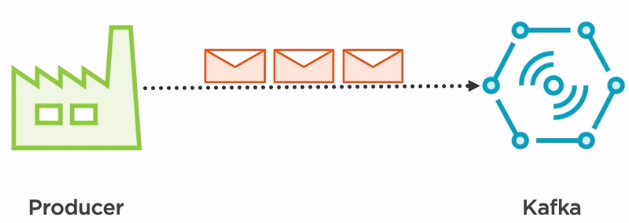
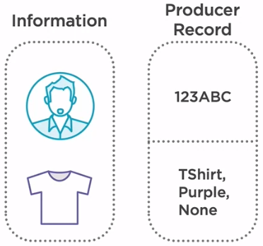
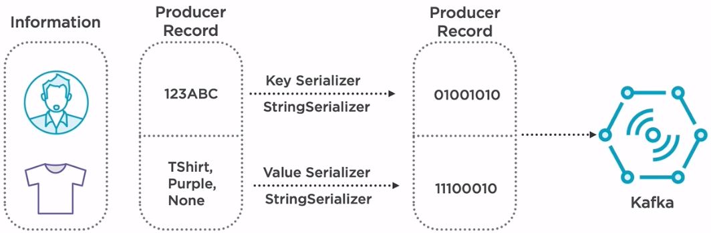

In this article, we will learn how to Kafka producer works and how to implement it by using Java code. Let's get started.

<br>

## Table of contents
- [The definition of Kafka Producer](#the-definition-of-kafka-producer)
- [How Kafka Producer works](#how-kafka-producer-works)
- [Source code Java for Kafka producer](#source-code-java-for-kafka-producer)
- [Wrapping up](#wrapping-up)

<br>

## The definition of Kafka Producer

A producer is an application which creates and transmits events to the Kafka cluster.



The Kafka producer serves as an adapter for transmitting the data processed, by our application by dealing with all the low-level details regarding serialization, network connections, or encrypted communication.

<br>

## How Kafka Producer works


To examplify how a producer works under the hood, let's consider a user-tracking web page, which based on the articles that the consumer hovers over, it will send an event to a topics stored in a Kafka cluster. This event will later be used to build a list of suggestions.

For example, when the user hovers over the purple T-shirt, an appropriate message will be sent to Kafka. So how will things work on the producer application.

We have a bunch of information about the customer that triggered the event and some data about the article that he showed interest in. After we have gathered all this data, we need to create something called a producer record. A producer record represents an actual message that will be sent to Kafka. The producer record like any other message is composed of two main things, a key and a value.



Let's consider that an appropriate key for this type of record would be the userID that has triggered the hovered event. We can find that information from the user details object. The value would be represented by a single concatenation of the type of the article that the customer showed interest in, the color, and the design if any separated by a comma.

We known that Kafka cannot store data types. It can only store bytes. So if we're actually sending our record to Kafka, we need to convert it into a binary format. The way to do that is by using a key serializer and a value serializer.

The key serializer will convert the key, while the value serializer will convert the value. Since both our key and value are strings, we're going to use StringSerialiser for both of them. Now that our producer record has been successfully converted in a binary format, we can now transmit it to Kafka.



<br>

## Source code Java for Kafka producer

```java
import org.apache.kafka.clients.producer.KafkaProducer;
import org.apache.kafka.clients.producer.Producer;
import org.apache.kafka.clients.producer.ProducerConfig;
import org.apache.kafka.clients.producer.ProducerRecord;
import java.util.Properties;

public static void main(String[] args) throws Exception {
    Properties props = new Properties();
    props.put(ProducerConfig.BOOTSTRAP_SERVERS_CONFIG, "localhost:9092");
    props.put(ProducerConfig.ACKS_CONFIG, "all");

    //If the request fails, the producer can automatically retry,
    props.put(ProducerConfig.RETRIES_CONFIG, 0);

    props.put(ProducerConfig.BATCH_SIZE_CONFIG, 16384);

    //Reduce the no of requests less than 0
    props.put(ProducerConfig.LINGER_MS_CONFIG, 1);

    //The buffer.memory controls the total amount of memory available to the producer for buffering.
    props.put(ProducerConfig.BUFFER_MEMORY_CONFIG, 33554432);

    props.put(ProducerConfig.KEY_SERIALIZER_CLASS_CONFIG, StringSerializer.class.getName());
    props.put(ProducerConfig.VALUE_SERIALIZER_CLASS_CONFIG, StringSerializer.class.getName());

    Producer<String, String> producer = new KafkaProducer<String, String>(props);
    String topic = "test";
    for (int i = 0; i < 10; i++) {
        producer.send(new ProducerRecord<String, String>(topic, "key " + i, "value" + i));
        System.out.println(i);
    }

    System.out.println("Message sent successfully");
    producer.close();
}
```

<br>

## Wrapping up
- Due to Kafka only store binary format of data, so we need to serialize our data before sending to Kafka. To do this, we can use some serializer such as StringSerializer, AVRO, ...


<br>

Refer:

[https://sookocheff.com/post/kafka/kafka-in-a-nutshell/](https://sookocheff.com/post/kafka/kafka-in-a-nutshell/)

[https://stackoverflow.com/questions/38024514/understanding-kafka-topics-and-partitions](https://stackoverflow.com/questions/38024514/understanding-kafka-topics-and-partitions)

<br>

**Using async method for sending message to Kafka**

[http://rick-hightower.blogspot.com/2017/05/writing-kafka-producers-and-consumers.html](http://rick-hightower.blogspot.com/2017/05/writing-kafka-producers-and-consumers.html)

<br>

**Producer configurations**

[https://docs.confluent.io/current/installation/configuration/producer-configs.html](https://docs.confluent.io/current/installation/configuration/producer-configs.html)