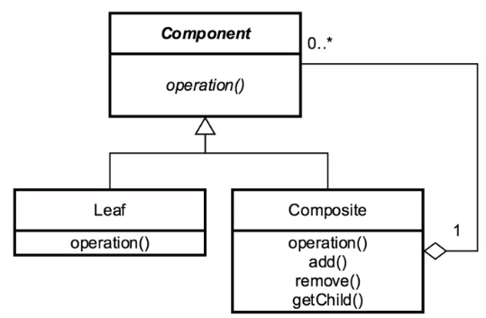

In this article, we will learn how to use Composite pattern. Let's get started.

<br>

## Table of contents
- [Given Problem](#given-problem)
- [Solution of Composite Pattern](#solution-of-composite-pattern)
- [When to use](#when-to-use)
- [Benefits & Drawback](#benefits-&-drawback)
- [Code C++ /Java / Javascript](#code-c++-/java-/-javascript)
- [Application & Examples](#application-&-examples)
- [Contrast to other patterns](#contrast-to-other-patterns)
- [Wrapping up](#wrapping-up)


<br>

## Given Problem 

Assuming that we have two class such as Part class and Whole class that Whole class contains some instances of Part class. Below is a UML diagram that describe it.


In the above diagram, we can have some notes:
- Clients of the hierarchy must treat **Part** and **Whole** objects differently, which makes them more complex especially if the object structure is constructed and traversed dynamically.

- In order to understand the disadvantage of the above diagram, we can get an example about folder and file. We have folder as **Whole** class, file as **Part** class. But folder can contain other folders. And folder can contain files.

    So, it means that folder can be an instance of **Part** class of another folder as **Whole** class. But with an above diagram, the **Part**-**Whole** classes are different. So, in our code, **Whole** class also can contain its instances. It makes our code really complex because we treated **Part** and **Whole** instances differently.

Belows are some drawbacks of the above diagram:
- difficult to traverse all elements of Whole.

- violate the inheritance property.

    In reality, Whole class can contains the other Whole class's instances and Part class's instances. So, Whole class can be considered as Part class. It's is-a relationship between Whole-Part class.

    Then, we do not take advantage of polymorphism property to traverse dynamically.

To solve these problem, we need to define an interface that have all common operations of Part and Whole class. Then, Part and Whole classes will inherit from this interface.

So, we have Composite pattern.

<br>

## Solution of Composite Pattern

The design of the Composite pattern is that it is tree-structured. The root of the tree starts with a component. Components are two things, either a leaf or a composite of objects.

The different between them is that a leaf just has operations and a composite has all of the same operations available, but also knows about its child components.

Below is a UML diagram of Composite pattern.



The Component class is the abstraction for all components, including composite ones. It declares the interface for objects in the composition. The component can also define methods for accessing the parent, but it isn't necessary to still use this pattern correctly.

The leaf represents the leaf objects or nodes in the composition. It should be noted that it also implements all of the component's methods. The composite though represents a composite component, or a component that has children and implements methods to manipulate those children. It also implements all of the component's methods as well, but typically delegates the functionality to its children. So a leaf and a composite have the same functions inside of them, a composite just knows about which children it has and what it can do with children.

<br>

## When to use

- When components represent part or whole structure.

    This is done by configuring our objects into tree structures. Once our data is built by this way, we can treat individual objects the same as a composite object. In treating objects the same, we can apply operations or functions on both the individual and the composite, and expect them to work the same way.


<br>

## Benefits & Drawback
1. Benefits

    - makes easily to add new kinds of components to our collection as long as they support a similar programming interface.


2. Drawbacks

    - It can overly simplify system. This may seem like a strange drawback at first, but in building the hierarchy the way that we want to do it, it can make it difficult to restrict what we want to add to it.

    - Implementation can also be costly if dealing with a very large composite, or if implemented incorrectly. This doesn't have to be the case, but if child objects are held in a collection and each object itself contains a collection, its size can grow fairly quickly.

<br>

## Code C++ /Java / Javascript

To refer this pattern's code, we can read the [source code of Composite pattern on Github](https://github.com/gamethapcam/Design-Pattern/tree/master/Structural-Pattern/Composite-pattern).

<br>

## Application & Examples

- Map

    ```java
    Map<String, String> personAttributes = new HashMap<>();
    personAttributes.put("site_role", "person");
    personAttributes.put("access_role", "limited");

    Map<String, String> groupAttributes = new HashMap<>();
    personAttributes.put("group_role", "claims");

    Map<String, String> secAttributes = new HashMap<>();
    secAttributes.putAll(personAttributes);
    secAttributes.putAll(groupAttributes);

    System.out.println(secAttributes);
    ```

- In Java, we have **java.awt.Component**.
- JSF widgets.
- RESTful web service GETs.

<br>

## Contrast to other patterns

Below is the comparison between the Composite pattern and the Decorator pattern.
- With Composite patern

    - It is a tree structure, its intent to make a leaf and a composite have the same interface to the client.
    - It provides a unity between objects.

- With Decorator pattern

    - It contains another entity. This may sound like a composite, but it is really just composition. Composition is just an object containing another one.
    - If differs in that the decorator modifies the behavior of the contained entity. This is usually adding functionality to an entity that it didn't originally have. It decorates the underlying object, but doesn't necessarily change it.

<br>

## Wrapping up

- Generalizes a hierarchical structure.

- Can simplify things too much.

- It definitely makes things easier for the client.

- The composite does not equal the composition. The composite pattern is dealing with that hierarchical structure where composition is just an object containing another one.

Thanks for your reading.

<br>

Refer: 

[Design Patterns in Java: Structural by Bryan Hansen](https://app.pluralsight.com/library/courses/design-patterns-java-structural/table-of-contents)
