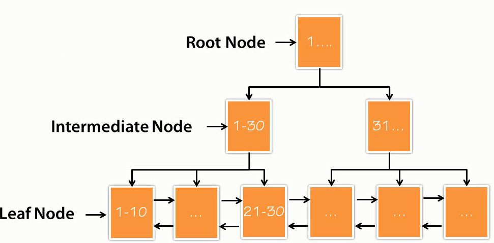
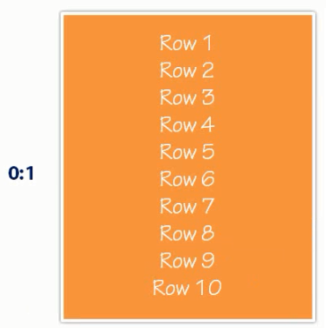
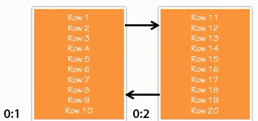
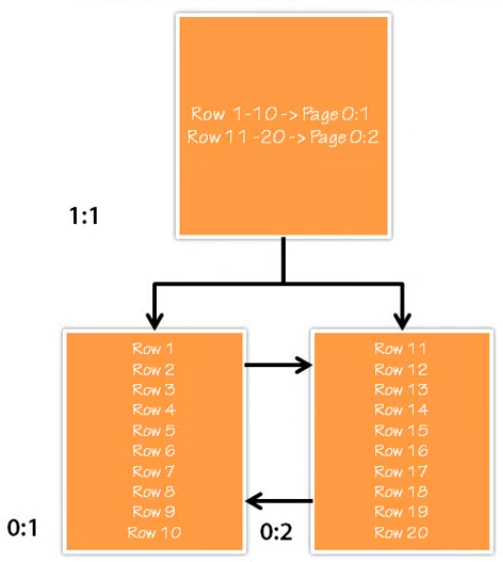
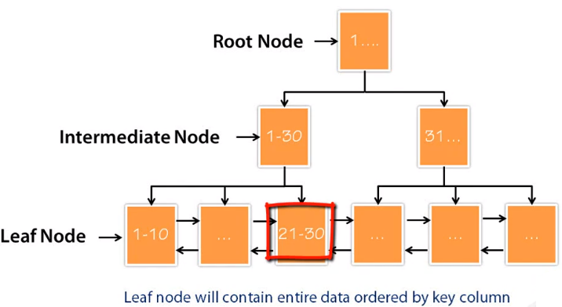
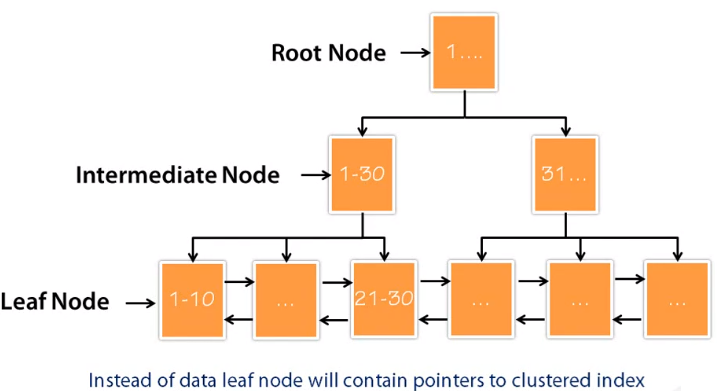
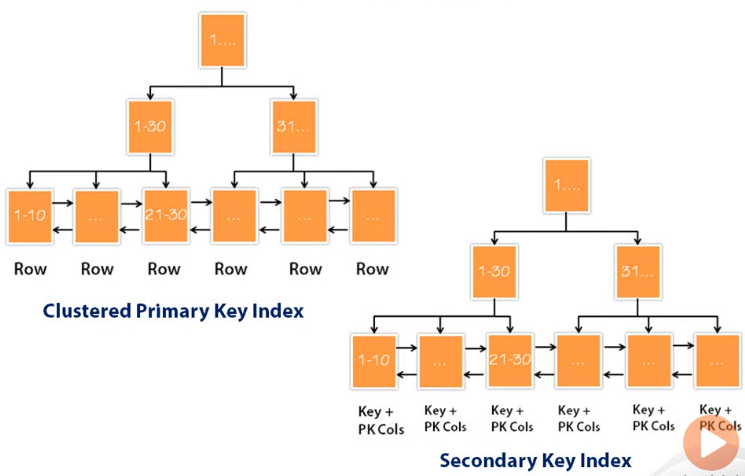
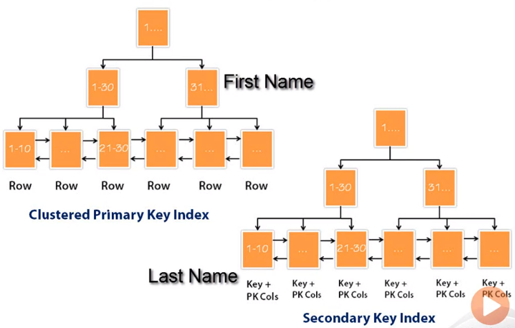

In this article, we will learn about Cluster Index that is usually in some storage engines in MySQL, SQL Server, PostgreSQL, ...

Let's get started.

 

## Table of contents
- [Introduction to Clustered Index](#introduction-to-clustered-index)
- [Introduction to Secondary Index](#introduction-to-secondary-index)
- [Clustered Index B-Tree](#clustered-index-b-tree)
- [Secondary Index B-Tree](#secondary-index-b-tree)
- [InnoDB's MySQL clustered table](#innodb's-mysql-clustered-table)
- [Benefits and Drawbacks](#benefits-and-drawbacks)
- [How to choose Primary Key as clustered index](#how-to-choose-primary-key-as-clustered-index)
- [Wrapping up](#wrapping-up)

 

## Introduction to Clustered Index

Some characteristic of Clustered Index that we need to know:
- Clustered index is just a different approach of data storage.

    - It's not really a different type of index. InnoDB supports clustered indexes.
    - Not all storage engines support it.

- Rows with adjacent key values are stored close to each other.

    That's the secret for its better performance when we are doing grand scan.
    
- Its row with adjacent keys are physically sorted in clustered index, it's only possible to have one clustered index per table, but we can use different keys and build a secondary index.

 

## Introduction to Secondary Index

- An index which is not clustered index is called as a secondary index.

- Secondary Index is InnoDB does not store actual data but only contains the pointer to the data. 

- If there is a clustered index on the table
    
    - Secondary index will contain the pointer to clustered index.

- If there is no clustered index on the table

    - Secondary index will contain the row pointer to the actual data.

 

## Clustered Index B-Tree

Based on the above image of clustered index B-Tree, we have root node, intermediate node, and leaf node. In clustered indexes of InnoDB, we only have data in leaf node.

A root node and intermediate node will have a pointer to the next level node. Here is a data page and for simplicity, we will assume that a single data page can contain 10 rows or 10 entries.

If there are only 10 rows in our table, we only need a single page. Let's assume that we have more 10 rows, from 11 to 20 rows. In that case, we need now another page. The first page of leaf level node, 0, will how row 1 - 10 and the second page will have rows from 11 - 20. In this point of time, we note that page 1 contains 1 - 20 rows, and page 2 contains 11 - 20 rows.

However, the tables need one more pages to make those entries. Let's introduce one more level.

Now, this new page is root page in this scenario.

The root page is a level 1 and a single page. It has two entries over here. The first entry indicates that row 1 - 10 is now in page 0:1 and rows 11 - 20 are in page 0:2. If we have more than 10 pages, the entire 1:1 page will be filled. So, we have the structure of clustered index B-Tree that is described in the first image of this section.

Back to the structure of Clustered Index B-Tree.

We have leaf nodes, which will contain data and pointer to the next page and we will help intermediate node, which will have a pointer to the leaf node. The root node will also have a pointer to the intermediate nodes.

Now, we want to retrieve 22th row. However, when MySQL engine wants to get 22th row, it will have tranversed from root node to intermediate node and end up on leaf node. First, it will go to root node and it will ask where actually 22th row belongs. Root node will send it to intermediate node on the left side. Intermediate node, which contains the location to rows 1 - 30. Now, MySQL engine read this intermediate node and try to figure out where exactly 22th row belongs to. The intermediate node will point it to this particular leaf node for row 22th. Similarly, it will traverse from the root node to intermediate node and leaf node for any other value, which we're trying to retrieve.

Remember that in the case of the clustered index, all the data is located in leaf node. This particular information is not true if we are talking about secondary index for InnoDB.

 

## Secondary Index B-Tree

Below is a diagram of secondary index B-Tree.

On a first look, it looks exactly the same as clustered index B-Tree. However, there is one big difference between both of them. A clustered index has a data and a leaf node, but a secondary index does not have a data at the leaf node.

In the previous section, we have that if there is a clustered index on the table, secondary index will contain the pointer to clustered index, and if there is no clustered index on the table, secondary index will contain the row pointer. Following the same logic, a leaf node will contain either a pointer to the clustered index or a row pointer. Because secondary index does not contain any data, it's quite possible to have more than one secondary index if any database supports more than one clustered index and had more data at the leaf node, that is essentially copying the same table multiple times, and that leads to many different problems, as per architecture perspective.

 

## InnoDB's MySQL clustered table

1. How clustered index works in InnoDB storage engine

    Below is a diagram of cluster index and secondary index.

    

    On a first look, both of them look exactly similar. However, when we pay attention to the leaf level, we can see in a clustered primary key index, we have rows at leaf level, whereas in secondary key index, we have keys and primary key columns. As there is a clustered index on this table, secondary key index also contain pointer to primary keys. Here is how it works, if we are looking for a column, which is a key of secondary key index.

    First, we will use secondary key index and figure out an appropriate location, and once it's figured out the key for the rest of the data, it will once again go back to clustered index and will continue to look for additional data and retrieve the entire row.

    So, **why do we need a secondary key index?** It's not possible to always to order our clustered index as per all of our queries.

    Assuming that we have our table that uses clustered index for primary key - **first name** field. Now, we have multiple queries on our table. The first query may be on a **first name** and second query is on **last name**.

    In that case, we clearly need two different indexes. We can have one clustered index in a table, and we can order that according to **first name**, if we have our clustered index that has key ordered by **first name**. We will have to use secondary key index with **last name**.

    

    In above image, the **last name** will be part of the key and there will be a pointer to clustered index. If our query is looking for only **first name**, it will not require to come to secondary key index, it will directly use clustered primary key index. If we're looking for **last name** and the **address**, at this point of time, we cannnot directly use clustered primary key index. We will go to the particular index and figure it out appropriate last name and later jump back to our clustered index and get additional data from leaf node as leaf node contains all the rows.

2. If we do not use primary key to use as index, how InnoDB choose index column

    - Firstly, by default, InnoDB engine will choose primary key as index column.
    - Secondly, if our table do not point the primary key, InnoDB engine will search column that satisfy a condition that is **UNIQUE** and **NOT NULL**.
    - Finally, if an above condition is not satisfied, InnoDB engine will be itself define a hidden clustered index named **GEN_CLUST_INDEX** on a synthetic column which contains the row ID values, and make cluster data for this column.

 

## Benefits and Drawbacks
1. Benefits

    - Related data is stored close to each other, leading less disk I/O while retrieving sequential or range data.

        If the table is huge, the clustered index architecture often saves a lot of disk I/O operation when compared to scanning the entire table. And hence, while query engine is looking for specific data in the table, it can point to the exact location of data storage with the help of clustered index. This leads to much less I/O operation and ultimately it increases overall performance of the query.

    - Faster data access as data and index are stored together at leaf node, and leaf node are pointing to each other with the help of pointers.

        If we're returning the data in the same order as the clustered index keys are stored, the performance of that query is also improved massively.

    --> The main advantage of clustered index is the performance.

2. Drawbacks

    - Data insertion speed is dependent on the order of the Primary Key.

        Table needs to optimize if inserted data is not ordered by Primary Key.
    
    - Clustered index have minimal impact for in-memory data.

    - Updating the clustered index column is expensive as data is moved based on its size to different location.

    - Because of the different size of the data in row and the presence of clustered indexes, page split occurs when new data is inserted leading to fragmentation.

        A lot of fragmentation in a table will lead to bad performance of the entire server.

    - Secondary index contains the location of the clustered index instead of row pointer, hence the size is larger.

 

## How to choose Primary Key as clustered index

Normally, we choose primary key as clustered index but which propeties of Primary Key that will be used in Clustered Index. Can the property be **AUTO INCREASEMENT** or **RANDOM**?

Below is a table that compares the usage way of **AUTO INCREASEMENT** and **RANDOM**.

|          Factors        |                AUTO INCREASEMENT Column                |                   RANDOM column                  |
| ----------------------- | ------------------------------------------------------ | ------------------------------------------------ |
| Insert data             | Due to the key is automatically increased, so our new record will be inserted to the tail page. | With RANDOM key, it will find suitable position to insert a new record into our pages. |
| Update data             | Do not update for the value of column as clustered index, because our clustered index B-Tree will need to re-index all records. | Do not update for the value of column as clustered index, because our clustered index B-Tree will need to re-index all records. |
| Page fragmentation      | Due to the key is automatically increased, our new record will be inserted to the tail page. So, our a new record do not insert into the middle pages, then the engine do not need fragment pages. | Because our a new record will be inserted a random position, so engine will fragment page. |
| Size of non-clustered index | Due to our key is automatically increased, so our key is declared as NUMBER type, its size will be less than VARCHAR type. | If our non-clustered index 's data type is VARCHAR, so it takes so such memory to save it.

 

## Wrapping up
- Clustered Index usually use primary key to index.

- We have only one clustered index per table. And all indexes other than the clustered index are known as secondary indexes. 

- If a table doesn't have a primary key:

    - MySQL creates a hidden clusters index.
    - SQL Server use directly a heap table which is a table without a clustered index. Data is stored in the heap withou specifying an order.

 

Refer:

[MySQL Indexing for Performance by Pinal Dave](https://app.pluralsight.com/library/courses/mysql-indexing-performance/table-of-contents)

[https://medium.com/@genchilu/a-brief-introduction-to-cluster-index-and-secondary-index-in-innodb-9b8874d4da6a](https://medium.com/@genchilu/a-brief-introduction-to-cluster-index-and-secondary-index-in-innodb-9b8874d4da6a)

[Heaps (Tables without Clustered Indexes)](https://docs.microsoft.com/en-us/sql/relational-databases/indexes/heaps-tables-without-clustered-indexes?view=sql-server-ver15)

[Bookmark Lookup in SQL Server](https://techcommunity.microsoft.com/t5/sql-server/bookmark-lookup/ba-p/383122)