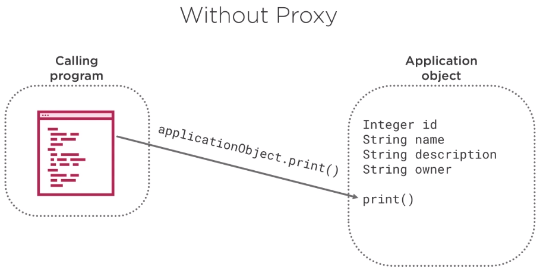
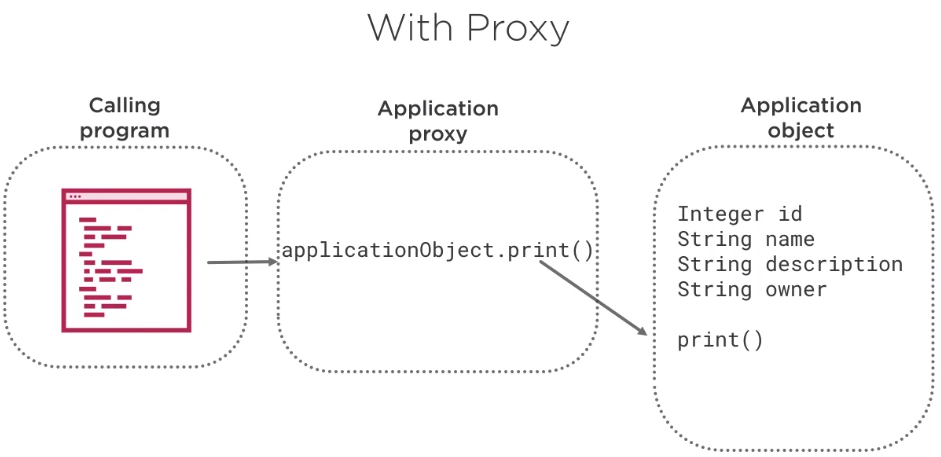

In this article, we will learn how to use @Transactional annotation to manage transaction with database in Spring Data JPA.

Let's get started.

<br>

## Table of contents
- [Aspect oriented programming](#aspect-oriented-programming)
- [Transactional Overview](#transactional-overview)
- [Transactional annotation](#transactional-annotation)
- [Transaction advice](#transaction-advice)
- [Rollback a declarative transaction](#rollback-a-declarative-transaction)
- [Wrapping up](#wrapping-up)


<br>

## Aspect oriented programming

Aspect oriented programming is a programming paradigm that breaks programming logic into distinct parts. Spring uses this paradigm when implementing transaction management. Transaction management in Spring is enabled via proxies.

But how it works when we're not using a proxy. When we call code, we invoke a method on an object reference. The method is invoked directly on that object reference.



However, when a proxy is used and we invoke a method directly on an object reference, the method is no longer invoked directly on that object reference, but instead on a reference to the proxy. And, as such, the proxy delegates to all of the interceptors relevant to that particular method call.



Specifically, the proxy uses a **transaction interceptor**, which intercepts method calls or indication of lifecycle events on the associated target class. This occurs in conjunction with an appropriate **platform transaction manager** to handle transactions.

The default advice mode for processing **@Transactional** annotations is proxy, which allows for interception of calls through the proxy only.

## Transactional Overview

For our case study, there are four components that make declarative transaction management work.
- The persistence context proxy
- The entity manager proxy
- The transactional aspect
- The platform transaction manager

Next, we will go over each one and see how they interact with each other.
- Entity Manager Proxy

    Entities are objects that live in a database and are managed by the entity manager. The entity manager defines the methods that are used to interact with the persistence context. So what is persistence context?

    The database transaction happens inside the scope of a persistence context. Each entity manager instance is associated with a persistence context, a set of manage entity that exist in a particular data store. A persistence context defines the scope under which particular entity instances are created, persisted, and removed.

- Transactional Aspect

    The transaction aspect manages transactions for any methods with the @Transactional annotation and uses a transaction interceptor, which intercepts method calls for an associated target class. It's important to note that the interceptor is called both before and after the method is invoked on the object reference.

    The transactional aspect has two main responsibilities.
    - First, at the before moment, it determines if the business method about to be called should run in the scope of an ongoing database transaction, or if a new transaction should be started.
    - Second, at the after moment, it decides if the transaction should be committed, rolled back, or left running.

- Transaction manager 

    The transaction manager abstraction, in this case, is Spring's platform transaction manager interface, and JPA transaction manager is the only implementation of that interface that understands JPA.

    The transaction manager is responsible for providing essential methods for controlling transaction operations at runtime like begin, commit, and rollback.


<br>

## Transactional annotation

The declarative transaction management uses the @Transactional annotation. The @Transactional annotation can be used at either the class or method level.

When placed on the class or interface level, all methods within it will become transactional. Method invocations override the class level annotation.

```java
@Service
@Transactional
public class ReleaseService implements IReleaseService {
    @Autowired
    private ITicketDAO ticketDAO;

    @Autowired
    private IReleaseDAO releaseDAO;

    @Override
    public void addRelease(Release release) {
        releaseDAO.addRelease(release);
    }
}
```

Spring recommends that we only annotate concrete class and methods of concrete class with @Transactional annotation as opposed to annotating interfaces. There are two ways to configure transactions in Spring.
- XML based, use xml files outside of the code to configure

- Annotation based, uses java annotations in the code to configure


<br>

## Transaction advice

The **@Transactional** annotation has several transactional parameters, also called the transaction advice.

1. propagation option

    ```java
    @Transactional(propagation= ...)
    ```

    The propagation parameter defines how transactions relate to each other.
    - The most commom options are REQUIRED.

        ```java
        @Transactional(propagation=Propagation.REQUIRED)
        ```

        The code will always run in a transaction or it creates a new transaction or reuses one if available. This is the default.

    - The other option is REQUIRES_NEW.

        ```java
        @Transactional(propagation=Propagation.REQUIRES_NEW)
        ```

        Code will always run in a new transaction suspending the current transaction if one exist.

    - The other option is NEVER

        ```java
        @Transactional(propagation=Propagation.NEVER)
        ```

        This means a method shouldn't be run within a transaction.

2. isolation option

    ```java
    @Transactional(isolation= ...)
    ```

    The isolation level of a transaction defines how data within transactions are available to other processes, users, and systems.
    - Isolation.READ_UNCOMMITTED

        ```java
        @Transactional(isolation=Isolation.READ_UNCOMMITTED)
        ```

        This allows dirty reads, which allows the transaction to read data written but not yet committed by other transactions.

    - Isolation.READ_COMMITTED

        ```java
        @Transactional(isolation=Isolation.READ_COMMITTED)
        ```

        This does not allow dirty reads.

    - Isolation.REPEATABLE_READ

        ```java
        @Transactional(isolation=Isolation.REPEATABLE_READ)
        ```

        If a row is read twice in the same transaction, the result will always be the same.

    - Isolation.SERIALIZABLE

        ```java
        @Transactional(isolation=Isolation.SERIALIZABLE)
        ```

        This performs all transactions in a sequence.

    The different levels have the different performance characteristics in a multithreaded application. This is also a default options that uses the transaction isolation level provided by the underlying implementation.

3. timeout option

    ```java
    @Transactional(timeout= ...)
    ```

    A timeout represents a timeout for the operation wrapped by the transaction. The transaction timeout defaults to the default timeout of the underlying transaction system or to none if timeouts are not supported.

    ```java
    @Transactional(timeout=5)
    ```

4. readOnly flag

    ```java
    @Transactional(readOnly= ...)
    ```

    We can set this flag to true when transactions don't need to write back to the database. The default of this is false.

    Setting the falg to true allows the underlying implementation to possibly optimize data access. When using JPA, this flag is only a hint for the persistence provider, and it will not necessarily cause failures of write access attempts. Its behavior is vendor dependent.

    The readOnly flag is only relevant inside of a transaction. If an operation occurs outside of a transactional context, the flag is simply ignored.

5. rollback rules

    ```java
    @Transactional(rollbackFor= ..., noRollbackFor=...)
    ```

    - rollbackFor option

        ```java
        @Transactional(rollbackFor=Exception.class)
        ```

        By default, rollback happens for runtime unchecked exceptions only. The checked exception does not trigger a rollback of the transaction. There's the rollBackFor option. This defines one or more exceptions that we want to trigger a rollback for. So if we throw an exception or a subclass of it, always use this parameter to tell Spring to roll back transactions if a checked exception occurs. 

    - rollbackForClassName option

        ```java
        @Transactional(rollbackForClassName={"Exception"})
        ```

        This defines one or more exceptions that we want to trigger a rollback for. We include the specific class name. The rollbackForClassName attribute actually provides a little more flexibility than the rollBackFor parameter.

    - noRollbackFor option

        ```java
        @Transactional(noRollbackFor=NoSuchElementException.class)
        ```

        This specifies the class name where rollbacks should not occur.

<br>

## Rollback a declarative transaction

Let's take a look at the steps to rollback transactions in a simple declarative transaction management.
- To trigger Spring to rollback a transaction, simply throw an exception from code that is currently executing in the context of a transaction.
- Spring catches any unhandled exceptions as it bubbles up the call stack.
- Spring makes a determination on whether or not to mark the transaction for rollback.

The configuration that allows us to define which exception types mark a transaction for rollback including checked exceptions.

```java
public interface IReleaseDAO extends JpaRepository<Release, Long> {}
public interface ITicketDAO extends JpaRepository<Ticket, Long> {}
public interface IApplicationDAO extends JpaRepository<Application, Long> {}

@Service
@Transactional(noRollbackFor=NoSuchElementException.class)
public class ReleaseService implements IReleaseService {
    @Autowired
    private ITicketDAO ticketDAO;

    @Autowired
    private IReleaseDAO releaseDAO;

    @Override
    public void addRelease(Release release) {
        this.releaseDAO.save(release);
    }

    @Override
    public Optional<Release> getRelease(int releaseId) {
        return this.releaseDAO.find(releaseId);
    }

    @Override
    public Release scheduleRelease(Release release) {
        // Transaction consists of two steps:
        // 1. Assign a ticket to an existing release as one database transaction
        // 2. Update the status of existing tickets to deployed status as 

        createTickets(release);
        assignTicketsToRelease(release.getId(), release.getTickets());

        return release;
    }

    private void createTickets() {
        release.getTickets().forEach(ticket -> {
            this.ticketDAO.save(ticket);
        });
    }
}
```

<br>

## Benefits and drawbacks
1. Benefits

    - allows developer manage transactions via configuration and annotations, and it's less flexible.

    - It does allow developers to separate transaction logic from business logic.

    - easy to maintain. Boilerplate code is kept away from the business logic.

    - it's preferred when a lot of transaction logic.

2. Drawbacks


<br>

## Wrapping up
- How to use @Transactional annotation with specific attributes such as propagation, isolation, timeout, readOnly, and rollback rules.


<br>

Refer:

[Data Transactions with Spring](https://app.pluralsight.com/library/courses/data-transactions-spring/table-of-contents)