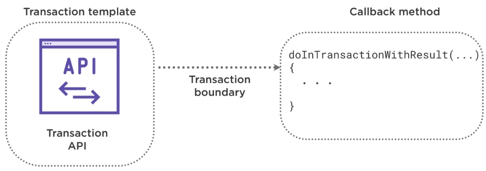

In this article, we will learn how to write code ourself to work with transactions in Spring Data JPA.

Let's get started.

<br>

## Table of contents
- [Introduction to programmatic transaction management](#introduction-to-programmatic-transaction-management)
- [Transaction template](#transaction-template)
- [Transaction settings](#transaction-settings)
- [Benefits and Drawbacks](#benefits-and-drawbacks)
- [The comparison between programmatic and declarative transaction management](#the-comparison-between-programmatic-and-declarative-transaction-management)
- [Wrapping up](#wrapping-up)

<br>

## Introduction to programmatic transaction management

With programmatic transaction management, the Spring framework provides two means of programmatic transaction management.
- Using the transaction template, which is similar to Spring templates, like JdbcTemplate and other available templates.

- Using a platform transaction manager, which handles transactions across Hibernate, JDBC, JPA, JMS, etc.

Now transaction template is recommended over using a platform transaction manager because it handles more of the transaction details for us.


<br>

## Transaction template

The **TransactionTemplate** class simplifies programmatic transaction execution by wrapping the transaction manager API and providing a template method around which a transactional boundary is started. After the callback method concludes, the transaction is committed.



```java
public void doInTransactionWithoutResult(TransactionStatus status) {
    try {
        createTickets(release);
        assignTicketsToRelease(release.getId(), release.getTickets());
    } catch(NoSuchElementException ex) {
        ex.printStackTrace();
    }
}

public Object doInTransactionWithResult(TransactionStatus status) {
    // ...
}
```

A transaction template exposes its functionality via a callback method. One implementation does not have a return type. That's **doInTransactionWithoutResult()** method, and the other has a return type - **doInTransactionWithResult()** method.


<br>

## Transaction settings

As with declarative transaction management, we can specify transaction settings such as the propagation mode, the isolation level, and the timeout, etc. This can be setup in the constructor.

```java
public ReleaseService(PlatformTransactionManager transactionManager) {
    this.transactionTemplate = new TransactionTemplate(transactionManager);
    this.transactionTemplate.setPropagationBehaviorName("PROPAGATION_REQUIRES_NEW");
    this.transactionTemplate.setReadOnly(true);
}
```

In order to rollback data when having exception or similar things, we can do like the following code:

```java
public void doInTransactionWithoutResult(TransactionStatus status) {
    try {
        createTickets(release);
        assignTicketsToRelease(release.getId(), release.getTickets());
    } catch(NoSuchElementException ex) {
        status.setRollbackOnly();
    }
}
```

The TransactionStatus class represents the status of transaction. Transactional code can use this to retrieve status information and to programmatically request a rollback like we have done in the above code. The TransactionTemplate will trigger a transaction rollback if the callback code throws a runtime exception or if it sets the transaction to RollbackOnly via the TransactionStatus argument to the callback method. Otherwise, it will automatically commit the transaction. The TransactionStatus object is used to roll back the transaction. This is caused by calling setRollbackOnly().

If the **doInTransactionWithoutResult()** method completes successfully, then the transaction will be committed.

```java
@Service
public class ReleaseService implements IReleaseService {
    @Autowired
    private ITicketDAO ticketDAO;

    @Autowired
    private IReleaseDAO releaseDAO;

    private final TransactionTemplate transactionTemplate;

    public ReleaseService(PlatformTransactionManager transactionManager) {
        this.transactionTemplate = new TransactionTemplate(transactionManager);
    }

    @Override
    public Release scheduleRelease(Release release) {
        this.transactionTemplate.execute(new TransactionCallbackWithoutResult() {
            public void doInTransactionWithoutResult(TransactionStatus status) {
                try {
                    createTickets(release);
                    assignTicketsToRelease(release.getId(), release.getTickets());
                } catch(NoSuchElementException ex) {
                    status.setRollbackOnly();
                }
            }
        });
    }
}
```

<br>

## Benefits and Drawbacks
1. Benefits

    - manage transactions via code that give developers complete control.

    - it's also useful when we have minimal transaction logic.

    - flexible but difficult to maintain.

2. Drawbacks

    - it creates our code boilerplate at times.

    - couples transaction and business logic.

<br>

## The comparison between programmatic and declarative transaction management

When we need fine-grained control over transactions, and we have a small number of transactional operations, use programmatic transaction management.

Let's talk about another method of programmatic transaction management that Spring provides, the PlatformTransactionManager.

Let's take a look at the code of declarative transaction management.

```java
@Service
@Transactional
public class ReleaseService implements IReleaseService {
    public Release scheduleRelease(Release release) {
        createTickets(release);
        assignTicketsToRelease(release.getId(), release.getTickets());

        return release;
    }
}
```

This declarative code is very simple as it handles transaction management for developers. This makes our code very easy to maintain and evolve. This is why the Spring team recommends this approach over programmatic transaction management.

Now there are times when programmatic transaction management and the flexibility that comes along with it is needed. We've seen using the transaction template. Now, let's look at another method using the PlatformTransactionManager directly.

```java
@Autowired
private PlatformTransactionManager transactionManager;

public Release scheduleRelease(Release release) {
    TransactionDefinition transactionDefinition = new DefaultTransactionDefinition();
    TransactionStatus transactionStatus = transactionManager.getTransaction(transactionDefinition);
    try {
        createTickets(release);
        assignTicketsToRelease(release.getId(), release.getTickets());
        transactionManager.commit(transactionStatus);
    } catch(RuntimeException ex) {
        transactionManager.rollback(transactionStatus);
        throw e;
    }

    return release;
}
```

With **PlatformTransactionManager**, we find that we have even more control over transactions than when using the other programmatic method **transactionTemplate**. We decide when to start a transaction, commit, or rollback.

We ask transactionManager to start a new transaction with that definition by calling the **getTransaction()** method. The return value is a **TransactionStatus** object to keep track of the **transactionStatus**. If the transaction is succesful, we will ask the **transactionManager** to commit this transaction by passing in the **transactionStatus**. If there is an error during the process, the **scheduleRelease()** method will throw a RuntimeException, in which case we will catch the exception and rollback the transaction.


<br>

## Wrapping up


<br>

Refer:

[Data Transactions with Spring](https://app.pluralsight.com/library/courses/data-transactions-spring/table-of-contents)