In this article, we will learn how topic works in Kafka. This knowledge about topic is really important when we want to work with Kafka.

Let's get started.

 

## Table of contents
- [Introduction to record and topic](#introduction-to-record-and-topic)
- [Delete topic operation](#delete-topic-operation)
- [Compact topic operation](#compact-topic-operation)
- [Partitions](#partitions)
- [Wrapping up](#wrapping-up)

 

## Introduction to record and topic

The data saved in each Kafka cluster is called records. Just as a regular message, a record consists of three parts, a key, a value and a timestamp.

Both the key and value can be represented by any type of information. It can be a string , a number, or even an object. The default limit for the size of a message is 1 MB but we should always structure our message in order to be sent and retrieved efficiently.

The timestamp represents the number when the message has been produced. If we don't specify a timestamp manually, then the producer will do it for us.

All the messages transmitted in an enterprise can be catgorized to make them easier to track and process. A category of messages is represented by a topic.

Topics are stored in a broker, but list of all topics is managed by the zookeeper. Based on the way the broker is sending the data, there are two types of topic, delete and compact.

 

## Delete topic operation

Delete topic is deleting the data based on some factors. The first factor is the size. If the topic grows too big, the broker will start to delete old messages, cleaning up space.

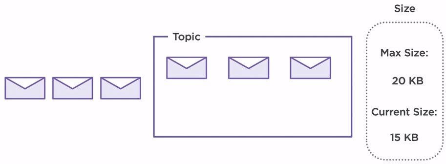

In this scenario, our maximum size of our topic is set to 20KB. Each message has 5KB, so in our topic, we can store a maximum of 4 messages at a time. When new messages arrive on the system, older ones are deleted ensuring the capability of the broker to receive new messages. By default, there is no size limit set to topic configuration.

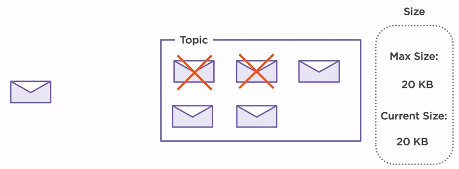

The second factor that can result in deleting a message inside the broker is time. By default, a broker is configured to store messages for seven days, and then it deletes them.

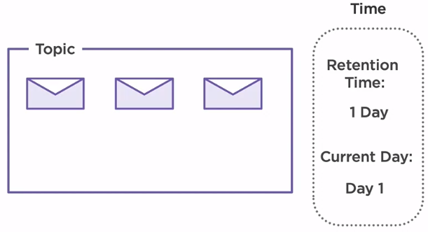

In our scenario, we have set the retention time to one day. As we can see, we have already produced some messages on day one. On day two, all three messages are deleted and no longer available.

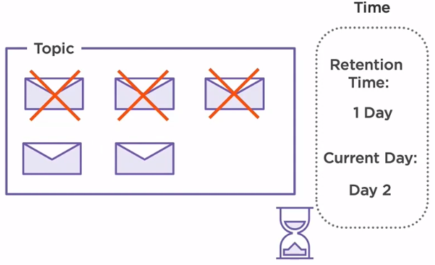

Two more messages are produced on the same day, but since the broker is able to retain them for only one day, on day three, the messages produced on the second day are now deleted.

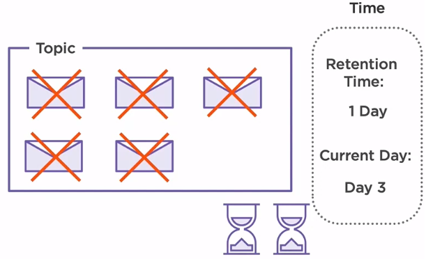

 

## Compact topic operation

The other option when it comes to handling data inside our broker is by using compaction topics. They work a bit differently compared to delete topics by mimicking the upsert functionality from a database. Upsert is the abbreviation for update/insert.

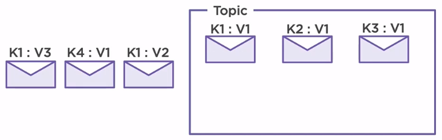

When a new message is produced on a topic, the broker will check if another message with the same key already exists in there. In case it does, it will update the old record. Otherwise, it will just insert the new one.

Let's consider that we have already produced three messages inside our topic. Each message has a different key, K1, K2 and K3, but the same value. When a new message with the same key, K1 is produced, the old value gets updated, V1 becomes V2.

If a message with a different key is produced, then it will simply insert it without affecting the others. The process repeats for every new message that is produced.

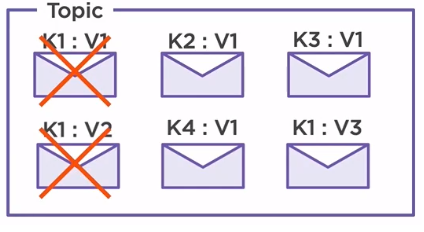

 

## Partitions

Apache Kafka is a distributed system, so we need a way to spread the load evenly across multiple brokers and also replicate the data inside of topics. The way that Kafka solves this problem is by using partitions.

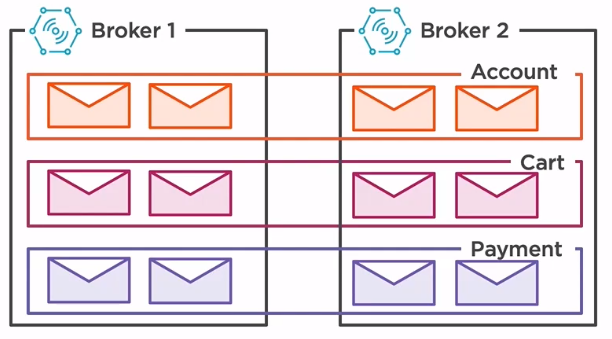

**The same topic is split into multiple partitions, each partition is living in a separate broker**. Of course, in case that the number of partions is bigger than the number of brokers, multiple partitions will reside on the same broker. The most important thing to remember is that **each partition will store different messages**. In other words, the same message will not exist in different partitions unless it has been produced multiple times.

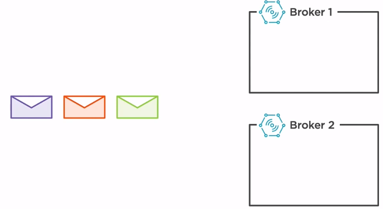

In this current setup, we have two partitions, partition 0, which resides in broker 1, and partition 1 which resides in broker 2. When new messages are arriving, if we do not have a custom partitioning strategy, then the broker will spread the messages evenly. The green message will be stored in partition 0 while the orange message is stored in partition 1.

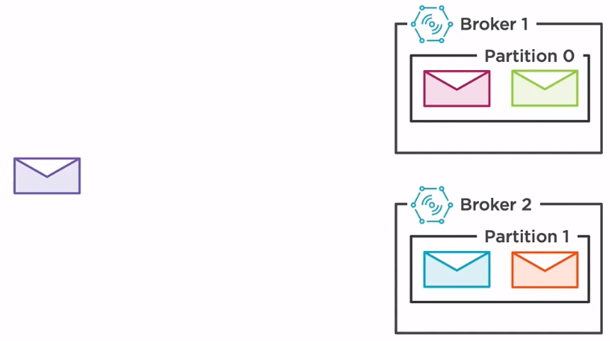

Having a higher number of partitions solves splitting the load across the brokers, but what about failures? How can we ensure the safety of our data if a broker goes down?

The answer is replicated partitions. Just as before, our topic is split into two partitions, but now two extra partitions have been added. These partitions are replicas of the original ones, thus ensuring the integrity of our data if one of our broker goes down. When a new message is produced on partition 0 on broker 1, a copy of that message will be automatically sent to the other broker on the replicated partition. The same operation happens if a message is produced on broker 2. This process will ensure that all the messages can be recovered if one of the two brokers fails.

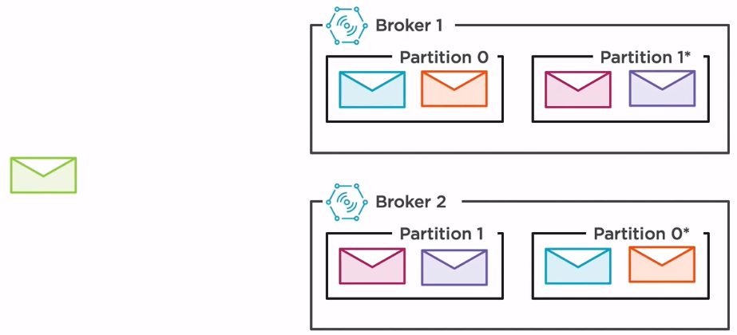

 

## Wrapping up
- There are two types of topic

    - delete topic
    - compact topic

- The same topic is split into multiple partitions, each partition is living in a separate broker. Each partition will store different messages.

 

Refer:

[Kafka - The definitive guide ebook]()

[Designing Event-driven Applications Using Apache Kafka Ecosystem by Bogdan Sucaciu](https://app.pluralsight.com/library/courses/designing-event-driven-applications-apache-kafka-ecosystem/table-of-contents)