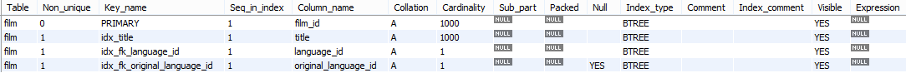

To improve the speed of accessing a database, one way that you can think about is to use index. The internal detail of using indexes is relevant to the B+ Tree. To understand deeply about using indexes, you can practice to make B+ tree at this [link](https://ducmanhphan.github.io/2019-01-22-B+-tree).

Using too many indexes is to make your database that is accessed data slow down when utilizing some operations such as insertion, update, deletion. In this article, we will learn how to use index correctly in MySQL.


## Table of Contents
- [Types of Indexes in MySQL](#types-of-indexes-in-mysql)
- [Some operations that we need to use index](#some-operations-that-we-need-to-use-index)
- [Benefits and Drawbacks](#benefits-and-drawbacks)
- [Wrapping up](#wrapping-up)

<br>

## Types of Indexes in MySQL

There are different types of indexes in relational theory. Each index is designed to achieve a different goal. Old indexes, which we are implemented at the database storage level instead of database server level, hence, each index is different from each other and there is no single way to implement indexes in MySQL. In simple words, the inner workings for each index are quite different from each other.

Belows are some types of indexes that we need to know.
- B-Tree index

    To know more about B-Tree Index in MySQL, we can read our article [Understanding about B-Tree Index in RDBMS](http://ducmanhphan.github.io/2020-10-15-Understanding-about-B-Tree-index-in-RDBMS).

- Clustered index

    To know more about Clustered Index in MySQL, we can read our article [Understanding about Clustered Index in RDBMS](http://ducmanhphan.github.io/2020-04-12-Understanding-about-clustered-index-in-RDBMS).

- Hash index

    To know more about Hash Index in MySQL, we can read our article [Understanding about Hash Index in RDBMS](http://ducmanhphan.github.io/2020-10-20-Understanding-about-Hash-index-in-RDBMS).

- Other index types

    - Spatial Indexes

        - MyISAM supports spatial indexes. However, MySQL GIS support is not exhaustive, hence, there is not much of the interruption of spatial indexes in MySQL.

    - Full text indexes

        - Just like search engines, they find key words in our texts. They use different kinds of operators to search any data.
        - Full text index is supported by MyISAM.

    - Other types

        - TokuDB - Fractal Tree Indexes.
        - ScaleDB - Patricia tries
        - InfiniDB - Special Logic

<br>

## Indexing strategies for high performance

Indexes are called keys in MySQL. They are data structure that storage engines use to find rows quickly, leading to better performance for our queries. They are very important for higher performance when our data is large.

Indexes are often misunderstood. So poor indexing can cause lots of performance problems. Indexes can improve performance by many orders of magnitude. Let's look at some of the cases where indexes can be helpful.
- Indexes help to find rows matching a WHERE clause.
- Eliminate rows by opting for the most selective index.
- Retrieving rows from other table while joining multiple tables.
- Finding MIN() or MAX() value.
- Sort or group table.
- Reduce I/O bottleneck by using Covering Index.

Belows are some common things that we will use in MySQL to interact with our database. We will use default **sakila** database.

1. List indexes

    In order to get list of indexes in our database, we can use following commands:

    ```sql
    SHOW INDEX FROM film FROM sakila;
    SHOW INDEX FROM film;

    SELECT * FROM INFORMATION_SCHEMA.STATISTICS
    ```

    So, we will have our result:

    

2. Create index

    ```sql
    -- Create index
    CREATE INDEX idx_film_length ON film(length);

    -- Query using index
    SELECT film_id, length FROM film WHERE length = 100;

    -- Explain index usage
    EXPLAIN SELECT film_id, length FROM film WHERE length = 100;
    ```

    When using explain command, we have:

    

    - The 1st column is **id**. It's just a select identifier.
    - The 2nd column is **select_type**. There can be various different select types.

        For example:
        - SIMPLE, a simple query of SELECT command.
        - UNION, indicates there is a UNION used in the SELECT query.
        - If there is a sub-query used in our SELECT statment, the select_type would SUB_QUERY.

    - The 3rd column is **table**. It indicates the table for output row.
    - The 4th column is **type**, that indicates the type of join.

        In this case, the type of join is ref. It means that all rows with a matching index value are read from this table for each combination of rows from the previous table. That means all the rows with matching index values are returned in this query.

    - The 5th column is **possible_keys**. It indicates which indexes MySQL can choose from to find the rows in the table.

        This column is totally independent of the order of the tables as displayed in the output from EXPLAIN. This means that some of the keys in **possible_keys** might not be usable in practice with generated table order. If this column is null, there are no relevant index.

    - The 6th column is **key**. It's a very important column. That **key** that MySQL actually decided to use, the **possible_keys**, was just an indication. However, the key column is the actual key used to retrieve the results. In other words, if MySQL decides to use one of the possible keys indexes to look up rows, that index is listed as the key value.

        In some of the cases, it's quite possible key will name an index that is not present in the possible key values. This can happen if none of the possible keys indexes are suitable for lookup rows, but all the columns selected by query are columns of the other index.

    - The 7th column is **key_len**. It indicates the length of the key that MySQL decided to use.

    - The 8th column is **ref** that shows which columns or constants are compared to the index named in the key column to select rows from the table.

    - The 9th column is **rows** that indicates the number of rows MySQL believes it must examine to execute the query.

        Remember, in InnoDB engine, this number is an estimate and may not be the exact number of the rows written by the query.

    - The final column is **Extra** that contains additional information about how MySQL resolves the query. In our case, it suggests using index. That means the column information is retrieved from the table using only information in the index tree without having to do an additional seek to read the actual row.

    In InnoDB storage engine, when we create a primary key on any column, InnoDB storage engine will automatically create clustered indexes on that column. Hence, there is a clustered index on column film_id. It means that a column film_id will be included as a pointer in all the other secondary indexes.

3. Delete index

    ```sql
    DROP INDEX idx_film_length ON film;
    ```

<br>

## Some operations that we need to use index

MySQL uses indexes for these operations:
- To find the rows matching a **WHERE** clause quickly.

- To eliminate rows from consideration. If there is a choice between multiple indexes, MySQL normally uses the index that finds the smallest number of rows (the most selective index).

- If the table has a multiple-column index, any leftmost prefix of the index can be used by the optimizer to look up rows. For example, if you have a three-column index on **(col1, col2, col3)**, you have indexed search capabilities on **(col1)**, **(col1, col2)**, and **(col1, col2, col3)**.

- To retrieve rows from other tables when performing joins. MySQL can use indexes on columns more efficiently if they are declared as the same type and size. In this context, **VARCHAR** and **CHAR** are considered the same if they are declared as the same size. For example, **VARCHAR(10)** and **CHAR(10)** are the same size, but **VARCHAR(10)** and **CHAR(15)** are not.

    For comparisons between nonbinary string columns, both columns should use the same character set. For example, comparing a utf8 column with a latin1 column precludes use of an index.

    Comparison of dissimilar columns (comparing a string column to a temporal or numeric column, for example) may prevent use of indexes if values cannot be compared directly without conversion. For a given value such as 1 in the numeric column, it might compare equal to any number of values in the string column such as '1', ' 1', '00001', or '01.e1'. This rules out use of any indexes for the string column.

- To find the **MIN()** or **MAX()** value for a specific indexed column key_col. This is optimized by a preprocessor that checks whether you are using **WHERE key_part_N = constant** on all key parts that occur before key_col in the index. In this case, MySQL does a single key lookup for each **MIN()** or **MAX()** expression and replaces it with a constant. If all expressions are replaced with constants, the query returns at once. For example:

    ```sql
    SELECT MIN(key_part2),MAX(key_part2)
    FROM tbl_name WHERE key_part1=10;
    ```

- To sort or group a table if the sorting or grouping is done on a leftmost prefix of a usable index (for example, **ORDER BY key_part1, key_part2**). If all key parts are followed by **DESC**, the key is read in reverse order.

- In some cases, a query can be optimized to retrieve values without consulting the data rows. (An index that provides all the necessary results for a query is called a covering index.) If a query uses from a table only columns that are included in some index, the selected values can be retrieved from the index tree for greater speed:

    ```sql
    SELECT key_part3 FROM tbl_name
    WHERE key_part1=1
    ```

Indexes are less important for queries on small tables, or big tables where report queries process most or all of the rows. When a query needs to access most of the rows, reading sequentially is faster than working through an index. Sequential reads minimize disk seeks, even if not all the rows are needed for the query.

<br>

## Benefits and Drawbacks
1. Benefits

    - Indexes improve query performance greatly in most of the cases.
    - Indexes reduces the random I/O of the storage system by converting it to sequential I/O whenever possible.
    - Indexes improves performance by avoiding sorting, using temporary tables and reducing additional network traffic.

<br>

## Wrapping up


<br>

Refer:

[MySQL Indexing for Performance by Pinal Dave](https://app.pluralsight.com/library/courses/mysql-indexing-performance/table-of-contents)

[PostgreSQL: Index Tuning and Performance Optimization by Pinal Dave](https://app.pluralsight.com/library/courses/postgresql-index-tuning-performance-optimization/table-of-contents)

[https://dev.mysql.com/doc/refman/5.7/en/mysql-indexes.html](https://dev.mysql.com/doc/refman/5.7/en/mysql-indexes.html)

[https://techtalk.vn/ly-do-khien-uber-phai-chuyen-tu-postgres-sang-mysql.html](https://techtalk.vn/ly-do-khien-uber-phai-chuyen-tu-postgres-sang-mysql.html)

[https://dev.mysql.com/doc/refman/5.7/en/index-merge-optimization.html](https://dev.mysql.com/doc/refman/5.7/en/index-merge-optimization.html)

[https://planet.mysql.com/entry/?id=661727](https://planet.mysql.com/entry/?id=661727)

[https://techtalk.vn/nhung-kien-thuc-giup-website-cua-ban-nhanh-len-gap-n-lan.html](https://techtalk.vn/nhung-kien-thuc-giup-website-cua-ban-nhanh-len-gap-n-lan.html)

[https://www.slideshare.net/billkarwin/how-to-design-indexes-really](https://www.slideshare.net/billkarwin/how-to-design-indexes-really)

[https://cstack.github.io/db_tutorial/parts/part7.html](https://cstack.github.io/db_tutorial/parts/part7.html)

[https://dzone.com/articles/database-btree-indexing-in-sqlite](https://dzone.com/articles/database-btree-indexing-in-sqlite)

[https://use-the-index-luke.com/sql/anatomy/the-tree](https://use-the-index-luke.com/sql/anatomy/the-tree)

[https://www.geeksforgeeks.org/indexing-in-databases-set-1/](https://www.geeksforgeeks.org/indexing-in-databases-set-1/)

[http://coding-geek.com/how-databases-work/#Tree_and_database_index](http://coding-geek.com/how-databases-work/#Tree_and_database_index)

[https://chartio.com/learn/databases/how-does-indexing-work/](https://chartio.com/learn/databases/how-does-indexing-work/)

[http://www.mysqltutorial.org/mysql-index/mysql-use-index/](http://www.mysqltutorial.org/mysql-index/mysql-use-index/)

[http://www.mysqltutorial.org/mysql-index/mysql-index-cardinality/](http://www.mysqltutorial.org/mysql-index/mysql-index-cardinality/)

[https://gravitymodel.net/database-indexing-archiving-purging/](https://gravitymodel.net/database-indexing-archiving-purging/)

<br>

**How MySQL indexes works internally**

[https://guide.couchdb.org/draft/btree.html](https://guide.couchdb.org/draft/btree.html)

[https://stackoverflow.com/questions/3567981/how-do-mysql-indexes-work](https://stackoverflow.com/questions/3567981/how-do-mysql-indexes-work)