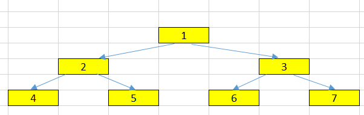
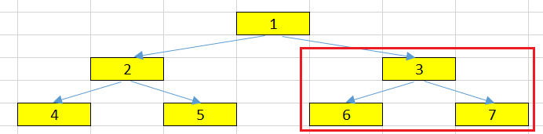

<br>

## Table of contents
- [Given problem](#given-problem)
- [Node of a Tree](#node-of-a-tree)
- [Degree of a Node](#degree-of-a-tree)
- [Edge, Path, and Distance](#edge,-path,-and-distance)
- [Depth, Level, Height, and Width](#depth,-level,-height,-and-width)
- [Wrapping up](#wrapping-up)

<br>

## Given problem

Given a tree that looks like an below image.



In this article, we will understand some common concepts such as:
- Node and some things around it.
- Degree
- Edge
- Path
- Distance
- Depth
- Level
- Height
- Width

<br>

## Node of a Tree

A node is a structure which may contain a value or condition, or represent a separate data structure.

In an above image, we can have some nodes:


Normally, in binary tree, we can define a node like that.

```java
class TreeNode {
    int value;
    TreeNode left;
    TreeNode right;
}
```

Belows are some concepts that are relevants to a Node.
1. Root node

    The top node in a tree, the prime ancestor.

    For example, our root node in an above tree is ```1```.

2. Child node

    A node directly connected to another node when moving away from the root, an immediate descendant.

    For example, ```2``` and ```3``` are the child nodes of the ```root node``` - ```1```.

3. Parent node

    The converse notion of a child, an immediate ancestor.

    For example, **1** is the **parent node** of two child nodes: **2** and **3**.

4. Sibling nodes

    A group of nodes with the same parent.

    For example, **2** and **3** are the sibling nodes. They have the same parent node - **1**.

5. Descendant node

    A node reachable by repeated proceeding from parent to child. Also known as subchild.

    For example, 3, 7, and 6 are descendant nodes of 1.

    

6. Ancestor node

    A node u is an ancestor of a node v if v is contained in the subtree rooted at u; we may write equivalently that v is a descendant of u.

    For example, 1 is an ancestor node for every node such as 2, 3, 4, 5, 6, and 7.

7. Leaf node

    A node with no children.

    For example, 4, 5, 6 and 7 are leaf nodes in our tree.

    


<br>

## Degree of a Node

For a given node, it's the number of children. A leaf is necessarily degree zero.

The degree of a tree is the maximum degree of a node.

For example:
- the degree of node 1 is 2 because it has two nodes: 2 and 3.
- the degree of an above tree is 2.


<br>

## Edge, Path, and Distance

1. Edge 
    
    Edge is the connection between one node and another.

    

2. Path

    Path is a sequence of nodes and edges connecting a node with a descendant.

    Path includes all nodes and all edges along the path, not just edges.

    For example, the path between two nodes 4 and 5 is: **4 --> 2 --> 5**.

    

3. Distance

    The number of edges along the shortest path between two nodes.

    For example, the distance between 4 and 5 is 2.

    

<br>

## Depth, Level, Height, and Width

1. Depth

    The distance between a node and the root.

    **The depth of the root node is 0.**

    For example, the depth of 5 node is 2.

    

2. Level

    The level of a node is defined by 1 + the number of edges between the node and the root.

    Below is the relationship between Level and Depth concepts.

    ```java
    Level = Depth + 1
    ```

    **The level of root node is 1.**

    For example, the level of 6 node in an above tree is 3.

    Below is the source code that calculates the maximum level of binary tree.

    We use [top-down recursive version](https://ducmanhphan.github.io/2020-01-20-How-to-solve-tree-problems-recursively/) for this problem because:
    - the starting point is the root node.
    - we know that the level of root node is 1.

    ```java
    public class MaxLevelTree {

        private static int maxHeight = Integer.MIN_VALUE;

        private static void getMaxLevelTopDown(TreeNode root, int level) {
            if (root == null) {
                return;
            }

            if (root.left == null && root.right == null) {
                maxHeight = Math.max(maxHeight, level);
            }

            getMaxLevelTopDown(root.left, level + 1);
            getMaxLevelTopDown(root.right, level + 1);
        }
    }
    ```

3. Height

    The height of a node is the number of edges on the longest downward path between that node and a leaf.

    For example:
    - the height of root node is 2.
    - the height of 2 node is 1.

    Below is the source code to calculate the height of binary tree. We will use [bottom-up recursive version](https://ducmanhphan.github.io/2020-01-20-How-to-solve-tree-problems-recursively/) because:
    - if the node is null, then its height is -1.
    - the leaf node's height is 0.
    - It means that we have sufficient information about the height of the children nodes.

    ```java
    public static int getHeightTree(TreeNode root) {
        if (root == null) {
            return -1;
        }

        int leftHeight = getMaxLevelBottomUp(root.left);
        int rightHeight = getMaxLevelBottomUp(root.right);

        return Math.max(leftHeight, rightHeight) + 1;
    }
    ```

4. Width

    The number of nodes in a level.

    For example:
    - at the level = 2, we have two nodes such as 2 and 3.

        

    - at the level = 3, we have four nodes.

        


<br>

## Wrapping up

- With depth and level concept, remember that it compares with the root node.

- With height concept, it compares with the leaf node.


Refer:

[https://en.wikipedia.org/wiki/Tree_%28data_structure%29](https://en.wikipedia.org/wiki/Tree_%28data_structure%29)

[https://www.cs.yale.edu/homes/aspnes/pinewiki/BinaryTrees.html?highlight=%28CategoryAlgorithmNotes%29](https://www.cs.yale.edu/homes/aspnes/pinewiki/BinaryTrees.html?highlight=%28CategoryAlgorithmNotes%29)