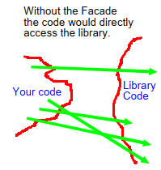
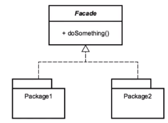

In this article, we will learn how to use Facade pattern and how to apply it in our project.

Let's get started.


<br>

## Table of contents
- [Given Problem](#given-problem)
- [Solution of Facade Pattern](#solution-of-facade-pattern)
- [When to use](#when-to-use)
- [Benefits & Drawback](#benefits-&-drawback)
- [Contrast to Other patterns](#contrast-to-other-patterns)
- [Code C++ /Java / Javascript](#code-c++-java-javascript)
- [Application & Examples](#application-&-examples)
- [Wrapping up](#wrapping-up)


<br>

## Given Problem 

In our Java project, we usually utilize the other libraries such as HttpURLConnect, JDBC, ... Normally, we will use directly classes of their libraries in many places. The more we use it, the more bigger our code have. It also creates the boilerplate code or redundancy something.

So, the Single Responsibility Principle do not satisfy.



Therefore, our problem will need a concentrated class that manage all relationships with other library.

<br>

## Solution of Facade Pattern

The Facade pattern provides a simplified interface to a complex or difficult to use system that is often the result of a poorly designed API.

The design of the Facade pattern is quite simple. It is a class that utilizes typically just composition in its design. We shouldn't have a need for inheritance. The Facade pattern encompasses the entire life cycle of whatever object we're dealing with, but it doesn't necessarily have to be considered a correct usage of this pattern.

Below is a UML diagram of the Facade pattern.



There really isn't a standard UML diagram for the facade pattern because the Facade pattern typically wraps whatever other API we're working with. Simply stated though, the Facade pattern contains other classes, and this is the basis for this diagram. We have a Facade class that does something or some operations, and it contains usually through composition multiple other packages or APIs that it's providing a simpler interface for end-users.

<br>

## When to use

- When we are encountering the complex system.

- When we want to decouple between other systems.

There are some specific situations that the Facade pattern can be used.
- access to a database.
- access to I/O device, for example, webcam, sound card.
- file I/O
- using visualization libraries
- using other libraries, ...

<br>

## Benefits & Drawback
1. Benefits

    - It's a higher-level interface.

    - It makes an API easier to use, oftentimes we will encounter a poorly designed API. We can wrap a facade around it to hide the details from the client.

    - It also helps to reduce dependencies on outside code, reduce complexity. It means that this facade pattern promotes weak coupling between our application with the other subsystems that we need to use.

    - It will simplify the interface or client usage. We typically want to wrap the complex code with an interface using this facade to make it simpler for the end-user.

    - It should also be thought of as a refactoring pattern. We usually want to implement a facade to wrap a poorly or complex written API.

2. Drawbacks

    - adds a layer of indirection which may affect performance.

    - may make our code bigger.

    - our developer will need to learn to use this API.

<br>

## Contrast to Other patterns

- The comparison between the Adapter pattern and the Facade pattern.

    - With the Facade pattern

        - It simplifies an interface.
        - It works with typically just composites.
        - It provides a cleaner API to something that was designed incorrectly or complex to begin with.

    - With the Adapter pattern

        - It's also a refactoring pattern and it's similar to the Facade pattern.
        - It modifies behaviors and typically add behavior to an object.
        - So with the Facade pattern, we're just trying to clean up its usage where the Adapter pattern is adding behavior to the object that we're working with.
        - It also provides a different interface to code. So, the Adapter pattern is trying to bring an API or an interface up to something more current in our application, where the Facade pattern is just easier to work with.

<br>

## Code C++ /Java / Javascript

In this section, we will use the Facade pattern with JDBC.

```java
public class JdbcFacade {

    DbSingleton instance = null;

    public JdbcFacade() {
        instance = DbSingleton.getInstane();
    }

    public int createTable() {
        int count = 0;
        try {
            Connection conn = instance.getConnection();
            Statement sta = conn.createStatement();
            count = sta.executeUpdate("CREATE TABLE Address (ID INTEGER, StreetName VARCHAR(20), City VARCHAR(20))");
            sta.close();
            conn.close();
        } catch (Exception ex) {
            ex.printStackTrace();
        }

        return count;
    }

    public int insertIntoTable() {
        int count = 0;
        try {
            Connection conn = instance.getConnection();
            Statement sta = conn.createStatement();
            count = sta.executeUpdate("INSERT INTO Address (ID, StreetName, City) VALUES(1, '1234 Some Street', 'VN')");
            sta.close();
            conn.close();
        } catch (Exception ex) {
            ex.printStackTrace();
        }

        return count;
    }

    public List<Address> getAddress() {
        List<Address> addresses = new ArrayList<>();
        try {
            Connection conn = instance.getConnection();
            Statement sta = conn.createStatement();
            ResultSet rs = sta.executeQuery("SELECT * FROM Address");

            while (rs.next()) {
                System.out.println(rs.getString(1) + " " + rs.getString(2) + " " + rs.getString(3));
                Address address = new Address();
                address.setId(rs.getString(1));
                address.setStreetName(rs.getString(2));
                address.setCity(rs.getString(3));

                addresses.add(address)
            }

            rs.close();
            sta.close();
            conn.close();
        } catch (Exception ex) {
            ex.printStackTrace();
        }

        return addresses;
    }
}

@Data
@AllArgsConstructor
@NoArgConstructor
class Address {
    private String id;
    private String streetName;
    private String city;
}
```

<br>

## Application & Examples

- Some examples in Java

    - java.net.URL

        Below is the segment of code that we use URL to do something.

        ```java
        public static void main(String[] args) {
            URL url = new URL("http", "...", 80, "/author/...");
            BufferedReader in = new BufferedReader(new InputStreamReader(url.openStream()));

            String inputLine;
            while ((inputLine = in.readLine()) != null) {
                System.out.println(inputLine);
            }
        }
        ```

        The URL class is an interesting example of the Facade pattern. It's doing a lot of stuff here, opening and closing connections, making sure we've got things formatted the right way, handling streams on the backend, ...

    - javax.faces.context.FacesContext
        
        Now, Faces is part of the J2EE pattern, Faces has a fairly complex API, and interacting with the context can be quite difficult. So this is an great example of the Facade pattern.

<br>

## Wrapping up
- It simplifies the client interface.
- It hides the complexity of something and make them easier to use.


<br>

Thanks for your reading.

<br>

Refer: 

[Design Patterns in Java: Structural by Bryan Hansen](https://app.pluralsight.com/library/courses/design-patterns-java-structural/table-of-contents)

[https://medium.com/swlh/structural-design-pattern-facade-c6157dbbd025](https://medium.com/swlh/structural-design-pattern-facade-c6157dbbd025)

[https://medium.com/@andreaspoyias/design-patterns-a-quick-guide-to-facade-pattern-16e3d2f1bfb6](https://medium.com/@andreaspoyias/design-patterns-a-quick-guide-to-facade-pattern-16e3d2f1bfb6)