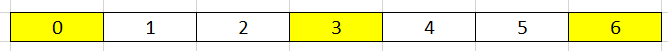
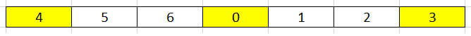
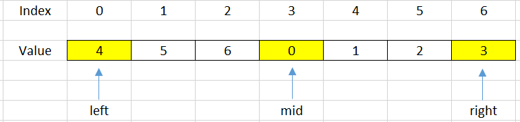
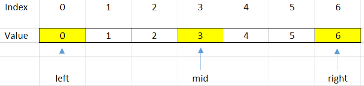
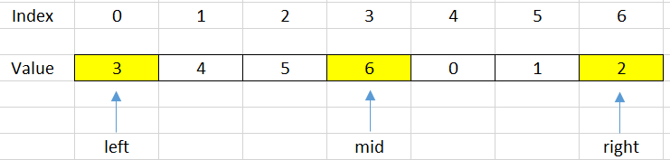

In this article, we will find something out about the rotated array and how to find its minimum element.

Let's get started.

<br>

## Table of Contents
- [Given problem](#given-problem)
- [Some properties of a rotated array](#some-properties-of-a-rotated-array)
- [Find minimum element of the rotated array](#find-minimum-element-of-the-rotated-array)
- [Using Linear Search](#using-linear-search)
- [Using Binary Search to optimize solution](#using-binary-search-to-optimize-solution)
- [Wrapping up](#wrapping-up)

<br>

## Given problem

Assuming that we have the sorted array that is described in the below image:



After shifting this sorted array by some steps, we can have:



The above array is called as a rotated array.

<br>

## Some properties of a rotated array

- When we divide a rotated array into two halves, at least one of the two halves will always sorted.

    To understand this property, we can see a below image:

    

    If we choose the mid = 3 as the pivot point, we can find that our array is divided into two halves that are increased arrays.

    --> So we can apply Binary Search for problems that are relevant to rotated array.

<br>

## Find minimum element of the rotated array

To solve this problem, we can have two solutions:
- Linear Search

    The simple solution to solve it is to use Linear Search. We can scan all elements and compare them with the minimum element.

- Binary Search

    Because the a part of array is sorted, so we can use Binary Search to solve it.

<br>

## Using Linear Search

Below is our source code about this way.

```java
public static int findMinElement(int[] arr) {
    int minPos = 0;
    for (int i = 1; i < arr.length - 1; ++i) {
        if (arr[minPos] > arr[i]) {
            minPos = i;
        }
    }

    return minPos;
}
```

The complexity of Linear Search:
- Time complexity: O(n) - n is the number of elements of this array
- Space complexity: O(1)

<br>

## Using Binary Search to optimize solution

In a rotated array, we will have some cases that we will cope with when shift it.

1. Case 1 - when sorted array is not rotated with any steps

    

    In this case, our array is a sorted array but does not rotate with any steps. So, to check this case, we do the below expression:

    ```java
    if (arr[left] <= arr[high]) {
        return left;
    }
    ```

2. Case 2 - When our **mid** index points to the minimum element

    

    So, we will check it by using the following condition:

    ```java
    int next = (mid + 1) % n;   // n is the length of the array
    int prev = (mid + n - 1) % n;

    if (arr[mid] < arr[next] && arr[mid] < arr[prev]) {
        return mid;
    }
    ```

3. Case 3 - When our **mid** index points to the element that is belong to the sub-array. It does not contains the minimum element.

    

    In order to know exactly how we are under this case, we will use the below condition:

    ```java
    if (arr[left] <= arr[mid]) {
        left = mid + 1;
    }
    ```

    Due to the minimum element that is belong to the other side, so we will shift the right side.


4. Case 4 - When our mid index points to the element that is belong to the sub-array. It contains the minimum element.

    

    ```java
    if (arr[mid] <= arr[right]) {
        right = mid - 1;
    }
    ```

Based on the four conditions, we will have source code for this problem:

```java
public static int findMinElement(int[] arr) {
    int len = arr.length;
    int left = 0;
    int right = len - 1;

    while (left <= right) {
        if (arr[left] <= arr[right]) {  // Case 1: sorted array
            return left;
        }

        int mid = left + (right - left) / 2;
        int next = (mid + 1) % len;
        int prev = (mid + len - 1) % len;
        if (arr[mid] <= arr[next] && arr[mid] <= arr[prev]) {   // Case 2: mid index points to the minimum element
            return mid;
        } else if (arr[mid] <= arr[right]) {    // Case 4
            right = mid - 1;
        } else if (arr[mid] >= arr[left]) {     // Case 3
            left = mid + 1;
        }
    }

    return -1;
}
```

The complexity of Binary Search:
- Time complexity: O(log(n)) - n is the number of elements of this array
- Space complexity: O(1)

<br>

## Wrapping up

- Understanding about what the rotated array is, and its properties.

- When we have two different trends in our array, we can use Binary Search to solve this problem.

- From this problem, we can find that in a rotated array, the index of the minimum element will be equal to the number of rotation of its array.
