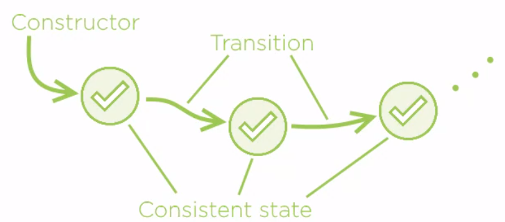

<br>

## Table of contents
- [Introduction to Defensive Programming](#introduction-to-defensive-programming)
- [Some traditional defensive techniques](#some-traditional-defensive-techniques)
- [Some ways to represent Defensive programming](#some-ways-to-represent-defensive-programming)
- [Source code](#source-code)
- [Wrapping up](#wrapping-up)


<br>

## Introduction to Defensive Programming

1. Definition of Defensive programming

    According to [wikipedia.com](), we have the definition of Defensive Programming.

    ```
    Defensive programming is a form of defensive design intended to ensure the continuing function of a piece of software under unforeseen circumstances. Defensive programming practices are often used where high availability, safety, or security is needed.

    Defensive programming is an approach to improve software and source code, in terms of:
    - General quality – reducing the number of software bugs and problems.
    - Making the source code comprehensible – the source code should be readable and understandable so it is approved in a code audit.
    - Making the software behave in a predictable manner despite unexpected inputs or user actions.
    ```

2. The first law of Defensive programming

    ```
    When you have to defend, you have to already lost.
    ```

    It means that we will build safety into high-level design without defining explicitly defensive instructions in code.

3. The difference between Defensive coding and Defensive programming

    |             Defensive Coding                            |               Defensive Programming                  |
    | ------------------------------------------------------- | ---------------------------------------------------- |
    | Write code which explicitly defends from negative cases | Produce design which defends out of the box          |
    |                                                         | Positive and negative execution scenarios treated the same |
    | Always applicable and produces poor results             | Sometimes applicable and produces greater results    |


<br>

## Some traditional defensive techniques

Before jumping into Defensive programming, we need to read up on the traditional defensive techniques.

1. Predictability

    Normally we want to know what will happen when we invoke a method that includes good naming strategy in method name, argument names, and return value.

    The next technique is having predictable outcomes. Whatever the code is doing, it must serve the result, which we can expect, at least structurally.

    For example:

    ```java
    public MyType myMethod();
    ```

    Based on the Predictability property, we can forecast something about **myMethod()** method:
    - Return an object of MyType
    - Do not return null
    - Do not throw an exception

    Those two last things are structurally different from an object. They're different to such extent that we would have to write entire separate code segment to deal with them.

2. Certainty

    It makes sense to define how the method will perform its duty without getting too intimate with its concrete implementation.

    It means that do not pass switches to a method.
    - No Boolean arguments
    - No enum arguments

    Passing a switch means that the caller is switching behavior of the method. It is not helping produce stable code. Quite a contrary, it adds uncertainty to our methods. But method should do one thing with absolute certainty. And only accept valid argument values.


3. Simplicity

    - Keep small number of method arguments. It makes our code that is easy readability.

    - Keep the code short.

    - Avoid branching when possible.

    - Avoid code repetition.

4. Completeness
    
    - Any branching or switching should have alternative branch covered with reasonable behaviour.
        
        **if** instruction should have a reasonable **else** branch.

        **switch** instruction should have a reasonable **default** case.

5. Failing fast

    Do not let bad data propagate
    - Fail right away, or
    - Provide a reasonable default and keep going.

6. Handling errors

    - Handle errors when they happen.
    - Assert preconditions, postconditions and invariants.
    - If something cannot happen, assert it and it will not happen.
    - Add global exception handler to keep the application running.

<br>

## Some ways to represent Defensive programming

1. Consistent objects

    We will create consistent and complete objects as the fundamental method of avoiding the need to defend against the opposite, incomplete or inconsistent state.

2. Consistent mutations

    All transitions must lead to complete and consistent states.

    

    If the object appears in complete and consistent state, and then only traverse other complete and consistent states, then we will never have to defend against missing parts and contradictory information coming out from the Objects state

3. No primitive types

    - Avoid excessive use of primitive types.
    - Replace primitive types with custom domain types.

    It means that we will use Value Object pattern.

4. Function domains

    Satisfy mandatory conditions before making a function call.

    For example, normally we will use try-catch to handle exception.

    ```java
    try {
        obj.doSomething();
    } catch (InvalidOperationException ex) {
        ex.printStackTrace();
    }
    ```

    In the above code, we will quickly realize that it boils down a deceptively simple question **Am I safe making this call?**. Using this way we can remove that boilerplat code.

5. Defensive design

    - Encapsulate state and operations.
    - Unify positive and negative execution flows.

6. Objects, not null

    - Do not use null references.

    In this way, we can learn from the article [Working with Nulls in Java](https://gamethapcam.github.io/2020-02-01-Working-with-Nulls-in-Java/).

7. Rich domain models

    - We will talk about the mutability and impact it has on design and our reasons to write a defensive code. Then avoid mutability helps avoid a defense and where it leads to code prolieration, effectively damaging the design.

    - Using restricted mutability technique to reduce the need to defend against unexpected states and events but also reducing the amount of code we have to write.

    - Historical modeling technique for powerful features.


8. No exceptions

    - Do not introduce alternate execution paths with exceptions.

    - Do not use exceptions as just another heavyweight if/else.

    - With better approach: pass either the result or the error in a discriminated union.

<br>

## Source code

Below is the source code that use defensive coding.

```java
if (data.any()) {
    int min = data.min();
    reportSuccess(min);
} else {
    reportFailure();
}
```

Then, we will apply Defensive Programming.

```java
Action toDo = data.firstOrNone()
                  .map(() -> reportSuccess(data.min()))
                  .reduce(reportFailure());
toDo();
```


<br>

## Wrapping up

- Understanding about how to work with Defensive programming and how to think about it.


<br>

Refer:

[Advanced Defensive Programming Techniques by Zoran Horvat](https://app.pluralsight.com/library/courses/advanced-defensive-programming-techniques/table-of-contents)

[https://devmethodologies.blogspot.com/2012/05/defensive-programming.html](https://devmethodologies.blogspot.com/2012/05/defensive-programming.html)

[https://www.codeproject.com/Articles/7904/Defensive-programming](https://www.codeproject.com/Articles/7904/Defensive-programming)

[http://danielroop.com/blog/2009/10/15/why-defensive-programming-is-rubbish/](http://danielroop.com/blog/2009/10/15/why-defensive-programming-is-rubbish/)

[https://scottdorman.blog/2008/07/04/what-is-defensive-programming/](https://scottdorman.blog/2008/07/04/what-is-defensive-programming/)

[https://app.pluralsight.com/guides/intro-defensive-programming-in-python](https://app.pluralsight.com/guides/intro-defensive-programming-in-python)