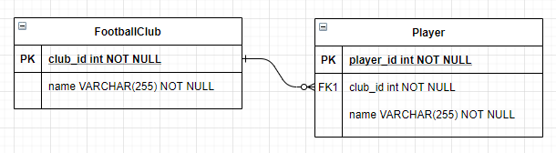

<br>

## Table of contents

- [Given problem](#given-problem)
- [How to use one-to-many relationship](#how-to-use-one-to-many-relationship)
- [Some concepts that we need to know about relationships](#some-concepts-that-we-need-to-know-about-relationships)
- [Understanding parameters of @JoinColumn annotation](#understanding-parameters-of-@joincolumn-annotation)
- [Understanding parameters of @OneToMany annotation](#understanding-parameters-of-@onetomany-annotation)
- [Understanding parameters of @ManyToOne annotation](#understanding-parameters-of-@manytoone-annotation)
- [Some questions about one-to-many relationship](#some-questions-about-one-to-many-relationship)
- [Best practices for one-to-many relationship](#best-practices-for-one-to-many-relationship)
- [Wrapping up](#wrapping-up)


<br>

## Given problem

Supposed that we have the relationship between football club and player is the one-to-many relationship. It can look like the below image.



After we analyzed the relationship between entities, then we need to use JPA to implement it in our code.

So how do we solve it?

<br>

## How to use one-to-many relationship

Before jumping directly to write JPA code for the above problem, we need to create Football club, and Player tables in our database. The relationship between them will be described through the foreign key.

```sql
CREATE TABLE IF NOT EXISTS FOOTBALL_CLUB (
    club_id INT NOT NULL AUTO_INCREMENT,
    name VARCHAR(255) NOT NULL,
    stadium_name VARCHAR(255) NOT NULL,

    PRIMARY KEY (club_id),
);

CREATE TABLE IF NOT EXISTS PLAYER (
    player_id INT NOT NULL AUTO_INCREMENT,
    name VARCHAR(255) NOT NULL,
    number INT NOT NULL,
    address VARCHAR(255) NOT NULL,
    club_id INT NOT NULL,

    PRIMARY KEY (player_id),
    FOREIGN KEY (club_id) REFERENCES FOOTBALL_CLUB(club_id)
);
```

Then, we will use JPA to map entity with the record of the corresponding table.

```java
@Entity
@Table(name = "FOOTBALL_CLUB")
public class FootballClubEntity {

    @Id
    @Column(name = "club_id")
    private int id;

    @Column(name = "name")
    private String name;

    @Column(name = "stadium_name")
    private String stadiumName;

    @OneToMany(mappedBy = "footballClub", cascade = CascadeType.ALL, orphanRemoval = true)
    private List<PlayerEntity> players;
}

@Entity
@Table(name = "PLAYER")
public class PlayerEntity {

    @Id
    @Column(name = "player_id")
    private int id;

    @Column(name = "name")
    private String name;

    @Column(name = "number")
    private int number;

    @Column(name = "address")
    private String address;

    @ManyToOne(fetch = FetchType.LAZY)
    @JoinColumn(name = "football_club_id", referencedColumnName="id")
    private FootballClubEntity footballClub;
}
```

<br>

## Some concepts that we need to know about relationships

1. The owning side

    The owning side is the side contains the foreign key that is primary key in the other side.

    For example, the relationship between Football club and Player is the one-to-many relationship. One Football Club will contain the multiple the Players. And one Players will be contained by one Football club.

    So, in our database, the Player table will contain the primary key of Football club table as a foreign key.

    --> The owning side is the Player entity, and absolutely, the inverse side is the Football club entity.

2. The inverse side

    The inverse side is the remained side when we determined the owning side.

3. Bidirectional relationship

    It means that both entities will reference to each other.

    For example, the relationship between Student and Teacher is bidirectional.
    - One Student can be teach from the multiple Teacher. Then in Student entity, it can contain the multiple Teacher entity's instances.
    - On Teach can teach the multiple students. So in Teach entity, it can point to the multiple Student entity's instances.

4. Unidirectional relationship

    It means that only one entity will reference to the other.

<br>

## Understanding parameters of @JoinColumn annotation

Below is the definition of **@JoinColumn** annotation.

```java
@Repeatable(JoinColumns.class)
@Target({ElementType.METHOD, ElementType.FIELD})
@Retention(RetentionPolicy.RUNTIME)
public @interface JoinColumn {
    String name() default "";

    String referencedColumnName() default "";

    boolean unique() default false;

    boolean nullable() default true;

    boolean insertable() default true;

    boolean updatable() default true;

    String columnDefinition() default "";

    String table() default "";

    ForeignKey foreignKey() default @ForeignKey(ConstraintMode.PROVIDER_DEFAULT);
}
```

**@JoinColumn** annotation is used in the owning side - the **child entity** that contains the **foreign key** points to the **primary key** of the **parent entity**.

Supposed that we still have one-to-many relationship between FootballClub and Player.

```java
public class FootballClubEntity {
    @OneToMany(mappedBy = "footballClub", cascade = CascadeType.ALL, orphanRemoval = true)
    private List<PlayerEntity> players;
}

public class PlayerEntity {
    @ManyToOne(fetch = FetchType.LAZY)
    @JoinColumn(name = "football_club_id", referencedColumnName="id")
    private FootballClubEntity footballClub;
}
```

The meaning of these parameters:
1. **name** parameter

    This parameter's value will be the foreign key variable's name in a table.
    
    Then the table in which it is found depends upon the context.
    - If the join is for a **OneToOne** or **ManyToOne** mapping using a foreign key mapping strategy, the foreign key column is in the table of the source entity or embeddable.
    - If the join is for a **unidirectional OneToMany** mapping using a foreign key mapping strategy, the foreign key is in the table of the target entity.

        ```java
        // unidirectional one-to-many association using a foreign key mapping
        // In Customer class
        @OneToMany
        @JoinColumn(name="CUST_ID") // join column is in table for Order
        public Set<Order> getOrders() {return orders;}
        ```

        Based on the above example, we can find that the **name** parameter's value - **CUST_ID** is in the foreign key of Order table.

    - If the join is for a **ManyToMany** mapping or for a **OneToOne** or **bidirectional ManyToOne/OneToMany** mapping using a join table, the foreign key is in a join table.
    - If the join is for an element collection, the foreign key is in a collection table.

2. **referencedColumnName** parameter

    This parameter will refer to the primary key's name of the parent entity.

3. **unique** parameter


4. **nullable** parameter


5. **insertable** parameter


6. **updatable** parameter


7. **columnDefinition** parameter


8. **table** parameter


9. **foreignKey** parameter


<br>

## Understanding parameters of @OneToMany annotation

Below is the definition of @OneToMany annotation.

```java
@Target(value={METHOD,FIELD})
@Retention(value=RUNTIME)
public @interface OneToMany {
    Class targetEntity() default void.class;

    CascadeType[] cascade() default {};

    FetchType fetch() default FetchType.LAZY;

    String mappedBy() default "";

    boolean orphanRemoval() default false;
}
```

1. **mappedBy** parameter

    This parameter will be used in Bidirectional relationship. It contains the **variable's name** under the **@ManyToOne** annotation.

    For example, we have the one-to-many relationship between the Football club entity and the Player entity.

    ```java
    public class FootballClubEntity {

        @Id
        @Column(name = "id")
        private Long id;

        @OneToMany(mappedBy = "footballClub")
        private List<PlayerEntity> players;

    }

    // This PlayerEntity has foreign key football_club_id
    public class PlayerEntity {

        @Id
        @Column(name = "id")
        private Long id;

        @ManyToOne(fetch = FetchType.LAZY)
        @JoinColumn(name = "football_club_id", referencedColumnName="id")
        private FootballClubEntity footballClub;

    }
    ```

2. **orphanRemoval** parameter

    If we want to remove an entity, then remove automatically **n** other entities based on one-to-many relationship, we need to use this parameter.

3. **fetch** parameter

    This parameter will be used to specify what actions hibernate do when we get an instance of the entity that has one-to-many relationship with the other entities.

    Below is the definition of FetchType type.

    ```java
    public enum FetchType {
        // Hibernate will do not load all entities immediately. It only loads when we want to load them directly.
        LAZY,

        // Hibernate will load all entities immediately when we get an instance that entity.
        EAGER;

        private FetchType() {
        }
    }
    ```

4. **targetEntity** parameter

    Hibernate will use this parameter to know exactly which entity type that it can reference.

5. **cascade** parameter

    Below is the definition of **CascadeType** data type.

    ```java
    public enum CascadeType {
        ALL,
        PERSIST,
        MERGE,
        REMOVE,
        REFRESH,
        DETACH;

        private CascadeType() {
        }
    }
    ```

    The meaning of each type of cascade parameter.

    |    CascadeType   |               Meaning               |
    | ---------------- | ----------------------------------- |
    | ALL              | cascade={PERSIST, MERGE, REMOVE, REFRESH, DETACH} |
    | PERSIST          | This type will implement the perist operation from the parent entity to its child entities. |
    | MERGE            | This type will implement the merge operation from the parent entity to its child entities.  |
    | REMOVE           | This type will implement the remove operation from the parent entity to its child entities. |
    | REFRESH          | This type will re-read the value of the parent entity, then re-read its child entities.     |
    | DETACH           | This type will implement the detach operation from the parent entity to its child entities. |

<br>

## Understanding parameters of @ManyToOne annotation

In @ManyToOne annotation, its definition will look like:

```java
@Target({ElementType.METHOD, ElementType.FIELD})
@Retention(RetentionPolicy.RUNTIME)
public @interface ManyToOne {
    Class targetEntity() default void.class;

    CascadeType[] cascade() default {};

    FetchType fetch() default FetchType.EAGER;

    boolean optional() default true;
}
```

This @ManyToOne annotation has the same four parameters with @OneToMany annotation.
- **targetEntity** parameter
- **cascade** parameter
- **fetch** parameter
- **optional** parameter -  Whether the association is optional. If set to **false**, then a non-null relationship must always exist.

To understand their meaning of parameters, we need to read up on the section [Understanding parameters of @OneToMany annotation](#understanding-parameters-of-@onetomany-annotation).

<br>

## Some questions about one-to-many relationship

1. The difference between **orphanRemoval** parameter and **cascade.REMOVE** parameter

    Assuming that we have the one-to-many relationship between FootballClub and Player, it can be described in the below code.

    ```java
    public class FootballClubEntity {
        @Id
        @Column(name = "id")
        private Long id;

        @OneToMany(mappedBy = "footballClub", cascade = CascadeType.REMOVE)
        private List<PlayerEntity> players;
    }

    // This PlayerEntity has foreign key football_club_id
    public class PlayerEntity {

        @Id
        @Column(name = "id")
        private Long id;

        @ManyToOne(fetch = FetchType.LAZY)
        @JoinColumn(name = "football_club_id", referencedColumnName="id")
        private FootballClubEntity footballClub;
    }
    ```

    The difference between the cascade.REMOVE parameter and the orphanRemoval parameter is in the response to disconnecting a relationship.

    For example:

    ```java
    // get the FootballClubEntity from something
    FootballClubEntity footballEntity = ...;

    // disconnect the footballEntity with the player entities
    footballEntity.setPlayers(null);
    ```

    The response for each case:
    - If we use the orphanRemoval parameter, all related player entities will be removed in database automatically.
    - If we use the cascade.REMOVE parameter, all related player entities will not be remove in database automatically.

2. The difference between **CascadeType.Detach** and **CascadeType.Remove**

    Supposed that we have the one-to-many relationship between Football club entity and Player entity.

    ```java
    public class FootballClubEntity {
        @OneToMany(mappedBy = "footballClub", cascade = CascadeType.ALL, orphanRemoval = true)
        private List<PlayerEntity> players;
    }

    public class Player {
        @ManyToOne(fetch = FetchType.LAZY)
        @JoinColumn(name = "football_club_id", referencedColumnName="id")
        private FootballClubEntity footballClub;
    }
    ```

    And we have operations in **EntityManager** that relate to these above **CascadeType**.
    - **detach()** method

        ```java
        // definition of detach() method
        void detach(java.lang.Object entity);

        public static void main() {
            // create football club entity with multiple players.
            // ...

            FootballClubEntity footballClub = buildFootballClub();
            PlayerEntity beckham = buildPlayer("Beckham");
            PlayerEntity ronaldo = buildPlayer("Ronaldo");
            PlayerEntity messi = buildPlayer("Messi");

            footballClub.setPlayers(Arrays.asList(beckham, ronaldo, messi));
            entityManager.detach(footballClub);
        }
        ```

        Because in the FootballClubEntity class's @OneToMany annotation, we use **CascadeType.ALL** for this annotation. So, when we call **entityManager.detach(footballClub);**, the football club entity's instance and multiple player entities will be detach from Persistence Context. But their all records of **FootballClubEntity** and **Player** entities will still remain.

        Then, if we change these entities, it will not reflect to the database.

    - **remove()** method

        ```java
        void remove(java.lang.Object entity);
        ```

        Using **CascadeType.ALL**, **remove()** method of **EntityManager** class to the **FootballClubEntity** will remove both the **FootballClubEntity**'s instance and their **PlayerEntity**'s instances from the **PersistenceContext** and the database.

3. The problem of utilizing the **CascadeType.ALL** in **@ManyToOne** annotation

    For example:

    ```java
    public class User {
        @OneToMany(fetch = FetchType.EAGER)
        protected Set<Address> userAddresses;
    }

    public class Address {
        @ManyToOne(fetch = FetchType.LAZY, cascade = CascadeType.ALL)
        protected User addressOwner;
    }
    ```

    In this our problem, if we remove an Address record, then it would lead to remove the related User. As a User can have multiple addresses, the other addresses would become orphans.

    To fix this problem, we can use **mappedBy** parameter in User class's OneToMany, and remove the **CascadeType.ALL** in Address class's @ManyToOne annotation.

<br>

## Best practices for one-to-many relationship

To understand how **@OneToMany** annotation work, we can read about the article [The best way to map a @OneToMany relationship with JPA and Hibernate](https://vladmihalcea.com/the-best-way-to-map-a-onetomany-association-with-jpa-and-hibernate/).

But here we have some notes:
- If we use only the unidirectional @OneToMany, it will create the temporary third table. So it is not efficiency, and it will reduce the system's performance.

- To fix the above problem, we should use @JoinColumn annotation to accompany with @OneToMany annotation.

    The @JoinColumn annotation helps Hibernate to figure out that there is a Foreign Key column in the child table that defines this association.

    In this case, we need to take a closer look at [Hibernate flush order](https://vladmihalcea.com/hibernate-facts-knowing-flush-operations-order-matters/).

- The best way to implement the one-to-many relationship is using both @OneToMany and @ManyToOne annotations.

- The problem of using @OneToMany annotation is that we need to maintain a collection of child entities. The problem with collections is that we can only use them when the number of child records is rather limited.

    So, in this case, we only use @ManyToOne annotation. To use the collection of child entities, we use the native sql.

<br>

## Wrapping up

- Understanding the one-to-many relationship and some parameters of @OneToMany, @ManyToOne annotations.

<br>

Refer:

[https://www.baeldung.com/hibernate-one-to-many](https://www.baeldung.com/hibernate-one-to-many)

[https://docs.oracle.com/javaee/6/api/javax/persistence/OneToMany.html](https://docs.oracle.com/javaee/6/api/javax/persistence/OneToMany.html)

[https://www.baeldung.com/jpa-join-column](https://www.baeldung.com/jpa-join-column)

[https://docs.oracle.com/cd/E19798-01/821-1841/6nmq2cpav/index.html](https://docs.oracle.com/cd/E19798-01/821-1841/6nmq2cpav/index.html)

[https://vladmihalcea.com/the-best-way-to-map-a-onetomany-association-with-jpa-and-hibernate/]|(https://vladmihalcea.com/the-best-way-to-map-a-onetomany-association-with-jpa-and-hibernate/)