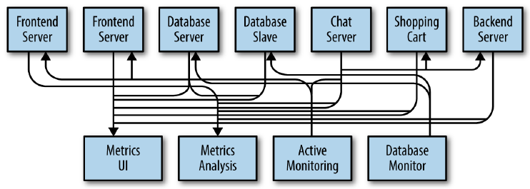
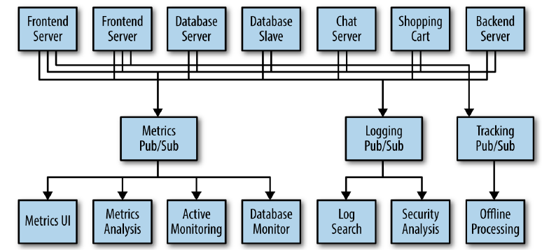
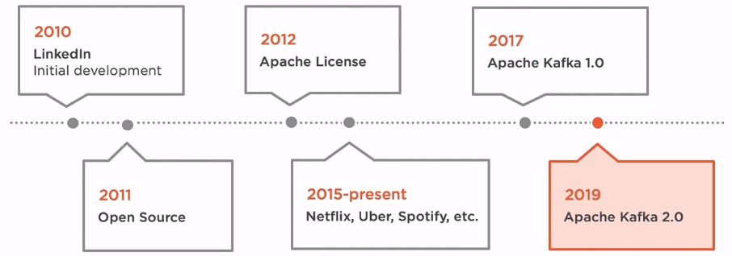
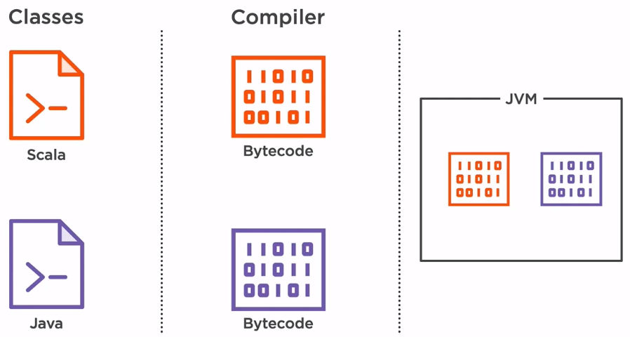
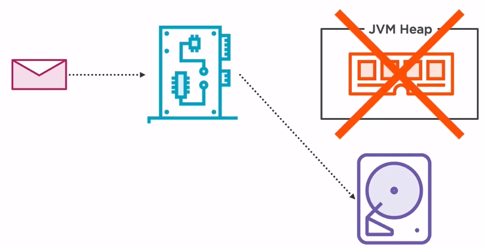
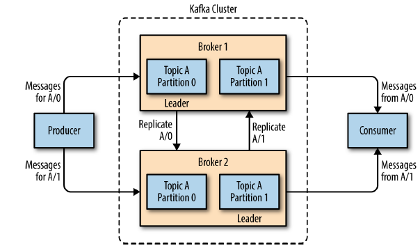
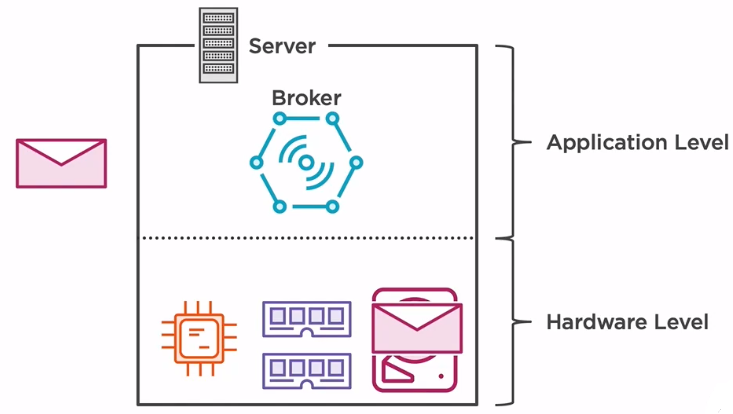
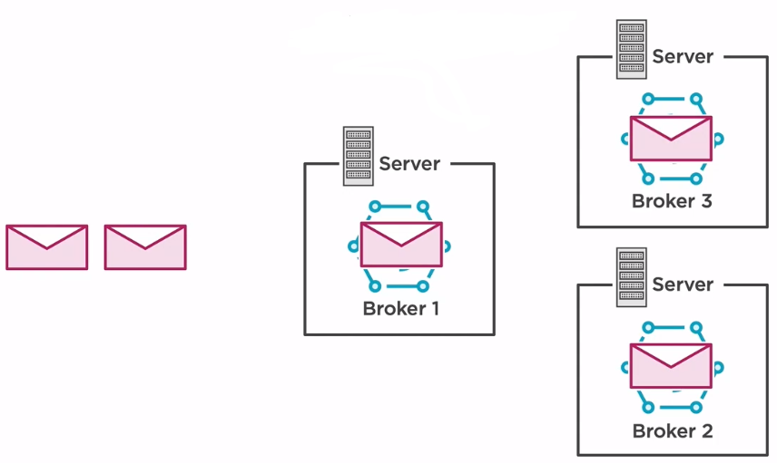
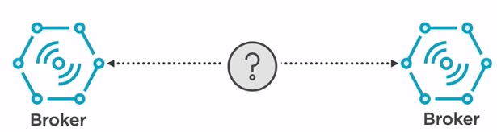
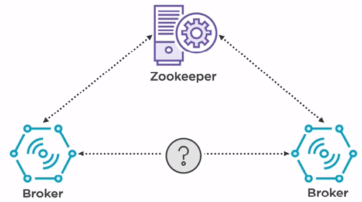

In this article, we will find something out about Kafka. Understanding about the architecture of Kafka makes us coding better, reduce the number of bugs.

Let's get started.

<br>

## Table of contents
- [Given problem](#given-problem)
- [Solution of using Kafka](#solution-of-using-kafka)
- [Concepts in Kafka](#concepts-in-kafka)
- [The architecture of Kafka](#the-architecture-of-kafka)
- [Wrapping up](#wrapping-up)

<br>

## Given problem

Assuming that we create an application that needs to send monitoring information somewhere, so we write in a direct connection from our application to an app that displays our metrics on a dashboard, and push metrics over that connections. Then we have our system looks like this:


But in our system, we need to analyze our metrics over a longer terms. So we will create a new service that can receive metrics, store them, and analyze them. And other systems also want to get individual metrics and use them for various purposes. So, our system's architecture will be described in the below image:



We can easily find some drawbacks of this architecture:
- it's hard to trace connections between systems.
- in the future, our system's complexity increases, it takes so much time to understand it because it becomes mess.
- tightly coupling between producers and consumers.

<br>

## Solution of using Kafka

Our problems is as same as the problems of [Mediator pattern](https://ducmanhphan.github.io/2020-01-29-Mediator-pattern/). So, to deal with them, we will create a single application that receives metrics from all the applications and provide a server to query those metrics for any system that needs them. It's called **Metrics Pub/Sub** for queuing data.


When we need to do similar work with log messages, because we have to track user behavior on the front-end website to collect data for working on machine learning or some reports for management, we also will create other queue system that is similar **Metrics Pub/Sub**.



All above systems are called a publish/subscribe messaging system. This publish/subscribe messaging system can be described with the following information:
- Publish/subscribe messaging is a pattern that is characterized by the sender (publisher) of a piece of data (message) not specifically directing it to a receiver.

- The publisher classifies the message somehow, and that receiver (subscriber) subscribes to receive certain classes of messages.

- Pub/Sub system often have a broker, a central point where messages are published, to facilitate this.

To implement this publish/subscribe messaging system, we have Apache Kafka.

According to [wikipedia.com](https://en.wikipedia.org/wiki/Apache_Kafka), we have:

```
Apache Kafka is an open-source stream processing software platform developed by Linkedln and donated to the Apache Software Foundation, written in Scala and Java. The project aims to provide a unified, high-throughput, low-latency platform for handling real-time data feeds. Kafka can connect to external systems (for data import/export) via Kafka Connect and provides Kafka Streams, a Java stream processing library. Kafka uses a binary TCP-based protocol that is optimized for efficiency and relies on a "message set" abstraction that naturally groups messages together to reduce the overhead of the network roundtrip.
```

<br>

## Introduction to Kafka

- Apache Kafka is open source and has a great community contributing to the project and developing an entire ecosystem around it.
    
    

    Kafka was originally developed in 2010 at LinkedIn and was subsequently open sourced in 2011.
    
    In 2012, the project had graduated the Apache incubator and became a top-level Apache project allowing the users of the software to use it for any purpose, to distribute it or modify it without any concerns for any royalties. Companies became very interested in this product, and many have started to adopt it, including companies like Netflix, Uber and Spotify, who are handling millions of messages per day.
    
    In 2017, the first stable version of Kafka had been released, and two years later, the major version has been bumped again.

- Kafka has been built in Java, one of the most popular programming languages in the world.

    

    This ensures a high number of contributors are maintaining and developing the product, but it also has debugging when something goes wrong, especially because there are many Java-oriented DevOps engineers on the hiring market compared to some other programming languages.
    
    Originally, Kafka was developed with Scala, but soon after, it switched to Java because of its popularity and ease of delivering new versions.
    
    Although they are two separate programming languages, they can run under the same platform, so there are no need for a Big Bang type of change. The Scala and Java classes are passed through a compiler, a Scala compiler for Scala classes and a Java compiler for Java classes. After the compilation step, both the Scala and Java classes result in something called bytecode. The byte code resulted is the same, so it can be run under the same JVM without knowing if the original code was Scala or Java.

- High throughput

    Kafka is fast. It can handle a very high load of messages per second without using a massive amount of resouces.
    
    It achieves this using two main features.
    - Firstly, there is no serialization or deserialization happening inside Kafka.

        

        The serialization process consists of converting an known object, for example, a car, into a stream of bytes, in order to transmit it over a network or to store it in memory, or even in our file on our hard drive.

        The reverse process called deserialization, and it allows converting the stream of bytes back into the known object after it has been transmitted over the network or when it is retrieved from the hard drive.

        The problem with those two operations is the fact that they are expensive in the sense that it requires processing power and time to do it. When only a couple of hundred messages per day are serialized and deserialized, it would not represent an impact to the system. But try to image a scaling up to millions or even billions messages per day. These operations would slow down the entire system, so Kafka does nots handle anything else rather than bytes. All the data that is stored on the hard drive is usin a well-known byte encoding format, so there is no serialization or deserialization happening inside Kafka.
        
        The same thing can be said about what Kafka is receiving and transmitting over the network. All the data that is passed into Kafka and received from it will be in a binary format.

    - Secondly, it uses a mechanism called zero copy.
    
        

        The goal is to store a message in a hard drive for it to be persisted for the long term and prevent losing data in case of a blackout.
        
        In a typical application, when a message is received over the network, it passes through the network card, and then it is stored in the Java heap, which is from the the hardware perspective, resides on the RAM. The data will then be copied to the hard drive. The reason for using the RAM and not the hard drive for storage is the fact that hard drive are usually very slow when it comes to random data access.

    Kafka is handling these by storing the data sequentially and bypassing the Java heap resulting in a situation where the data is not copied from one component to another, hence the name zero copy.
    
    A bit disappointing is the fact that the zero copy feature is only available for non-TLS connections. The reason for doing this is because the transport layer security protocol is deeply embbeded in the JDK, so bypassing the JVM heap is not possible in this situation. So increasing the security on our system by using encrypted communication would result in some performance throwbacks.

- Kafka is more than a messaging system. Kafka is considered to be a distributed streaming platform. 

    A distributed streaming platform include:
    - First of all, it can be used as a messaging system by using the publish/subscribe pattern. In this pattern, there are two types of applications, consumers and producers. Producers create and publish the events to the messaging system while consumers subscribe to those events and consume them.

    - Kafka can also be used for storing the data in a distributed way. It supports clustering, so data will be uniformly spread across systems, but it can also be replicated in case one of the systems fail, thus ensuring data will not be lost.

    - The last process that a distributed streaming platform can perform is processing the events as they occur in the system by taking benefit of the streaming model. Companies should react as fast as possible to customer's needs, and by using streaming, all the incoming events can be processed in almost realtime.

<br>

## Concepts in Kafka

1. Message

    The unit of data within Kafka is called a *message*. In database, we can consider it as a row or a record. A *message* is simply an array of bytes, so it does not have a specific format or meaning.

    A message can have an optional bit of metadata, which is referred to as a *key*. Keys are used when messages are to be written to partitions in a more controlled manner. This key is generated by using **consistent hashing**.

2. Cluster and Broker

    A single Kafka server is called a *broker*. The broker receives messages from producers, assigns *offsets* to them, and commits the messages to storage on disk. It also services consumers, responding to fetch requests for partitions and responding with the messages that have been committed to disk. Depending on the specific hardware and its performance characteristics, a single broker can easily handle thousands of partitions and millions of messages per second.

    Kafka broker leader election can be done by Zookeeper. Means in case of data loss, Zookeeper decide which broker to make a master and which broker to make a slave.

    Kafka brokers are designed to operate as a part of a *cluster*. Within a cluster of brokers, one broker will also function as the cluster controller (elected automatically from the live members of the cluster). The controller is responsible for administrative operations, including assigning partitions to brokers and and monitoring for broker failures. A partition is owned by a single broker in the cluster, and that broker is called the leader of the partition. A partition may be assigned to multiple brokers, which will result in the partition being replicated as seen in the below image. This provides redundancy of messages in the partition, such that another broker can take over leadership if there is a broker failure. However, all consumers and producers operating on that partition must connect to the leader.

    


3. Producer and Consumer

    Producers create new messages. By default, the producer does not care what partition a specific message is written to and will balance messages over all partitions of a topic evenly. In some cases, the producer will direct messages to specific partitions. This is typically done using the message key and a partitioner that will generate a hash of the key and map it to a specific partition. This assures that all messages produced with a given key will get written to the same partition. The producer could also use a custom partitioner that follows other business rules for mapping messages to partitions.

    When the new broker is started, all the producers search it and automatically sends a message to that new broker. Kafka producer doesn't wait for acknowledgments from the broker and sends messages as fast as the broker can handle.

    Consumers read messages. The consumer subscribes to one or more topics and reads the messages in the order in which they were produced. Consumers work as a part of a *Consumer Group*, which is one or more consumers that work together to consume a topic. The group assures that each partition is only consumed by one member. In this way, consumers can horizontally scale to consume topics with a large number of messages. Additionally, **if a single consumer fails, the remaining members of the group will rebalance the partitions being consumed to take over for the missing member**.

4. Topic, Partition and Offset

    - Topic

        

        Messages in Kafka are categorized into *topics*. We can think of topic as database table or a folder in a filesystem.

    - Partition

        Topics are additional broken down into a number of *partitions*. Partitions allow us to parallelize a topic by splitting the data in a particular topic across multiple brokers — each partition can be placed on a separate machine to allow for multiple consumers to read from a topic in parallel. Consumers can also be parallelized so that multiple consumers can read from multiple partitions in a topic allowing for very high message processing throughput.

        Partitions are the way that Kafka provides redundancy and scalability. Each partition can be hosted on the different server, which means that a single topic can be scaled horizontally across multiple servers to provide performance far beyond the ability of a single server.

        The number of partitions can be configured when we create a new topic.

        ```python
        # create test topic
        bin/kafka-topics.sh --create
                            --zookeeper localhost:2181
                            --replication-factor <num_brokers_replicate>
                            --partitions <num_partitions_per_topic>
                            --topic <name_topic>
        ```

        Benefits of having multiple partitions in a topic:
        - allows for multiple consumers to read from a topic in parallel.

    - Offset

        Each message within a partition has an identifier called its *offset*. The *offset* is another bit of metadata, an integer value that continually increases - that Kafka adds to each message as it is produced. So, we can find that Kafka brokers are stateless.
        
        The *offset* the ordering of messages as an immutable sequence. Kafka maintains this message ordering for us. Consumers can read messages starting from a specific offset and are allowed to read from any offset point they choose, allowing consumers to join the cluster at any point in time they see fit. Given these constraints, each specific message in a Kafka cluster can be uniquely identified by a tuple consisting of the message's topic, partition, and offset within the partition. By storing the offset of the last consumed message for each partition, either in Zookeeper or in Kafka itself, a consumer can stop and restart without losing its place.

        Why we need offset in partitions for each consumer?

        --> Because we have multiple producers, consumers on one topic, each producer push messages into topic's partition. Then each consumer need to keep track which messages it has already consumed by keeping track of the offset of messages.

5. Zookeeper

    It's used to manage and coordinate with the broker. *ZooKeeper* service is mainly used to notify producer and consumer about the presence or failure of any new broker in the Kafka system. As per the notification received by the Zookeeper regarding presence or failure of the broker then producer and consumer take a decision and starts coordinating their task with some other broker.

<br>

## The architecture of Kafka

Kafka has two important components that we need to remember.
- The main component is the Kafka broker, which deals with receiving, storing, and transmitting data.

- But a broker cannot live by itself. It requires a zookeeper in order to achieve a distributed state.

1. Broker

    A broker should always reside in a dedicated server with dedicated resources since it has a very high input/output load, which may affect other applications or the other way around.
    
    A broker is nothing more than a process that lives on top of the OS. When a message is received  across the network, the broker stores it into the hard drive of that machine. When that specific message has been requested, the broker will then copy it from the file system, and it will transmit to the application that request it.

    

    It's important to mention that everything is done at the binary level. Messages are nothing more than bytes received over a network.

    Having a single server may be enough for the development environment when load throughput and loss the data may not be an issue. But in order to ensure that our setup is fault-tolerant and highly available, then multiple brokers need to be added under the same context. This distribution is called a cluster.

    

    When a message is received, the broker will duplicate it, and then it will send it to its siblings to prevent the loss of data in case of faliures. Having a cluster setup also increases the throughput by offering a uniform load across the brokers without overloading one while the others are idle.

2. Zookeeper

    

    The main problem is that broker are independent applications and one has no idea about the others.

    To solve this issue, we need a zookeeper. Consider a zookeeper as a centralized service that all the brokers are connected to. A zookeeper maintains a list with all the brokers registered to it but also some configuration required by the brokers to synchronize. It helps the brokers to distribute the load evenly by electing leaders who are in charge of handling some specific categories of messages. Also, in case of a broker failure, it will announce it to the others in order to prevent sending data to a faulty broker.

    

<br>

## Benefits and Drawbacks

1. Benefits

    - Reliability - Kafka is distributed, partitioned, replicated and fault tolerance.
    - Low latency - It is capable of handling these messages with the very low latency of the range of miliseconds, demanded by most of the new use cases.
    - Scalability - Kafka messaging system scales by most of the new use cases.
    - Durability - Kafka uses distributed commit log which means messages persists on disk as fast as possible, hence it is durable.
    - Performance - Kafka has high throughput for both publishing and subscribing messages. It maintains stable performance even many TB of messages are stored.

2. Drawbacks


<br>

## Wrapping up


<br>

Refer:

[Kafka: The definitive guide book](https://www.amazon.com/Kafka-Definitive-Real-Time-Stream-Processing/dp/1491936169)

[Apache Kafka cookbook](https://www.amazon.com/Apache-Kafka-Cookbook-Saurabh-Minni-ebook/dp/B015EHCTES)

[Learning Apache Kafka, 2nd Edition](https://www.amazon.com/Learning-Apache-Kafka-Nishant-Garg-ebook/dp/B00U2MI8MI)

[Apache Kafka - Packtpub]()

[https://blog.scottlogic.com/2018/04/17/comparing-big-data-messaging.html](https://blog.scottlogic.com/2018/04/17/comparing-big-data-messaging.html)

[https://sookocheff.com/post/kafka/kafka-in-a-nutshell/](https://sookocheff.com/post/kafka/kafka-in-a-nutshell/)

[https://data-flair.training/blogs/kafka-architecture/](https://data-flair.training/blogs/kafka-architecture/)

[https://linuxhint.com/install-apache-kafka-ubuntu/](https://linuxhint.com/install-apache-kafka-ubuntu/)

[https://www.coretechnologies.com/products/AlwaysUp/Apps/RunApacheKafkaAsAWindowsService.html](https://www.coretechnologies.com/products/AlwaysUp/Apps/RunApacheKafkaAsAWindowsService.html)

[https://kafka.apache.org/quickstart](https://kafka.apache.org/quickstart)

[http://kafka.apache.org/intro](http://kafka.apache.org/intro)

[https://chrzaszcz.dev/2019/05/26/kafka-101/](https://chrzaszcz.dev/2019/05/26/kafka-101/)

[https://blog.scottlogic.com/2018/04/17/comparing-big-data-messaging.html](https://blog.scottlogic.com/2018/04/17/comparing-big-data-messaging.html)

<br>

**Architecture of Kafka**

[https://blog.usejournal.com/understanding-apache-kafka-the-messaging-technology-for-modern-applications-4fbc18f220d3](https://blog.usejournal.com/understanding-apache-kafka-the-messaging-technology-for-modern-applications-4fbc18f220d3)