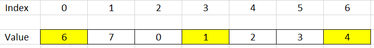
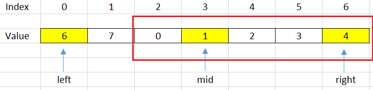
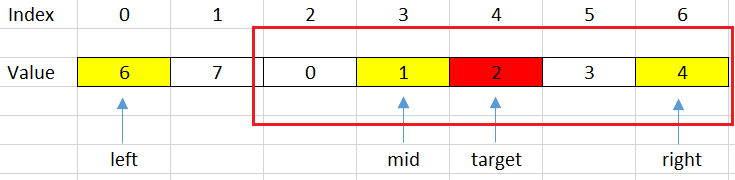
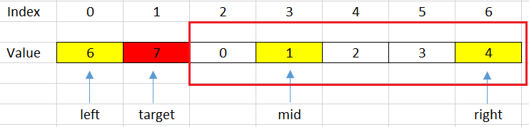
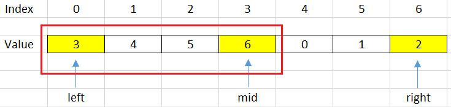
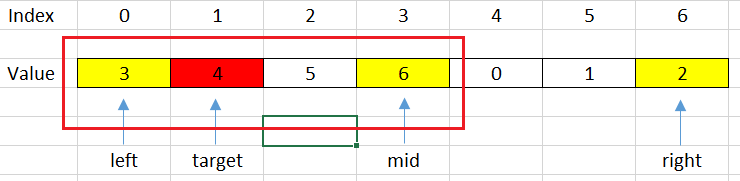
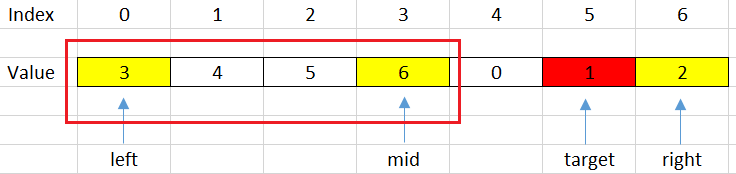

In this article, we will solve the problem about finding element in the rotated array.

Let's get started.

<br>

## Table of contents
- [Given problem](#given-problem)
- [Using Linear Search to find element](#using-linear-search-to-find-element)
- [Using Binary Search](#using-binary-search)
- [Wrapping up](#wrapping-up)

<br>

## Given problem

Given a rotated array, find the index of specific element.

Assuming that, we have a rotated array like the below image:



How can we find the index of specific element in optimal time?

<br>

## Using Linear Search to find element

Normally, the first thing we do is to use brute-force to deal with problem. In this case, we will use linear search to do it.

```java
public static int search(int[] nums, int target) {
    int pos = 0;
    for (int i = 0; i < nums.length - 1; ++i) {
        if (nums[i] == target) {
            pos = i;
            break;
        }
    }

    return pos;
}
```

The complexity of using Linear Search is:
- Time complexity: O(n)
- Space complexity: O(1)

<br>

## Using Binary Search

The drawback of using Linear Search is about the time complexity - **O(n)**. But we can improve it in **O(logn)**, because our rotated array has sub-arrays that are increased array.

So we can use Binary Search. Next, we will analyze our problem when using Binary Search.

1. Case 1 - When we jump into the right sub-array

    

    But in this case, we can have two issues:
    - our target will under this range.

        For example: target = 2, then we have:

        

        Then, we will shift left with steps: ```left = mid + 1;```

    - our target will not be contain in this range.

        For example: target = 7, then we have:

        

        Then, we will shift right with steps: ```right = mid - 1;```

    Based on the above conditions, we can have the segment code:

    ```java
    if (nums[mid] <= nums[right]) {
        if (nums[mid] < target && target <= nums[right]) {
            left = mid + 1;
        } else {
            right = mid - 1;
        }
    }
    ```

2. Case 2 - When we jump into the left sub-array

    

    But in this case, we also have two issues:
    - our target will under this range.

        For example: target = 4, it can be described in a below image.

        

        Then, we will shift left with some steps: ```right = mid - 1;```

    - our target will be not contain in this range.

        For example, target = 1, then we have:

        

        Then, we will shift right with some steps: ```left = mid + 1;```

    Based on above conditions, we can some code to describe it.

    ```java
    if (nums[mid] >= nums[left]) {
        if (nums[left] < target && target < nums[mid]) {
            right = mid - 1;
        } else {
            left = mid + 1;
        }
    }
    ```


Below is our source code of this way:

```java
public static int search(int[] nums, int target) {
    int left = 0;
    int right = nums.length - 1;

    while (left <= right) {
        int mid = left + (right - left) / 2;
        if (nums[mid] == target) {
            return mid;
        }

        if (nums[mid] <= nums[right]) { // right half is sorted
            if (target > nums[mid] && target <= nums[right]) {
                left = mid + 1;
            } else {
                right = mid - 1;
            }
        } else {        // left half is sorted
            if (nums[left] <= target && target < nums[mid]) {
                right = mid - 1;
            } else {
                left = mid + 1;
            }
        }
    }

    return -1;
}
```

The complexity of Binary Search is:
- Time complexity: O(log(n)).
- Space complexity: O(1).

<br>

## Wrapping up
- Understanding why we can apply Binary Search in this problem.

- Go from the brute-force solution, then optimize it.

