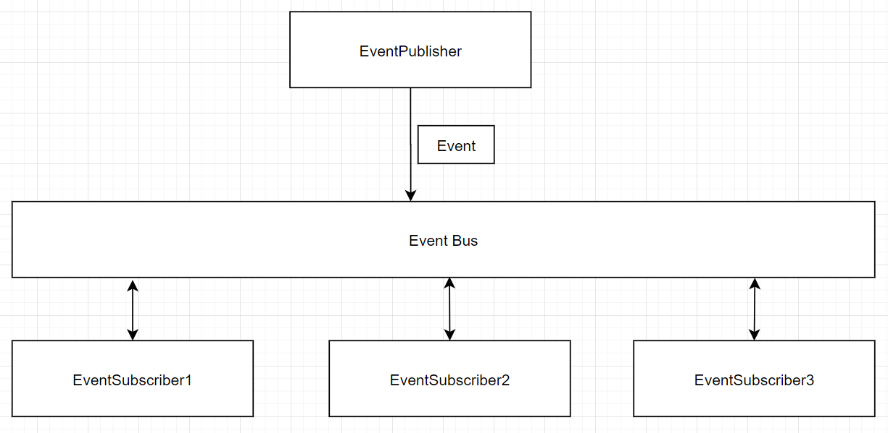

<br>

## Table of contents
- [Given problem](#given-problem)
- [Solution with Event bus pattern](#solution-with-event-bus-pattern)
- [Source code](#source-code)
- [Benefits and Drawbacks](#benefits-and-drawbacks)
- [The relationship with other patterns](#the-relationship-with-other-patterns)
- [Wrapping up](#wrapping-up)


<br>

## Given problem

In the section **Some problems with Command Bus pattern** of the article [Command bus pattern](https://gamethapcam.github.io/2020-12-02-command-bus-pattern/), we discussed about their Command bus pattern's arduous and its solution. It is to use Event Bus pattern to decouple between the primary action and the secondary action in Command Bus pattern.

This way makes our code satisfy Single Responsibility Principle and extends our functionality in the future time.

So how do we implement the Event Bus pattern?

<br>

## Solution with Event bus pattern

Below is the diagram that describes how Event Bus pattern works.



Some components in this pattern:
1. Event Publisher

    Event Publisher is a component that is responsible for publish an Event to the Event Bus.

2. Event Bus

    After the Event Bus received an Event from Event Publisher, the Event Subscriber components that have subscribed to that Event will get notified.

3. Event Subscriber

    The Event Subscriber receives an Event, and it will start to do its behavior.

    The relationship between Event and Event Publisher is that an Event can be sent to the multiple Event Subscribers.

<br>

## Source code

Belows are some steps that we need to implement Event Bus pattern with Spring framework.
1. Definition of **Event** class that will pass to **EventBus**

    In this **Event** class's object, it will contain all data that we want to pass an **EventSubscriber** object.

    ```java
    public class Event {
        private final String eventName;
        private final Map<String, String> data = new HashMap();

        public Event(String eventName) {
            this.eventName = eventName;
        }

        public void setData(String key, String value) {
            this.data.put(key, value);
        }

        public String getData(String key) {
            return this.data.get(key);
        }

        // other getter/setter method for each data types
        // ...
    }
    ```

2. Definition of **EventDataObject** class that will take data from **Event** class's object.

    ```java
    public interface EventDataObject {
        default void restoreFromEvent(Event event) {
            // nothing to do
        }

        default Event getEvent() {
            return null;
        }
    }
    ```

3. Definition of **EventBus** interface and its implementation.

    ```java
    public interface EventBus {
        void initialize();

        void publish(Event event);
    }
    ```

    Because with each event, we have a list of subscribers. So, we will use Hash Map data structure to save them.

    ```java
    @Component
    public class EventBusImpl {
        private boolean hasInitialized = false; 
        private Map<String, List<EventSubscriber>> eventWithSubscribers;
        private ApplicationContext context;

        @Autowired
        public EventBusImpl(ApplicationContext context) {
            this.context = context;
        }

        @Override
        @PostConstruct
        public void initialize() {
            Map<String, EventSubscriber> subscribers =
                    this.context.getBeansOfType(EventSubscriber.class);
            this.eventWithSubscribers = subscribers.values().stream()
                                                .collect(Collectors.groupingBy(subscriber -> {
                                                    EventHandler annotation = subscriber.getClass().getAnnotation(EventHandler.class);
                                                    if (Objects.isNull(annotation)) {
                                                        throw new RuntimeException();
                                                    }

                                                    return annotation.value();
                                                }));
            this.hasInitialized = true;
        }

        @Override
        public void publish(Event event) {
            if (!this.hasInitialized) {
                throw new RuntimeException();
            }

            List<EventSubscriber> eventSubscribers = this.eventWithSubscribers.getOrDefault(event.getEventName(), new ArrayList<>());
            eventSubscribers.forEach(subscriber -> {
                subscriber.handleEvent(event);
            });
        }

        @PreDestroy
        public void destroy() {
            this.hasInitialized = false;
            this.eventWithSubscribers.clear();
        }
    }
    ```

    In Spring framework, we will use all beans in IoC container to access **EventSubscriber** objects.


4. Definition of **EventPublisher** class

    ```java
    @Component
    public class EventPublisher {
        private static ApplicationContext context;

        @Autowired
        public setContext(ApplicationContext context) {
            EventPublisher.context = context;
        }

        public static void publish(Event event) {
            context.getBean(EventBus.class).publish(event);
        }

    }
    ```


5. Definition of **EventSubscriber** class, **EventDataObjectHandler** class and **EventtHandler** annotation.

    ```java
    @Retention(RetentionPolicy.RUNTIME)
    @Target(value = {ElementType.TYPE})
    public @interface EventHandler {
        String value();
    }
    ```

    ```java
    public interface EventSubscriber {
        void handleEvent(Event event);
    }
    ```

    ```java
    public abstract class EventDataObjectHandler<T extends EventDataObject>
                                        implements EventSubscriber {
        private Class<T> eventClazzType;

        public EventDataObjectHandler(Class<T> eventClazzType) {
            this.eventClazzType = eventClazzType;
        }

        @Override
        public void handleEvent(Event event) {
            try {
                T eventObject = this.eventClazzType.newInstance();
                eventObject.restoreFromEvent(event);
                this.handle(eventObject);
            } catch(InstantiationException | IllegalAccessException ex) {
                throw new RuntimeException();
            }
        }

        protected abstract void handle(T event);
    }
    ```

6. Assuming that there is someone has just registered as a user in our application, after RegisterUserCommand completed, a RegisteredUserEvent will be fired. This event will responsible for sending an email to that user.

    ```java
    public class RegisteredUserEventDataObject implements EventDataObject {
        public static final String EVENT_NAME = "RegisteredUserEventDataObject";

        private String username;
        private String password;
        private String phoneNumber;

        public RegisteredUserEventDataObject() {}

        @Override
        public Event getEvent() {
            GlobalEvent event = new GlobalEvent(EVENT_NAME);
            event.setString("UserName", this.userName);
            event.setString("Password", this.password);
            event.setString("PhoneNumber", this.phoneNumber);

            return event;
        }

        @Override
        public void restoreFromEvent(Event event) {
            this.username = event.getData("UserName");
            this.username = event.getData("Password");
            this.username = event.getData("PhoneNumber");
        }
    }
    ```

    ```java
    @Component
    @EventHandler(RegisteredUserEventDataObject.EVENT_NAME)
    public class RegisteredUserEventSubscriber extends EventDataObjectHandler<RegisteredUserEventDataObject>
                                     implements EventSubscriber {
        public RegisteredUserEventSubscriber() {
            super(RegisteredUserEventDataObject.class);
        }

        @Override
        protected void handle(RegisteredUserEventDataObject eventDataObject) {
            // do something
        }
    }
    ```

    ```java
    public static void main(String[] args) {
        Event registeredUserEvent = new Event(RegisteredUserEventDataObject.EVENT_NAME);
        registeredUserEvent.setData("UserName", "Something");
        registeredUserEvent.setData("Password", "Something");
        registeredUserEvent.setData("PhoneNumber", "Something");

        EventPublisher.publish(registeredUserEvent);
    }
    ```

<br>

## Benefits and Drawbacks

1. Benefits

    - Decoupling between Event Publishers and Event Subscribers. Then it makes our project easy to maintain, scale when we have to receive new requirements.

2. Drawbacks

    - All weird things in the Event Bus pattern's implementation will be hidden in Event Bus component. Sometimes, it's difficult to understand.

    - In the [Source code](#source-code) section, we find that each event was fired, we will create an **EventDataObject** object to pass the corresponding **Subscriber** object. It means that we replicate the event data to subscribers. So memory will increase when we have lots of Subscribers.

        Solution for this problem is that we should use local cache or using the same reference with **EventDataObject** object.

<br>

## The relationship with other patterns

1. Event Bus pattern and Publisher/Subscriber pattern

    - Publisher/Subscriber pattern also want some other components to be aware of certain events taking place. But the Publisher does not want to know who the events will be received.

        And a message that is sent by Publisher, will be processed in the future time. It means that it is in the asynchronous way.

    - Event Bus pattern need to know which Event Subscribers that subscribed some specific events.

        An event will be process in the synchronous way. It means that Event Subscribers will be implement its logic immediately after taken that event.

2. Event Bus pattern and Mediator pattern

    The Event Bus pattern is an instance of Mediator pattern. But Event Bus in Guava framework is an implementation of the Observer pattern.

<br>

## Wrapping up

- Understanding about how to implement Event Bus pattern from scratch, and build it based on Guava and Vert.x library.

<br>

Refer:

[https://blog.jkl.gg/implementing-an-event-bus-with-rxjava-rxbus/](https://blog.jkl.gg/implementing-an-event-bus-with-rxjava-rxbus/)

[https://hackernoon.com/event-bus-implementation-s-d2854a9fafd5](https://hackernoon.com/event-bus-implementation-s-d2854a9fafd5)

[https://code.google.com/archive/p/simpleeventbus/](https://code.google.com/archive/p/simpleeventbus/)

[https://medium.com/elixirlabs/event-bus-implementation-s-d2854a9fafd5](https://medium.com/elixirlabs/event-bus-implementation-s-d2854a9fafd5)

[https://dzone.com/articles/design-patterns-event-bus](https://dzone.com/articles/design-patterns-event-bus)

[https://docs.microsoft.com/en-us/dotnet/architecture/microservices/multi-container-microservice-net-applications/integration-event-based-microservice-communications](https://docs.microsoft.com/en-us/dotnet/architecture/microservices/multi-container-microservice-net-applications/integration-event-based-microservice-communications)

[https://www.techyourchance.com/event-bus/](https://www.techyourchance.com/event-bus/)

[https://searchapparchitecture.techtarget.com/tip/How-to-tackle-5-common-event-bus-pattern-problems](https://searchapparchitecture.techtarget.com/tip/How-to-tackle-5-common-event-bus-pattern-problems)

[https://timnew.me/blog/2014/12/06/typical-eventbus-design-patterns/](https://timnew.me/blog/2014/12/06/typical-eventbus-design-patterns/)

[https://codeopinion.com/cap-event-bus-outbox-pattern/](https://codeopinion.com/cap-event-bus-outbox-pattern/)

[https://pub.dev/packages/event_bus](https://pub.dev/packages/event_bus)

[https://vertx.io/docs/vertx-core/java/](https://vertx.io/docs/vertx-core/java/)

[https://subscription.packtpub.com/book/application_development/9781788629775/11/ch11lvl1sec85/the-event-bus-pattern](https://subscription.packtpub.com/book/application_development/9781788629775/11/ch11lvl1sec85/the-event-bus-pattern)

[https://aspnetboilerplate.com/Pages/Documents/EventBus-Domain-Events](https://aspnetboilerplate.com/Pages/Documents/EventBus-Domain-Events)

[https://microservices.io/patterns/data/event-driven-architecture.html](https://microservices.io/patterns/data/event-driven-architecture.html)

[https://microservices.io/patterns/data/domain-event.html](https://microservices.io/patterns/data/domain-event.html)

[https://www.eventstore.com/blog/event-sourcing-and-cqrs](https://www.eventstore.com/blog/event-sourcing-and-cqrs)

<br>

**Open source from github**

[https://github.com/tfredrich/Domain-Eventing](https://github.com/tfredrich/Domain-Eventing)

<br>

**Event Bus in Guava**

[https://www.baeldung.com/guava-eventbus](https://www.baeldung.com/guava-eventbus)

[https://github.com/google/guava/wiki/EventBusExplained](https://github.com/google/guava/wiki/EventBusExplained)

[https://bowenli86.github.io/2016/01/29/java/guava/Guava-EventBus/](https://bowenli86.github.io/2016/01/29/java/guava/Guava-EventBus/)

[https://hackernoon.com/communicating-between-components-in-java-using-guava-event-bus-2f8a1e4e18dd](https://hackernoon.com/communicating-between-components-in-java-using-guava-event-bus-2f8a1e4e18dd)

[https://laptrinhx.com/event-bus-in-guava-application-of-observer-mode-1135542315/](https://laptrinhx.com/event-bus-in-guava-application-of-observer-mode-1135542315/)