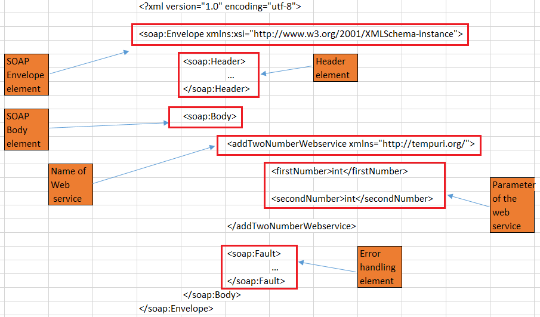
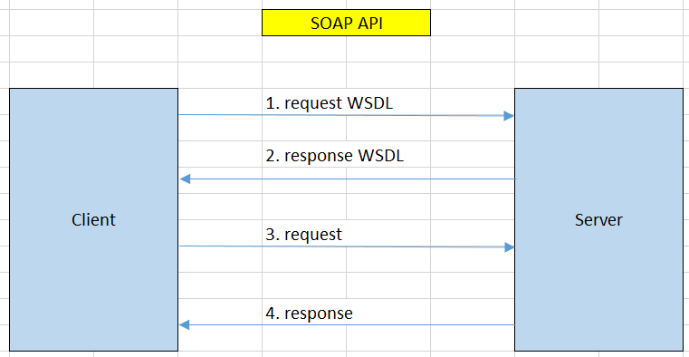

In this article, we will find something out about SOAP webservices, how to use it, and some its disadvantages and advantages.

Let's get started.

<br>

## Table of contents
- [Introduction to SOAP Webservice](#introduction-to-soap-webservice)
- [Understanding about the structure of SOAP API](#understanding-about-the-structure-of-soap-api)
- [How the client and server interact through SOAP API](#how-the-client-and-server-interact-through-soap-api)
- [When to use](#when-to-use)
- [Benefits and Drawbacks](#benefits-and-drawbacks)
- [The comparison between RESTful webservice and SOAP webservice](#the-comparison-between-RESTful-webservice-and-soap-webservice)
- [Wrapping up](#wrapping-up)

<br>

## Introduction to SOAP Webservice

According to [the definition of SOAP on wikipedia.com](https://en.wikipedia.org/wiki/SOAP), we have:

```
SOAP (abbreviation for Simple Object Access Protocol) is a messaging protocol specification for exchanging structured information in the implementation of web services in computer networks. Its purpose is to provide extensibility, neutrality, verbosity and independence.[vague] It uses XML Information Set for its message format, and relies on application layer protocols, most often Hypertext Transfer Protocol (HTTP), although some legacy systems communicate over Simple Mail Transfer Protocol (SMTP), for message negotiation and transmission.

SOAP allows developers to invoke processes running on disparate operating systems (such as Windows, macOS, and Linux) to authenticate, authorize, and communicate using Extensible Markup Language (XML). Since Web protocols like HTTP are installed and running on all operating systems, SOAP allows clients to invoke web services and receive responses independent of language and platforms.
```

<br>

## Understanding about the structure of SOAP API

1. Structure of SOAP Message

    

    Based on an image about the structure of SOAP message, we have:
    - The first part of SOAP message is the Envelope element.

    - The next part is Header element of SOAP message. It includes attributes used to process the message and is an optional element

    - Continuously, it is Body element. It contains all webservice's specification, its arguments that Client need to know.

    - Finally, it is Fault element. It provides error messages when processing and it is an optional element.

2. WSDL file

    WSDL is an XML file that defines and describes the services that are available in the web service of interest such as the data types being used in the SOAP messages and what all operations are available via the web service. 
    
    It describes the naming of services, the specifications and structure of the response sent back. The services in the WSDL are described as a compilation of network ports/endpoints.

<br>

## How the client and server interact through SOAP API

Below is an image to describe this relationship.



Based on an above image, we can have some steps:
1. Client send request to Server to get WSDL file or comon format of Webservice that Client need to abide by.

2. Then, Server publish its WSDL file's content for Client.

    Each SOAP web service is obliged to provide to a client a WSDL file which gives information like how sevice works and how to access it’s resources. It’s like a menu in the restaurant, the client receives a list of all actions that he/she is allowed to perform.

3. After being aware of what actions that Client can do with Server, Client will send real request to server.

    First, Client have to encapsulate the information such as webservice's name and its arguments into a SOAP message. This Client's action is called **Marshalling**.

    Then, sent it to Server as part of HTTP request.

4. Client receives response from Server.

    After receiving the SOAP message from Client, Server need to unwrap it. This Server's action is called **Demarshalling**.
    
    Next, calling the corresponding action that Server publish.

    Then, finishing that action, Server will send response back to Client.


<br>

## When to use

- SOAP is a better choice for applications that have complex API so as to describe the services and methods, where formal contracts are agreed for the exchange format, where a guaranteed level of security is required etc.

- Stateful operations – if the application has a requirement that state needs to be maintained from one request to another, then the SOAP 1.2 standard provides the WS* structure to support such requirements.

<br>

## Benefits and Drawbacks

1. Benefits

    - simple, flexible and highly extensible messaging protocol

    - SOAP is designed to be platform independent and is also designed to be operating system independent, and protocol independent.

        Because SOAP can operate over any protocol such as HTTP, SMTP, TCP, UDP.

    - Built-in error handling

    - Works well in distributed enterprise environments (REST assumes direct point-to-point communication)

    - SOAP message contains the data type of the webservice's argument, so Client have to know exactly --> improve security.

2. Drawbacks

    - Takes so much time with round-trip network.

    - Takes so much time to pre-processing the SOAP message.

    - takes more bandwidth.


<br>

## The comparison between RESTful webservice and SOAP webservice

|                    RESTful API                   |                  SOAP API                   |
| ------------------------------------------------ | ------------------------------------------- |
| REST stands for Representational State Transfer  | SOAP stands for Simple Object Access Protocol |
| REST is an Architectural style in which a web service can only be treated as a RESTful service if it follows the constraints of being: 1. Client Server, 2. Stateless, 3. Cacheable, 4. Layered System, 5. Uniform Interface | SOAP is a protocol. SOAP was designed with a specification. It includes a WSDL file which has the required information on what the web service does in addition to the location of the web service. |
| REST use Uniform Service locators to access to the components on the hardware device. | SOAP uses service interfaces to expose its functionality to client applications. In SOAP, the WSDL file provides the client with the necessary information which can be used to understand what services the web service can offer. |
| REST does not need much bandwidth when requests are sent to the server. REST messages mostly just consist of JSON messages. | SOAP requires more bandwidth for its usage. Since SOAP Messages contain a lot of information inside of it, the amount of data transfer using SOAP is generally a lot. |
| REST permits different data format such as Plain text, HTML, XML, JSON, etc. But the most preferred format for transferring data is JSON. | SOAP can only work with XML format. As seen from SOAP messages, all data passed is in XML format. |


<br>

## Wrapping up

- Understanding how SOAP webservice works between Client and Server.

- Understanding about when to use SOAP webservice.

<br>

Refer:

[https://www.journaldev.com/9123/jax-ws-tutorial](https://www.journaldev.com/9123/jax-ws-tutorial)

[https://www.oracle.com/technical-resources/articles/javase/soap.html](https://www.oracle.com/technical-resources/articles/javase/soap.html)

[https://www.guru99.com/soap-simple-object-access-protocol.html](https://www.guru99.com/soap-simple-object-access-protocol.html)

[https://www.guru99.com/comparison-between-web-services.html](https://www.guru99.com/comparison-between-web-services.html)