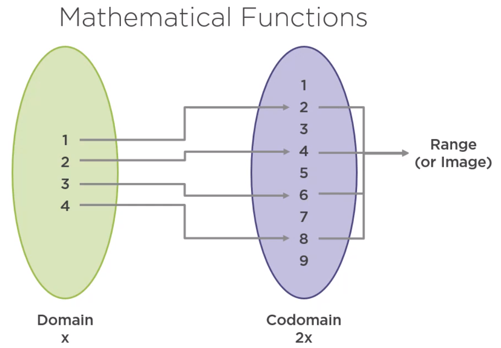
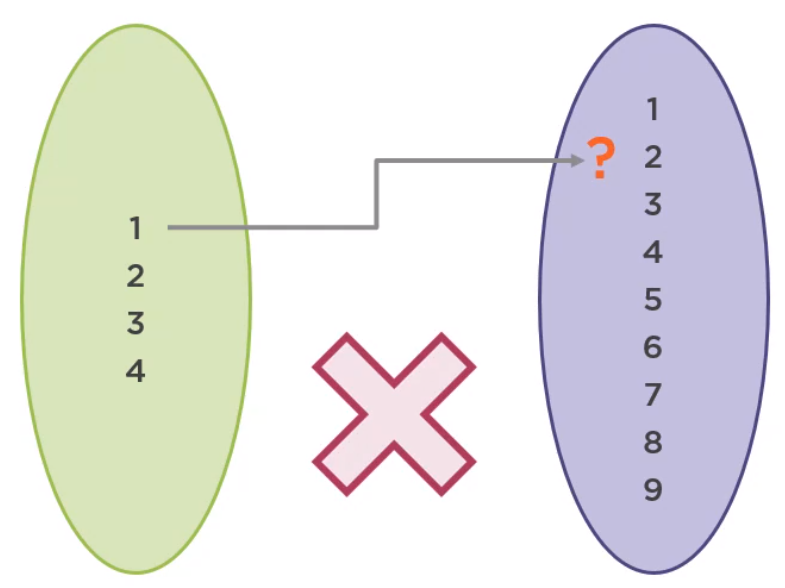
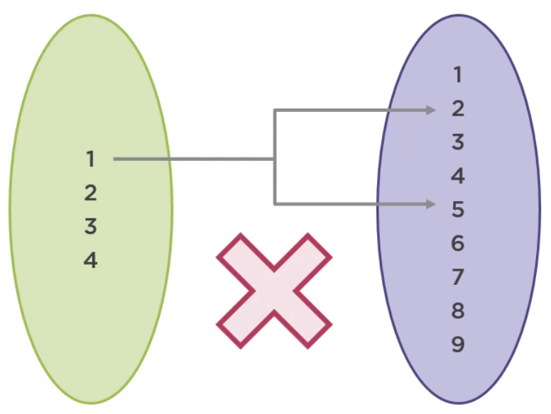
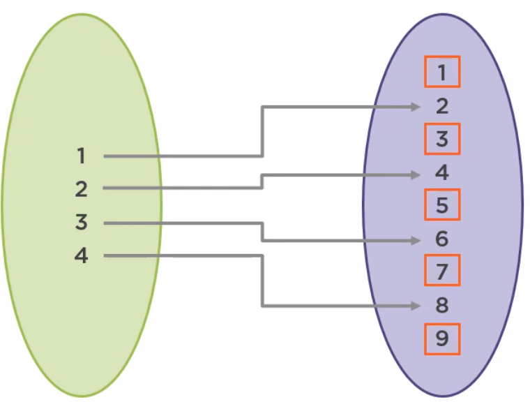
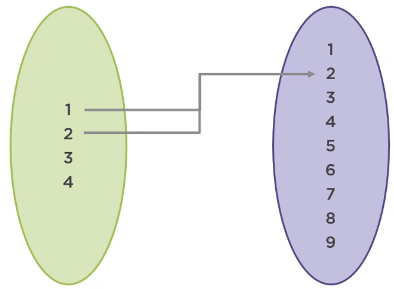
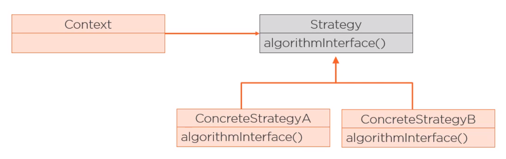

<br>

## Table of contents
- [Understanding about function](#understanding-about-function)
- [High-order functions](#high-order-functions)
- [Some examples that compose functions](#some-examples-that-compose-functions)
- [Wrapping up](#wrapping-up)


<br>

## Understanding about function

1. Mathematical functions

    In mathematics, a function is just a mapping from a domain all the values that go into a function to a range or image, the values that actually come out of the function, which is a subset of the codomain, the set of all the values that may possibly come out of the function.

    

    If f is a function from domain A to codomain B, the type of the function is represented this way. 
    - All elements of the domain must have one and only one corresponding element in the codomain.
    
        - There cannot exist elements in the domain with no corresponding value in the codomain.

            

    
        - There cannot exist two elements in the codomain corresponding to the same element of the domain.

            

        - There may be elements in the codomain with no corresponding element in the domain. In other words, they are not part of range but are part of the codomain.

            

        - There may be elements in the codomain with more than one corresponding element in the domain

            

        
2. Functions in Programming

    In programming, a function is just a block of instructions executed sequentially that performs a specific task. Functional programming attempts to reconcile these two definitions by giving functions a specific set of requirements so they can resemble mathematical functions.
    - They must not mutate their argument or anything outside the function.
    - They must always return a value.
    - When called with the same argument, they must always return the same result.


<br>

## High-order functions

1. Definition of High-order function

    A function becomes a high-order function when:
    - It takes a function as its input, or its argument.

        ```java
        hFunc(l -> l + 1);
        ```

    - It returns a function as its output.

        ```java
        Function<Long, Long> f = hFunc();
        ```

    - Both the above case.

        ```java
        Function<Long, Long> f = hFunc(l -> l + 1);
        ```

2. Application of High-order function

    - Strategy Pattern

        


        This pattern allows us to encapsulate the behavior that varies in a supertype, making different behaviors, the subclasses, interchangeable. In Java, this pattern is usually implemented using an interface, creating different implementations for different behaviors.

        For example:

        ```java
        interface RewardPointsGenerator {
            RewardPoints calculate(Order order);
        }

        Order processOrder(Order order, RewardPointsGenerator rewardPointGenerator) {
            // ...
            RewardPoints p = rewardPointGenerator.calculate(order);

            // ...
        }

        RewardPointsGenerator totalBasedRP = order -> { ... }
        RewardPointsGenerator numProductsBaseRP = order -> { ... }

        Order processOrder1 = processOrder(order, totalBasedRP);
        Order processOrder2 = processOrder(order, numProductsBaseRP);
        ```

        Instead of using RewardPointsGenerator interface, we can utilize the Function interface to implement a function from order to RewardPoints in this way.

        ```java
        Function<Order, RewardPoints> totalBasedRP = order -> { ... }
        Function<Order, RewardPoints> numProductsBaseRP = order -> { ... }

        Order processOrder(Order order, Function<Order, RewardPoints> rPGenerator) {
            // ...
            Integer rewardPoints = rPGenerator.apply(order);

            // ...
        }
        ```

        To avoid the clutter of a lambda expression with a body, we can move the code the a method and use a method reference.

        ```java
        Order processOrder1 = processOrder(order, this::totalBaseRewardPoints);
        Order processOrder2 = processOrder(order, this::numProductsBasedRewardPoints);
        ```

        In any cases, object-oriented, or functional programming, having simple units of code that are easy to read and test is a good practice, that's exactly what high-order functions can be small, concise units of code that are easy to test and make the code more readable.

3. The difference between High-order functions and Fluent Interfaces, Method chaining, Cascading

    Fluent interfaces refer to a style of programming to make methods more readable, where the output of one method is applied directly to another method without using intermediate variables and using a naming convention that makes its use more natural.

    For example:

    ```java
    BigDecimal amount = BigDecimal.TEN
                            .add(BigDecimal.ONE)
                            .multiply(BigDecimal.TEN)
                            .subtract(BigDecimal.ONE);
    ```

    Fluent interfaces are often implemented with method chaining, in which the calling of a method returns an object on which further methods can be called. This object may not necessarily be the same object that the method acts upon. BigDecimal is an example of method chaining because it is an immutable class whose methods return new BigDecimal instances.

    Cascading is similar to method chaining, but the return object is the current object. In other words, the methods always return this, which can imply a mutation of the properties of the object.

    ```java
    public StringBuilder append(String str) {
        super.append(str);
        return this;
    }
    ```

    Below is the example that we want to combine the points of many reward objects.

    ```java
    public class RewardPoints {
        public final Integer points;

        public RewardPoints(Integer points) {
            this.points = points;
        }

        public RewardPoints combine(RewardPoints rewardPoints) {
            return new RewardPoints(this.points + rewardPoints.points);
        }

        @Override
        public String toString() {
            return "RewardPoints {" +
            "points=" + this.points +
            "}"
        }
    }
    ```

    Using Fluent interface, we have:

    ```java
    RewardPoints reward1 = new RewardPoints(5);
    RewardPoints reward2 = new RewardPoints(10);
    RewardPoints reward3 = new RewardPoints(20);

    RewardPoints totalRewardPoints = reward1.combine(reward2)
                                            .combine(reward3);
    System.out.println(totalRewardPoints);
    ```

    Then, using a static method that receives two RewardPoints objects.

    ```java
    public static RewardPoints combine(RewardPoints rp1, RewardPoints rp2) {
        return new RewardPoints(rp1.points + rp2.points);
    }


    RewardPoints reward1 = new RewardPoints(5);
    RewardPoints reward2 = new RewardPoints(10);
    RewardPoints reward3 = new RewardPoints(20);

    RewardPoints totalRewardPoints = combine(combine(reward1, reward2), reward3);
    System.out.println(totalRewardPoints);
    ```

    Or we can think that the composition will look like the below code but this is not function composition. This is composing function applications.

    ```java
    public class RewardPointsCombiner2 {
        private static RewardPoints calculatRewardPoints(Order order) {
            return new RewardPoints(19);
        }

        private static RewardPoints roundRewardPoints(RewardPoints rewardPoints) {
            return new RewardPoints((int) (Math.round(rewardPoints.points/10.0) * 10));
        }

        public static void main(String[] args) {
            Order order = new Order();
            Function<Order, RewardPoints> totalBaseRewardPoints = RewardPointsCombiner2::calculatRewardPoints;
            Function<Order, RewardPoints> roundRewardPoints = RewardPointsCombiner2::roundRewardPoints;

            RewardPoints totalRewardPoints = roundRewardPoints.apply(totalBaseRewardPoints.apply(order));
            System.out.println(totalRewardPoints);
        }
    }
    ```

    Function composition will look more like the below code, where composed is defined this way or with a lambda expression.

    ```java
    public class RewardPointsCombiner3 {
        private static RewardPoints calculatRewardPoints(Order order) {
            return new RewardPoints(19);
        }

        private static RewardPoints roundRewardPoints(RewardPoints rewardPoints) {
            return new RewardPoints((int) (Math.round(rewardPoints.points/10.0) * 10));
        }

        private static Function<Order, RewardPoints> compose(Function<Order, RewardPoints> f1,
                                                             Function<Order, RewardPoints> f2) {
            return arg -> f1.apply(f2.apply(arg));
        }

        public static void main(String[] args) {
            Order order = new Order();
            Function<Order, RewardPoints> totalBaseRewardPoints = RewardPointsCombiner2::calculatRewardPoints;
            Function<Order, RewardPoints> roundRewardPoints = RewardPointsCombiner2::roundRewardPoints;

            // use the static compose method that has already defined
            Function<Order, RewardPoints> f = compose(roundRewardPoints, totalBaseRewardPoints);

            // use built-in compose() method of Function functional interface
            Function<Order, RewardPoints> f = roundRewardPoints.compose(totalBaseRewardPoints);

            // use built-in andThen() method of Function functional interface
            // f.compose(g) == g.andThen(f)
            Function<Order, RewardPoints> f = totalBaseRewardPoints.compose(roundRewardPoints);

            System.out.println(f.apply(order));
        }
    }
    ```


<br>

## Some examples that compose functions

1. Composing Functions

    Functions are blocks that can be composed to build other functions. Composition is the nesting of functions, passing the result of one function as the input of the next.

    For example, if we have a function f that adds 10 to the argument and a function g that multiplies the argument by 10, the composition of functions f and g is expressed as f round g and is equivalent to this.

    ```java
    f(x) = x + 10
    g(x) = x * 10

    f o g (x) = f(g(x))
    ```

    There are two things that we need to know:
    - One is that functions are applied in the inverse order of writing. In this case, g is applied first, and then f.
    - f o g is usually different from g o f, although sometimes they may be equivalent.

        ```java
        f(x) = x + 10
        g(x) = x + 5

        f o g (1) = f(g(1)) = f( 1 + 5 ) = 6 + 10 = 16
        g o f (1) = g(f(1)) = g( 1 + 11 ) = 5 + 11 = 16
        ```

        The reason for this is the associative property of these operations.

        The associative property is a mathematical principle that proves that the grouping of values does not affect the result.

        For example:

        ```java
        1 + 2 + 3 = (1 + 2) + 3 = 1 + (2 + 3)
        ```

        This property also applies to functional programming composition. For example, if we compose the functions a, b, and c, this will be equivalent to first composing a and b, and then compose the result to c, or composing b and c, and then compsing the result to a.

        ```java
        f = a o b o c

        // 1st way
        g = a o b
        f = g o c

        // 2nd way
        g = b o c
        f = a o g
        ```


2. Composing Predicates

    Predicate can be considered a function from T to Boolean, but instead of using compose(), or andThen() methods, the Predicate interface has the and() and or() methods.

    For example:

    ```java
    List<RewardPoints> Arrays.asList(
                            new RewardPoits(10),
                            new RewardPoits(20),
                            new RewardPoits(45),
                            new RewardPoits(90),
                            new RewardPoits(120)
    );

    Predicate<RewardPoints> moreThan40Points = rp -> rp.points > 40;
    Predicate<RewardPoints> lessThan100Points = rp -> rp.points < 100;

    List<RewardPoints> filteredRewardPoints = list.stream()
                                                  .filter(moreThan40Points.and(lessThan100Points))
                                                  .collect(Collectors.toList());
    System.out.println(filteredRewardPoints);                                
    ``` 

    ```java
    public static <T> Predicate<T> orPredicates(Predicate<T>... predicates) {
        Predicate<T> p = x -> false;
        return Arrays.stream(predicates).reduce(p, Predicate::or);
    }
    ```

<br>

## Wrapping up

- A function is a mapping from:

    - A domain (the values that go into a function)
    - To a codomain (all the possible values that can come out of the function)

    The actual values that come out of the function are the range or image.

- Functional programming requirements

    - Functions must not mutate anything outside the function
    - Functions must not mutate their arguments
    - Functions must always return the same result when called with the same argument

- In Java, functions can be represented by:

    - static methods
    - lambda expressions, or method references backed by a functional interface

- High-order functions promote

    - abstraction
    - composition
    - reusing of behavior

<br>

Refer:

[https://app.pluralsight.com/library/courses/applying-functional-programming-techniques-java/table-of-contents](https://app.pluralsight.com/library/courses/applying-functional-programming-techniques-java/table-of-contents)