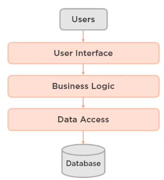

<br>

## Table of contents
- [Given problem](#given-problem)
- [Solution with Clean architecture](#solution-with-clean-architecture)
- [Source code](#source-code)
- [Benefits and Drawbacks](#benefits-and-drawbacks)
- [The relationship with other patterns](#the-relationship-with-other-patterns)
- [Wrapping up](#wrapping-up)


<br>

## Given problem

Normally, we use the three layer architecture, for example, MVC architecture pattern, to organize our project. Below is the background of this pattern.



Below is the functionalities of each layer in an above image.
- User Interface layer or Web Service layer

    This layer will manage all user interface that can be interacted with users. Or it can communicate with the other system by using SOAP API or Restful API.

    After receiving requests from users, it will transfer requests to the below layers.

- Business Logic layer

    This layer will process requests that satisfy all business rules. If requests violate some business rules, this layer will return the result for the WebService layer or response result to users.

    If requests pass some rules, they will be pushed to the Data Access layer to persistence their states. Or this layer will call Data Access layer to get data to check information that it wants.

- Data Access layer

    Data Access layer will interac with the physical system such as database or redis, search engine, ... It will be used to save the requests's states permanently. Or it will query SQL to get the result based on the need of Business Logic layer.

    We use some ORM frameworks such as Hibernate, EclipseLink, ... to map fields of object to the table's columns. These object is called entities.

Then, we will design database for our application based on some normalizations. After we have tables, we will create entities and repositories or DAO with CRUD operations in the Data Access layer or Persistence layer.

In Business Logic layer, we will use directly entities from Data Access layer. So Business Logic layer will have strong coupling with Data Access layer. It means that we are utilizing entities as the business model. But Web Service layer or User Inteface also depends on Business Logic layer.

So our application, currently, depends on the database. Customer's requirements always change, then our database design is also modified. Our layers will break down. We need to write code again. This is a bad architecture when coping with the changes.

The another drawback of layered architecture is its rules. The current layer only knows about the beneath layers. Sometimes, we want to use common layers such as util, shared, ..., then we need to push it into the most bottom layer, it is Persistence layer. It makes Persistence layer growing rapidly. Our code becomes mess.

Bad or messy architecture is architecture that is complex, but due to accidental complexity rather that necessary complexity. Belows are some drawbacks of bad architecture that we need to know.
- It's incoherent in the sense that the parts do not seem like they fit together.
- It's rigid, that is the architecture resists change or makes it difficult to evolve the architecture over time.
- It's brittle, touching a part of the code might break another part of the code somewhere else.
- It's untestable.
- Ultimately, all of these things lead to an architecture that's unmaintainable over the life of the project 

--> So, based on the bad architecture's characteristics, we need the clean architecture.

<br>

## Solution with Clean architecture

1. History of Clean Architecture


2. Introduction to Clean Architecture

    

    Belows are some explanations for each part in the above image.
    - Entities

        It is used to describe the business objects of our system. It can contains the nested complex objects.

        Uncle Bob considers an entity can be an object with methods, or it can be a set of data structures and functions. It is different than the objects in DDD.

        In the layered architecture pattern, entities is put in the Persistence layer. But in clean architecture, Domain-driven Design, Hexgonal architecture, entities is pulled up to the Domain layer. This way will seperate the dependence of Domain layer to the Persistence layer. When our system is more complex, it can overcome the changes.

    - Use Case

        Use Cases are some business behaviors when the system receives requests. It can be considered as the Service layer in the layered architecture pattern.

        In the reality, in our project, we usually define the operations that interact with the outside such as databases, memory caches, ... as the interfaces. It helps us to abstract all things from outside as much as possible. If the customer wants to changes a place that we want to persistent data from database to cache, we can easily switch them without influencing the current businesses of our system.

        Normally, we expect one use case for each business action. And in each use case, we will include some interfaces that we need to communicate with the other system.

        And one thing that we need to know is that throw business exceptions for validations of fields. If we encounter the cases about null pointer exception, throws the sytem exceptions.

    - Interface/Adapters

        This layer is used to interact with the other systems. It can be splited two smaller layers.
        - DataProviders

            To interact with database or other systems that contain data, we will define some classes that implement the interfaces in Use Cases.

        - EntryPoints

            To communicate Web Services such as Restful API, SOAP API, JPos ISO, gRPC, each controller will need to inject instances of the specific use cases.

            All data from the other services, we need to convert to our DTO objects.

    - Frameworks and drivers

        This layer will be relevant to the external system such as Database, web framework, ... Normally, we do not need to take care about it. But it is used to combine everything together.

        Supposed in Spring framework, this layer will define main class, and some configuration classes.

3. The package structure of Clean Architecture

    From the above section, we understood the theory of Clean architecture. But how do we transform this thought into the package and implement with source code.

    Below is the structure of package in Clean architecture.

    ```
    com.manhpd
        |
        |
        |--- configuration
        |    |
        |    |--- database
        |    |
        |    |--- redis
        |    |
        |    |--- elastic_search
        |
        |--- core
        |    |
        |    |--- entity
        |    |
        |    |--- usecase
        |
        |--- dataprovider
        |    |
        |    |--- database
        |    |
        |    |--- redis
        |    |
        |    |--- elastic_search
        |
        |--- entrypoints
        |    |
        |    |--- rest
        |    |
        |    |--- job
        |
    ```

<br>

## Source code

1. Given problem

    Supposed that we want to simulate how an Account can transfer Money to an another Account.

2. Analysis entities and use cases - core layer

    There are some entities in this problem:
    - Account
    - Activity

    And we have one use case - send money. In this SendMoneyUseCase, we need to check the balance of this Account with the transfered money.

3. Analysis the interface adapters layer

    - With DataProvider layer, we have some actions with database:

        - Load information about this account.
        - Update that account's information when it satisfied about the balance and the transfered money.

    - With EntryPoint layer, we have SendMoneyEndPoint business action.

4. Source code

    

<br>

## Benefits and Drawbacks

1. Benefits

    We have good, clean architecture when it is simple or at least it's only as complex as is necessary, and that complexity is not accidental.

    - It's understandable, that is it's easy to reason about the software as a whole.

    - It's flexible, we can easily adapt the system to meet changing requirements.

    - It's emergent, the architecture evolves over the life of the project.

    - It's testable, the architecture makes testing easier, not harder.

    - Ultimately, all of these leads to an architecture that's more maintainable over the life of the project.

2. Drawbacks

    - If our Entities that managed by ORM framework in Persistence layer is as same as the Domain Objects in Domain layer or Business Logic layer because we only use database without using other systems, it makes redundancy, the cost about memory, the time to convert between Entities and Domain Objects.

    - We need to create so many interfaces such as define multiple use cases that our system needs multiple business action, it makes our performance not good. To understand about this trait, we need to find some resources that talk about the internal implementations of inheritance and polymorphism of OOP.

        If we remove this drawback about that we have multiple interfaces, we can find a benefit here. We are decoupling between Domain and some persistence frameworks such as Hibernate, Eclipse Link, ... when we want to change accroding to the customer's requirements.

<br>

## Wrapping up

- Understanding some particular parts in Clean Architecture such as Entities, Use Cases, Interfaces/Adapters, and Frameworks && Drivers.

<br>

Refer:

[https://blog.cleancoder.com/uncle-bob/2012/08/13/the-clean-architecture.html](https://blog.cleancoder.com/uncle-bob/2012/08/13/the-clean-architecture.html)

[https://blog.ndepend.com/introduction-clean-architecture/](https://blog.ndepend.com/introduction-clean-architecture/)

[https://www.insaneprogramming.be/article/2017/02/14/thoughts-on-clean-architecture/](https://www.insaneprogramming.be/article/2017/02/14/thoughts-on-clean-architecture/)

[https://dzone.com/articles/clean-architecture-is-screaming](https://dzone.com/articles/clean-architecture-is-screaming)

[https://www.slideshare.net/mattiabattiston/real-life-clean-architecture-61242830](https://www.slideshare.net/mattiabattiston/real-life-clean-architecture-61242830)

[Clean Architecture: Patterns, Practices, and Principles](https://app.pluralsight.com/library/courses/clean-architecture-patterns-practices-principles/table-of-contents)

[https://medium.com/@tiagoflores_23976/how-choose-the-appropriate-ios-architecture-mvc-mvp-mvvm-viper-or-clean-architecture-2d1e9b87d48](https://medium.com/@tiagoflores_23976/how-choose-the-appropriate-ios-architecture-mvc-mvp-mvvm-viper-or-clean-architecture-2d1e9b87d48)

[https://de.slideshare.net/HimanshuDudhat1/mvp-clean-architecture](https://de.slideshare.net/HimanshuDudhat1/mvp-clean-architecture)

[https://softwareengineering.stackexchange.com/questions/336677/what-is-the-difference-between-mvp-and-clean-architecture](https://softwareengineering.stackexchange.com/questions/336677/what-is-the-difference-between-mvp-and-clean-architecture)

[https://engineering.21buttons.com/clean-architecture-in-django-d326a4ab86a9](https://engineering.21buttons.com/clean-architecture-in-django-d326a4ab86a9)

[https://gist.github.com/ygrenzinger/14812a56b9221c9feca0b3621518635b](https://gist.github.com/ygrenzinger/14812a56b9221c9feca0b3621518635b)

[https://medium.freecodecamp.org/how-to-write-robust-apps-consistently-with-the-clean-architecture-9bdca93e17b](https://medium.freecodecamp.org/how-to-write-robust-apps-consistently-with-the-clean-architecture-9bdca93e17b)

[https://marconijr.com/posts/clean-architecture-practice/](https://marconijr.com/posts/clean-architecture-practice/)

<br>

**The referenced source code**

[https://github.com/mattia-battiston/clean-architecture-example/](https://github.com/mattia-battiston/clean-architecture-example/)