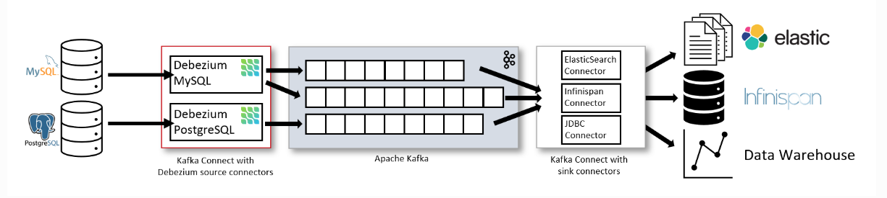
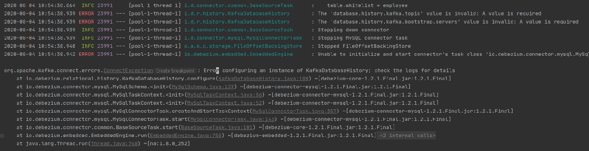
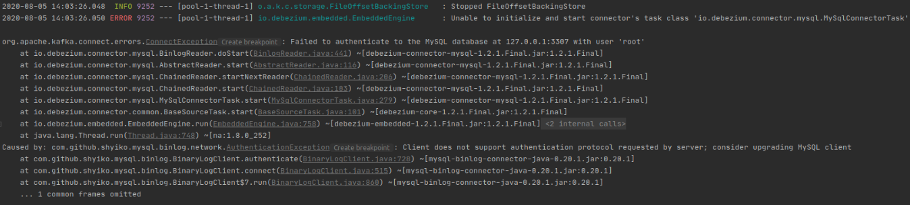
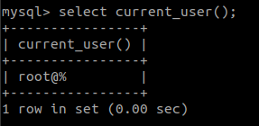

<br>

## Table of contents
- [Given problem](#given-problem)
- [Solution with Debezium](#solution-with-debezium)
- [Using Docker Compose to define all softwares](#using-docker-compose-to-define-all-softwares)
- [Source code](#source-code)
- [Some notes about configuration of this project](#some-notes-about-configuration-of-this-project)
- [Some problems happen in this project](#some-problems-happen-in-this-project)
- [Wrapping up](#wrapping-up)


<br>

## Given problem

In Microservice architectural pattern or CQRS pattern that is combined with Event Sourcing, all things that we will work is events. It makes our our system reliable, fault-tolerance, asynchronous, ...

Then, how do we implement it in the real projects?


<br>

## Solution with Debezium

In this article, we will use Debezium to deal the above problem. In reality, Debezium is built on top of Kafka Connect, Kafka, and some other driver of databases.

Before jumping into source code, we need to understand about the architecture of Debezium.



Debezium will contain some important parts:
- Source

    This part will be database that we usually in project such as MySQL, PostgreSQL, Oracle, MariaDB, ...

- Sink

    This part will be used to contain all data that we get from Source part. Our data will be processed based on our intention.

    If we want to statistic errors, rates about requests, ..., we can use Elastic Search.

    If we want to cache all things, we can use Infinispan.

- Intermediate components

    This part contains:
    - Debezium library will read binlog file of MySQL, or transaction log of the other databases to convert CRUD operations in database into events of Debezium.

    - Kafka Connect will receive data from Debezium. Then it pushes data into the specific topic that we configure.

    - Apache Kafka

<br>

## Using Docker Compose to define all softwares

In this project, we will use some tools:
- MySQL 8.0
- Kafka 2.5 with Zookeeper
- Redis

Below is the content of docker-compose.yaml file.

```yaml
version: '3'

services:
  # https://hub.docker.com/_/mysql
  mysqldb:
    image: mysql:8.0
    container_name: mysql
    ports:
      - 3307:3306
    command: --max-connections=1000
    environment:
      - MYSQL_DATABASE=employee_sample
      - MYSQL_ROOT_PASSWORD=12345
    volumes:
      - mysqldb_data:/var/lib/mysql
    restart: always

  redis:
    image: redis:5.0.7
    container_name: redis
    ports:
      - 6379:6379
    volumes:
      - redis_volume:/data
    restart: always

  zookeeper-server:
    image: bitnami/zookeeper:latest
    container_name: zookeeper-server-dev
    ports:
      - 2181:2181
    environment:
      - ALLOW_ANONYMOUS_LOGIN=yes
    restart: always
    volumes:
      - zookeeper_data:/bitnami
    networks:
      - backend

  kafka-server:
    image: bitnami/kafka:latest
    container_name: kafka-server-dev
    ports:
      - 9092:9092
    environment:
      - ALLOW_PLAINTEXT_LISTENER=yes
      - KAFKA_LISTENERS=PLAINTEXT://:9092
      - KAFKA_ADVERTISED_LISTENERS=PLAINTEXT://127.0.0.1:9092
      - KAFKA_CFG_ZOOKEEPER_CONNECT=zookeeper-server:2181
    restart: always
    depends_on:
      - zookeeper-server
    volumes:
      - kafka_data:/bitnami
    networks:
      - backend

# local means the volumes zookeeper_data, kafka_data are created on the same Docker host
# where we run our container.
# It is equivalent to:
# docker volume create --driver local --name zookeeper_data
# docker volume create --driver local --name kafka_data
volumes:
  mysqldb_data:
    driver: local
  zookeeper_data:
    driver: local
  kafka_data:
    driver: local
  redis_volume:
    driver: local

networks:
  backend:
    driver: bridge
```

When we run with command **docker-compose up**, we need to configure **binlog** file with row mode.

<br>

## Source code

To view source code of this project, you can refer to this link on [github](https://github.com/gamethapcam/J2EE/tree/master/src/Java_Spring/Spring-Boot/cdc-debezium).

<br>

## Some notes about configuration of this project

To understand the meaning of each parameter in Debezium's configuration, we need to look at the below table.

|               Name               |                                          Description                                     |                   Sample value                |
| -------------------------------- | ---------------------------------------------------------------------------------------- | --------------------------------------------- |       
| connector.class                  | The connector’s name when registered with the Kafka Connect service.                     | io.debezium.connector.mysql.MySqlConnector    |
| offset.storage                   |                                                                                          | org.apache.kafka.connect.storage.FileOffsetBackingStore |
| offset.storage.file.filename     | Specify the name of file that we want                                                    | /tmp/file.dat                                 |
| offset.flush.interval.ms         | Interval at which to try committing offsets for tasks of Kafka Connect                   | 60000                                         |
| name                             | The name of this connector that we want                                                  | table_name-mysql-connector                    |
| database.server.id               | By default, a random number is generated between 5400 and 6400, though we recommend setting an explicit value. | a random value          |
| database.server.name             | This is the logical name of the MySQL server or cluster                                  | mysqlServer-employee                          |
| database.hostname                | The MySQL server address                                                                 | 127.0.0.1                                     |
| database.port                    | The MySQL server port number                                                             | 3306                                          |
| database.user                    | The MySQL user with the appropriate privileges.                                          | root                                          |
| database.password                | The MySQL user’s password.                                                               | ******                                        |
| database.dbname                  | The MySQL database name that we want to listen data change event                         | employee                                      |
| table.whitelist                  | A list of all tables that we want to monitor. Each identifier is of the form databaseName.tableName. By default the connector will monitor every non-system table in each monitored database | employee_sample.employee |
| database.whitelist               | An optional comma-separated list of regular expressions that match database names to be monitored; any database name not included in the whitelist will be excluded from monitoring. By default all databases will be monitored. May not be used with database.blacklist. | employee_sample,order_sample |
| debezium.source.database.history | In this option, we can have two values: io.debezium.relational.history.MemoryDatabaseHistory or io.debezium.relational.history.FileDatabaseHistory | io.debezium.relational.history.MemoryDatabaseHistory |
| debezium.source.database.history.file.filename | If we select the value io.debezium.relational.history.FileDatabaseHistory, then we need to point the path of file | /path/db-history.dat |
| database.history.kafka.topic     | Define a topic that Kafka Connect will push data into it. It is as same as a topic that we defined with Kafka | dbHistory.table_name     |
| database.history.kafka.bootstrap.servers | A list of Kafka brokers that the connector uses to write and recover DDL statements to the database history topic | localhost:9092 |


<br>

## Some problems happen in this project

1. Timeout with Kafka


2. Error configuring an instance of KafkaDatabaseHistory; check the logs for details

    - Given problem

        

    - Solution

        In order to create KafkaDatabaseHistory right away, we need to configure some important options for Kafka.
        - **database.history.kafka.topic** option

            The value of this option is equal to the topic that we are configured in kafka.

        - **database.history.kafka.bootstrap.servers** option

            The value of this option is the IP address of Kafka. 

        - **debezium.source.database.history** option for the mysql connector

            The default value is **io.debezium.relational.history.KafkaDatabaseHistory**. If we use non-Kafka deployments, we need to use one the following values:
            - **io.debezium.relational.history.FileDatabaseHistory** (along with **debezium.source.database.history.file.filename** property);

            - **io.debezium.relational.history.MemoryDatabaseHistory** for test environments.

3. Access the volume in local host

    This volume directory is protected by Linux, so we can not access it by using cd command.

    To solve this problem, we can use command ```sudo ls <volume_name>```.

4. Client does not support authentication protocol requested by server; consider upgrading MySQL client

    - Given problem

        When we use MySQL 8.0, we will encounter this problem. Because mysql-binlog-connector-java library depends on the mysql-connector-java library in the old version that uses the different encryption algorithm.

        

    - Solution

        To solve this problem, we will configure MySQL 8.0 server that accepts the password of the old encryption algorithm.
        - MySQL 8.0 uses [Secure Password Authentication](https://dev.mysql.com/doc/internals/en/secure-password-authentication.html) algorithm for password.
        - The older version of MySQL uses [sha2_password authentication algorithm](https://dev.mysql.com/doc/internals/en/sha256.html).

        Before jump to fix it, we need to know the name of our current user. Then, we can use the below command:

        

        ```sql
        ALTER USER 'root'@'%' IDENTIFIED WITH mysql_native_password BY 'our_password';
        ```

<br>

## Wrapping up

- Understanding about some configurations when we are working with debezium in our project.

- Take care about configuration because it can cause some problems.


<br>

Thanks for your reading.

<br>

Refer:

[https://medium.com/swlh/change-data-capture-cdc-with-embedded-debezium-and-springboot-6f10cd33d8ec](https://medium.com/swlh/change-data-capture-cdc-with-embedded-debezium-and-springboot-6f10cd33d8ec)

[https://debezium.io/documentation/reference/0.9/connectors/mysql.html](https://debezium.io/documentation/reference/0.9/connectors/mysql.html)

[https://www.postgresql.org/docs/9.6/logicaldecoding-explanation.html](https://www.postgresql.org/docs/9.6/logicaldecoding-explanation.html)

[https://github.com/debezium/debezium/tree/master/debezium-connector-mysql](https://github.com/debezium/debezium/tree/master/debezium-connector-mysql)

[https://debezium.io/documentation/reference/1.2/operations/debezium-server.html#debezium-source-database-history-class](https://debezium.io/documentation/reference/1.2/operations/debezium-server.html#debezium-source-database-history-class)

[https://pulsar.apache.org/docs/en/2.3.0/io-cdc-debezium/](https://pulsar.apache.org/docs/en/2.3.0/io-cdc-debezium/)

[https://debezium.io/documentation/reference/1.2/connectors/mysql.html](https://debezium.io/documentation/reference/1.2/connectors/mysql.html)

<br>

**Timeout when deploying Kafka**

[https://rmoff.net/2018/08/02/kafka-listeners-explained/](https://rmoff.net/2018/08/02/kafka-listeners-explained/)

[https://github.com/confluentinc/demo-scene/blob/master/community-components-only/docker-compose.yml#L22-L51](https://github.com/confluentinc/demo-scene/blob/master/community-components-only/docker-compose.yml#L22-L51)

[https://stackoverflow.com/questions/53586130/kafka-topic-creation-timed-out-waiting-for-a-node-assignment](https://stackoverflow.com/questions/53586130/kafka-topic-creation-timed-out-waiting-for-a-node-assignment)

<br>

**Fix bug about authenticating in MySQL 8.0**

[https://medium.com/codespace69/mysql-8-0-client-does-not-support-authentication-protocol-requested-by-server-consider-8afadc2385e2](https://medium.com/codespace69/mysql-8-0-client-does-not-support-authentication-protocol-requested-by-server-consider-8afadc2385e2)