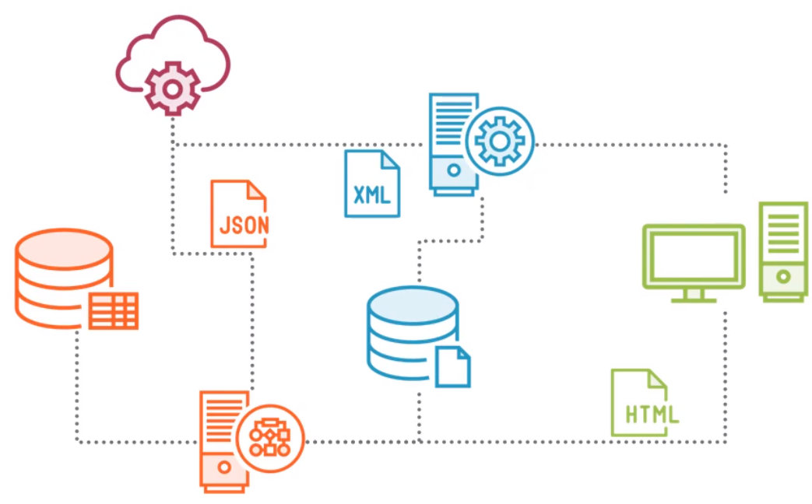
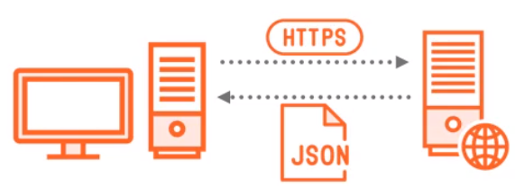
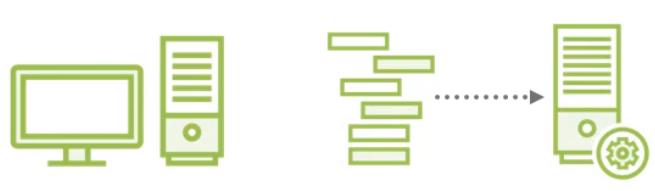
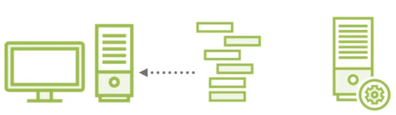
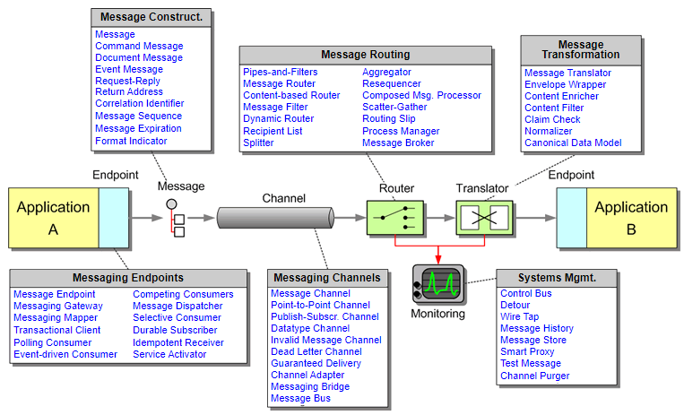
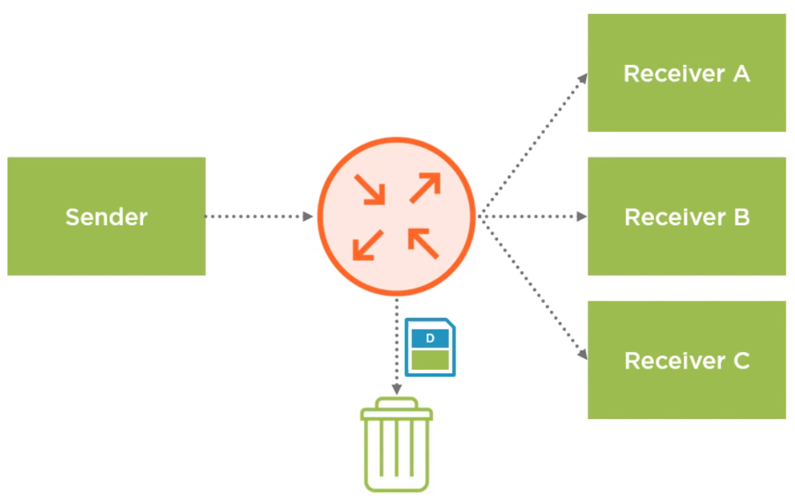
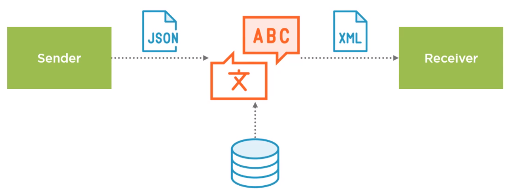
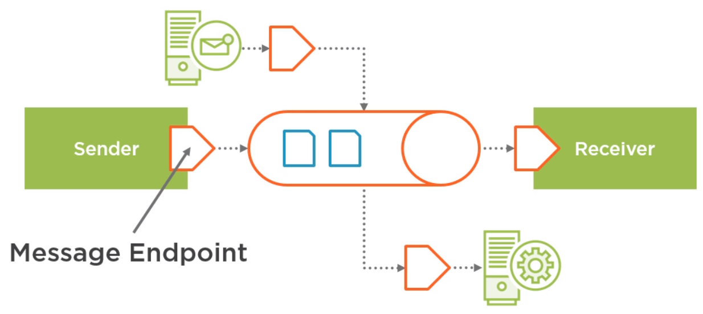

 

## Table of contents
- [Introduction to Enterprise Integration Patterns](#introduction-to-enterprise-integration-patterns)
- [Messaging Channels](#messaging-channels)
- [Message Routing](#message-routing)
- [Message Transformation](#message-transformation)
- [Messaging Endpoints](#message-endpoints)
- [Some open source frameworks that implement EIP](#some-open-source-frameworks-that-implement-EIP)
- [Benefits and Drawbacks](#benefits-and-drawbacks)
- [Wrapping up](#wrapping-up)

 

## Given problem

Supposed that many companies have many different software systems and applications to run their business. The systems often have to be connected to work with each other and also two systems outside of the company itself. Connecting these different systems is what we mean by integration.

Integrating systems is not always easy, because the systems may have fastly different interfaces and use different data formats. Some of the ways in which systems can be connected together include Web services, messaging systems, exchanging files, FTP, shared databases, email and even custom application level networking protocols. Integration is about connecting systems using these mechanisms and also about translating data between different formats.

So, how can we apply design pattern in the integration of system?

 

## Introduction to Enterprise Integration Patterns

1. Enterprise Integration Patterns
    
    The EIPs focus on asynchronous messaging. In the below, we will compare the difference between asynchronous and synchronous, and the advantages of asynchronous way.

    One common way to let software components communicate with each other is through Web services, especially Restful API.
    - Synchronous

        

        With JSON as the common data format are frequently used, webservies work in synchronous way. The client sends a request to the server and then waits until the server has processed it and sends back reponses. However, communication does not always need to be synchronous. In many cases, it can be asynchronous instead.

    - Asynchronous

        

        When using asynchronous messaging system, the sender sends a message and immediately continues processing, not waiting for a response. The messaging system will make sure that the message is delivered to the receiver at some point in the future.

        

        If the response is needed, a message might be sent back to the original sender in the same way.

        
        
    It's the same as the difference between talking to someone on the phone and sending someone a text message. Talking on the phone is synchronous, we say something and then wait for the other person to respond to what we said.

    Sending a text message is asynchronous. We send a message and continue doing other things. At some point in the future, the other person will read our message.

    Some advantages of Asynchronous:
    - More responsive system because sender does not have to wait.
    - Message buffering makes the system resilient to failure.

        For example, in the queue. This makes it possible for the system to continue working. If the reciever is temporarily unavailable when the receiver is back up again, it continues to process messages that are waiting it in the queue. This makes system to be able to deal with temporary failures withou losing data.

    - Receier processes messages at its own rate.

        A queue also helps to prevent the receiver being overwhemed with requests because the receiver can get messages from the queue and process them at a rate that is independent of how fast the sender is putting messages into the queue.

2. Some types of EIPs

    EIPs splits into some types.
    - Messaging Systems

    - Messaging Channels

        It deals with various different types of channels which enable messages to be exchanged between applications.

    - Message Constructions

        It describes how messages can be constructed.

    - Message Routing

        It describes ways how message can be routed from a source to one or more destination applications.

    - Message Transformation

        It deals with transformation issues for messages.

    - Messaging endpoints

        It shows different ways how applications can be connected to messaging system.

    - System management

        It deals with management and governance issues of message-based EAI (Enterprise Application Integration) solutions.

    Belows are 65 messaging patterns, organized as follows:

    

3. Some common definitions in EIPs

    - Message

        It's very important to understand what exactly a message is. Because it's a data unit to transmit between systems.

        Message contains two parts:
        - header

            The header contains metadata, which can be anything that the messaging system needs to deliver the message to a receiver, for example, timestamp.

            If we know how Http works, then this model of a message will look familiar. An Http request and response also consists of headers with metadata and optionally, a body that contains application-specific data to get messages from a sender to receiver.

        - payload

            A payload is the actual content of the message. This can be any kind of data, and the meaning of the payload is application specific.
 

## Messaging Channels

If our system want to communicate with the other systems by decoupling them, we need to use Message Channel's patterns to deal with it.

A message channel is an abstract idea of something that carries messages from a sender to receiver. There are many different ways to implement message channel. For example, queue, but a message channel is not always a queue.

Belows are some messaging channel patterns that we need to know.
- Point-to-Point Channel
- Publish-Subscribe Channel
- Datatype Channel
- Invalid Message Channel
- Dead Letter Channel
- Guaranteed Delivery
- Channel Adapter
- Messaging Bridge
- Message Bus

But we can only look at the two main types of message channel, which are point-to-point channel and publish-subscribe channel.
- A Point-to-Point channel is a message channel that connect exactly one sender with exactly one receiver.

    For example, a queue.

- A Publish-Subscribe channel is used to broadcast messages from one sender to multiple receivers.

    One common scenario where we would want to use a publish-subscribe channel is to broadcast event notifications to parts of our software that are interested in particular types of events.

 

## Message Routing

There might be some situations where the receiver of a message that gets sent to a Message Channel is not always fixed. We might want to decide, for example, based on a specific header value in the message, which receiver should process the message.

A message router is a component in the messaging system that makes such decisions. The messaging system might even decide to drop a message all together and not deliver to any receiver. A component that makes such decisions is a message filter.

Below is some patterns in Message Routing.
- Message Router
- Message Filter
- Splitter
- Dynamic Router

 

## Message Transformation

The different systems often produce and consume data in different formats.

For example, a sender might produce messages in JSON format, and a receiver expects XML, we need a message translator between them to convert messages from JSON to XML.

Other kinds of message transformers work on the headers rather than the payload of a message, or enriched the content of a message with the document from another source, such as a database.

Belows are some patterns in Message Transformation.
- Message Translator
- Content Enricher
- Envelope Wrapper
- Content Filter
- Claim Check
- Normalizer
- Canonical Data Model

 

## Messaging Endpoints

When we work with a messaging system, senders and receivers of messages need to connect in some way to be able to send and receive messages. A message endpoint is the part of the code of a sender and a receiver that connects to the messaging system.

Some patterns in Messaging Endpoints:
- Channel Adapter
- Gateway
- Service Activator

 

## Some open source frameworks that implement EIP

1. Apache Camel

2. Mule

3. Apache ActiveMQ

4. Apache ServiceMix

5. Spring Integration

    Some benefits of using Spring Integration:
    - Integrate many different kinds of systems without writing plumbing code.
    - Separate integration code from business logic.
    - Use EIPs in our Spring-based applications.

 

## Benefits and Drawbacks

1. Benefits

    - These patterns address the rigidity commonly found in point-to-point integration solutions.
    - Improving the agility of the overall enterprise system changes are no longer costly endeavors. They allow business processes to change quickly at the need of the enterprise.
    - EIPs bring stability to business processes by decoupling interconnected systems often through the introduction of a queue or middle platform for guaranteeing delivery of messages.

2. Drawbacks

 

## Wrapping up

- Understanding some types of Enterprise Integration Patterns.

- Some frameworks that we can use to apply EIPs.

 

Refer:

[Enterprise Integration Patterns ebook by Gregor Hohpe and Bobby Woolf](http://amazon.com/o/asin/0321200683/ref=nosim/enterpriseint-20)

[Architectural patterns in Packtpub]()

[http://michalwarecki.blogspot.com/search/label/Enterprise%20Integration%20Patterns?updated-max=2012-07-15T06:29:00-07:00&max-results=20&start=2&by-date=false](http://michalwarecki.blogspot.com/search/label/Enterprise%20Integration%20Patterns?updated-max=2012-07-15T06:29:00-07:00&max-results=20&start=2&by-date=false)

[http://michalwarecki.blogspot.com/2012/04/enterprise-integration-patterns-eip.html](http://michalwarecki.blogspot.com/2012/04/enterprise-integration-patterns-eip.html)

[https://schatten.info/publications/cee_set/cee_set2008.pdf](https://schatten.info/publications/cee_set/cee_set2008.pdf)

[https://dzone.com/refcardz/enterprise-integration?chapter=3](https://dzone.com/refcardz/enterprise-integration?chapter=3)

[https://www.javacodegeeks.com/2012/11/introduction-to-enterprise-integration-patterns.html](https://www.javacodegeeks.com/2012/11/introduction-to-enterprise-integration-patterns.html)

[https://www.enterpriseintegrationpatterns.com/patterns/messaging/](https://www.enterpriseintegrationpatterns.com/patterns/messaging/)

 

**Some EIPs that Apache Camel supports**

[https://www.baeldung.com/apache-camel-intro](https://www.baeldung.com/apache-camel-intro)

[https://camel.apache.org/components/latest/eips/enterprise-integration-patterns.html](https://camel.apache.org/components/latest/eips/enterprise-integration-patterns.html)