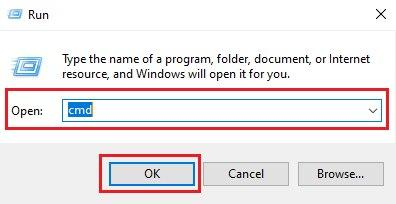
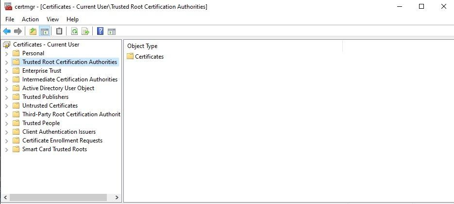
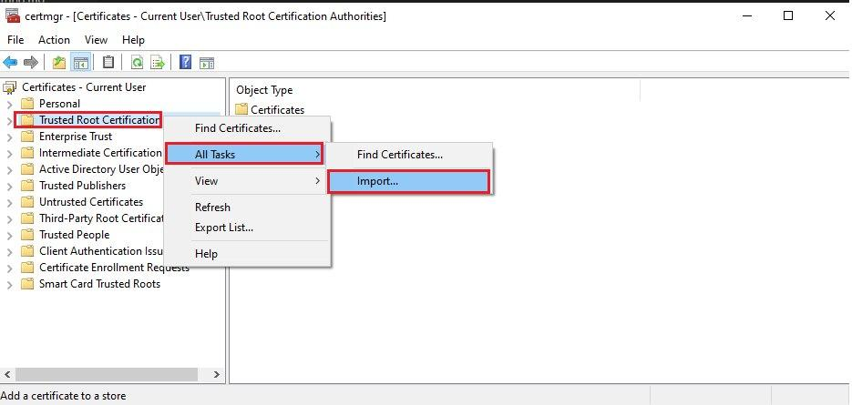
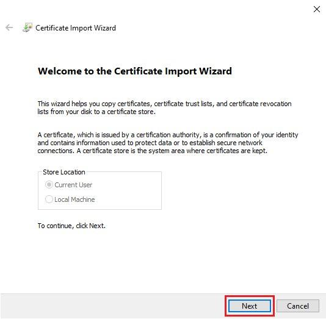
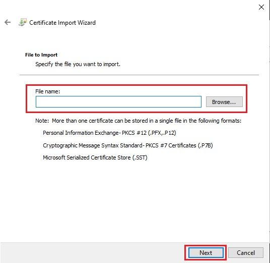
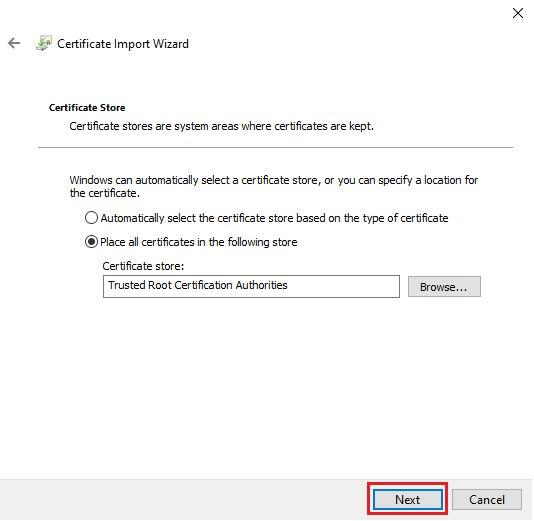
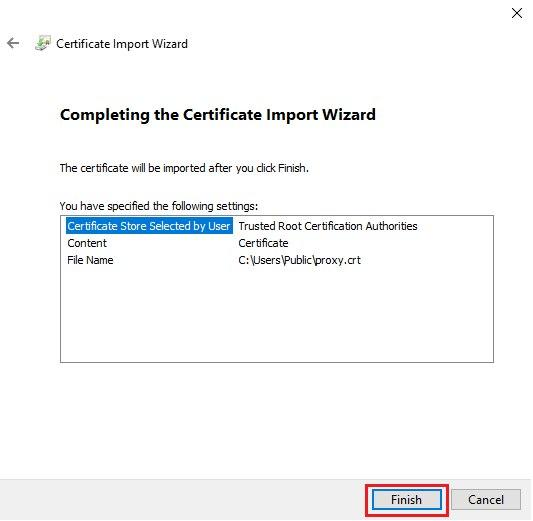
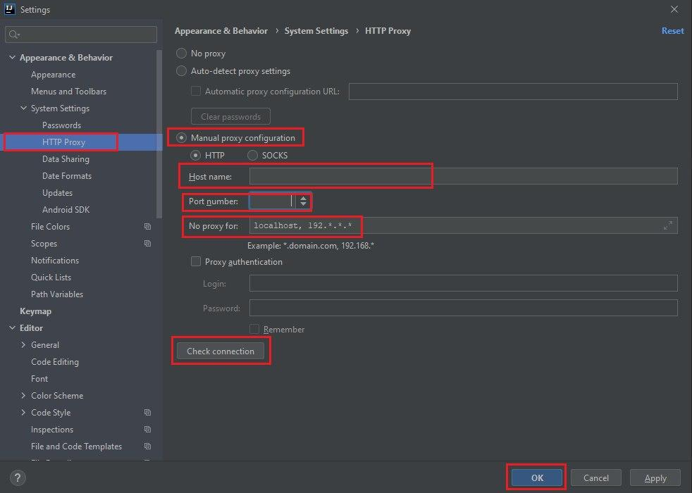
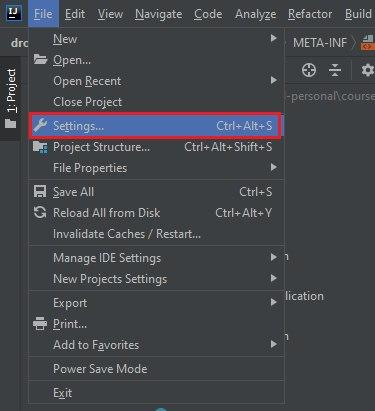
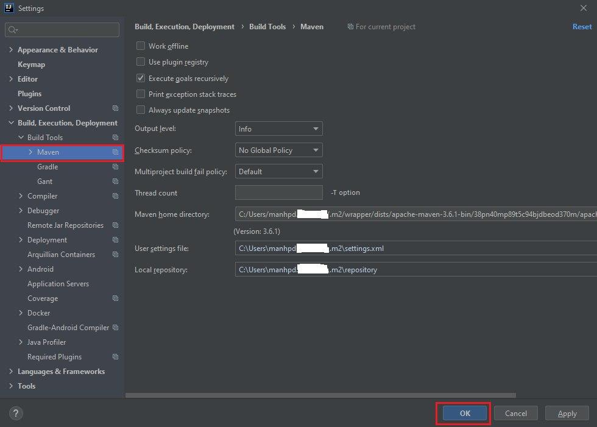

<br>

## Table of Contents
- [Given problem](#given-problem)
- [Solution for importing cetificate](#solution-for-importing-certificate)
- [Add certificate into certmgr](#add-certificate-into-certmgr)
- [Add the proxy's information to settings.xml file of Maven](#add-the-proxy's-information-to-settings.xml-file-of-maven)
- [Add the proxy's information in the Settings of Intellij](#add-the-proxy's-information-in-the-Settings-of-intellij)
- [Configure the certificate in the keytool of JDK](#configure-the-certificate-in-the-keytool-of-jdk)
- [Wrapping up](#wrapping-up)


<br>

## Given problem

Sometimes we need to work with Maven project but it does not download any dependencies. The root cause is our requests that go through a proxy. So we have to configure multiple steps to pull these dependencies.

How do we overcome this problem?

<br>


## Solution for importing cetificate

Belows are some steps to configure certificate in our project.
1. Add certificate into certmgr.

2. Add the proxy's information to settings.xml file of Maven.

3. Add the proxy's information in the Settings of Intellij.

4. Configure the certificate in the keytool of JDK.

<br>


## Add certificate into certmgr

1. Click Windows + R to open Run dialog

2. Typing cmd to open command line

    

3. In cmd.exe, typing certmgr.

    In **Certificates - Current User** tree, we need to notice about **Trusted Root Certification Authorities** item.

    

    Right click to **Trusted Root Certification Authorities** item, then select **All Tasks** > **Import**.

    

    Then, we have **Certificate Import Wizard** dialog. Click **Next** button.

    

    Next, we click the Browser button to refer to our certificate file.

    

    Click Next button.

    

    Finally, click Finish button to complete installing our certificate file.
    
    


<br>

## Add the proxy's information to settings.xml file of Maven

Below is the content of settings.xml file.

```xml
<settings xmlns="http://maven.apache.org/SETTINGS/1.0.0" xmlns:xsi="http://www.w3.org/2001/XMLSchema-instance" xsi:schemaLocation="http://maven.apache.org/SETTINGS/1.0.0 https://maven.apache.org/xsd/settings-1.0.0.xsd">
  <pluginGroups>
    <pluginGroup>repo.maven.apache.org</pluginGroup>
  </pluginGroups>
  <proxies>
    <proxy>
      <id>optional</id>
      <active>true</active>
      <protocol>https</protocol>
      <host>proxy-name</host>
      <port>proxy-port</port>
    </proxy>
  </proxies>
</settings>
```

Then, this settings.xml file will be imported in the Intellj IDEA.

- In **Settings** dialog by typing **Ctrl+Alt+S**.

    

    With **User settings file**, we need to point to the **settings.xml** file in the our Maven's directory that we installed.

<br>

## Add the proxy's information in the Settings of Intellij

In Menu of Intellij, select **File** > **Settings** or use shortcut **Ctrl+Alt+S**.



Select HTTP Proxy to configure.



In an above image, we need to select **Manual proxy configuration**, then configure **Host name**, **Port number**, and **No proxy for**.

<br>

## Configure the certificate in the keytool of JDK

1. Why we need to configure keytool

    According to [the document of Oracle](https://docs.oracle.com/javase/7/docs/technotes/tools/solaris/keytool.html), we have:

    ```
    keytool is a key and certificate management utility. It allows users to administer their own public/private key pairs and associated certificates for use in self-authentication (where the user authenticates himself/herself to other users/services) or data integrity and authentication services, using digital signatures. It also allows users to cache the public keys (in the form of certificates) of their communicating peers.
        
    A certificate is a digitally signed statement from one entity (person, company, etc.), saying that the public key (and some other information) of some other entity has a particular value. When data is digitally signed, the signature can be verified to check the data integrity and authenticity. Integrity means that the data has not been modified or tampered with, and authenticity means the data indeed comes from whoever claims to have created and signed it.

    keytool also enables users to administer secret keys used in symmetric encryption/decryption (e.g. DES).

    keytool stores the keys and certificates in a keystore.
    ```

2. Steps to configure

    This is the final step. We need to configure certificate for JDK by using **keytool**.

    Belows are some command that we use to create keystore.

    ```bash
    # Java 8
    keytool -import -trustcacerts -alias <named-file> -file <certificate-file-path> -keystore "$JAVA_HOME/jre/lib/security/cacerts"

    # Java 11
    keytool -import -trustcacerts -alias <named-file> -file <certificate-file-path> -keystore "$JAVA_HOME/lib/security/cacerts"
    ```

    If the keytool needs to provide the password, we can type the default password for cacerts keystore is **changeit**.

    In some cases, we need to use username/password of admin to configure certificate. And our certificate should be put in the public folder that have been seen by the other users.

<br>

## Wrapping up

- Understanding about the steps to setup certificate in OS.
