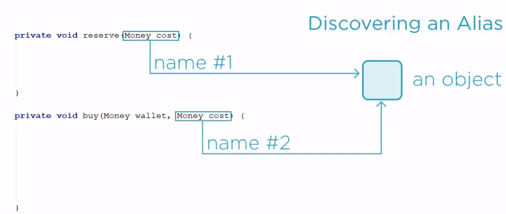
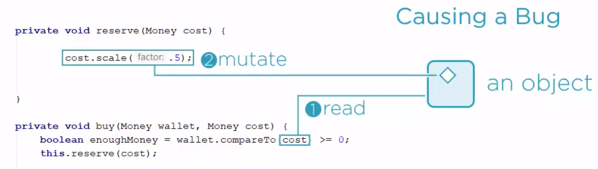
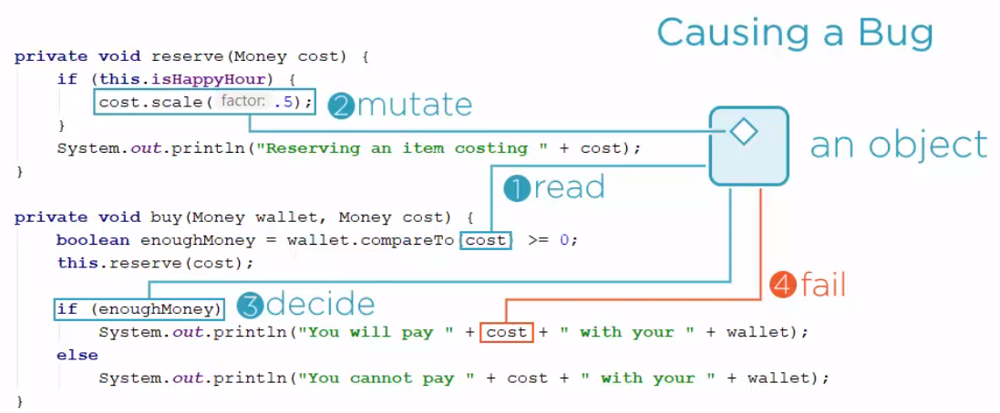

  
<br>

## Table of contents
- [Given problem](#given-problem)
- [Solution with Value Objects pattern](#solution-with-value-objects-pattern)
- [When to use](#when-to-use)
- [Benefits and Drawbacks](#benefits-and-drawbacks)
- [Differences between Values and Entities](#differences-between-values-and-entities)
- [Wrapping up](#wrapping-up)


<br>

## Given problem

Supposed that we have an application that needs to have the selling feature by defining **buy()** method with two arguments including the total money that we have, and the other indicating the cost of whatever we want to buy.

This method looks like:

```java
public class Customer {
    private void buy(Money wallet, Money cost) {
        // nothing to do
    }
}
```

In this our problem, we will define the additional mutable **Money**, and **Currency** classes.
- Money class describes the amount of money that we have and the unit of money - Currency class
- Currency class indicates the unit of money in a country that we use such as USD, JPN, EURO, ...
    
    It simply wraps a string representing the currency symbol, and it is also comparable.

Belows are the definition of Money and Currency classes.

```java
public class Money implements Comparable<Money> {
    private BigDecimal amount;
    private Currency currency;

    public Money(BigDecimal amount, Currency currency) {
        this.amount = amount.setScale(2, RoundingMode.HALF_UP);
        this.currency = currency;
    }

    /**
     * It is used to scale the amount stored in the Money object by a given factor
     *
     */
    public void scale(double factor) {
        this.amount = this.amount.multiply(new BigDecimal(factor)).setScale(2, RoundingMode.HALF_UP);
    }

    @Override
    public int compareTo(Money other) {
        return this.compareAmountTo(this.currency.compareTo(other.currency), other);
    }

    private int compareAmountTo(int currencyCompare, Money other) {
        return currencyCompare == 0 ? this.amount.compareTo(other.amount) : currencyCompare;
    }

    @Override
    public String toString() {
        return this.amount + " " + this.currency;
    }
}

public class Currency implements Comparable<Currency> {
    private String symbol;

    public Currency(String symbol) {
        this.symbol = symbol;
    }

    public Money zero() {
        return new Money(BigDecimal.ZERO, this);
    }

    @Override
    public int compareTo(Currency other) {
        return this.symbol.compareTo(other.symbol);
    }

    @Override
    public String toString() {
        return this.symbol;
    }
}
```

In our **buy()** method, we will define the **reserve()** method that we want to reserve an item before selling it. 

```java
public class Customer {
    private void reserve(Money cost) {
        System.out.println("Reserving an item costing " + cost);
    }

    // The customer's request is to check whether the buyer has enough Money. Then, we reserve goods.
    private void buy(Money wallet, Money cost) {
        boolean enoughMoney = wallet.compareTo(cost) >= 0;
        this.reserve(cost);

        if (enoughMoney) {
            System.out.println("You will pay " + cost + " with your " + wallet);
        } else {
            System.out.println("You cannot pay " + cost + " with your " + wallet);
        }
    }

    public void run() {
        Currency usd = new Currency("USD");
        Money usd12 = new Money(new BigDecimal(12), usd);
        Money usd10 = new Money(new BigDecimal(10), usd);
        Money usd7 = new Money(new BigDecimal(7), usd);

        this.buy(usd12, usd10);

        System.out.println();
        this.buy(usd7, usd10);
    }
}
```

In this case, it is assuming that the **reserve()** method does not change its argument. But unfortunately, we have a new requirement that might introduce a sale off in the holiday. Using **isHappyHour** variable for this feature and our **reserve()** method might cut the price to half during the sale off time.

```java
public class Customer {
    private boolean isHappyHour;

    private void reserve(Money cost) {
        if (this.isHappyHour) {
            cost.scale(0.5);
        }

        System.out.println("Reserving an item costing " + cost);
    }

    public void run() {
        Currency usd = new Currency("USD");
        Money usd12 = new Money(new BigDecimal(12), usd);
        Money usd10 = new Money(new BigDecimal(10), usd);
        Money usd7 = new Money(new BigDecimal(7), usd);

        //this.buy(usd12, usd10);

        //System.out.println();
        //this.buy(usd7, usd10);

        //System.out.println();
        this.isHappyHour = true;
        this.buy(usd7, usd10);
    }
}
```

Our result has:

```
Reserving an item costing 5.00 USD
You cannot pay 5.00 USD with your 7.00 USD
```

This is an odd problem. Because we are using two mutable **Money** and **Currency** classes. This makes our object that is changed implicitly.

How do we overcome this problem?


<br>

## Solution with Value Objects pattern

The problem of this kind of defect is that we cannot point to any particular line of code which is defective. Each function alone looks correct. That is how we come to the field of aliasing bugs. Alias means that there are two references to the same object. It is like when the same object can be found under two names. That is why this item alias has been used to define the situation, and then one object starts the foul play.



The first object reads the shared object, then the second object writes the new content into it.



Later, the first object continues doing things based on the earlier assumption. Unfortunately, the state of the shared object is now different. Another read would reveal that, but the object has out of luck. It is not reading anything, it is already advancing in firm steps, and the overall result will be incorrect. That is how aliasing bugs manifest.



Basic technique to avoid them is to not modify shared objects. A method argument is a good example of a shared reference. The cost argument is a reference passed from the outside. The **reserve()** method has every right to believe that somebody else is still keeping a valid reference to the same object, and to avoid the risk of an aliasing bug, this method must refrain from modifying the argument. This is a slight ambiguity here. Having an alias doesn't mean that there is an aliasing bug around. That is precisely the reason why aliasing bugs are so difficult to find in production code. There is nothing wrong with any part of the system. Only sometimes and only if the system is assembled in some specific way, those seemingly correct parts will not work together as expected.

```java
public class Money implements Comparable<Money> {
    private BigDecimal amount;
    private Currency currency;

    // ...

    // Does not mutate the amount field
    public Money scale(double factor) {
        return new Money(this.amount.multiply(new BigDecimal(factor)), this.currency);
    }

    // Base on the addition of the primitive values, Money class also provide add() method
    public Money add(Money other) {
        if (other.currency.compareTo(this.currency) != 0) {
            throw new IllegalArgumentException();
        }

        return new Money(this.amount.add(other.amount), this.currency);
    }

    // ...
}

public class Customer {
    private boolean isHoliday;

    private Money reserve(Money cost) {
        Money finalCost = this.isHoliday ? cost.scale(0.5) : cost;
        System.out.println("Reserving an item costing " + finalCost);

        return finalCost;
    }

    private void buy(Money wallet, Money cost) {
        boolean enoughMoney = wallet.compareTo(cost) >= 0;
        Money finalCost = this.reserve(cost);
        boolean finalEnough = wallet.compareTo(finalCost) >= 0;

        if (finalEnough && !enoughMoney) {
            System.out.println("Only this time, you will pay " + finalCost + " with your " + wallet);
        } else if (finalEnough) {
            System.out.println("You will pay " + finalCost + " with your " + wallet);
        } else {
            System.out.println("You cannot pay " + finalCost + " with your " + wallet);
        }
    }
}
```

With primitive data types, they can use some operators to interact with each other such as addition, subtract, divide, equal, ... From the **add()**, **equals()** methods of **Money** class, we can find that there is no reason to observe a **Money** differently than an int. Then, it had led to the invention of Value Objects.

Some thoughts about Value Objects:
- Some objects can truly be viewed the same as primitive values.

    It is meant by that is we can let the garbage collector destroy a Money object.

- Construct them again when needed.

<br>

## Using the equivalence relation

1. The equivalence relation

    Normally, we always want to compare the two value objects each other. So, in Java, we need to override the **equals()** method.

    Before going to define the **equals()** method for **Money** class and **Currency** class, we should remember some properties of the equivalence relation:
    - reflexive: a = a
    - Symmetric: a = b --> b = a
    - Transitive: a = b and b = c --> a = c    

    In **Money** class, we define the **equals()** method like the below.

    ```java
    @Override
    public boolean equals(Object other) {
        // reflexive property
        if (other == this) return true;

        // satisfy transitive property
        return other instanceof Money && this.equals((Money) other);
    }

    private boolean equals(Money other) {
        return this.amount.equals(other.amount) && this.currency.equals(other.currency);
    }
    ```

    Analysis about properties of the equivalence relation in **Money** class:
    - With the reflexive property, we will use **= =** operator to compare their references. But in our case, it's redundant because we never call the same objects many times, then it makes our code slower. So we can remove it.

        ```java
        if (other == this) return true;
        ``

    - With the transitive property, it always satisfy because **String** data type in **Currency** class and **BigDecimal** data type in **amount** variable provide the transitive property.

    - With symmetric property

        Two objects must return the same result from their **equals()** methods.

        The instanceof operator is reflexive, and transitive, but it is not symmetric. It will evaluate to true when applied to an object of a derived class.

        For example:
        - baseObj instanceof BaseType = true
        - derivedObj instanceof BaseType = true

        But it won't work when we have **baseObj instanceof DerivedType = false**.

        It means that our symmetric property will break down.

        To satisfy the symmetric property, we should use:
        - With classes and its sub-type, we need to compare by using **getClass()** method.
        - If our class does not have any derived classes, we should use final modifier in the class's definition. Then we can use **instanceof** operator to compare.

    So, we have the **equals()** method of **Money** class and **Currency** class.

    ```java
    public class Money {
        @Override
        public boolean equals(Object other) {
            return other != null && other.getClass() == this.getClass() && this.equals((Money) other);
        }

        private boolean equals(Money other) {
            return this.amount.equals(other.amount) && this.currency.equals(other.currency);
        }
    }


    public final class Currency implements Comparable<Currency> {
        private String symbol;

        // ...

        @Override
        public boolean equals(Object other) {
            return other instanceof Currency && this.equals((Currency) other);
        }

        private boolean equals(Currency other) {
            return this.symbol.equals(other.symbol);
        }
    }
    ```

    The pitfalls of the equivalence relation:
    - **equals()** method implements equivalence relation.
    - Base and derived objects are not equivalent.
    - Otherwise, they would violate symmetric.
    - Objects of the same type are equal if their components are equal.
    - Value object only consists of values.

2. The total order relation

    ```java
    @Override
    public int compareTo(Money other) {
        // nothing to do
    }
    ```

    **compareTo()** method is implementing the relation of total order over the set of all **Money** objects.

    Below is the total order relation:
    - Antisymmetric: a <= b and b <= a --> a = b
    - Transitive: a <= b and b <= c --> a <= c
    - Connexive: a <= b or b <= a

    Java specification correctly mandates that **equals()** and **compareTo()** methods should behave consistently.

    It means that:
    - When a.compareTo(b) = 0, then a.equals(b) = true, and vice versa.

<br>

## Using Value Objects as Keys

To use our Value Objects as keys in collections such as Map, ..., we need to override the hashCode() method.

```java
@Override
public int hashCode() {
    // nothing to do
}
```

Belows is the hashCode() method of Money and Currency classes.

```java
public class Money implements Comparable<Money> {

    // ...

    @Override
    public int hashCode() {
        // 1st way
        // faster to use bitwise operator
        // return this.amount.hashCode() ^ this.currency.hashCode();

        // 2nd way
        // since hashcode is the consequence of object's content,
        // we would usually combine hash codes of contained objects,
        // multiplying by some small prime number is a common strategy.
        return this.amount.hashCode() * 17 + this.currency.hashCode();
    }
}

public final class Currency implements Comparable<Currency> {
    // Implementing hashCode is mandatory whenever custom equals is implemented.
    @Override
    public int hashCode() {
        return this.symbol.hashCode();
    }
}
```

The hash code must not change and should be dispersed.

<br>

## When to use

- When we want to model the real primitive values such as money, request id, ...

<br>

## Benefits and Drawbacks

1. Benefits

    - Immutability is simple to implement.

    - Avoid aliasing bug when taking advantage of the immutable objects.

    - Makes code easy to maintain.

2. Drawbacks

    - Take so much memory when we have many operations to change the its value.

<br>

## Differences between Values and Entities

- An entity has a history of its own.

    Take an interface representing a painter, a person who paints walls. It represents a real human being. It usually models a physical entity.

    For example:

    ```java
    public interface Painter {
        int getId();
        boolean isAvailable();
        Duration estimateTimeToPaint(double sqMeters);
        Money estimateCompensation(double sqMeters);
        String getName();
        double estimateSqMeters(Duration time);
    }
    ```

- We always need to track an entity over time.

    We many enter a person into our register, our database, and keep track of them over time. The principle method of keeping track over time is through assigning a persistent identity to such an object.

- Let's reconstruct the same entity later.

    Identity helps us reconstruct an entity object much later in a different running of an application, on a different computer if need be.

<br>

## Wrapping up

- Value Objects are simple values that can be thrown away and reconstructed, and the fact that we do not track changes on values gives rise to the most important aspect of values.

- They are immutable. All their operations only return a new object. They only consist of other immutable components.

    Not only the **Money** object doesn't change itself, but it only consists of value objects. The Currency object is also immutable and BigDecimal class is immutable as well. When developing a complex object model, we will recognize many value objects, objects that have all the qualities of plain intergers, only that they are reference types, instances of classes.

<br>

Refer:

[Making Your Java Code More Object-oriented by Zoran Horvat](https://app.pluralsight.com/library/courses/object-oriented-java-code/table-of-contents)

[https://enterprisecraftsmanship.com/posts/hierarchy-value-objects/](https://enterprisecraftsmanship.com/posts/hierarchy-value-objects/)